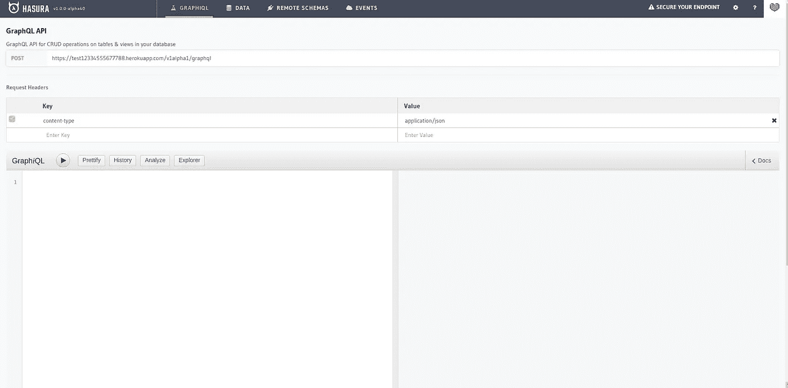
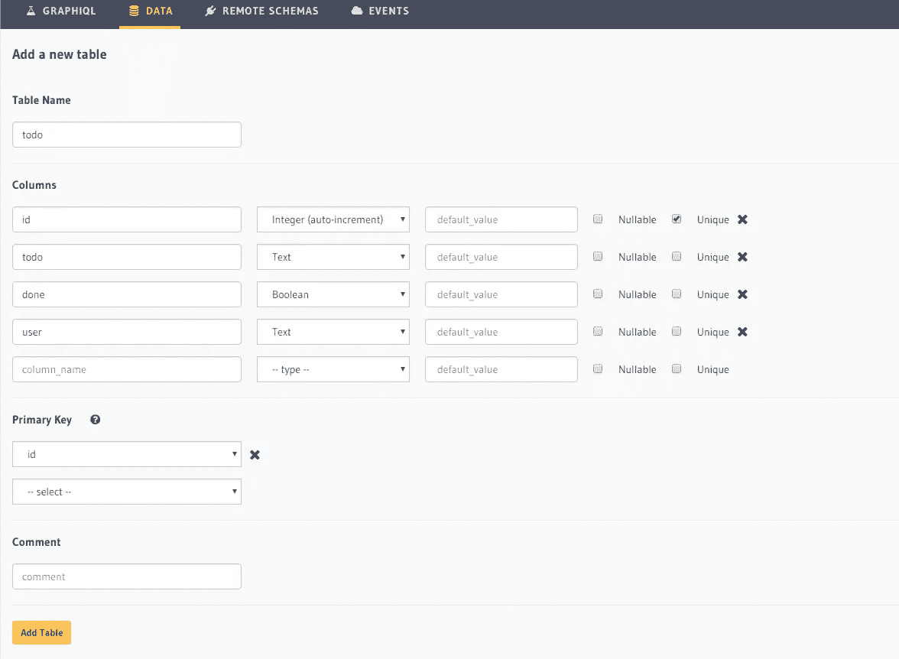
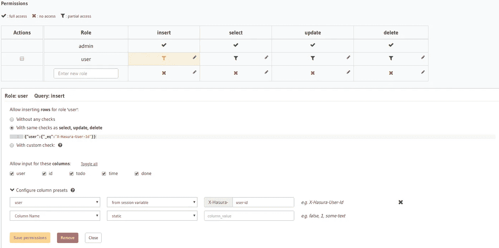

# Todo 应用程序 Hasura、GraphQL 和 React

> 原文：<https://levelup.gitconnected.com/todo-app-hasura-graphql-and-reactjs-dfd3f1224034>

这是一篇关于现代网络技术的文章——React、GraphQL、Hasura 和 Auth0。todo 应用程序是学习任何技术中所有凝乳操作的最佳方式，因此我们将构建一个单页面 Todo 应用程序来查看 React、Hasura 和 Auth0 的运行情况。

**我们将介绍的内容:**

*   什么是 GraphQL，以及 Hasura 如何让开发人员的生活变得更加轻松
*   在 Heroku 上设置 Hasura GraphQL
*   使用 Hasura 后端构建 React 应用程序
*   使用 Auth0 JWT 进行身份验证和授权
*   在 Heroku 上部署应用程序

**先决条件:**

*   React 的基础知识(如果需要，您可以遵循初学者 [React](https://reactjs.org/tutorial/tutorial.html) 教程)
*   和 Heroku 的一些经历
*   电脑:p

# 什么是 GraphQL 和 Hasura

GraphQL 是一种查询语言，它允许我们根据应用程序的需求来查询数据。旨在为所有类型的查询构建只有一个 API 端点的客户端应用程序，不像 REST 那样，我们必须为数据库上的每个操作定义几个端点。


Hasura 可以让你在构建应用程序时避免编写不必要的后端。它在 postgres 上为您提供了一个 GraphQL API，可以加速应用程序的开发，因为您不必担心后端，它很容易扩展，很容易与 Auth0 或 firebase-auth 等认证工具集成，允许您在 Postgres 上触发操作事件，将您从令人头痛的部署中解脱出来。

简而言之，它让开发人员的生活变得更加轻松。

# 在 Heroku 上设置 Hasura GraphQL

这一步可能是本文中最简单的。

*   在 [Heroku](https://www.heroku.com/) 上注册并点击此[链接](https://heroku.com/deploy?template=https://github.com/hasura/graphql-engine-heroku)。
*   打开部署的应用程序，Hasura 就启动了。



*   为 todo 应用程序创建数据库。转到“数据”选项卡并创建表格。



*   设置权限



**尝试一个突变**

```
 mutation{
 insert_todo(objects:[{user:”user1",todo:”todo todo todo”}])
             {
              returning{
                         id
                         user
                         todo
                         done
                       }
             } 
         }
```

**查询数据**

```
query{
  todo{
    user
    id
    todo
    done
  }
}
```

更多信息请阅读[和](https://docs.hasura.io/1.0/graphql/manual/queries/index.html)。

# 使用 Hasura 后端构建 React 应用程序

*   安装 create-react-app `npm install create-react-app -g`
*   创建 react 应用程序`create-react-app todo`
*   `cd todo`
*   `npm start` *运行在本地主机上的 app:3000*
*   安装 apollo 客户端，从我们的应用程序调用 GraphQL APIs

`npm install --save apollo-boost graphql graphql-tag react-apollo`

为 GraphQL 设置 Apollo(在 App.js 中)——这个文件将由 index.js 渲染，从文件中可以明显看出它渲染了`Todo`和`AddTodo`组件，这两个组件有 todos 列表和添加更多 todos 的表单。我们需要将整个事情包装在一个用于查询 GraphQl 的`ApolloProvider`中。

```
import ApolloClient from “apollo-boost”;
import {ApolloProvider} from “react-apollo”const client = new ApolloClient({  
uri: "https://example.herokuapp.com/v1alpha1/graphql"
});
```

在 Todos.js 文件中创建`Todos`组件 Create，用于列出 Todos。在这个文件中，我们查询 Hasura GraphQL 来获取数据。todo 查询从`./components/Queries`导入，查询后，根据加载、错误或数据状态提供结果。在每一个结果中，我们都添加了另外两个组件——一个标记为 done，另一个标记为 delete，其中我们在 props 中传递 id，以便我们可以删除或标记特定 id 的对象。

*   在文件夹中创建组件。/components-add todo . js，MarkTodo.js，DeleteTodo.js，queries.js
*   queries.js 拥有我们将在应用程序中的数据库上进行的所有突变查询列表。ADD_todo、MARK_TODO、DEl_TODO、TODO 分别用于添加 TODO 变异、将 TODO 标记为完成变异、删除 TODO 变异和获取所有 TODO 查询。
*   AddTodo.js 是一个表单，在输入框的每次改变时，`state.content`被改变为输入框的值，并且在提交时，`state.content`在变异中被发送并且 Todo 查询被重新提取。
*   DeleteTodo.js 和 MarkDone.js，它们为在`DeleteTodo`和`MarkDone`组件的属性中传递的特定 id 执行删除并将 done startus 设置为 true 突变。

# 使用 Auth0 JWT 进行身份验证和授权

我们将使用 Auth0 进行身份验证和授权，因此第一步是在 Auth0 上注册并创建一个 Auth0 应用程序(选择一个带有 react 和回调 URL[http://localhost:3000/callback 的单页应用程序)。](http://localhost:3000/callback).)

**什么是 JWT？**

JSON Web Token (JWT)是一个 JSON 对象，在 RFC 7519 中被定义为一种在双方之间表示一组信息的安全方式。令牌由报头、有效载荷和签名组成。

**步骤 1 为 JWT 配置 Hasura**

*   为您的应用程序配置 Heroku 配置变量`HASURA_GRAPHQL_ADMIN_SECRET`和`HASURA_GRAPHQL_JWT_SECRET`。记住`HASURA_GRAPHQL_ADMIN_SECRET`，因为它将用于你的管理员登录，你将不得不从[https://hasura.io/jwt-config](https://hasura.io/jwt-config)生成`HASURA_GRAPHQL_JWT_SECRET`，提供你在 auth0 中给定的域名。
*   在这一步之后，如果没有合适的 JWT 令牌，你将无法从 Hasura 访问你的数据。

**步骤 2 配置 React 应用程序以发送 JWT 身份验证令牌**

*   使用`react-dom-router`为登录、注销、应用程序(todo 应用程序所在的位置)和回调(在 Auth0 中给出的回调 URL)创建 4 个路由。这可以在下面的代码中看到。

*   我们已经在 routes 中初始化了一个`auth`对象，并传入了所有的 routes props，这样我们就可以在所有的 routes 中访问 auth。
*   登录时，我们只需要一个 Auth0 登录方法的按钮。我们将在本地浏览器存储中保存 JWT 令牌。注意:这不是一个非常安全的做法，因为它可以被任何人窃取。当用户注销时，我们将删除它。
*   为了在请求中传递 auth 令牌，我们只需要用头部`Authorization`替换掉`ApolloClient`和来自`localStorage`的令牌，这是我们在登录时保存的。

```
const ACCESS_TOKEN = localStorage.getItem('id_token'); 
const client = new ApolloClient({ 
 uri: "https://example.herokuapp.com/v1alpha1/graphql",
  headers: { 
   'Authorization': `Bearer ${ACCESS_TOKEN}`,
   }});
```

[这个视频](https://www.youtube.com/watch?v=kHCLQEKjdnI)对在 Hasura 上配置 JWT 有一个非常好的解释。

# 在 Heroku 上部署应用程序

这又是文章的简单部分

*   从 heroku dashboard 创建 Heroku 应用程序
*   在您的系统上安装 Heroku cli
*   `heroku login`在终端
*   `heroku git clone -a <your app>`
*   `cd <your app>`
*   添加所有文件并提交它们
*   `git push heroku master`部署您的应用

https:// <your app="">.herokuapp.com 查看您的应用运行</your>

仅此而已。这就是使用 Hasura GraphQL 和部署来创建应用程序是多么容易。

[](https://gitconnected.com/learn/react) [## 学习 React -最佳 React 教程(2019) | gitconnected

### React 是一个现代 JavaScript 库，前端 web 开发人员使用它来构建用户界面(UI)。它用于…

gitconnected.com](https://gitconnected.com/learn/react) 

你可以在 https://github.com/karannaoh/todo-hasura-react 找到这个应用的源代码

我发现对构建这个应用程序非常有用的东西

*   [https://blog . hasura . io/tutorial-leveraging-hasura-graph QL-and-Apollo-to-build-and-deploy-a-full stack-react-app-bafa 32724010/](https://blog.hasura.io/tutorial-leveraging-hasura-graphql-and-apollo-to-build-and-deploy-a-fullstack-react-app-bafa32724010/)
*   [https://docs.hasura.io](https://docs.hasura.io)
*   【https://reactjs.org/docs/getting-started.html 
*   [https://www.apollographql.com/docs/react/](https://www.apollographql.com/docs/react/)
*   [https://www.youtube.com/watch?v=kHCLQEKjdnI](https://www.youtube.com/watch?v=kHCLQEKjdnI)

这是我在学习 react、Hasura 和 GraphQL 时写的第一个技术博客，我会很高兴得到关于这个的反馈，你可以给我关于 karanpratapsingh43@gmail.com 的反馈。

## 关于我

我是印度理工学院的四年级本科生。

我花了大部分时间写代码，制作迷因😅。计算机科学、哲学和物理是我的几个兴趣。我积极参与了两家创业公司，但我不是企业家。