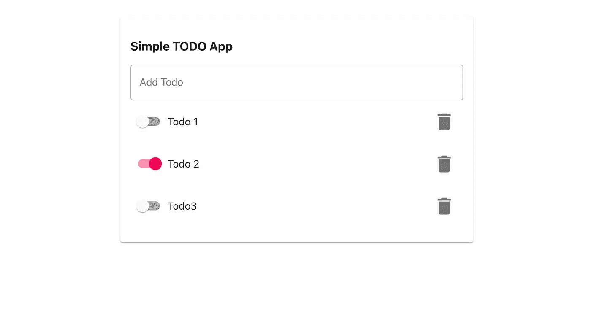
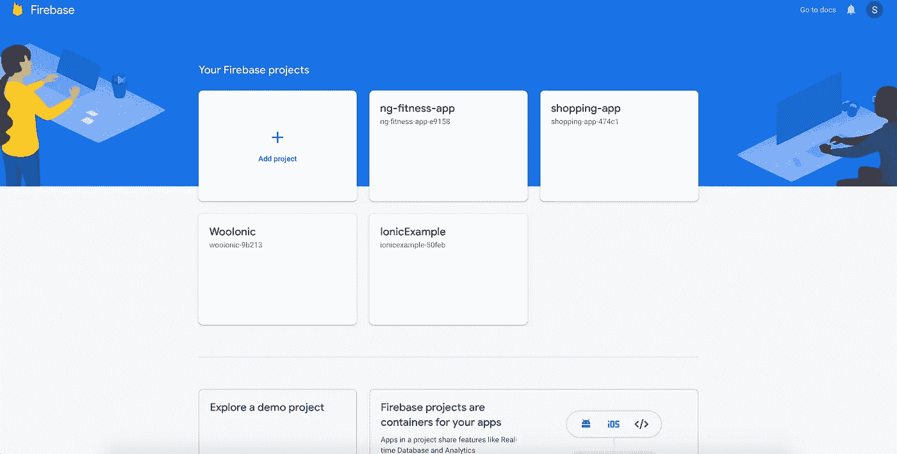
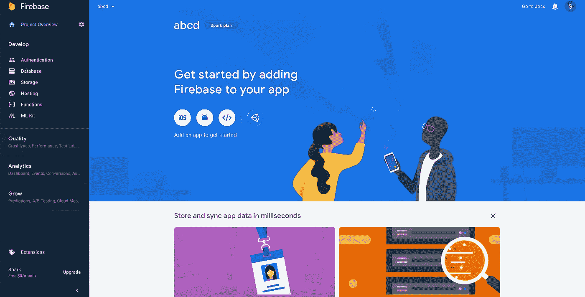
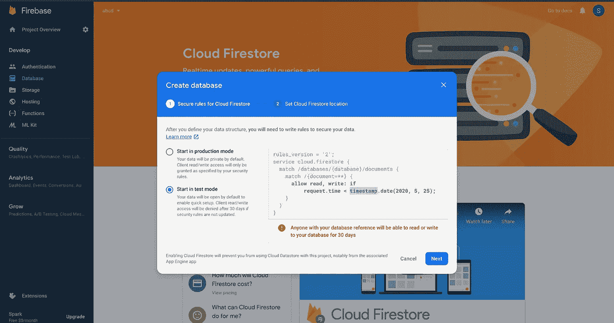

# 使用 Firebase + React + TypeScript 构建一个 Todo 应用程序

> 原文：<https://levelup.gitconnected.com/todo-app-using-firebase-react-typescript-ea0a34bd417d>

# **简介**

本文是初学者指南，介绍如何通过构建一个简单的 TODO 应用程序将 React 应用程序连接到 Firebase。



一个基于 Material-UI React 框架的基本 Todo 应用程序

Firebase 通过实时数据库帮助您构建移动和 Web 应用程序，这意味着如果一个用户更新数据库中的记录，所有订阅该数据的用户都将获得更新的数据。这使得开发人员的工作变得容易。

举例来说，如果您必须构建一个简单的聊天，您需要有后端服务、数据库和 WebSocket，或者您可以使用 Firebase 来处理构建实时聊天应用程序所需的所有功能。

**使用 Firebase 的一些主要优势**

1.  实时数据库
2.  主办；主持
3.  证明
4.  储存；储备
5.  通知

在本文中，我们将介绍如何设置 Firebase 以及如何将其连接到 React 应用程序。

## **建立你的 Firebase 数据库**

要设置你的数据库，你需要使用谷歌账户登录到你的 firebase 控制台[链接](https://console.firebase.google.com/)



你的控制台应该看起来像这样

进入控制台后，通过给项目命名来添加项目



数据库控制台

现在下一步是将 Firebase 连接到你的应用程序。在本文中，我们将使用 React.js，因此让我们将它连接到我们的应用程序。点击“>”注册应用程序，您将获得以下格式的配置详情

```
var firebaseConfig = {
    apiKey: "xxxxxxxxxxxxxxxxxxxxxxxxxxxx",
    authDomain: "xxxxxxxxxxxx",
    databaseURL: "xxxxxxxxxx",
    projectId: "xxxxxxxxxx",
    storageBucket: "xxxxxxxxxxx",
    messagingSenderId: "xxxxxxxxxxxxxxxxxxx",
    appId: "1:xxxxxxxxx:web:xxxxxxxxxxxxxx",
    measurementId: "xxxxxxxxx"
  };
```

设置 Firebase 的最后一步是创建一个数据库。在这个例子中，我们将使用测试模式数据库



出于安全原因，Firebase 只允许 30 天的测试模式。您可以通过转到 rules 并将配置更改为

```
rules_version = '2';
service cloud.firestore {
  match /databases/{database}/documents {// This rule allows anyone on the internet to view, edit, and delete
    // all data in your Firestore database. It is useful for getting
    // started, but it is configured to expire after 30 days because it
    // leaves your app open to attackers. At that time, all client
    // requests to your Firestore database will be denied.
    //
    // Make sure to write security rules for your app before that time, or else
    // your app will lose access to your Firestore database
    match /{document=**} {
      allow read, write;
    }
  }
}
```

现在我们让 Firebase 设置它的时间来设置 React 应用程序。在这个例子中，我们将使用 TypeScript。让我们使用 CRA 命令创建应用程序

```
npx create-react-app todo-firebase --template typescript# oryarn create react-app todo-firebase --template typescript
```

一旦应用程序设置，我们需要添加应用程序的 Firebase 配置。最好的方法是将其作为自定义环境变量添加到。env 文件的细节可以在[这里](https://create-react-app.dev/docs/adding-custom-environment-variables/)找到。自定义变量应该以 REACT_APP_ 开头。一旦我们添加了变量，我们的 env 文件将会是这样的

```
REACT_APP_APIKEY=XXXXXXXXXXXXXXXXREACT_APP_AUTHDOMAIN=xxxxxxxxxxxxxxxREACT_APP_DB=XXXXXXXXXXXXXREACT_APP_PID=XXXXXXXXXXXXXXXREACT_APP_SB=XXXXXXXXXXXXXREACT_APP_SID=XXXXXXXXXXXXXXXREACT_APP_APPID=1:XXXXXXXXX:web:XXXXXXXXXXXXREACT_APP_MID=XXXXXXXXXXX
```

将 Firebase 模块安装到我们的应用程序中

```
npm install firebase
Or
yarn add firebase
```

因此，让我们通过创建文件 firebase.ts 来初始化我们的应用程序中的 firebase。因此，我们只需要导入我们需要的特性，而不是包含所有的特性。在我们的例子中，我们需要唯一的数据库，所以我们的 firebase 文件将导入唯一的数据库

```
import firebase from 'firebase/app'import "firebase/database"const config = {apiKey: process.env.REACT_APP_APIKEY,authDomain: process.env.REACT_APP_AUTHDOMAIN,databaseURL: process.env.REACT_APP_DB,projectId: process.env.REACT_APP_PID,storageBucket: process.env.REACT_APP_SB,messagingSenderId: process.env.REACT_APP_SID,appId: process.env.REACT_APP_APPID,measurementId:process.env.REACT_APP_MID};firebase.initializeApp(config);
```

接下来，我们需要引用我们的集合来执行 CRUD 操作。在本例中，我们将集合称为 todos。我们可以通过获取数据库的引用来获取这个集合的引用

```
firebase.initializeApp(config);const databaseRef = firebase.database().ref();export const todosRef = databaseRef.child("todos")
```

因此，配置文件将初始化应用程序，并获取所需集合的引用

我们的示例应用程序有 TodoList、TodoForm 和 Todo 组件。这个例子的样板代码可以在这里找到。

好了，设置好了，让我们创建一个待办事项。通常，如果我们使用我们自己的服务，我们将使用 fetch 或 Axios 通过导入包进行 API 调用来保存数据，然后调用 route 并发布数据。但是使用 firebase，您可以在一行代码中完成导入集合引用并推送数据。这是我喜欢在 firebase 上工作的众多原因之一。它使前端开发人员的工作变得容易。

```
import {todosRef} from "./firebase";todosRef.push(item)
```

因此，要在 TodoForm.tsx 中创建 todo，我们需要获取数据并将其推送到引用。

现在让我们看看如何从 todos 的案例列表中获取数据。为了检索数据，我们使用 **on()** 方法。该方法将事件类型作为**【值】**，然后检索数据的**快照**。因此，每次值改变时，我们将获得新的数据集，而无需用户刷新页面或进行 API 调用或套接字。就像我之前提到的，它给了我们实时数据。如果我们只需要一次数据，那么我们使用 once()方法代替 on()方法。我将在下一篇文章中更多地讨论 QueryReference 和快照，在下一篇文章中，我们将使用 Firebase 在应用程序中设置身份验证。所以这就是我们的 TodoList.tsx 添加这个方法后的样子。

为了从集合引用的集合中更新或删除文档，我们通过 id 获取子文档。一旦有了数据，我们就用 set()方法更新它，用 remove()方法删除数据

```
// To update data
todosRef.child(todo.id).set({...todo,done:!todo.done})// To delete data
todosRef.child(todo.id).remove()
```

因此，只需添加一些配置，我们就可以创建一个 react 应用程序并执行 CRUD 操作，而无需担心后端。完整的代码可以在[这里](https://github.com/suhas86/react-todo-firebase/tree/firebase-integration)找到

我将继续撰写一篇关于如何使用 firebase 处理认证的文章。

编码快乐！干杯