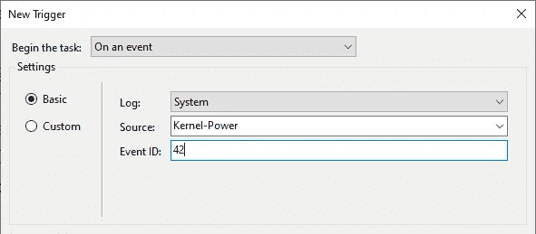
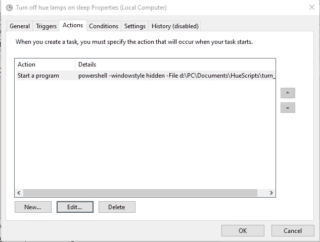

# 根据您的电脑状态切换飞利浦色调

> 原文：<https://levelup.gitconnected.com/toggle-philips-hue-depending-on-your-pc-state-8d7dc1e4f5b>

## 使用智能手机或平板电脑应用程序并不是控制智能照明的唯一方式。你也可以从你的电脑、笔记本电脑或平板电脑上完成这项工作。


纳丁·沙巴纳在 [Unsplash](https://unsplash.com?utm_source=medium&utm_medium=referral) 上拍摄的照片

# 介绍

几周前，我接触了飞利浦 Hue 灯。对于一个灯泡来说似乎有点贵。然而，它激起了我的好奇心，足以给它一个镜头。我买了[白色氛围启动包](https://amzn.to/3bs2FxD)——因为我真的不喜欢纯白色的辉光——连同两个[色调播放灯条](https://amzn.to/3jT2QGG)。

如果你读过我的任何其他故事，你已经知道我喜欢自动化发布网站、管道调整和 Instagram 嵌入。当然，我也想自动控制我的智能灯。当我解锁电脑时，我希望色调播放灯条自动打开，并在锁屏时关闭。

在这个故事中，我将向你解释用 **PowerShell** 和 **Windows 任务调度器编程 Hue Lights 的基础知识。**

如果你想从我自己的网站上阅读，请点击下面的链接。

*原载于*[*https://morehue.com*](https://morehue.com/philips-hue-getting-started/)*。*

> 自动化很容易，你只需要知道要采取哪些步骤。

# 阶段

1.  找到你的网桥的 IP 地址
2.  获得一个经过**认证的**用户名
3.  找到**灯使**自动化
4.  创建您想要的**脚本**
5.  定义**预定任务**

# 1.找到你的网桥的 IP 地址

幸运的是，Hue 系统附带了一个 API，可以通过 web 请求轻松控制。但是，在我们尝试使用飞利浦 Hue 灯之前，我们首先需要找到网桥的 IP 地址。该桥将接收我们所有的 web 请求。很好看的教程可以在[这里](https://developers.meethue.com/develop/get-started-2/)找到。但是因为我们现在只需要我们的桥的 IP，我们也可以去这个链接:[https://discovery.meethue.com/](https://discovery.meethue.com/)。

该链接将显示一个小的 JSON 响应，其中包含网桥的内部 IP 地址。响应看起来有点像这样:

```
[
  {
    "id": "ecbdsa5afffe1303cf",
    "internalipaddress": "192.168.1.41"
  }
]
```

记下这个 IP 地址，因为我们在其他步骤中需要它。

# 2.获取经过验证的用户名

与当今任何其他受保护的系统一样，Hue 系统要求用户验证他或她的身份。但是在我们这样做之前，我们需要导航到下面的 URL(这是我们的桥的沙盒 URL):`https://<bridge_ip_address>/debug/clip.html`

现在我们需要发送一个认证请求来认证我们自己。用下面的消息体`{ "devicetype" : "My_amazing_computer" }`向 URL `/api`发送 post 请求。然后，您将看到以下消息:

```
[
 {
  "error": {
   "type": 101,
   "address": "",
   "description": "link button not pressed"
  }
 }
]
```

现在去按你舰桥上的链接按钮，然后再按一次`POST`按钮。您现在应该会得到如下所示的成功响应:

```
[
 {
  "success": {
   "username": "j5hvYCkJPN8a87daQ6a0mmxBcG6ozeLp3zXU5lgc"
  }
 }
]
```

这就对了。您现在有了经过验证的用户名。把这个也写下来，我们将在下一阶段用到它。

# 3.找到要自动化的灯

有了前一阶段获得的认证用户名，我们可以将所有的灯连接到我们的桥上。为此，在 de API 沙箱中发送一个新请求至:

`https://<bridge_ip_address>/api/<authenticated_username>/lights`

这将给你一个 JSON 响应，显示你系统中所有的灯。所有这些灯将有相同的名称对应他们，因为你会看到在色调应用程序。对于我的例子，我将使用灯光 1 和 2 —我的灯光的 id—。

# 4.创建您想要的脚本

现在我们已经有了桥接 IP、经过验证的用户名和要自动化的灯，我们可以开始一些真正的编程了！在这一部分，我们将编写两个脚本。第一个将打开我们的色调播放栏，而第二个将关闭它们。实现这一点的代码是用 PowerShell 编写的，因为我们可以在 Windows 中用 PowerShell 轻松地发出 web 请求。下面的代码用于关灯:

变量`$apiconent`被用作我们请求的`POST`主体。在这种情况下，将执行两个`POST`请求来关灯。一个示例 URL 看起来像带有以下 JSON 主体的`http://192.168.1.41/api/j5hvYCkJPN8a87daQ6a0mmxBcG6ozeLp3zXU5lgc/lights/1/state``{ "on" : false }`。

除了`$apicontent`变为`{ "on": true}`之外，开灯的脚本几乎相同。将这些脚本保存到您喜欢的文件夹中。

# 5.定义计划任务

在 lights 自动化过程的最后一步，我们需要定义上面写的脚本何时需要运行。幸运的是，windows 有一个称为任务调度器的东西，可以将任何操作与 Windows 中的特定操作结合起来。

首先，我们将添加关灯任务。打开 Windows 任务调度器，点击**动作**，随后点击**创建任务……**。转到**触发器**选项卡，定义一个新的触发器。我添加了一个触发器，将工作站上的开始任务**锁定**，并将其添加到我们的触发器中。然后我又加了一个睡眠模式。这个稍微复杂一点，我们在一个事件上添加了一个新的触发器**，作为日志值 **System** ，作为源值 **Kernel-Power** 和事件 ID **42** (用于睡眠的事件)。这将看起来像这样:**



现在我们需要将一个**动作**耦合到已定义的触发器。转到**动作**选项卡，添加一个新动作。离开动作为**开始一个程序。**在设置部分，填写`powershell` 作为要运行的程序。现在添加下面的参数`-windowstyle hidden -File C:\Documents\HueScripts\turn_off_play.ps1`并点击 OK。您的操作选项卡将如下所示:



干得好！你完成了自动关闭色调灯的脚本！在我们继续下一步之前，去检查一下。

## 开灯

现在我们需要做同样的事情，当你的电脑醒来时打开灯。这个过程几乎和关灯的任务一样。我现在将指出这项任务的不同之处:

*   在工作站解锁上，将锁定的触发器更改为
*   **将**事件 ID** 更改为 1(电脑唤醒事件)**
*   **更改动作的**文件名****

# **结论**

**自动化很容易，你只需要知道要采取哪些步骤。在本教程中，我们找到了一种根据电脑状态自动设置色调灯条的方法。让这成为你家庭自动化之旅的开始。**

**如果您遇到其他简洁的自动化技术，请告诉我！**

**编码快乐！**

****

**[https://ko-fi.com/koenvanzeijl](https://ko-fi.com/koenvanzeijl)**

# **分级编码**

**感谢您成为我们社区的一员！ [**订阅我们的 YouTube 频道**](https://www.youtube.com/channel/UC3v9kBR_ab4UHXXdknz8Fbg?sub_confirmation=1) 或者加入 [**Skilled.dev 编码面试课程**](https://skilled.dev/) 。**

**[](https://skilled.dev) [## 编写面试问题+获得开发工作

### 掌握编码面试的过程

技术开发](https://skilled.dev)**