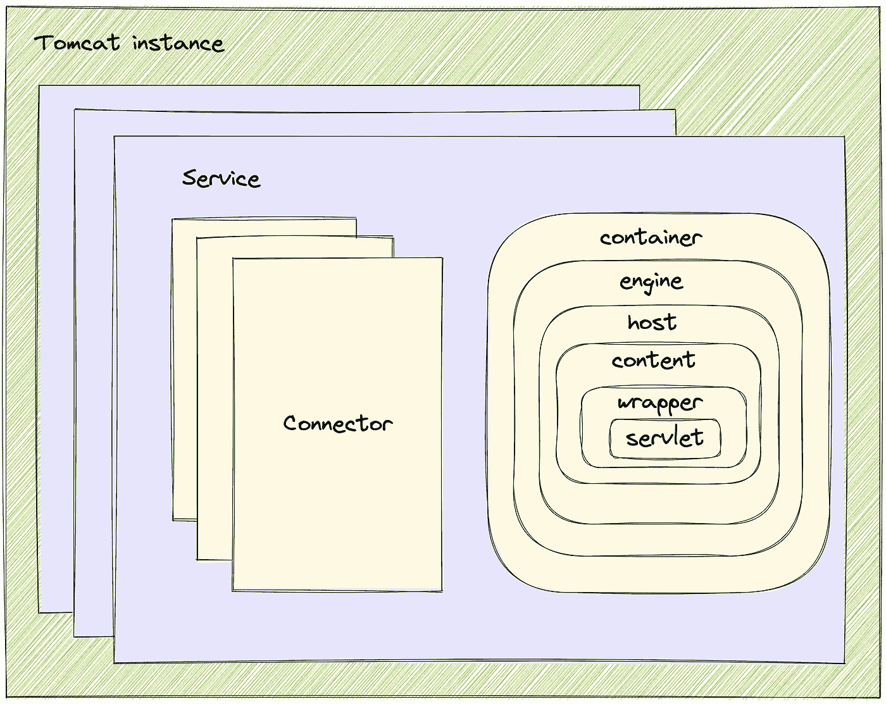
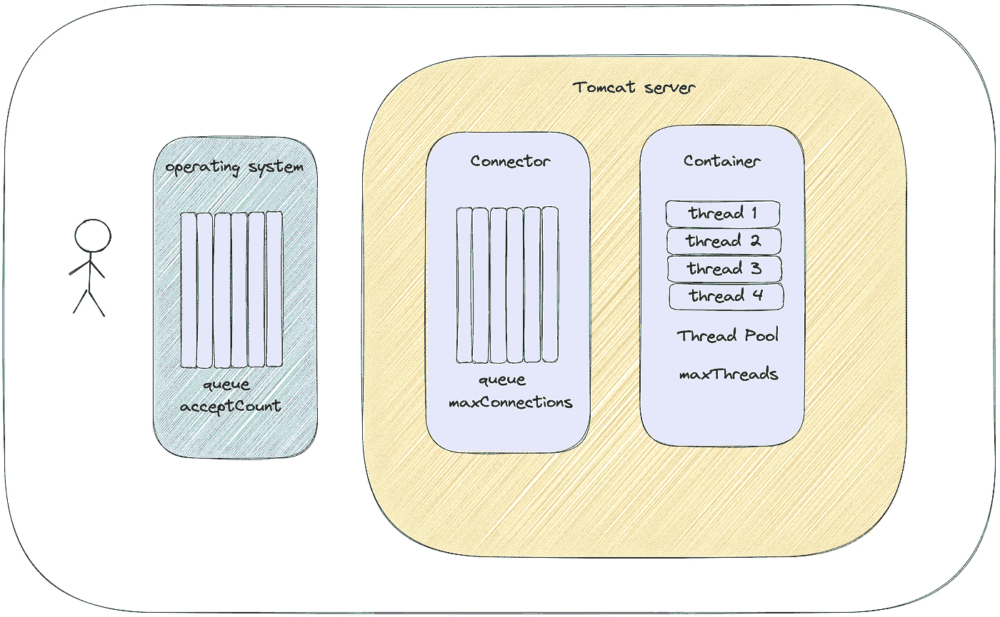

# Tomcat 参数优化

> 原文：<https://levelup.gitconnected.com/tomcat-parameter-optimization-11246402f810>

如何对 Tomcat 进行性能优化？

照片由 [niko photos](https://unsplash.com/@niko_photos?utm_source=unsplash&utm_medium=referral&utm_content=creditCopyText) 在 [Unsplash](https://unsplash.com/s/photos/tree?utm_source=unsplash&utm_medium=referral&utm_content=creditCopyText) 上拍摄

对于提供接口服务的应用，很多都使用 SpringBoot 默认的 Servlet 容器 Tomcat。

在上线初期，因为大部分流量较小，所以我们不会对 Tomcat 进行特殊的参数调整。

但是随着流量的增加，应用的性能指标越来越差。这个时候，我们大多数人都会选择扩大容量。

除了容量扩展，我们还可以选择在 Tomcat 上执行性能调优，在不增加成本的情况下提高性能。

今天我们将分享如何在 Tomcat 上执行简单的性能调优来提高应用程序性能。

**Tomcat 的架构。**

作者图片

从上图可以看出，Tomcat 将其业务抽象为组件，如`Server, Service, Connector, Container`等。，每个组件都有不同的作用。

服务器组件是 Tomcat 最外层的组件，它是 Tomcat 实例本身的抽象，代表 Tomcat 本身。一个服务器组件可以有一个或多个服务组件。

服务组件是 Tomcat 中提供服务和处理请求的一组组件。一个服务组件可以有多个连接器和一个容器。多个连接器表示它可以使用多个协议同时接收用户请求。

连接器负责处理客户端连接，并为各种服务协议提供支持，包括 BIO、NIO、AIO 等。它存在的价值在于屏蔽了多协议容器的复杂性，统一了容器的处理标准。

容器组件是负责特定业务逻辑处理的容器。当连接器组件与客户机建立连接时，它将请求转发给容器组件的引擎组件进行处理。

至此，Tomcat 的核心组件基本完成。事实上，容器组件中有许多细分的组件。事实上，如果您对业务的抽象感兴趣，您可以继续查看。

*   引擎组件表示一个可运行的 Servlet 实例，包括 Servlet 容器的核心功能，它可以有一个或多个虚拟主机(Host)。其主要作用是将请求委托给合适的虚拟主机进行处理，即根据 URL 路径的配置匹配合适的虚拟主机进行处理。
*   主机组件负责运行多个应用程序，并负责安装这些应用程序。它的主要功能是解析 web.xml 文件，并将其匹配到相应的上下文组件。
*   上下文组件表示特定的 Web 应用程序本身，它最重要的功能是管理内部的 Servlet 实例。一个上下文可以有一个或多个 Servlet 实例。
*   包装器组件代表一个 Servlet，它负责管理一个 Servlet，包括 Servlet 加载、初始化、执行和资源恢复。包装器是最底层的容器。

可以看出，Host 是虚拟主机的抽象，Context 是应用的抽象，Wrapper 是 Servlet 的抽象，Engine 是处理层的抽象。

**核心参数。**

在了解核心参数之前，我们需要对 Tomcat 对请求的处理流程有一个大致的了解。Tomcat 对请求的处理流程如下。

作者图片

在上面的原理图中，有三个非常关键的核心参数，也是性能调优的关键。

*   `acceptCount`:当容器线程池达到最大数量且没有空闲线程，连接器队列达到最大数量时，操作系统可以接受的最大连接数。
*   `maxConnections`:当容器线程池达到最大数量并且没有空闲线程时，连接器队列可以接收的最大线程数量。
*   `maxThreads`:容器线程池中处理线程的最大数量。

从以上三个参数的意义，我们可以知道以下结论。

客户端并不直接与 Tomcat 的连接器组件建立联系，而是先与操作系统建立联系，然后将其交给连接器。

这一点很重要，否则，你不会理解`acceptCount`参数。

不仅连接器组件中有一个队列，操作系统中也有一个队列来临时存储与客户端的连接，这也是一个关键点。

我们所说的线程池是指 Container 容器中的线程池。

理解这三个核心参数的含义非常重要，否则后续的性能调优工作就无从开展。

**maxThreads。**

我们知道`maxThreads`指的是请求处理线程的最大数量，在 Tomcat7 和 Tomcat8 中默认为`200`。

该参数的设置需要根据任务的执行内容进行调整。一般来说，计算公式是:`maximum number of threads = ((IO time + CPU time)/CPU time) * number of CPU cores`。

这个公式的思路其实很简单，就是最大化的利用 CPU 资源。

一个任务的时间消耗分为 IO 时间消耗和 CPU 时间消耗。基本上 IO 时间消耗是最多的，CPU 这个时候没事干。

所以如果可以允许 CPU 在任务等待 IO 的同时处理其他任务，那么 CPU 利用率就会提高。

一般来说，由于 IO 时间消耗远大于 CPU 时间消耗，所以根据公式计算出来的`maxThreads`数会远大于 CPU 核数，这是正常的。

需要注意的是，这个数值并不是越高越好。因为一旦线程过多，CPU 就需要进行上下文切换，这就消耗了部分 CPU 资源。

所以最好的办法就是用上面的公式算出一个基准值，然后进行压力测试，调整到一个合理的值。

一般来说，如果`maxThreads`的值增加了，但是吞吐量不增不减，可能说明已经到了瓶颈。

**maxConnections。**

`maxConnections`指线程池中的线程达到最大值且全部繁忙时，连接器中队列所能容纳的最大连接数。

一般来说，我们必须设定一个合理的值，不能允许它无限制地堆积。

因为 Tomcat 的处理能力肯定是有限的，到了一定程度肯定就处理不过来了。所以，积累多了也没用。反而会造成内存堆积，最终导致内存溢出 OOM。

一般情况下，经验值可以设置为与`maxThreads`相同的大小。

我觉得这样比较合理，因为队列中的连接最多只需要等待线程处理一个任务，不会等待太久，响应时间也不会太长。

如果想缩短响应时间，可以将`maxConnections`调得比`maxThreads`低一些，这样可以减少一些响应时间。

但需要注意的是，如果降得太低，可能会严重降低性能，降低吞吐量。

**接受计数。**

`acceptCount`指容器线程池达到最大数量且没有空闲线程，连接器队列达到最大数量时，操作系统可以接受的最大连接数。

当队列中的数量达到最大值时，所有传入的请求都将被拒绝。默认值为`100`。这可以理解为操作系统的一种自我保护机制。如果积累太多处理不了，那就拒绝掉，保护自己的资源。

该参数的调谐数据相对较少，但根据其含义，不建议该值大于`maxConnections`。

因为该队列中的连接需要等待。如果该值太大，则意味着将有许多连接没有被处理。

连接数越多，等待时间越长，响应时间越慢。如果您想要更短的响应时间，您可能应该降低这个值。

有些同学会想，我们有了`maxConnections`，为什么还需要`acceptCount`？这不是复读吗？其实在 BIO 时代，这两种价值观基本是一致的。

我猜是因为后来`NIO`、`AIO`等技术的出现，操作系统可以接受更多的客户端连接。

因此，操作系统可以先建立连接缓存，然后连接器可以直接从操作系统获取连接，这样就不需要等待操作系统进行耗时的 TCP 连接，从而提高效率。

除了以上三个参数，还有几个非核心参数，不过我觉得还是有一定作用的。

*   `connectionTimeout`:表示连接建立后等待的超时时间。如果超过这个时间，将直接返回超时。
*   `minSpareThreads`:表示存活线程的最小数量，即如果没有请求，那么必须保持存活的线程的最小数量。该参数与是否存在突发流有关。在突发流量的情况下，如果值太低，瞬时响应时间会比较长。

**总结一下。**

今天我们分享了 Tomcat 的核心组件，然后讲解了 Tomcat 在处理请求时的三个核心参数和调优经验。

对于`maxThreads`参数，如果按照公式计算，我们需要获得 IO 时间和 CPU 时间，但实际上这两个值并不容易获得。

所以一般来说，我们可以通过压力测试来获得一个比较合适的`maxThreads`。

对于`maxConnections`参数，可以设置一个与`maxThreads`相同的值，然后根据具体情况进行调整。

如果想减少响应时间，可以稍微关小一点，否则可以开大一点。

对于`acceptCount`参数，其调谐逻辑类似于`maxConnections`，可以设置成类似于`maxConnections`，然后根据相应的时间要求进行微调。

如果你喜欢这样的故事，想支持我，请给我鼓掌。

你的支持对我很重要，谢谢。