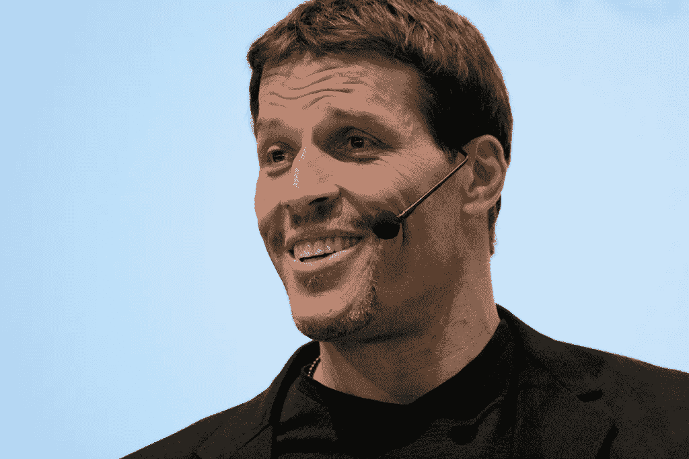
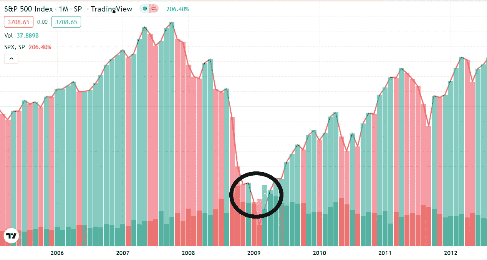
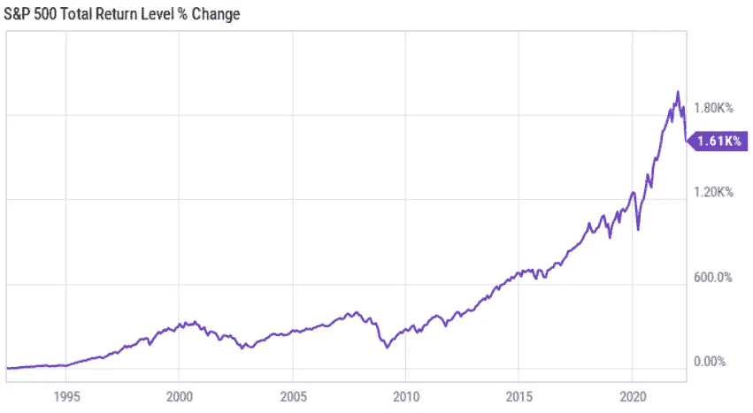

# 托尼·罗宾斯——亿万富翁自助大师告诉你如何在即将到来的经济衰退中提升自己

> 原文：<https://levelup.gitconnected.com/tony-robbins-billionaire-self-help-guru-tells-you-how-to-catapult-yourself-during-upcoming-f8bd912df672>

如果你准备好了，你可以在经济上占优势。

来源— [CC0 维基百科图片](https://en.wikipedia.org/wiki/Tony_Robbins#/media/File:Tony_Robbins.jpg)

据 [JP 摩根](https://www.jpmorgan.com/about/usconferences)称，他们为 400 名亿万富翁举办了一场投资会议，你必须证明你的净资产才能出席。

[托尼·罗宾斯](https://en.wikipedia.org/wiki/Tony_Robbins)也出席了，他 17 岁就搬出了家，远离了他成长的动荡环境。

作为一名看门人，他向他正在打扫的工地的房东询问他是如何变得如此成功的。房东告诉他，在参加了吉米·罗恩的一个研讨会后，他开始改变自己的生活。

吉米·罗恩是自我提升的教父。

托尼·罗宾斯身无分文，周薪仅 40 美元，但他想改变自己的生活，于是花 35 美元参加了一个 3 小时的吉米·罗恩研讨会。

他说这完全改变了他的生活。

> 托尼·罗宾斯:
> 
> “吉米·罗恩让我意识到，生活的秘密是比工作或其他任何事情更努力地为自己工作，因为这样我就有东西可以给别人，他塑造了我。”

我总是对那些通过商业教育和投资致富、但从未成功创业的自助大师表示怀疑。

就好像说，在这里，我自己没做过，但是我可以教你做什么的理论。

罗布·清崎就是一个很好的例子。

具有讽刺意味的是，他利用多层次网络营销公司安利(通常被称为传销)以托尼·罗宾斯的方式开始了他的职业生涯。

我觉得罗宾斯不一样。

他真的很在乎，他的领导策略没有利用恐惧——他开始鼓舞人心，虽然他今天的实际净资产并不明显，但他一生中从赤贫到暴富的故事是鼓舞人心的。

在这里，他向你展示了如何在这场不可避免的即将到来的衰退中让自己飞黄腾达。

# **这就是为什么这可能是你巨大的财务机会。**

衰退通常发生在支出普遍下降导致经济放缓的时候，没有人买得起任何东西。

如果我们因为政府强迫我们呆在家里而忽略 2020 年的人为衰退，2008 年将是我职业生涯中最严重的经济崩溃。

政府未能监管金融业和遏制有毒抵押贷款，任何有脉搏的人都获得了第二套和第三套住房的抵押贷款。

当购房者无法偿还贷款时，债权人陷入了死亡漩涡，一场信贷危机开始显现，将房地产泡沫转化为崩溃的房价。

信贷危机影响了整个经济，包括股市，下跌了约 40%。

这是 T2 标准普尔 500 指数，一个追踪美国 500 家最大公司的指数。

黑色圆圈显示，2009 年，从历史高点下跌了近 50%。

来源— [交易视图](https://www.tradingview.com/chart/4oOVDETy/?symbol=SP%3ASPX)

房价和股市都在自由落体，并继续放松，直到你可以以 20%的价格买房子，以 50%的价格买股票。

如果你有钱的话。

# 托尼·罗宾斯认为我们正在经历人类历史上最大的一次崩溃。

我们最近印刷了大量的货币，是历史上最多的，我们也经历了 12 年的牛市，所以罗宾斯认为崩盘是不可避免的。

他说，尽管如此，这并不完全是悲观的。

> 托尼·罗宾斯:
> 
> “如果你做好准备，崩盘可能是你一生中最不寻常的经济时期；它可以让你从现在的位置跳到你想去的地方。
> 
> “你可以在停机时弹射自己；你只需要为此做好准备”。

虽然罗宾斯认为衰退是一个很好的机会，但他说试图把握市场时机是不可能的。

> “你在美国消费者新闻与商业频道看到的所有这些预测者，他们生活的全部目的就是让算命先生看起来不错。
> 
> 没有人能做到”。

他说，从逻辑上讲，预期崩盘的人会等待崩盘发生，有些人甚至在恐惧中袖手旁观，而另一些人仍在赚钱。

> 托尼·罗宾斯:
> 
> “逻辑上，你说我在等待崩盘，但在人们等待的同时，人们却在赚钱”。

罗宾斯认为，在市场大幅波动期间，明智的做法是不要做出情绪化的决定。

你最好的选择是遵循沃伦·巴菲特的黄金法则，从长期着眼，捕捉那些退出市场的人永远不会得到的复利效应。

这个策略意味着你的资产配置、现金流和心态有助于你应对短期风险。

> 托尼·罗宾斯:
> 
> “总会有繁荣和萧条。你不能把握市场时机。它 99%的时间都不工作，”

罗宾斯指出，过去 20 年，S&P 的平均回报率为 8.6%。但是，如果你在此期间有 10 个最好的交易日没有入市，你的回报率将只有 2.5%。

# 股票市场数据—过去 94 年

标准普尔 500 从 1928 年到 2021 年的平均年收益率为[**11.82%。**](https://www.investopedia.com/ask/answers/042415/what-average-annual-return-sp-500.asp)

**如果你在 1992 年向标准普尔 500 指数投资了**10，000** 美元，并将股息再投资，你现在会有超过**170，000** 美元。**

**最近的市场波动有所下降。然而，该指数已被证明是长期的赢家，显示了投资的早期复合效应的好处。**

****

**来源— [杂色傻子](https://www.fool.com/investing/how-to-invest/index-funds/average-return/)**

# **罗宾斯说你必须这么做。**

**崩溃应该每五年发生一次。**

**2009 年到目前的市场是我们经历的最长的没有重大崩溃的一年，一场迫在眉睫的衰退将是大规模的。**

**罗宾斯说，无论你的收入有多高，你都必须有一个投资系统。**

**当全球巨星破产时，他用约翰尼·德普和 50 美分的财务状况作为例子，说明高收入者也容易受到财务滑坡的影响。**

> **托尼·罗宾斯:**
> 
> **“你必须赚钱，你的奴隶。**
> 
> **不管你的生意有多好，你都应该有一个自动投资的账户。**
> 
> **这是关于你所拥有的系统，而不是你随意做的那些事。**
> 
> **你必须从你的收入中拿出一定比例，无论如何，让它自动化，这样钱就被取出来了，你看不见它”。**

**罗宾斯反对那些说他们不能用收入投资的人。**

> **托尼·罗宾斯:**
> 
> **“如果政府向你征收额外的税，你会尖叫、呻吟、拳打脚踢，但最终你还是要支付。**
> 
> **所以给自己加个税”。**

**给自己征税，就像著名的西奥多·约翰逊的故事一样。**

**西奥多·约翰逊为联合包裹服务公司工作，但他的年薪从未超过 14000 美元(T2)；在晚年，他的身价超过了**7000 万美元**，在他有生之年捐出了 3500 万美元。**

**当约翰逊说他没有钱存的时候，一个朋友告诉他，如果他被征税，政府会毫不犹豫地从他的工资中扣除，他永远也不会看到这笔钱。**

**因此，约翰逊为自己设立了一种税，这导致了他的极度富有。尽管他赚了一小笔钱，但他还是把收入的 20%直接存入了一个投资账户。**

**50 年来，他的收入累计达到 7000 万美元。**

# **开始创造你的赚钱机器。**

**罗宾斯说，你应该留出一定比例的薪水，首先支付给自己。**

**他建议你选择收入的一定比例自动存起来。**

**这里没有正确的答案，所以相信你的直觉。**

**金额完全由你决定，从 3%到 50%，只要留出你能负担的，但你应该随着收入的增加而增加这个数字。**

**自动投资排在第一位，排在其他费用和支出之前，比如住房费用、水电费和你的社交生活。**

**诀窍是把这笔钱放在某个它会开始为你工作的地方，比如股票市场。**

> **托尼·罗宾斯:**
> 
> **“你的床垫下没有一个优秀的利率”。**

**他说，股票可能看起来令人生畏，但你不需要财富来开始。**

**根据纳斯达克，你可以用少至 1000 美元开始投资股票。**

**当你开始学习如何投资股票和债券时，你的一般经验是通过最小化成本来最大化回报。**

**你的投资成本包括佣金和账户费。尽可能保持最低价格，同时尽可能多样化。**

**托尼·罗宾斯说，你应该投资于追踪市场的多元化共同基金或指数基金。**

**他在[tonyrobbins.com](https://www.tonyrobbins.com/ask-tony/when-to-start-investing/)上解释道。**

> **“共同基金是投资公司的另一个名称，它将投资者的资金集中起来。**
> 
> **当你投资共同基金时，你投资的是股票、债券和房地产等混合资产，每一份都代表着你在基金资产中的所有权。**

**共同基金投资之所以有吸引力，是因为它们提供了由专业人士管理的单一多元化投资组合。**

# **最后的想法**

**罗宾斯不提倡单一股票投资，因为他认为多元化的投资组合有助于保护你免受波动性的影响。**

**我同意他所说的关于投资的一切。当他如此成功时，很难不这样做。**

**有一种更现代的思路认为，我们正在经历历史上最重大的财富向数字资产的转变。**

**与投资蓝筹股加密货币相比，下一代赚钱者对三年后的 2 倍收益并不那么兴奋。**

**我在股票市场没有头寸；我就是不感兴趣。**

**这并不意味着你不应该。**

> **如果你想在 Web3 上阅读更多我的观点，可以考虑成为会员。你的会员费直接支持你读的作家。如果你用我的链接 [*注册，我会赚一小笔佣金。点击这里*](https://medium.com/@jayden_levitt/membership) *。***

***本文仅供参考；不应将其视为财务、税务或法律建议。在做出任何重大财务决定之前，请咨询财务专家。***