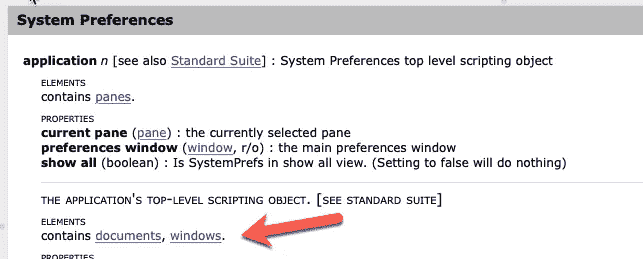
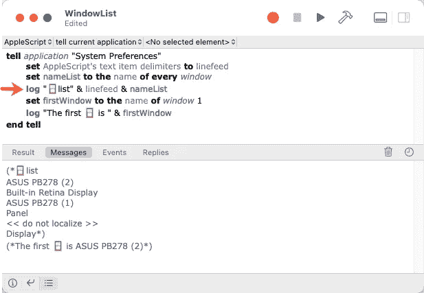
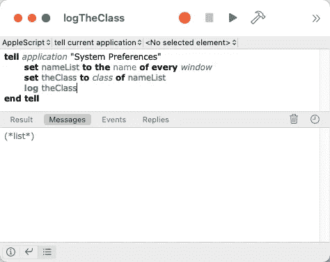
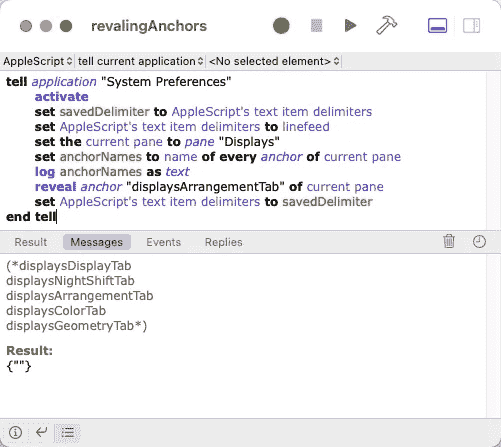

# 创建工具以更好地理解 AppleScript 第 2 部分

> 原文：<https://levelup.gitconnected.com/tooling-to-explore-applescript-part-2-ed44f511fcb5>

## [AppleScript 课程](https://gentille.us/applescript-articles-7f82c319d46?sk=0ad4bf43fb9356f9e647c970cb12c31f)

## 让我们再写一些工具来帮助我们理解 AppleScript。

AppleScript 的更多工具

*本文显示的所有代码都可以通过* [*关联的 GitHub repo*](https://github.com/Rolias/discover-applescript/tree/main/02-Tooling) *获得。*

# 前情提要…

[在第一部分](/create-tooling-to-understand-applescript-better-part-1-2727d6dbac83?sk=81bc5660e39d50cd0c3b67031b627d9f)中，我们见到了脚本编辑器、字典，并了解了系统偏好设置应用程序中的顶层面板。在本文中，我们将继续探索系统首选项，并构建更多的工具来检查窗口、类和锚。

# Windows 容器

系统偏好词典提到顶层对象包含窗口。

让我们进一步了解这个容器。如果您使用多台显示器，这可以证明是非常宝贵的。输入以下脚本，启动显示器系统偏好设置，然后运行脚本。你的结果会和我的不同。

列出“系统偏好设置”的窗口和窗口 1。

这段代码应该看起来很熟悉，我们没有列出`panes`，而是列出了`windows`。我们没有使用`display dialog`，而是使用一个简单的`log`命令。如果您有多台显示器，请尝试单击不同显示器上的不同显示首选项窗口。然后运行脚本，注意`window 1`返回不同的结果。

橙色箭头突出显示的行正在进行隐式的[强制](https://developer.apple.com/library/archive/documentation/AppleScript/Conceptual/AppleScriptLangGuide/conceptual/ASLR_fundamentals.html#//apple_ref/doc/uid/TP40000983-CH218-SW21)。变量`nameList`的类类型为`list`，我们希望它的类型为`string`或`text.`，这允许换行符被用作分隔符。将指示行更改为`log nameList`，注意每个条目不再由换行符分隔。最后，试着将那一行改为`log nameList as string`，你又得到了一个换行符分隔的列表，这次是通过使用显式强制。

# 类运算符

在这个例子中这似乎并不重要，但是当你得到形式为`*Can’t make «some-name-here» … into type string*` 的错误时，你就会知道发生了什么。解决这类问题可能需要确切地知道您正在处理的是什么类。幸运的是,`[class](https://developer.apple.com/library/archive/documentation/AppleScript/Conceptual/AppleScriptLangGuide/reference/ASLR_classes.html#//apple_ref/doc/uid/TP40000983-CH1g-BBCFEDGB)`操作符给了我们需要的东西。

获取对象或值的类

# 锚

锚允许我们以更精细的粒度操作元素。如果我们返回到系统偏好设置的字典并点击`panes`链接，它将向下滚动到`pane`部分。我们可以看到一个窗格包含了`anchors`。向下滚动到`anchor`条目，我们可以看到锚点有一个`name`属性，并响应`reveal.`让我们使用该信息编写一个新的脚本。

通过名称查找和显示锚点

这一次，我通过保存和恢复`text item delimiters.`成为了一个更好的 AppleScript 公民。这个脚本使用`[every](https://developer.apple.com/library/archive/documentation/AppleScript/Conceptual/AppleScriptLangGuide/reference/ASLR_reference_forms.html#//apple_ref/doc/uid/TP40000983-CH4g-BBCJFIIH)`引用表单关键字来提取窗格中的每个锚点。因为我想将它们记录为一个可消化的换行分隔列表，所以我只要求锚的`name`属性，然后我显式地将它强制为`text.`我运行了一次脚本来获取锚的名称，然后我调用应用程序提供的`reveal`命令来切换到使用发现的名称的对话框的 Arrangement 选项卡。

## 🔥小费

由于我们已经编写了较长的脚本，您可能已经注意到脚本编辑器提供了省略号或浅灰色的代码补全。要查看更多，或接受提供的完成信息，请按`esc`键。——*喂，别射信使！*

在下一篇文章的[中，我们将讨论嵌套的 tell 语句、系统事件应用程序和系统事件应用程序的 UI 元素。参见本系列](/tooling-to-explore-applescript-part-3-4da8f82fbfa5?sk=8485aceff834ab6eec34d7ad4df85b22)(目前)所有文章的[概述。](https://gentille.us/7f82c319d46?sk=0ad4bf43fb9356f9e647c970cb12c31f)