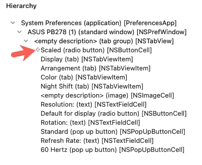
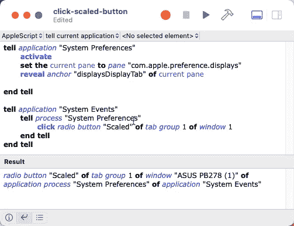

# 创建工具以更好地理解 AppleScript 第 3 部分

> 原文：<https://levelup.gitconnected.com/tooling-to-explore-applescript-part-3-4da8f82fbfa5>

## [AppleScript 课程](https://gentille.us/applescript-articles-7f82c319d46?sk=0ad4bf43fb9356f9e647c970cb12c31f)

## 是时候“嵌套和讲述”了，探索系统事件应用程序，并使用辅助功能导航器

浏览 AppleScript 的更多技巧

*本文显示的所有代码都可以通过* [*关联 GitHub repo*](https://github.com/Rolias/discover-applescript/tree/main/03-Tooling) *获得。*

# 前情提要…

在[第 1 部分](/create-tooling-to-understand-applescript-better-part-1-2727d6dbac83)和[第 2 部分](/tooling-to-explore-applescript-part-2-ed44f511fcb5?sk=1b840e74bae523c82d07c893f9513bcb)中，我们构建了许多脚本，我们知道如何找到窗口、窗格、锚点和显示信息。现在是时候进行交互了，深入到层次结构中去找到我们需要控制的确切项目。

# 相互作用

我们已经做了一些小的互动，比如让想要的锚出现。当我们想要更进一步，开始输入文本和点击按钮时，我们将想要再次使用字典并打开`System Events` 应用程序。我们要做的第一件事是学会将我们未来所有的命令指向正确的过程。

# 流程套件

我们可以看到系统事件应用程序有一个带有`processes`集合的`Processes Suite`。

我们可以用这个脚本在结果窗口中列出所有可用的进程。

获取系统事件流程

我们想要的过程就在那里，方便地命名为“系统偏好”。

# 嵌套 Tell 块

我们可以通过嵌套两个 tell 语句将命令指向 `System Events`应用程序的`System Preferences`进程，如下面脚本的第二块所示。

两个街区的故事

我们的第一个 tell 块和之前几乎一样，只是使用了窗格的 id`com.apple.preference.displays`而不是名称`"Displays".`

第二个 tell 块有嵌套。有一个外部的`tell`将我们的代码指向`System Events`应用程序。在里面我们有第二个嵌套的 tell，进一步将我们的命令指向`System Events.`的`System Preferences`进程，然后我们请求所有的`UI elements of window 1.`

不需要嵌套 tell 块，我们可以很容易地为`System Events`使用一个 tell 块，然后使用一个长行`get UI elements of window 1 of process “System Preferences”.`。你可以想象，如果我们需要针对流程执行一些任务，我们会厌倦向我重复短语`of process "System Preferences.`,嵌套方法也更具可读性。

# UI 元素

UI 元素记录在系统事件字典中。

获取 UI 元素列表通常是我们构造脚本所需要的。有些项目是不言自明的，如`button "Gather Windows",`，但其他如`button 3`或`tab group 1`呈现出更多的神秘。

# 解开谜团

`Accessibility Inspector`可以帮助我们揭开一般命名的 UI 元素的神秘面纱。安装 XCode 后，您可以使用 Spotlight 并按名称搜索来启动它。或者，您可以启动 XCode 并使用`XCode→Open Developer Tool ›`菜单，然后选择辅助功能检查器菜单项。

# 授权吧

打开系统偏好设置，在`Security & Privacy`窗格中点击`Privacy` 选项卡，然后点击左侧表格的`Accessibility`行。点按锁图标，并使用您的密码来解锁面板的右侧。然后使用+按钮添加`Accessibility Inspector` 应用程序。

# 使用它

在辅助功能检查器中，点击下图中蓝色的目标图标。然后将光标移动到您想要与之交互的应用程序，并选择一个项目。在下图中，我点击了`Scaled`按钮。

使用辅助功能检查器定位用户界面元素

辅助功能检查器的层次结构部分将填充我们需要的所有信息以及更多信息。上图读起来有点吃力。下面我只添加了层次结构。请注意，目标图标(由添加的橙色箭头指向)显示了层次结构中所选的特定项目。在层次结构中的同一级别还有许多其他项目。

瞄准缩放的单选按钮

# 点击按钮

现在我们已经获得了点击`Scaled`按钮所需的所有信息。我们可以看到它是`tab group 1`的一部分，而`tab group 1`又是`window "ASUS PB278 (1)"`的一部分(至少现在是索引 1)。下面是点击按钮的完整脚本。

看起来我花了很长时间来向你展示如何点击一个按钮。我同意这一点，但我希望**你**会同意你已经积累了一套工具，可以让你自己点击按钮和更多。

这不是我们学习旅程的终点。让脚本可重复可靠地运行仍然有一些关键的概念，我们将在以后的文章中探索这些想法，因为我们将增强我们的系统偏好脚本，使其变得更加有用。参见本系列(目前)所有文章的[概述。](https://gentille.us/7f82c319d46?sk=0ad4bf43fb9356f9e647c970cb12c31f)