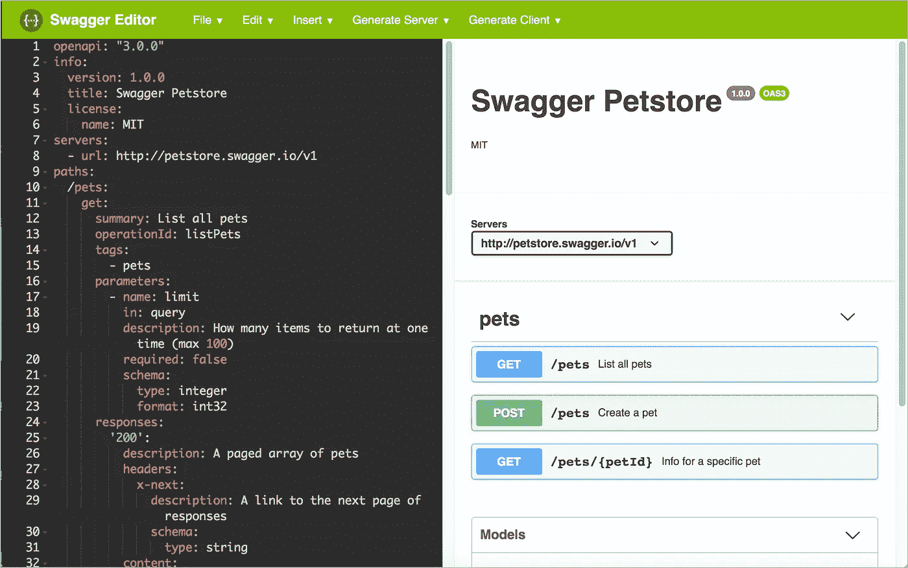
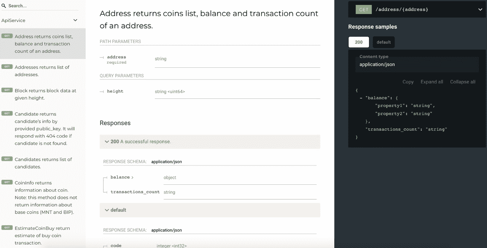
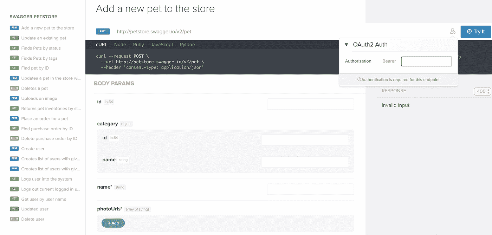
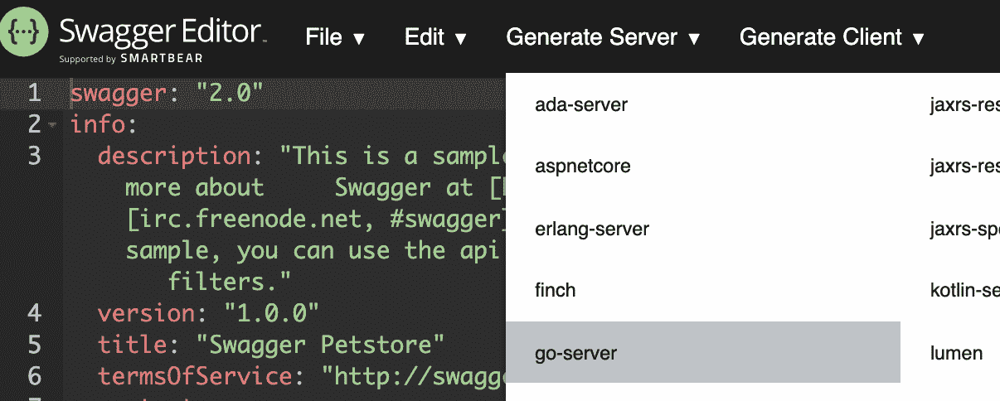
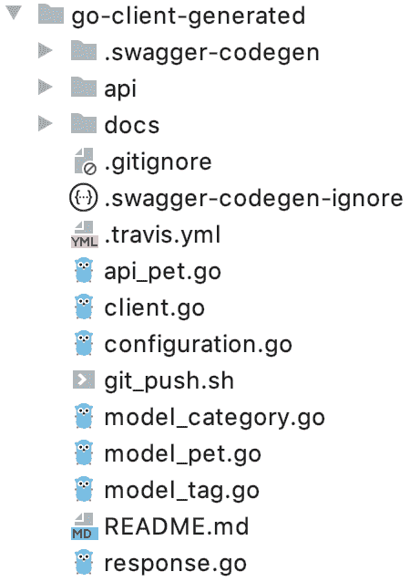
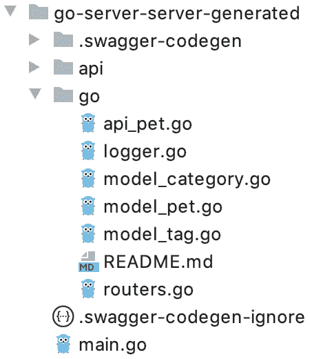
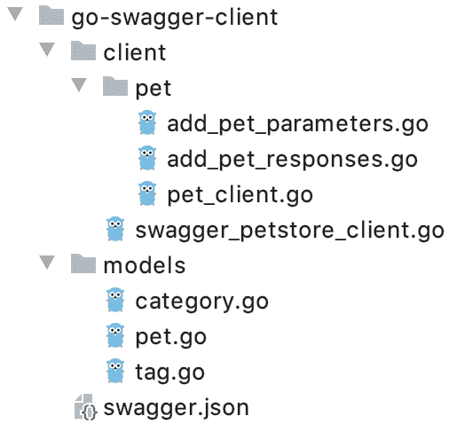
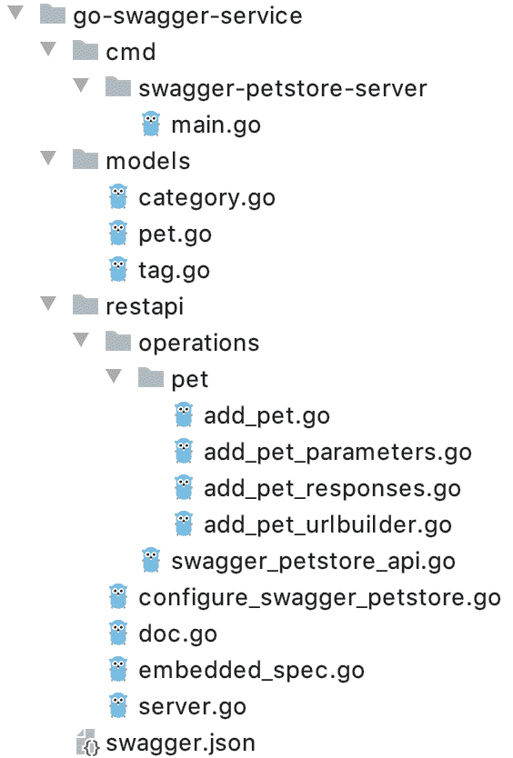
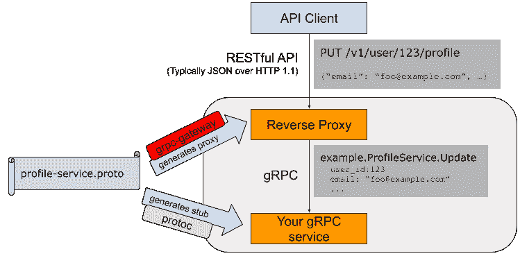

# 使用自动生成的代码和文档实现 Golang API 服务器的工具，grpc-gateway — protobuf，grpc，API，WebSocket。

> 原文：<https://levelup.gitconnected.com/tools-for-implementing-a-golang-api-server-with-auto-generated-code-and-documentation-694262e3866c>

阿尔瓦罗·雷耶斯在 [Unsplash](https://unsplash.com/photos/fSWOVc3e06w) 上拍摄的照片

# 什么是 OpenAPI 和 Swagger？

OpenAPI 是一个形式化的规范和完整的框架，用于描述、创建、使用和可视化 [REST](https://en.wikipedia.org/wiki/Representational_state_transfer) web 服务。目标是允许客户机系统和文档将它们的更新与服务器上的更改同步。这是可能的，因为方法、参数、模型和其他元素通过 OpenAPI 与服务器软件连接，并且始终与服务器软件保持同步。

该规范不依赖于编程语言，可以在 [HTTP](https://en.wikipedia.org/wiki/Hypertext_Transfer_Protocol) 协议之外使用。OpenAPI 同时应用于客户端、服务器以及根据 [REST](https://en.wikipedia.org/wiki/Representational_state_transfer) 创建的相应接口文档。

客户机可以在不知道服务器实现细节的情况下使用该规范。同时，开发者和普通用户都可以使用现成的工具和提供的接口使用 OpenAPI。 [XML](https://en.wikipedia.org/wiki/XML) 和 [JSON](https://en.wikipedia.org/wiki/JSON) 作为格式，但一般情况下可以选择另一种[标记语言](https://en.wikipedia.org/wiki/Markup_language) e(例如 [YAML](https://en.wikipedia.org/wiki/YAML) )。

## OpenAPI 规范

为了更好地理解 OpenAPI 规范，让我们来看看规范的一些摘录。

OpenAPI 元素有`paths`、`parameters`、`responses`和`security`。

在 OpenAPI 规范中，你的端点是`paths`。OpenAPI 规范中的端点可能看起来像这样:

下面是这段代码中对象的含义:

*   `/pets` -路径端点；
*   `get` - HTTP 方法；
*   `parameters` -查询的输入参数列表；
*   `responses` -请求响应列表；
*   `200` - HTTP 状态码；
*   `$ref`是对描述中定义响应的另一部分的引用(在`components`)。OpenAPI 有许多像这样的`$ref`链接来保持代码的整洁，并使其更容易重用。

## Swagger UI

分析 OpenAPI 规范最常用的工具之一是 Swagger UI。

[https://editor.swagger.io/](https://editor.swagger.io/)

[Swagger](https://swagger.io/) 是 OpenAPI 规范的原名，后来规范名改为 OpenAPI。现在“Swagger”指的是支持 [OpenAPI](https://github.com/OAI/OpenAPI-Specification/) 规范的 API 工具，而不是规范本身。人们仍然经常交替使用这两个名字，但是“OpenAPI”才是这个规范应该使用的名字。

除了 Swagger UI，其他工具也可以分析我们的 OpenAPI 文档。以下是其中的一些:

[https://redocly.github.io/redoc/](https://redocly.github.io/redoc/)

[https://docs.readme.com/](https://docs.readme.com/)

# I .从代码注释自动生成 OpenAPI 文件

您可以从程序代码中的注释自动生成 OpenAPI 规范文档，而不是手动编码。这种面向开发人员的方法在有大量 API 的情况下，或者在预先描述这些文档不太实际的情况下最有用。

Swagger 提供了许多库，您可以将这些库添加到您的程序代码中，以创建规范中的文档。本质上，它们分析开发人员添加的注释，并生成 OpenAPI 规范中的文档。但是，不同的编程语言有不同的注释方法。遵循特定于库的注释规则和准则来生成正确的等级库文件非常重要。

尽管这种方法“自动化”了规范生成，但是您仍然需要理解添加哪些注释以及如何添加它们(这与 Javadoc 注释和注释有太大的不同)。

# 二。按规格开发

您可以从代码注释中生成您的规范，尽管人们普遍认为自动生成不是最好的方法。建议小组手动实现规范，然后将规范文档作为开发人员在执行编码时使用的文档进行处理。这种方法通常被称为“规格优先开发”。

换句话说，开发人员查看规范以了解参数名应该是什么样子，应该是什么响应，等等。

“规范优先开发”的方法主要帮助你为一个大的团队使用文档，而不仅仅是为工程师。在实现之前定义规范也有助于团队通过讨论和批准交互接口的最终版本来创建更好的 API。

即使在创建 API 之前，如果您向规范中添加响应示例，规范也可能生成错误的响应。模拟服务器生成一个看起来像来自真实服务器的响应，但它只是代码中预定义的响应，对用户来说似乎是动态的。

# Golang 的开源工具

*   [swagger-API/swagger-codegen](https://github.com/swagger-api/swagger-codegen)；
*   [招摇过市/招摇过市](https://github.com/go-swagger/go-swagger)；
*   [swaggo/swag](https://github.com/swaggo/swag)；
*   [grpc-生态系统/grpc-网关](https://github.com/grpc-ecosystem/grpc-gateway)。

# 斯瓦格-API/斯瓦格-codegen

**★11.6 千**

Swagger Codegen 是一个代码生成器，用于从 OpenAPI 规范中定义的 RESTful API 创建服务器和客户端 SDK 存根。剩下的工作就是实现 API。

[**https://editor.swagger.io/**](https://editor.swagger.io/)

客户端包含发送请求的方法，以及处理请求的端点服务器和存根。

文件夹结构的示例如下所示。

客户端 swagger-api/swagger-codegen 的目录结构

swagger-api/swagger-codegen 服务器目录的结构

客户机和服务器包含相同的模型对象，这允许它们进行交互。下面的例子。

模范宠物

就其功能而言，这是最简单的工具。优点是您可以为几乎所有现代编程语言生成代码。

# 昂首阔步/昂首阔步

**★ 5，2k**

主 [go-swagger/go-swagger](https://github.com/go-swagger/go-swagger) 工具包提供了命令行工具来帮助您使用 swagger。

该工具包具有广泛的定制选项，并为使用 OpenAPI 2.0 规范提供了许多功能:

*   启动规范用户界面

> 招摇发球。/petstore-expanded.json

*   检查规格

> swagger 验证。/petstore-expanded.json

*   创建 API 服务器

> swagger 生成服务器[-f ./swagger . JSON]-A[应用程序名称[ —主体[主体名称]]

*   创建 API 客户端

> swagger 生成客户端[-f ./swagger . JSON]-A[应用程序名称[ —主体[主体名称]]

*   从源代码生成规范

> 生成 spec -o ./swagger.json

*   为了生成数据模型

> swagger 生成模型—规格= {规格}

*   转换规范，对齐，转换对象和指针，规范的统一

> 招摇扩展{spec}
> 
> 摇摆展平{spec}
> 
> swagger mixin {spec1} {spec2}

*   比较规格

> swagger diff {spec1} {spec2}

在我们的例子中，只有 API 客户机和服务器创建命令是有趣的。

下面显示了生成客户端时我们得到的结果。

客户机 go-swagger/go-swagger 的目录结构

客户端不仅包含对象模型，还包含验证对象模型、将对象模型转换成请求、发送请求以及获得响应的方法。

Http 客户端和请求实体验证

它的功能非常适合快速编写随时可用的 SDK 客户端与服务器进行交互。

服务器已经为实现做好了一切准备。它包括对象模型、端点、它们的描述、错误处理、查询验证以及服务初始化本身。

go-swagger/go-swagger 服务器目录的结构

服务器需要服务器配置和方法实现的最小配置。如果 configure_swagger.go 文件已经存在，则当您再次运行该命令时，将不会更新该文件。

服务器配置和实施

因此，我们有一个功能:

*   根据 Swagger 规范创建服务器；
*   根据 Swagger 规范生成客户端；
*   支持 JSON schema 和 swagger 提供的大部分特性，包括多态性；
*   从代码批注创建 OpenAPI 规范；
*   使用 swagger 规范的附加工具；
*   定制功能，带有供应商扩展和定制模板；
*   用户界面服务规范。

除了 [go-swagger](https://github.com/go-swagger) 工具和生成器之外， [go-openapi](https://github.com/go-openapi) 包还提供了基于 openapi 创建定制解决方案的模块化功能。

# swaggo/swag

**★ 2，7k**

[Swag](https://github.com/swaggo/swag) 将 Go 注释转换成 swagger 2.0 文档。已经为流行的 web 框架编写了许多插件。

*   [杜松子酒](http://github.com/swaggo/gin-swagger)
*   [回声](http://github.com/swaggo/echo-swagger)
*   [水牛](https://github.com/swaggo/buffalo-swagger)
*   [net/http](https://github.com/swaggo/http-swagger)
*   [火烈鸟](https://github.com/i-love-flamingo/swagger)
*   [纤维](https://github.com/arsmn/fiber-swagger)
*   …

添加一个`jsonschema`描述的过程与 Javadoc 注释和注解没有太大的不同。

swaggo 注释的示例

这允许您快速将 [swaggo/swag](https://github.com/swaggo/swag) 集成到现有项目中。

# grpc-生态系统/grpc-网关

**★ 8，8k**

[grpc-生态系统/grpc-网关](https://github.com/grpc-ecosystem/grpc-gateway)是一个`protoc`插件。它读取 RPC 服务定义，并生成一个反向代理服务器，将 RESTful JSON API 翻译成 gRPC。该服务器是根据 gRPC 描述中的参数创建的。

обратныйgrpc 网关

这个项目旨在为你的 gRPC 服务提供一个 HTTP + JSON 接口。这有助于您同时提供 gRPC 和 RESTful 风格的 API。

# 原蟾蜍

gRPC 用多种编程语言为服务器生成 API 客户端和存根，它速度快，易于使用，带宽效率高，其设计已经过 Google 验证。

gRPC 很容易定义。这使用了[协议缓冲区](https://developers.google.com/protocol-buffers) (protobuf)，一种独立于语言、独立于平台、可扩展的 Google 机制，用于序列化结构化数据。

protobuf 文件的描述

gRPC 相对于其他协议的优势:

*   比 JSON 紧凑 2 倍；
*   比 XML 紧凑 3 倍；
*   没有掩码，无法解密消息；
*   反序列化所需的 CPU 和内存更少；
*   提供所有语言版本；
*   向前和向后兼容性。

缺点:

*   没有默认值；
*   解码需要一个架构。

# 向前和向后兼容性

编码记录是编码字段的串联。每个字段由它的标签号定义(图示例中的数字 1、2 和 3)，并用数据类型标记(例如，字符串或整数)。如果没有设置字段值，它就不会包含在编码记录中。因此，字段标签对于编码数据的意义非常重要。您可以更改模式中的字段名称，编码的数据永远不会引用字段名称，但您不能更改字段标记，因为这将把所有现有的编码数据变成不正确的数据。

如果您没有忘记为每个字段设置一个新的标记号，那么您可以向模式中添加新的字段。试图读取由新代码写入的数据的旧代码(其不知道关于添加的新标签号的任何事情),包括具有它不理解的标签号的新字段，可以简单地忽略这个号。由于数据类型签名，解析器可以确定需要跳过多少字节。这确保了直接兼容性:旧代码可以读取新代码条目。

如果所有字段都有唯一的标签号，新代码将始终能够读取旧数据，因为标签号的含义没有改变。删除一个字段与添加一个字段没有什么不同，只是向后和向前的兼容性被颠倒了。您不能重复使用相同的标签号(因为包含旧标签号的数据可能仍存储在某个地方，新代码应忽略该字段)。

如果更改字段的数据类型，则存在丢失字段准确性或截断字段的风险。例如，我们将一个 32 位整数改为同样的 64 位整数。新代码可以很容易地读取旧代码写入的数据，因为解析器可以用零填充所有缺失的位。但是，当旧代码读取新代码写入的数据时，旧代码仍然使用 32 位变量来存储值。如果解码的 64 位值不适合 32 位，它将被截断。

在协议缓冲区格式中，没有列表或数组的数据类型，而是有一个重复的字段标记。相同的字段标记在记录中重复了几次。这样做的一个好处是，您可以将具有单个值的字段更改为重复的(具有多个值)。读取旧数据的新代码将看到一个零或一个元素的列表(取决于字段是否存在)，而读取新数据的旧代码将只看到最后一个元素。

# google.api.http

GRPC 代码转换是 gRPC 方法和一个或多个 HTTP REST 端点之间的转换功能。这允许开发人员创建一个支持 gRPC API 和 REST API 的 API 服务。包括 [API Google](https://github.com/googleapis/googleapis) 、[云端点](https://cloud.google.com/endpoints)、 [gRPC 网关](https://github.com/grpc-ecosystem/grpc-gateway)和 [Envoy](https://github.com/envoyproxy/envoy) 代理服务器在内的许多系统都支持这一特性，并将其用于大规模生产服务。

`[grcp-gateway](https://github.com/grpc-ecosystem/grpc-gateway)`服务器是根据服务定义中的`[google.api.http](https://github.com/googleapis/googleapis/blob/master/google/api/http.proto)`注释创建的。

`HttpRule`定义 gRPC / REST 映射方案。映射定义了 gRPC 请求消息的不同部分如何映射到 URL 路径、URL 请求参数和 HTTP 请求主体。它还控制 gRPC 响应消息在 HTTP 响应正文中的显示方式。在 gRPC 方法中，`HttpRule`通常被指定为`google.api.http`注释。

每个映射定义一个 URL 路径模板和一个 HTTP 方法。如果每个字段都是具有原始类型的非重复字段，则路径模板可以引用 gRPC 请求消息中的一个或多个字段。路径模板控制如何将请求消息字段映射到 URL 路径。

google.api.http 注释

您需要向`protoc`编译器提供必要的第三方`protobuf`文件。它们包含在`[third_party/googleapis](https://github.com/grpc-ecosystem/grpc-gateway/tree/master/third_party/googleapis)`文件夹的`grpc-gateway`存储库中，我们建议将它们复制到项目文件结构中。

您需要向`protoc`编译器提供必要的第三方`protobuf`文件。它们包含在`[third_party/googleapis](https://github.com/grpc-ecosystem/grpc-gateway/tree/master/third_party/googleapis)`文件夹中的`[grpc-gateway](https://github.com/grpc-ecosystem/grpc-gateway/)` [存储库](https://github.com/grpc-ecosystem/grpc-gateway/)中，我们建议将它们复制到项目文件结构中。

# 映射 GET 请求

URL 中 HTTP 映射的规则:

1.请求消息中的嵌套消息分为三类:

*   路径模板引用的字段。它们通过 URL 路径传递；
*   `google.api.HttpRule.body`引用的字段。它们通过 HTTP 请求体传递；
*   其他所有字段都通过 URL 请求参数传递，参数名是请求消息中字段的路径；
*   重复字段可以表示为同名的多个查询参数。

2.如果`google.api.HttpRule.body = "*”`，省略 URL 请求参数，所有字段都通过 URL 路径和 HTTP 请求体传递。

3.如果省略`google.api.HttpRule.body`，则省略 HTTP 请求体，所有字段都通过 URL 请求的 URL 路径和参数传递。

定义 GET 请求

如果缺少 HTTP 请求正文，请求消息中未被路径模板链接的任何字段都会自动成为 HTTP 请求参数。

映射到 URL 请求参数的字段必须具有基本类型、重复基本类型或非重复消息类型。如果类型重复，参数可以在 URL 中重复为`…?param=A&param=B`。对于一个消息类型，每个消息字段被映射到一个单独的参数，比如`…?foo.a=A&foo.b=B&foo.c=C`。

# 邮政

对于允许请求`body`的 HTTP 方法，body 字段定义了显示。考虑消息资源集合的 REST 更新方法。

可以在主体映射中使用特殊名称`“*“`来确定每个与路径模板不相关联的字段应该被映射到请求主体。这包括更新方法的以下替代定义:

定义发布请求

注意，当在主体显示中使用`“*”`时，不可能有 HTTP 参数，因为所有字段都不与主体中的路径结尾相关联。这使得在定义 REST API 时很少使用这个选项。`“*”`通常用于完全不使用 URL 进行数据传输的用户方法中。

# 附加方法包

您可以使用`additional_bindings`选项为单个 RPC 定义多个 HTTP 方法。

附加路径绑定

# 修补

gRPC 中没有空值，如果没有定义该值，则默认使用空值，即`string = ””`或`int = 0`。这很成问题，因为很难确定查询中的值是空的还是未定义的。解决这个问题的方法是列出在请求中设置的属性的名称。这必须由请求者设置，grpc-gateway 自动从请求有效负载中检测属性名称，并自动发送列表。

唯一的要求是 protobuf 请求消息必须有一个类型为的`update_mask`字段，并且请求必须是一个`PATCH`请求。其思想是，如果绑定被映射到一个修复，并且请求消息恰好包含一个消息字段掩码，则为网关处理程序创建额外的代码，该代码将基于请求体填充字段掩码。有两种情况:

*   根据 Google API 设计指南，从 REST 请求中隐藏了`FieldMask`。在这种情况下，`FieldMask`从请求体更新，并在 gRPC 请求消息中设置；
*   `FieldMask`接受 REST 查询。在这种情况下，网关保持字段掩码不变。

定义 POST 和 PUT 请求，使用 FieldMask 的示例

> 重要的是要知道，如果请求是一个 PUT 请求，`*update_mask*`字段将不会自动填充。有关字段掩码的更多信息，请参见此 [godoc](https://pkg.go.dev/google.golang.org/protobuf@v1.25.0/types/known/fieldmaskpb?tab=doc) 。

# WebSocket

gRPC 请求有四种类型[:](https://www.grpc.io/docs/what-is-grpc/core-concepts/#rpc-life-cycle)

*   [一元](https://www.grpc.io/docs/what-is-grpc/core-concepts/#unary-rpc) —这是一个单独的请求，一个 RPC 响应；
*   [客户端流](https://www.grpc.io/docs/what-is-grpc/core-concepts/#client-streaming-rpc) —这是一个具有多个请求和一个响应的 RPC
*   [服务器流](https://www.grpc.io/docs/what-is-grpc/core-concepts/#server-streaming-rpc) —这是一个具有一个请求和多个响应的 RPC
*   [双向流](https://www.grpc.io/docs/what-is-grpc/core-concepts/#bidirectional-streaming-rpc) —多请求多响应的 RPC。

将`mux` [grpc-gateway](https://github.com/grpc-ecosystem/grpc-gateway/blob/master/runtime/mux.go) 包装在 [grpc-websocket-proxy](http://github.com/tmc/grpc-websocket-proxy) 中，以通过 web sockets 公开流端点。在网络上，它对消息使用带有换行符的编码。

定义 WebSocket 路径

# HTTP 正文

[HTTP Body](https://github.com/googleapis/googleapis/blob/master/google/api/httpbody.proto) messages 允许您指定带有自定义数据内容和自定义内容类型头的响应消息。包含在`http.Body`响应中的值将一字不差地用于从网关返回的消息中。

生成带有自定义标头的响应

# 截击机

gRPC Go 最近获得了对拦截器的支持，即在将请求传递给用户的应用程序逻辑之前运行在 gRPC 服务器上，或者围绕用户的调用运行在 gRPC 客户端上的中间件。这是实现通用模板的理想方式:身份验证、日志、消息、验证、重试或监控。

[grpc_middleware](https://github.com/grpc-ecosystem/go-grpc-middleware) 为拦截器链提供支持。有两种类型的拦截器:客户端和服务器端。这个包为两者都提供了对拦截器的监控。

客户端和服务器端拦截器

证明

*   [grpc_auth](https://github.com/grpc-ecosystem/go-grpc-middleware/blob/master/auth) —认证中间件的可配置部分(通过`AuthFunc`)。

记录

*   grpc_ctxtags —将`Tag`地图添加到上下文中的库，其中数据是从请求体填充的；
*   grpc_zap —将 zap 日志记录库集成到 grpc 处理程序中；
*   grpc_logrus —将 logrus 日志记录库集成到 grpc 处理程序中；
*   grpc_kit —将 go-kit 日志库集成到 grpc 处理程序中。

监视

*   [grpc_prometheus](https://github.com/grpc-ecosystem/go-grpc-prometheus) —客户端和服务器端监控中间件；
*   [otgrpc](https://github.com/grpc-ecosystem/grpc-opentracing/tree/master/go/otgrpc) — OpenTracing 客户端和服务器端拦截器；
*   [grpc_opentracing](https://github.com/grpc-ecosystem/go-grpc-middleware/blob/master/tracing/opentracing) —支持流和处理程序返回标签的客户端和服务器端 opentracing 拦截器。

客户

*   [grpc_retry](https://github.com/grpc-ecosystem/go-grpc-middleware/blob/master/retry) —用于重复 grpc 响应代码的通用机制，客户端中间件。

计算机网络服务器

*   [grpc_validator](https://github.com/grpc-ecosystem/go-grpc-middleware/blob/master/validator) —检查来自`.proto`选项的传入 codegen 消息；
*   [grpc_recovery](https://github.com/grpc-ecosystem/go-grpc-middleware/blob/master/recovery) —把恐慌变成 grpc 错误；
*   [速率限制](https://github.com/grpc-ecosystem/go-grpc-middleware/blob/master/ratelimit) —用限制器限制 grpc 速度。

# 规格扩展

要在单独的文件中设置 OpenAPI 的附加参数，需要描述选项`grpc.gateway.protoc_gen_swagger.option.openapiv2_swagger`。

OpenAPI 的附加描述

# 只读的

有些字段，比如`ID`，更新没有意义。只需添加一条评论`// Output only`，就可以将它们设置为`“readOnly”: true`。在 protobuf 消息字段中，将该字段标记为只读。

只读字段

# 产生

从生成模型需要在本地安装 protobuf 协议缓冲区编译器协议 3.0.0 版或更高版本。其他依赖关系可以通过`go mod`设置。

安装依赖项

*   `protoc-gen-go`是一个`protoc`插件，用于在 Go 上生成缓冲协议包；
*   `protoc-gen-swagger`是一个生成 swagger 代码的插件；
*   `protoc-gen-grpc-gateway`是一个插件，用于生成反向代理服务器，将输入的 RESTful HTTP/1 请求转换为 gRPC。

生成 grpc-网关反向代理

# 履行

下面是一个在 Golang 中启动服务器的例子。

正在初始化 grpc 网关的入口点

# 优点和缺点

grpc 网关方法的优势:

*   都在一个地方；
*   RESTful JSON API
*   gRPC
*   网络插座；
*   支持自定义标题和数据(例如，上传文件)；
*   OpenAPI 文档。

缺点包括:

*   通过 HTTP 的低速；
*   OpenAPI 没有灵活的描述。

# OpenAPI 和 Swagger UI 的缺点

尽管 Swagger 具有吸引用户“让我试试”欲望的交互能力，但 Swagger 和 OpenAPI 也有一些缺点:

*   **仅链接信息:**首先，OpenAPI 规范和 Swagger UI 输出只覆盖链接文档。OpenAPI 为每个端点提供了基础:描述、参数以及示例请求和响应。OpenAPI 不包含入门空间、如何获得 API 密钥的信息、如何启动示例应用程序的信息、关于速度限制的信息，或者在开发人员指南中找到的一百个其他细节。因此，即使有这个很酷的交互工具允许用户探索和学习我们的 API，我们仍然需要提供一个用户指南。
*   **信息冗余/重复:**在 OpenAPI 中，可能有两个地方描述了端点和参数(Swagger UI 链接描述和用户指南)，您需要同步它们，将一个嵌入到另一个中，或者指定它们之间的关系。
*   **工作流 API 的复杂性:**API 的复杂性也可以创造一个 Swagger 的极限。如果有端点具有复杂的相互依赖关系，并且需要特殊的配置工作流或其他非直观的处理。例如，如果你需要在一个端点返回任何东西之前首先配置 API 服务，然后使用一个端点获得一个特定的对象，该对象被传递给另一个端点的参数，等等，在没有详细指南的情况下，Swagger UI 中的`Try-it-out`功能对用户来说没有太大意义。
*   **对真实数据的请求:**有些用户可能没有意识到，点击“试用”按钮会根据他们使用的 API 键对他们的帐户进行真实的调用。当用户开始询问如何删除所有测试数据或为什么他们的实际数据现在被破坏时，将 Swagger 等研究隔离软件环境与真实数据混合使用可能会导致问题。
*   **CORS 限制:**进行 API 调用时可能会遇到 CORS 限制(跨产地资源共享)。并非所有 API 都接受来自网页的请求。
*   **查询体参数多的问题:**查询体参数长的端点通常有问题。单个 API 可以包含带有数百行长的请求主体参数的查询。请求体中有了这个参数，Swagger 用户界面的显示就变得不可用了。

# 结论

尽管 OpenAPI 规范有缺点，但仍然强烈推荐使用它来描述 API。OpenAPI 正迅速成为越来越多工具的基础。您可以使用您的开放 API 规范将您的 API 导入到许多平台和系统中，并自动配置单元测试和原型。

有了上面讨论的工具，文档也成为实现 web 服务器的工具。