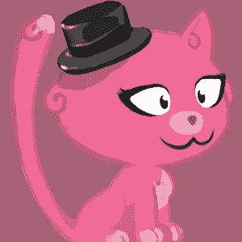
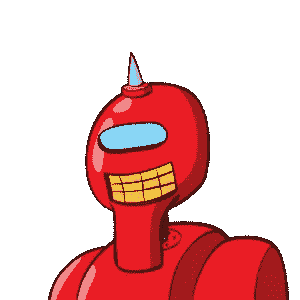
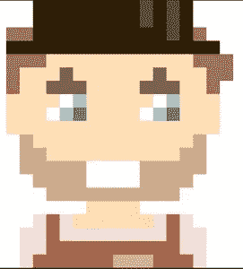
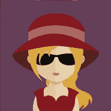

# 用于在 Node.js 中植入数据库的工具

> 原文：<https://levelup.gitconnected.com/tools-for-seeding-databases-in-node-js-72fb2f6c7320>

照片由在 [Unsplash](https://unsplash.com?utm_source=medium&utm_medium=referral) 拍摄的《我的镜头人生》

在这篇文章中，我将讨论一些我发现并用于不同项目的工具。我们为什么要植入数据库？对数据库进行种子设定通常有几个原因。首先，在数据库中存储数据通常有助于需要访问数据库的测试。播种数据库的第二个原因是展示一个项目，例如，一个投资组合或您为公司开发的某个东西的内部演示。

我列出了两类工具。一个面向数据的工具，和一些头像工具。

从面向数据的工具开始，一个 NPM 包， [Chance](https://www.npmjs.com/package/chance) 。我喜欢这个工具可以生成的各种数据。需要随机生成一个地址？机会可以做到。需要随机的句子？没问题。机会可以产生许多不同的东西。我强烈建议你查看他们的文档，我指的是它能产生的各种各样的东西。

我发现这很有帮助，尤其是在代码测试中使用 Chance 时，您可以为 Chance 使用的伪随机生成器设置一个种子值。这样每次运行程序时，只要以相同的顺序调用 Chance 的函数，就会得到可重复的结果。

Gravatar 标志

然而，到目前为止，有一个特性我不喜欢。这就是 Chance 生成头像 URL 的能力。当被调用时，它会生成随机的[Gravatar](https://en.gravatar.com/)URL，通常不会生成有意义的头像，而会生成 Gravatar 徽标，如左图所示。

接下来的 3 个工具都是静态图像生成器。其目的是用作图像占位符，通常用于配置文件。这 3 个工具都是简单的 RESTful APIs，只需要一个简单的 URL。左边的图像是通过在浏览器中转到下面的 URL `[https://robohash.org/whatever.png?set=set4](https://robohash.org/whatever.png?set=set4)`并保存图像而生成的。当然，我们也可以通过编程来实现。

好的一面是所有这些 API 都接受一些值(在上面的例子中是`whatever`)，这些值将生成一个独特的图像。相同的图像将由相同的短语反复生成，因此它是可重复的。但是，更改该值将会生成完全不同的图像。

从我最喜欢的[机器人哈希](https://robohash.org/)开始，我用它来生成左边的图像。这个网站是我最喜欢的，因为我碰巧喜欢机器人。如果你读了这个简短的文档(就在主页上)，这个网站还允许你创造怪物、人类和猫(上面那只可爱的小猫就是一个例子)。

接下来我们有[迪贝化身](https://avatars.dicebear.com/)。这个工具有两个显著的特点。首先，它可以生成 10 类图像(精灵),包括左边这个像素化的男性图像，是的，他们也有一个女性选项。值得注意的是，其中一个选项 code 可以生成 QR 码。第二个特点是，他们为每个精灵提供了许多高级选项的 npm 包。

最后但同样重要的是[可爱的化身](http://avatars.adorable.io/)。在三个生成器中，这个站点的选项最少。你会看到一张方方正正的卡通脸，就像左边这张。

最后要提的工具是[卡通头像](https://www.npmjs.com/package/cartoon-avatar)。这是一个 npm 包，它将随机选择解析为卡通头像的 URL。我喜欢这些是因为它们是人类占位符，我可以选择男性或女性作为选项。应该注意的是，这些图像不是随机生成的，而是随机选择的。男性头像 129 个，女性头像 114 个。我相信这对于大多数项目来说已经足够了。