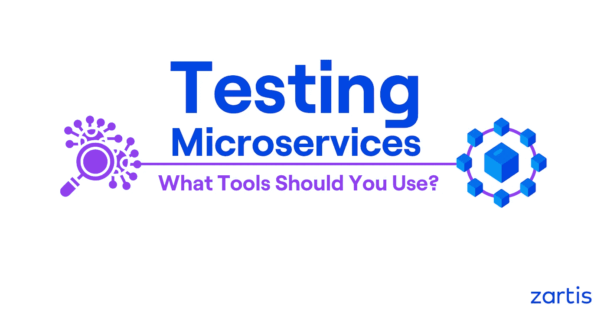
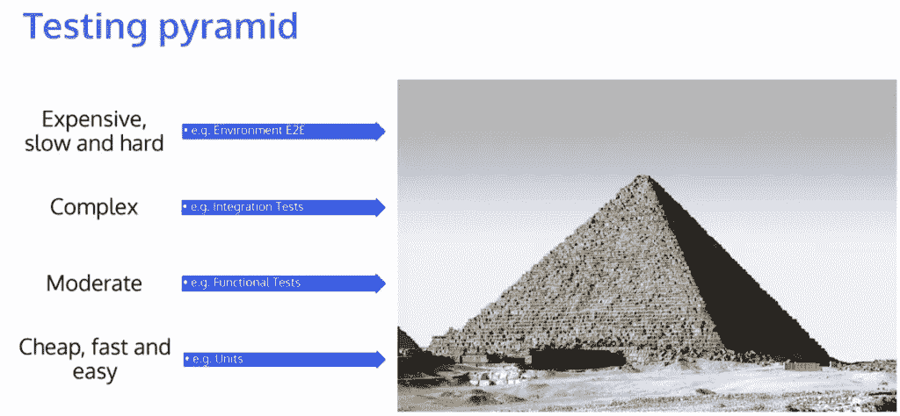

# 测试微服务的工具

> 原文：<https://levelup.gitconnected.com/tools-for-testing-microservices-f9f06854a99d>

本文探讨了在使用微服务时，您可以在软件开发的每个阶段使用的测试工具和技术。

在进入具体的工具之前，我们建议阅读本系列的前一篇博客——[测试微服务](/how-to-test-microservices-c7585181b686)——以获得对该主题的更广泛介绍以及可能需要的测试类型的详细概述。

这些文章总结了由 [Zartis](http://zartis.com) 首席工程师 Piotr Litwiń ski 主持的关于该主题的网络研讨会。你可以点击观看完整的网上研讨会[。](https://youtu.be/z2hCLOrXJ8M)

# 我们为什么要测试微服务？

我们会说为了省心，但在实践中，测试微服务可以通过避免多米诺骨牌效应来帮助我们消除许多问题。

微服务通常使用面向业务的 API 来封装核心业务能力。松散耦合的原则有助于消除或最小化服务及其消费者之间的依赖性。然而，分布式环境中最大的问题是在系统和子系统中有许多移动部件。它在不断变化，许多服务同时相互交互。

假设您有 10 个团队，不断地在您的系统和子系统的各个方面工作，一天部署多次。如果没有适当的测试，您可能会经历一些副作用，因为您没有意识到其他团队成员所做的更改。这变得非常复杂，在出现错误的情况下，回滚通常是相当大的。由于依赖关系树，从系统中取出其中一个微服务可能会很困难，因为这通常意味着您还需要恢复依赖于该微服务的其他部署。

# 测试金字塔和测试类型

为了掌握所有的变化，在软件开发生命周期(SDLC)的不同阶段，您可以运行不同的测试。这些测试可以分为构建测试、环境测试和系统测试。

**构建测试**通常包括单元测试、契约测试、功能或集成测试。这里的目标是在构建环境中的问题被推到任何地方之前消除它们。

要运行**环境测试**你不需要一个完整的环境，但是你需要不止一个服务或者系统组件来测试。为此，您可以使用模拟器来测试同时运行的服务。这些测试通常包括部署测试和端到端(E2E)测试。

对于**系统测试**，需要考虑两个测试组，即性能测试和弹性/可用性测试。使用这些测试，您可以测试您的整个系统或者子系统的一部分，这取决于您想要如何分割您的测试。

# 测试微服务的工具

就像 SDLC 的不同阶段有不同的测试一样，在这些阶段你也可以使用不同的工具来测试你的软件。这里，我们将介绍开发人员工具和 DevOps 工具，它们涉及部署微服务之前和之后的各个阶段。

# 微服务测试开发工具

顾名思义，下面的工具和技术将向您展示软件开发人员在将代码发送给 DevOps 团队发布之前必须验证其正确性的选项。

## 过程测试工具:

1.  **Stubs&mock:**它们是已经很好建立的模式，要么实现替换，要么使用市场上现有的库来替换您通常会注入到服务或类中的东西。
2.  **粗粒度单元测试:**这里，不是只有一个类或一个代码单元，而是让这个单元变得更大。例如，您可以使用测试服务器 nuget 包来加速内存中的几乎所有东西。
3.  定义良好的契约:契约将允许你有更多的模块性，并且可以独立测试，因为每个契约都是定义良好的。它也有助于以更好的方式开发软件，因为它促使你甚至在开始打基础之前就考虑很多事情，并且你可以更早地发现设计中的任何潜在问题。
4.  **内存测试框架:**这些测试比粗粒度的单元测试更广泛，但同样，它们允许您在同一处理器中测试许多东西。例如，您可以随时从 Visual Studio 中调试它。此外，一些 ORM 框架(例如实体框架)允许您使用像实体框架内存 nuget 包或 SQLite set 这样的工具来扩展内存实现，以便在内存模式下工作。此外，它还可以在身份服务器上以内存模式运行。

## 机器级测试工具:

这些测试仍然会在你的机器上运行，你仍然可以调试一些东西，但是通常需要你在后台运行一些东西，比如模拟服务器，这样你就可以和那个东西对话。

1.  **契约验证:**这个想法是在运行一组测试的同时，通过测试设置重定向流量来记录呼叫。当你进行一系列测试时，它会为你记录下来。Packed 是一个非常好的框架，它允许你验证合同是正确的。
2.  **Webdriver &(无头)浏览器:**如果您的合同得到验证，您可以使用 Webdriver 和无头浏览器来启动整个服务器，并模仿您通常与之对话的 API。您可以编写点击真实元素的测试，以查看它们的行为。为了使它更快，您可以在无头模式下运行这些测试。
3.  **本地副本:**使用本地 SQL 数据库、Cosmos DB 模拟器、Jason 或 mock 服务器，您可以轻松地分发副本。
4.  **易于分发的副本:**你可以在 Docker 上使用 MySQL 数据库，或者使用 Amazon fargate 或 Azure ACI 等工具在云中构建 Docker 容器。

# 微服务测试的 DevOps 工具

DevOps 团队通常不直接参与测试，但他们可以做很多事情来确保服务按预期工作。一旦服务被部署到给定的环境中，就可以使用这些工具或技术。

在给定的环境中运行 e2e/多服务集成测试是最常见的技术之一。一旦您在那个测试环境中部署了您的测试，您就可以使用 Specflow 或者类似的东西来设置自动化测试，检查基本的流程。

**启动时运行应用诊断**是另一项非常有用的技术。这是一段代码，用于检查 API、模式数据库、不正确的版本等。它检查应用程序启动时是否一切都出错，或者它是否还在工作。通过这种方式，您可以在部署特性之前或者在部署特性时发现管道中的问题。

**如果设置正确，使用指标和仪表板**是一个非常有用的工具。无论何时部署，您都应该查看日志和某些仪表板，例如，您的服务器吞吐量是否仍然很高，或者在部署后是否下降了。

设置正确的警报系统是有效利用仪表板的关键。不要查看 20 个仪表板，这在现实中是不会发生的，你可以有一个或两个总体的仪表板，如果有任何异常，你会收到通知。部署新服务时，您可以设置通知、电子邮件、松弛消息或任何聊天消息工具来报告问题。

重要的是，不要只在生产环境中使用指标和日志，而是在所有环境中使用，这样您就可以尽可能快、尽可能早地发现问题。

# 最后的想法

您可能需要花费一些时间和资源让您的团队参与进来，并调整您的开发和测试方法。然而，在日志运行中，您将拥有一个在愿景和开发方法上完全一致的团队。

在较低的级别进行测试还有许多其他优势。您可以节省大量的时间和回归，您可以更早地发现错误，但最重要的是，您将获得重构或扩展系统的信心，而不会因为可能出现的潜在问题而失眠。在问题到达客户手中之前解决问题将极大地增加您的客户和团队的产品信心，并为您的业务成功做好准备。