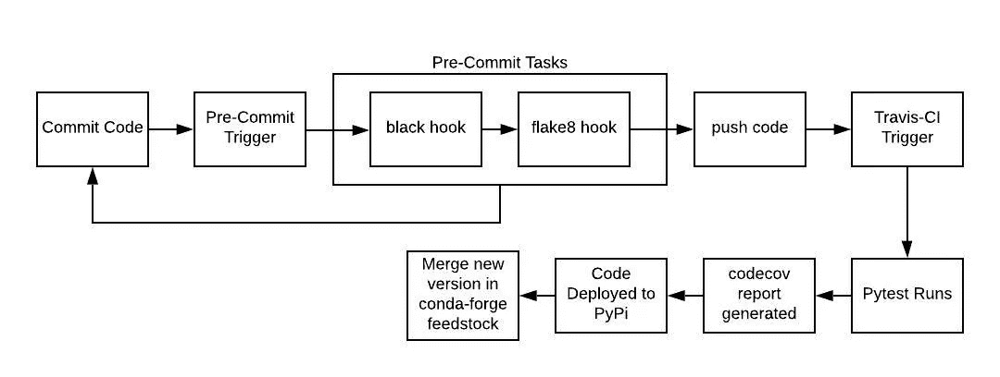

# 用于编写有效且健壮的 Python 库的工具

> 原文：<https://levelup.gitconnected.com/tools-for-writing-effective-and-robust-python-libraries-28bfd4c018c1>



Python 库管道(来源:Will Norris)

# 介绍

打包有助于改善您或您的团队工作流程的 python 软件对更大的 Python 社区非常有益；它使你的软件更加健壮，也可以提高你在内部使用它的能力。然而，如果没有适当的基础设施，您的 python 包可能会随着时间的推移而崩溃，或者对于其他用户来说太难有效使用。

公开你的代码库也能让你接触到其他致力于类似问题的伟大程序员；越多的人使用你的代码，它就越有可能成长和改进。如果你曾经帮助一个同事测试软件，那么你会亲眼看到对一个问题的新观点是如何加速开发的；对于新用户来说，你的软件越容易尝试，越有可能集成到他们的工作流程中，你就有越多的测试人员。

为了让你的软件长期工作，为了更广泛的用户群，考虑它的目的是什么，它是否实现了那个目标，以及代码将来是否可维护是很重要的。这三个需求可以通过三个工具来解决:单元测试、林挺和持续集成。有了这三个工具，您可以确保您的 python 包在未来也能正常工作，并且能够让新用户使用它们或在它们的基础上进行构建。

在这篇文章中，我将首先讨论这些工具，以及我们在 python 中可以访问哪些包来利用它们。然后，我将做一个简短的演练，在您自己的 GitHub 存储库中设置所有这些服务。

# 单元测试

测试你的代码通常不是软件工程师想到的第一件事，但是它应该是！因此，我们经常有一个想法，使我们的工作流程更容易，所以我们尽可能快地实现它。只要它能给我们想要的输出，就应该没问题，对吗？

我们拼凑起来的代码通常只涵盖了我们当天处理的特定用例。这意味着，当您重新使用上次用于处理数据的模块时，它今天可能不会像您预期的那样工作。代码在某一天有效而在另一天无效有几个可能的原因:

1.  没有真正理解一个函数应该做什么
2.  未考虑的边缘案例
3.  更新/过期的软件或依赖项

## 不理解一个函数应该做什么

编写单元测试的适当时间是在编写代码的时候。如果你想在你创建的 python 库中添加一个新函数，首先考虑你希望它如何工作，然后编写一个单元测试来检查它是否按照你的期望工作是有意义的。您甚至可以在编写函数之前编写调用新函数的测试；如果你明白需要如何使用它，你就会明白如何构建它。

当程序员最终使用他们的新代码时，他们经常会感到惊讶，因为他们意识到需要对其进行重构才能真正按照要求运行。当您编写单元测试时，您会强迫自己真正考虑您的代码将实现什么、为什么以及如何实现期望的结果。这种在开发过程中测试代码的过程还可以帮助您减少在项目过程中积累的技术债务，并有助于构建一个流畅的、工作一致的应用程序。

虽然在向 python 包中添加功能时停下来编写测试看起来很乏味，但从长远来看，这将为您省去巨大的麻烦。在程序开发完成后编写单元测试比在工作时编写要困难得多。一旦你写了 500 行代码，你可能就不能很好地理解文件中的每一行在细节层次上应该做什么。这意味着回过头来写你的单元测试将需要你一步一步地检查你的代码，在你已经创建了许多函数之间的交互之后，这将变得更加困难。

编写单元测试将有助于塑造每个功能如何工作的更好的细节；这意味着如果你把测试留到最后一分钟，你可能会发现自己在对你的代码库进行大规模的检查。尤其是如果你有一个更复杂的库，重构可能最终需要大量的时间和考虑。

## 未考虑的边缘案例

当你写一个函数的时候，考虑不同的输入会导致不希望的结果。问问你自己，你将如何处理这些边缘情况，并为每一个编写单元测试，以确保它们被覆盖。

开发中错过边缘案例是很自然的；如果你在使用你的代码时遇到另一个边缘情况，找出如何解决它，然后为它写一个单元测试。如果您不能立即解决这个问题，请在 GitHub repo 中为该代码打开一个问题，以提醒您稍后回来解决这个问题。

除了测试您自己的代码之外，如果您发现自己正在为别人拥有的另一个存储库修复一个边缘案例，那么最好的做法是编写一个单元测试来处理 pull 请求。添加一个单元测试可以让存储库的所有者清楚地了解你试图修复的用例以及你着手修复的方法。它还节省了库维护人员完全理解您的代码并为其编写单元测试的时间；维护开源包通常是没有报酬的，所以帮助维护您所使用的包对于整个 python 社区来说是非常有益的！

## 更新/过期的软件或依赖项

python 代码在某一天有效而在第二天无效的一个最常见的原因是 python 使用的复杂的依赖系统。您的一个依赖项被更新，或者改变您必须使用它们的功能的方式，或者完全删除它，这并不罕见；偶尔的更新也会破坏一些东西，并及时得到修复。如果您有一个健壮的单元测试系统，您通常可以查明哪个依赖导致了您的问题，这可以节省大量的故障排除时间！

python 中的依赖性问题需要一整篇文章来讨论。然而，值得一提的是，将所有的依赖项转移到一个下载渠道可以在将来为您节省大量的麻烦。这意味着如果您只能在 pip 或 conda-forge 上获得一个包，您应该尝试使用其中一个下载您环境中的所有包。依赖问题是我成为康达-福吉粉丝的原因。关于使用 pip/conda/conda-forge 还有争议，但是目前 conda-forge 是获得包含 GDAL 作为依赖项的地理空间包的工作环境的最容易的渠道。

## 单元测试工具

在当今的 python 中，pytest 通常是测试代码最简单、最 python 化的方法。它很容易学习如何使用，但是随着项目的扩展和测试需求的变化，它包含了很多可定制性。Pytest 也很容易集成到 Travis-CI 中，我们将在本文后面讨论。

# 林挺

几年前，Unix 中非常流行一种叫做“lint”的工具，用于分析 c 语言的源代码。Lint 会检查你的程序，寻找错误、bug、风格问题等。这个想法是，我们的“棉绒”会捡起代码周围的棉绒/灰尘，留下一个干净的成品。

作为程序员，我们每天都在编写和阅读代码。如果代码在不同的文件或不同的程序员之间是一致和相似的，那会很有帮助。代码越一致，人们就能越快地越过语法看到实际发生的事情。当代码不一致时，我们不得不在真正理解功能的核心之前花时间去破译语法。

一些编程语言有内置的格式化程序和标准(如 Go)，但其他语言遵循社区认可的标准(如 python)。围棋中的自动工具 gofmt 被称为林挺服务。它获取您的文件并检查它们的样式/格式问题。然后，它处理发现的任何问题，并返回格式化文件。Python 没有内置这样的自动工具，但在真正的 python 风格中，它可以访问一些很棒的第三方库来执行这项任务。

我们第一个有用的工具是`flake8`，它可以发现风格错误，并为您读出它们来自哪里。然而，`flake8`并没有解决这些格式问题。它只是告诉你他们在哪里。

这就是一个叫做`black`的工具的用武之地。black 不是标准 python 库的一部分，也不完全符合 PEP8 标准；然而，它在将代码整理成易于阅读和维护的格式方面做得非常出色。`black`实际上在 PEP8 标准的基础上包含了一些额外的规则，他们的团队声称这些规则可以更好地产生可维护的代码。

# 连续累计

持续集成可能是创建可维护代码的最重要的工具。有了持续集成(CI)服务，比如 Travis-CI，每次你推出一个新版本的代码，它的单元测试就会在一个全新的环境中运行，并带有你所选择的依赖项。每次迭代构建一个全新环境的过程是对新用户使用您提供的工具将会体验到什么的真正测试。如果一个依赖项被更新了，您的本地环境可能不会反映出来，但是 Travis 构建的新环境将测试您的依赖项的最新版本。

您可以选择在特定的时间间隔内运行持续集成，以确保对依赖项的更改不会破坏您使用它们的目的。如果有什么地方出错了，您可以查看哪个测试出错了，并使用错误消息来找出是什么变化导致了新的错误。

CI 服务不仅对运行测试有用，它们还提供部署代码的能力，并为您节省更多时间。例如，每次在 [earthpy](https://github.com/earthlab/earthpy/blob/master/.travis.yml) git repo 中创建标记提交时，都会触发一个命令来发布他们软件的新 pypi 版本。您可以添加许多不同的“挂钩”,当满足某些构建条件时，这些挂钩就会被触发。

# 我们的工具箱

既然我们已经讨论了为什么测试和格式化对于创建可靠的 python 代码的过程都是至关重要的，那么让我们深入研究一下实现它们的工具。

## 测试工具

*   `pytest`

Pytest 是一个非常容易使用的 python 测试库，用于 python 项目。它可以很容易地安装到 pip 或 conda 环境中，并且只需要很少的额外代码就可以开始工作。Pytest 也非常灵活，可以处理您可能需要的大多数测试需求，这使得它对于新的和有经验的 python 用户都是一个很好的工具；它也非常适合于从小规模开始并快速扩展的项目。

*   `codecov`

Codecov，代表“代码覆盖率”，是一个跟踪由单元测试执行的代码行的百分比的框架。这有助于您了解您在哪里进行测试，最重要的是，您的测试在哪里缺乏。它很容易安装，并与 pytest 很好地配对，所以使用它是一件容易的事！

## 林挺工具

*   `flake8`
*   `black`
*   `pre-commit`

由于我们希望在每次提交新代码时运行`flake8`和`black`，我们将利用另一个叫做`pre-commit`的框架，它允许我们指定一系列不同的任务，我们希望在任何时候提交新代码时执行这些任务；如果任务通过，那么我们可以提交，如果任务失败，那么我们必须在提交之前解决它们。

为了使用`pre-commit`,我们只需要创建一个. pre-commit-config.yaml 文件并指定所需的钩子。触发 black 和 flake8 的示例可以在下面的分步指南中看到。

## 持续集成(CI)工具

Travis-CI 是我最喜欢教授使用开源软件的程序员的 CI 服务，因为它设计得非常好，对于开源项目是免费的，并且易于学习如何使用，同时仍然具有很高的潜在定制上限。

您可以在 Travis 中运行最基本的`pytest`测试套件，也可以在多个操作系统中构建软件，并在完成后自动将您的代码部署到多个源代码中。许多其他开源项目也使用 Travis，这意味着在进一步定制时有许多例子可以参考。

Travis 在与提到的其他工具结合使用时可以实现一个很好的工作流，因为它允许您自动测试和部署您的代码，这消除了维护 python 包的许多步骤。

## 工具总结

为了向您展示流程，我们来看一下步骤:


Python 库管道(来源:Will Norris)

# 那么，你需要在回购协议中添加什么呢？

让我们来分析一下这些框架是如何集成到您的项目中的。

这些技术中的大多数只需要一个简单的配置文件，但是在您开始之前，有一些交互应该是清楚的。首先，你必须有一个公共的 GitHub 库。您的代码并不一定是 python 库，但是本指南中的一些内容与自动部署有关，如果您没有部署，可以跳过这些内容。

*注意:所有的配置文件都在项目的根目录下。*

## 1.设置预提交 yml 文件

整个过程的第一步是使用`flake8`和`black`开始林挺你的代码。为了做到这一点，我们将使用另一个名为`pre-commit`的框架，它允许您添加挂钩，这些挂钩在您尝试提交新代码时发生。我们将为`flake8`和`black`添加两个挂钩。

为此，我们需要将我们的`.pre-commit-config.yaml`文件添加到我们的 repo 的根目录，并告诉它运行我们的林挺服务。下面是一个包含这两个要求的示例文件:

```
repos: 
- repo: https://github.com/ambv/black 
  rev: stable 
  hooks:
  - id: black
    language_version: python3.6 
- repo: [https://github.com/pre-commit/pre-commit-hooks](https://github.com/pre-commit/pre-commit-hooks)
  rev: v1.2.3 
  hooks: 
  - id: flake8
```

现在，当您向 repo 提交代码时，您应该会看到 flake8 和 black 的输出。

## 2.添加您的 flake8 配置文件:。

这个文件是一个简单的`flake8`配置文件，告诉它忽略一些与`black`冲突的问题。

```
[flake8] 
ignore = E203, E266, E501, W503, F403 
max-line-length = 79 
max-complexity = 18 
select = B,C,E,F,W,T4,B9
```

如果您决定希望能够中断`flake8`标记的其他错误，您可以查找该错误的代码并将其添加到您的忽略列表中。

## 3.设置您的 Travis-CI 服务

为了使用 Travis-CI，您需要访问他们的网站，在那里您可以使用您的 GitHub 帐户登录并连接您正在使用的存储库。一旦你连接了你的回购，剩下的工作就由你的`travis.yml`文件完成了。

您的`travis.yml`文件对于您正在测试的项目类型来说是非常具体的。下面我将使用的例子是一个简单的 python 库，但是持续集成对于没有打包的代码来运行单元测试是有用的。

```
language: python
python:
  - "2.7"
  - "3.6"
install:
  - sudo apt-get update
  - pip install -r requirements.txt
  - python setup.py install
script:
  - pytest -v --cov=my_module
```

我们可以看到 travis 文件运行 pytest 并将代码覆盖率设置为 my_module。这意味着每次您将代码推送到 repo 时，Travis 将自动构建一个全新的环境，运行您的单元测试，然后生成一个代码覆盖报告。

在本例中，我们从一个文本文件的 pip 安装中构建环境。这适用于许多简单的项目，但是随着事情变得越来越复杂，您可能希望使用 conda 环境或带有 bash 脚本的虚拟环境来帮助更复杂的安装。我将在下面详细讨论这一点，但是您可以在这里看到一个示例[repo，它根据正在运行的操作系统构建不同的 conda 环境。](https://github.com/wino6687/SWEpy/blob/master/.travis/install.sh)

# 在 Travis 中执行常见任务的提示

**网页抓取&模仿服务器**

在 Travis 中与您的小型 linux 实例建立一个真正的 http 连接既慢又不可靠，因此与其 ping 真正的服务器，不如构建一个模拟服务器脚本并在您的 Travis 环境中运行它。这里有一个示例`.travis.yml`文件，它展示了如何构建一个模拟服务器以及相关代码。你所需要做的就是使用 python 的内置工具编写一个简单的 HTTP 服务器，并告诉它本地提供什么数据文件；通过这种方式，您可以存储一小部分数据，并且永远不用担心在单元测试期间 ping 真实的服务器。

为了让 Travis 运行您的模拟服务器，您需要在运行测试脚本之前，在您的 Linux 实例的后台运行它。您可以通过将下面的命令添加到您的`.travis.yml`中来做到这一点。重要的是要注意“&”，它告诉你的系统在后台运行这个程序。

```
before_script: 
  - mock_server.py &
```

**在多个操作系统上测试**

在 Travis 中，有几种不同的方法可以在多个操作系统上进行测试。这样做的文档是这里的，然而这些 docks 并不是 python 项目的完整图片。

在多个操作系统中进行测试的关键是在 yml 文件中使用 Travis 的 matrix 关键字。你可以这样做:

```
matrix: 
  include: 
  - os: linux 
    python: '3.6' 
    dist: xenial 
  - os: linux 
    python: '3.7' 
    dist: xenial 
  - os: osx 
    language: generic
```

在这里，我们可以看到 Travis 将启动三个独立的实例，每个实例运行各自的操作系统和发行版。当您这样做时，很可能会使您的安装过程变得复杂，因为不同的操作系统有不同的安装过程，这取决于您的依赖关系。请参阅下一节，了解如何使用 shell 脚本来完成安装。

**使用 Shell 脚本的复杂安装**

虽然 python 非常棒而且非常灵活，但是构建一个可靠的环境可能相当困难！如果您使用的是一个我们都很熟悉的包——GDAL，那就更是如此。

如果您需要设置一个更复杂的环境，或者在多个环境中运行您的测试，那么您可能希望设置简单的 shell 脚本来进行安装和测试。在创建 Travis 环境时，Shell 脚本为您提供了更大的灵活性。它们不像简单地使用 Travis 的内置安装和测试命令那样容易设置，但是它们给了你很多控制。这种设置的例子可以在[这里](https://github.com/wino6687/blogci/tree/master/travis_examples/script_install_example/.travis)找到。

***注意:*** *以后总是有可能改变构建 Travis 环境的方式，所以从一个选项开始，以后再转换也没有什么坏处。更改您的 Travis 配置只需投入很少的时间。*

# GitHub 配套指南

有几个链接指向包含这篇文章示例的 GitHub 库。这个 repo 被设置为一个 python 模块本身，名为“my_module”。在主回购中，您会看到以下结构:

```
. 
├── README.md 
├── my_module 
│    ├── __init__.py 
│    ├── my_module.py 
│    └── tests 
│        └── test_module.py 
├── requirements.txt 
├── setup.py 
└── travis_examples 
    ├── mock_server_example 
    │   └── mock_server.py 
    └── script_install_example 
        └── travis.yml
```

**回购重要提示:**

*   每个 python 模块都需要一个`setup.py`文件；我们的模块非常基础，所以它只运行`setuptools`来查找本地包。
*   您的`.travis.yml`文件被设置为使用 pip 和 requirements.txt 文件安装依赖项。
*   如果您更愿意使用 Anaconda，请参考他们的[文档](https://docs.conda.io/projects/conda/en/latest/user-guide/tasks/use-conda-with-travis-ci.html)以在 Travis 中安装。
*   为了查看该 repo 的 Travis 输出，单击[提交](https://github.com/wino6687/blogci/commits/master)选项卡，并单击绿色复选标记(表示通过测试)，然后选择“详细信息”。

# 总结和文档

现在，您已经拥有了所有的工具，可以开始确保您的 python 项目在未来具有良好的可维护性。虽然我们已经为您提供了几个示例，但是对于我们正在使用的每个框架，阅读文档是不可替代的。下面我链接了大部分相关文档，这些文档应该有助于指导您在阅读本文后可能仍然需要的任何故障诊断。

虽然这需要大量的前期工作，但建立一个健壮的系统来编写可维护和可部署的代码，从长远来看，将会使您受益。以后你会感谢自己做了这件事，每次你经历这个过程，它都会更快地实现。

文档:

*   [Pytest](https://pytest.org/en/latest/)
*   [Codecov](https://docs.codecov.io/docs)
*   [特拉维斯-CI](https://docs.travis-ci.com/)
*   [黑色](https://black.readthedocs.io/en/stable/the_black_code_style.html)
*   [薄片 8](http://flake8.pycqa.org/en/latest/)

*最初发表于*[*【https://github.com】*](https://github.com/wino6687/blog_posts/blob/master/UnitTesting_CI_Linting/Tools_Maintaining_Python.md)*。*