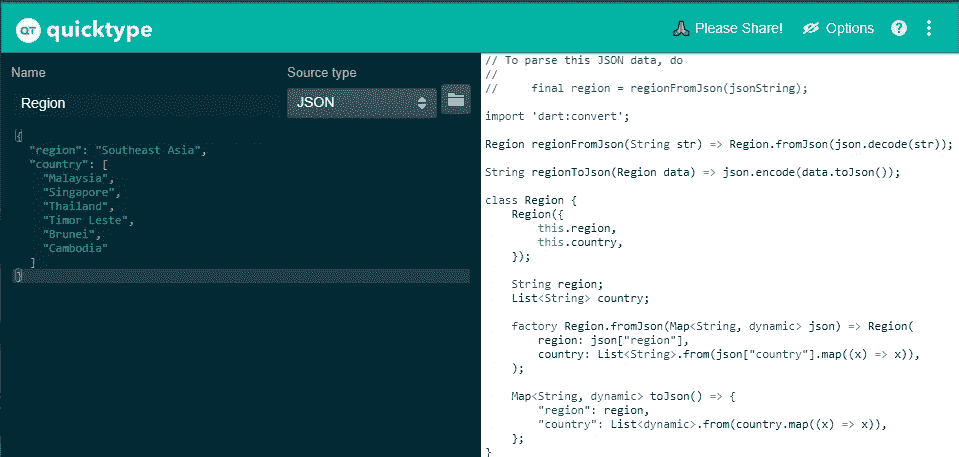
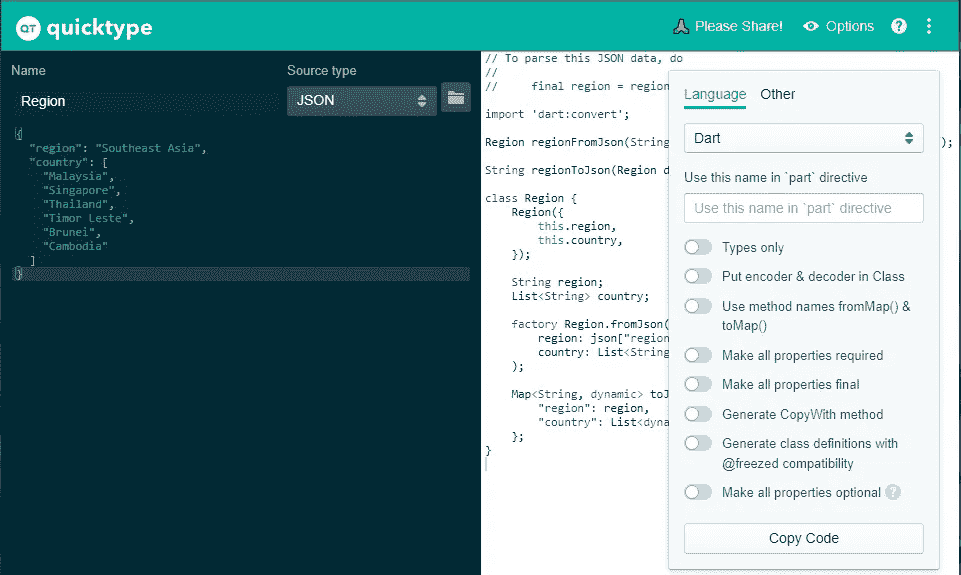
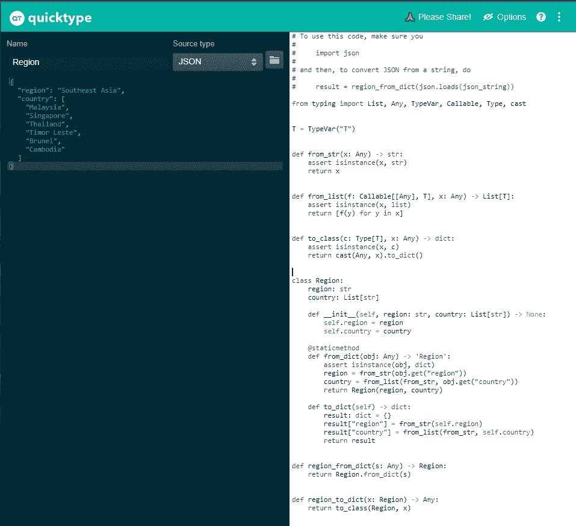
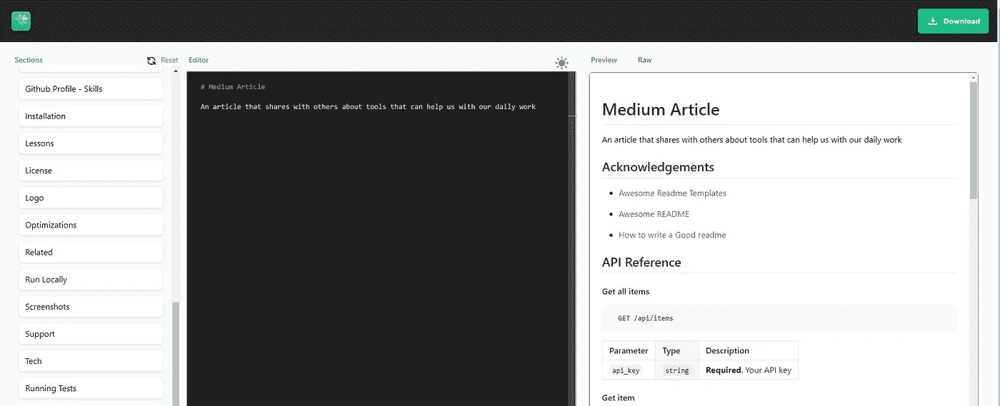
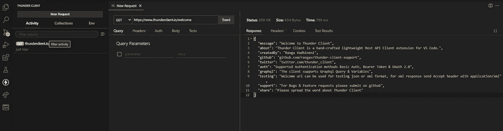
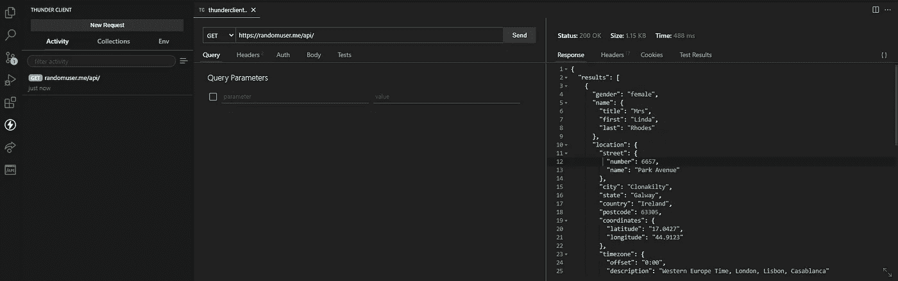
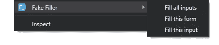

# 您不知道开发需要的工具

> 原文：<https://levelup.gitconnected.com/tools-that-you-dont-know-you-need-for-development-a73bf699a0d4>

## 使用正确的工具，聪明地工作

[**快速键入**](https://app.quicktype.io/)



从 QuickType 生成的 Dart 类文件

QuickType 是一个工具，它可以将 JSON 作为输入，并将其解析为几乎所有主要的编程语言，如 C#、C++、Javascript、Python、Dart、Objective-C、Kotlin。它有助于节省我们开发样板代码来解析来自 JSON 的数据和解析到 JSON 的数据的时间。

让我们来看一个例子，我们试着输入下面的 JSON 数据，我们想要 Dart 类文件:

```
{
  "region": "Southeast Asia",
  "country": [
    "Malaysia",
    "Singapore",
    "Thailand",
    "Timor Leste",
    "Brunei",
    "Cambodia"
  ]
}
```

我们将获得序列化和反序列化 JSON 对象的类文件。除此之外，还有一个选项按钮，可以根据所选的编程语言启用额外的功能。例如，对于 Dart，您将允许```@freezed ``兼容性，并将属性设为`` required ``。



基于所选编程语言的附加选项

用同样的 JSON，我们试着用它生成一个 Python 类文件。



从 QuickType 生成的 Python 类文件

[readme . so](http://Readme.so)



Readme.so 是一个帮助我们创建自述文件的 web 应用程序。它包含了所有的部分，所以你只需要相应地填写。此外，它的右侧还有一个预览，可以立即看到不同之处。如果有任何不需要包含的部分，请将其从部分中删除。当我为客户编写自述文件时，它节省了我很多时间；也许你可以试一试，然后让我知道你的想法。

[**迅雷客户端**](https://www.thunderclient.io/)



迅雷客户端

ThunderClient 是我长期使用的最好的冷门 VSCode 扩展之一。它是一个 API 客户端，工作方式类似于失眠和邮递员，但重量更轻，不需要在你的机器上安装任何额外的应用程序。

您可以将 cURL 命令导入其中，从一组端点收集数据，设置环境变量。ThunderClient 同时支持 REST 和 GraphQL。此外，它还支持集合导出，这让我们可以与团队成员共享它。我期待拥有的唯一缺失的功能是文件上传到端点。希望它很快就能投入使用。

[**Screego**](https://app.screego.net/)


斯克雷戈

Screego 是一个允许您与其他人共享您的屏幕的网页。这是一个来自社区的开源项目。将有一个随机生成的房间 id 可供使用，但您可以更改它。然后，创建房间后，您只需将 URL 共享给其他人，即可显示您的屏幕。使用起来很简单，离开后不需要登录使用，也不需要关闭房间。它涵盖了与他人快速会面的所有必要条件。

[**RandomUser**](https://randomuser.me/)



随机用户端点

RandomUser 是一个 API，可以使用它来检索一组随机生成的用户数据。它涵盖了应用程序通常需要的大部分列，比如姓名、电子邮件、密码、地址、地理位置，以及最重要的用户图像。此外，它是完全免费的，不需要任何认证。因此，它有利于发展；我们不需要用所有的列来模拟数据。

[TempMail](https://temp-mail.org/en/)


TempMail 是另一个让我惊讶的网络应用。这是一项免费服务，让你有一个可用的临时电子邮件地址。你可以用它收发电子邮件。收件箱也可以直接访问，每隔几秒钟刷新一次，以检索收到的电子邮件。在开发一个我必须在注册和登录阶段测试的应用程序时，它给了我很大的帮助。以前，我必须有几个电子邮件地址来注册和接收 OTP 代码进行确认等。现在，这可以在指尖使用。

[**FakeFiller**](https://chrome.google.com/webstore/detail/fake-filler/bnjjngeaknajbdcgpfkgnonkmififhfo?hl=en)



右键点击任何网页，会有假填充选项。

顾名思义，FakeFiller 是一个 chrome 扩展，可以帮助你用随机数据填写所有的输入表单。安装后，你需要做的就是右击任何网页。您将能够填写所有可用的输入，所选表单中的所有输入，或者只填写您选择的输入。在测试表单验证时，它确实帮助我节省了大量时间来逐个填写所有表单。

**最终关键外卖**

总有一些工具有待我们去发现，它们对我们很有帮助。使用正确的工具有助于我们专注于产品而不是重复性的任务，并减少非产品价值的任务。

如果你希望支持我并阅读更多来自 Medium 和我的优秀内容创作者的文章，你可以在这里加入 Medium 会员[。](https://munkevin.medium.com/membership)