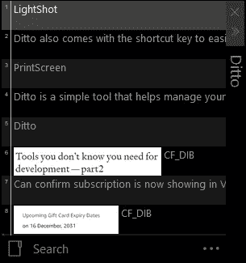
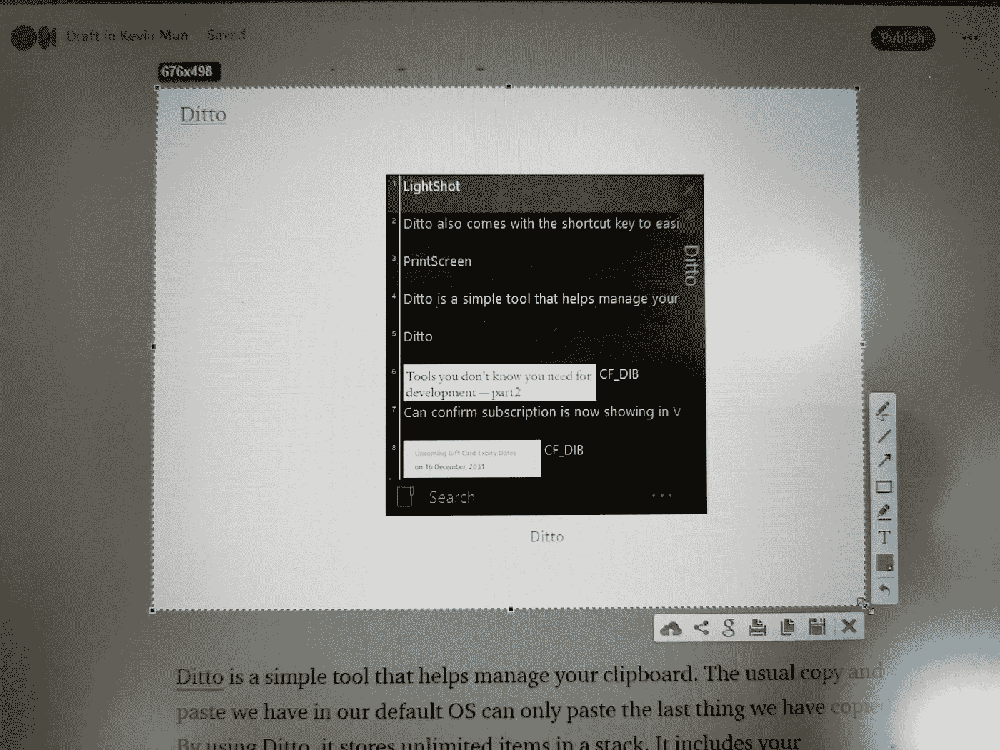
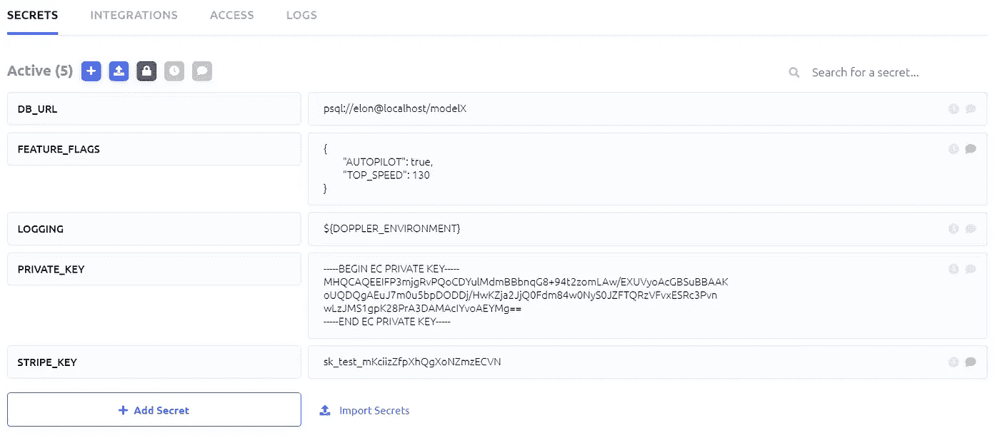
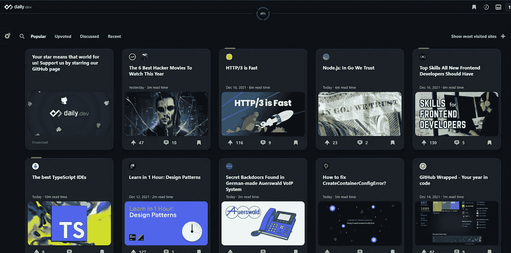
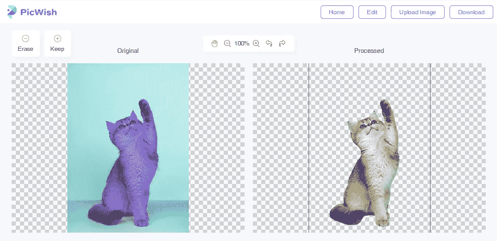

# 您不知道开发需要的工具—第 2 部分

> 原文：<https://levelup.gitconnected.com/tools-you-dont-know-you-need-for-development-part-2-8a6cadd889d3>

## 使用正确的工具，聪明地工作

点击[此处](/tools-that-you-dont-know-you-need-for-development-a73bf699a0d4)查看第一部分。

[同上](https://ditto-cp.sourceforge.io/)

同上

Ditto 是一个帮助管理剪贴板的简单工具。我们在默认操作系统中通常的复制和粘贴只能粘贴我们最后复制的内容。通过使用 Ditto，它可以在一个堆栈中存储无限的条目。它包括你的印刷屏幕和你的话。Ditto 还带有快捷键，通过按`ctrl +``可以轻松访问你的剪贴板。Ditto 有一个搜索栏；它有助于 JWT 令牌认证和授权访问。

PS:确保你的一些复制和粘贴的网址或术语不会被你的搭档发现。:)

[强光灯](https://app.prntscr.com/en/index.html)

强光灯

LightShot 是另一个简单的工具，在我的必装清单中。截屏工具可以帮助我在与开发人员交流时，在屏幕上快速显示错误消息或 bug。你需要做的就是按下键盘上的`prt sc`按钮。

更好的是，它不只是截屏整个屏幕。您将能够聚焦和裁剪您选择的区域。除此之外，你还可以在完成截图之前添加一些简单的编辑。最后一件我觉得有用的事情是，我们将能够在互联网上分享截图。它会上传到 prtnscr.com 24 小时后过期。当你需要与不同的人分享图片时，这很有帮助。

> Ditto 和 LightShot 在我的开发过程中为我做了一个像 Hadouken 和 Shoryuken 这样的完美组合。我所有由 LightShot 完成的截图将随时被 Ditto 访问，并几乎立即分享给我的团队成员。

[多普勒](https://www.doppler.com/)

多普勒

多普勒是一个环境管理工具，我在最近的几个项目中使用过。它是一个工具，可以帮助您将环境变量同步到您想要的任何地方，无论是您的本地、开发、暂存，甚至是生产。当我需要将我的环境从本地环境切换到 dev 环境时，它节省了我很多时间。然而，Doppler 需要一些前期设置才能使用，所以请务必在这里阅读他们的 CLI 设置教程。它与通常的免费增值 SAAS 有不同的定价等级。我目前一直在使用免费层，并计划为高级功能付费。

[Daily.dev](https://daily.dev/)

每日开发

Daily.dev 不是一个工具，而是一个帮助我每天提高开发知识的网站。它是一个类似于 Medium 的免费平台，但专门用于软件开发。他们有自己的策划团队，精心制作了一系列故事或教程，让你有兴趣在互联网上阅读来自 400 多个来源的内容。你可以在这里安装他们的 chrome 扩展。我通常会花 15 到 30 分钟来学习一些知识或技巧，以改进我的日常代码实践。

[PicWish](https://picwish.com/)

PicWish

Picwish 是一个网站，只做一件事，一件对我们很多人来说很有挑战性的事。它允许我们上传一张照片，我们可以删除它的背景，使其变得透明，并将其下载为 png 文件，就这么简单。作为一名开发人员，我讨厌编辑图像。Picwish 派上了用场，当我为我的文章和兼职工作制作图片时，我经常使用这个网站。

如果你希望支持我，阅读我和所有优秀的 Medium 内容创作者的文章，你可以在这里加入 Medium 会员。