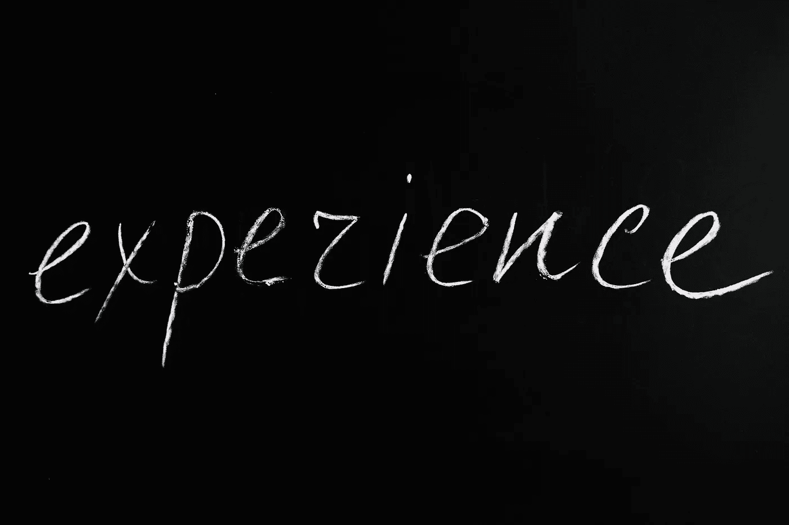

# 金融领域的 10 大人工智能任务，简单解释

> 原文：<https://levelup.gitconnected.com/top-10-artificial-intelligence-tasks-in-finance-simply-explained-bca6b7889282>

了解人工智能和金融的交叉以及当今的用例和任务

由来自 Pexels 的 [Pixabay](https://www.pexels.com/@pixabay/)

不要让它成为一个岔路口，思考你应该在多大程度上“学习”人工智能(AI)在金融领域的应用。金融和人工智能的交叉领域现在有许多应用，我的目标是通过这篇文章澄清它们，特别是进一步告知你对人工智能和金融价值的思考。

让我确保区别是清楚的:我并不建议你成为一名数据科学家或金融工程师，就像外面的许多人为了寻找微风而开夜车追逐无底洞的尽头一样。金融工程非常困难，因为后者与从全球人工智能研究领域获得框架、方法和途径没有什么不同。在任何人工智能职业中出现和存在的许多同样的问题，金融工程师都经历过。

我确实鼓励你考虑至少从人工智能的各个子领域获得对金融的方法和途径的基本理解:人工智能适合在你压力重重时解决问题，解决简单到更复杂的“数据和金融分析”用例。

来自 Pexels 的[迈克](https://www.pexels.com/@mike-468229/)

# **分成两部分:机器学习和自然语言处理(NLP)**

首先，它们都是人工智能的一个分支，系统可以从数据中学习并为决策提供信息。

这不是你的每一个其他机器学习和 NLP 描述:机器学习是一种数据分析的方法，以自动化模型开发过程[1]。NLP 是激活计算系统实现类似人类的任务与自然语言的交集[2]。

“人工智能”(AI)一词最早是由计算机科学家约翰·麦卡锡提出的[3]，并被定义为“制造智能机器的科学和工程”[4]。

在金融领域，人工智能正被应用于开发从股市走势到贷款违约风险的各种预测模型。机器学习算法已经快速处理了大量数据，并识别出在与机器学习相当的时间内不可能或难以实现的模式。对于财务部门来说，竞争优势不仅在于获得这些能力，还在于它们在适用任务中的优化。

除了提供对金融市场的见解，人工智能还被初创公司和老牌公司用来创造全新的产品和服务。举例来说，像摩根大通这样的组织正在使用区块链技术结合人工智能来简化财务流程[5]。

来自 Pexels 的安娜·塔拉泽维奇

# 金融中的人工智能任务

许多银行开始将机器学习用于检测欺诈活动、客户细分、金融预测、风险管理和贷款审批流程等任务。

尤其是最近，人工智能已经证明了在各种行业的自动化任务和流程方面有更多的潜力(随着拥抱脸引领的人工智能应用的不断传播)。金融工程是人工智能特别有益的一个领域。以下是人工智能如何实现金融工程任务和流程自动化的示例:

—自动化交易系统:使用人工智能，交易者可以建立自动化系统，分析市场数据并根据预定义的规则集执行交易，这是一个潜在的机会，可以减少决策过程中的情绪影响，并专注于特定和有针对性的交易执行。

—投资组合管理:可以集成人工智能算法来自动构建和管理投资组合(基于用户通过一组问答变量的输入)，同时考虑风险承受能力、市场偏好和用户期望的资产配置百分比等因素。如果人工智能能够提前从用户那里收集这些数据，其结果可能不仅会为投资组合经理节省时间，而且与纯粹非人工智能的人类主导的方法相比，可能会产生更优化的结果。

—资产定价:人工智能的集成可能会影响对不同资产价格之间关系的研究，并得出对未来走势的具体或优化预测，这一结果可能对需要为资产定价的投资者和金融机构都更有利。

—欺诈检测:机器学习算法可用于检测欺诈活动，如洗钱和内幕交易。有了这种分析洞察力，金融机构可以集成人工智能欺诈检测系统，以改善他们的合规工作。

来自 Pexels 的 [Engin Akyurt](https://www.pexels.com/@enginakyurt/)

—信用评分:通过分析借款人的财务历史，与不涉及人工智能知情流程的传统方法相比，人工智能信用评分模型可以提供潜在的更优化的风险评估。从这些数据中收集的信息对于贷款人在决定贷款批准和条款时可能是有价值的。

—保险承保:可以部署人工智能来分析个人的风险状况，并确定保险单的保费金额。通过这种用例收集的见解可能有利于保险公司，他们可能能够节省与手动核保相关的成本。

—税务合规性:人工智能税务软件可以帮助企业自动化其税务申报流程，方法是根据财务数据自动计算欠税，这一结果一旦实现，不仅可以节省时间，还可以减少仅由人工主导、仅由手动操作的系统导致错误的可能性。

—财务规划:使用人工智能的个人财务应用程序可以根据用户的独特情况，为用户提供关于储蓄和资金管理的自动建议，然后可能帮助用户朝着他们的目标做出个性化的财务决策。

—合同分析:机会是自动阅读和分析合同或提取关键信息，如条款和条件。这对于希望节省手动合同审查时间的企业来说很有价值。

—抵押贷款申请:通过利用人工智能自动化抵押贷款申请流程，金融机构可以缩短处理时间，并使客户更容易获得贷款批准。

来自 Pexels 的 Matthias Groeneveld

# **机器可能比你更了解你的同事(在你的组织中)**

当员工透露他们在组织中的工作经历时，总会有一些不安感。他们有没有想表达的赞美、建议或担忧？由于潜在的特定反馈，匿名是一个很难解决的问题。有时，问题可能需要立即恢复服务(组织必须尽快解决)。其他时候，你的建议可以改变当前的程序。

无论收集的见解是匿名的还是公开的，人工智能都可以领导员工体验(EX)反馈的促进、营销、数据收集和分析。

# 离别的思绪

如果你对这篇文章的编辑有任何建议，或者对进一步扩展这个主题领域有什么建议，请和我分享你的想法。

## 我创建了一个列表，您可以在其中查看我所有的金融和金融工程帖子:

 [## 金融工程:我的帖子

### 我关于金融工程的帖子。

medium.com](https://medium.com/@AnilTilbe/list/1bc857a2c2d4) 

**也就是说，考虑阅读这些:**

 [## 金融工程十大基本深度学习模型

### 金融工程中这些方法的 10 个基本深度学习(DL)模型和用例。

medium.datadriveninvestor.com](https://medium.datadriveninvestor.com/top-10-essential-deep-learning-models-for-financial-engineering-ca550fcff91) 

**和**

 [## 金融工程的 10 大基本 NLP 模型

### 金融工程中这些方法的 10 个基本 NLP 模型和用例。

medium.com](https://medium.com/mlearning-ai/top-10-essential-nlp-models-for-financial-engineering-f78f2536a2a9) 

**同样，**

 [## 如何在 2022 年成为一名金融工程师:数据科学家的路线图

### 成为金融工程师的数据科学和人工智能要求。

medium.com](https://medium.com/predict/how-to-become-a-financial-engineer-in-2022-a-roadmap-for-a-data-scientist-9b679976263e) 

*参考文献:*

*1。蒂尔贝，阿尼尔。(2022 年 8 月 2 日)。简化的 20 种机器学习方法。升级编码。*

**2。蒂尔贝，阿尼尔。(2022 年 8 月 9 日)。五大自然语言处理方法:10 秒钟解释。升级编码。*[*https://medium.com/p/633fb459433b*](https://medium.com/p/633fb459433b)*

**3。维基媒体项目的贡献者。(2022 年 8 月 8 日)。约翰·麦卡锡(计算机科学家)。维基百科。*[*https://en . Wikipedia . org/wiki/John _ McCarthy _(计算机 _ 科学家)*](https://en.wikipedia.org/wiki/John_McCarthy_(computer_scientist))*

**4。麦卡锡约翰。什么是人工智能？【http://www-formal.stanford.edu/jmc/whatisai.pdf】**

***5。摩根大通利用区块链技术帮助改善资金转账。(未注明)。检索 2022 年 8 月 11 日，来自*[*https://www . jp Morgan . com/news/jp Morgan-uses-区块链-技术-帮助-改善-资金转移*](https://www.jpmorgan.com/news/jpmorgan-uses-blockchain-technology-to-help-improve-money-transfers)**