# 十大最佳免费和廉价的虚拟主机服务(2022)

> 原文：<https://levelup.gitconnected.com/top-10-best-free-cheap-web-hosting-services-2022-3b1ac00e523c>

如果你想开始一个新项目，但没有足够的资源支付你的网络主机？

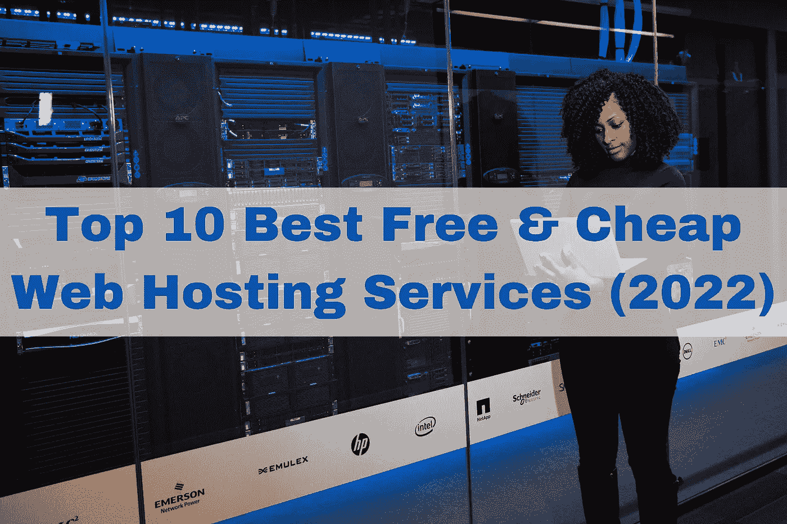

有几个免费选项可供选择。在文章的第一部分，我将分享一些最好的免费虚拟主机服务*，在文章的另一半，我将向你展示一些很棒的 ***便宜的*** 虚拟主机服务。*

> *虚拟主机是指网站所在的技术基础设施。无论你正在寻找共享主机，VPS 主机，或专用主机，选项是无穷无尽的。*

*找到一个好的主持人可能是一个挑战，因为根据你需要的计划类型，价格会有很大的不同。幸运的是，有一堆负担得起的选择，不会打破银行。这些包括托管 WordPress 主机，云服务器，Linux 主机，甚至经销商主机。*

*也有很多免费的虚拟主机服务，尽管质量参差不齐。有些提供有限的功能，比如没有支持团队的简单 cPanel 界面。其他的提供有限的存储空间、有限的带宽和缓慢的性能。*

*让我们看看文章的其余部分，找出 2022 年可用的一些最佳选择。*

# *五大最佳免费虚拟主机服务*

# *无限自由*

*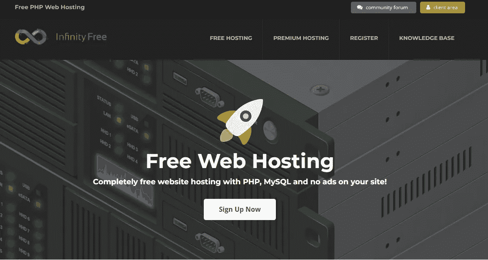*

*你可以点击[这里](https://infinityfree.net/)开始。*

*无限免费服务是最受欢迎的免费虚拟主机服务之一。它提供无限的带宽和 5GB 的存储空间，无限的子域，没有广告。唯一的限制是它不允许你安装任何第三方应用程序。你还可以获得一个 examplename.subdomain.com 形式的免费域名，这意味着你不必担心以后要付费，但如果你想定制一个，你必须将其重定向到他们的 DNS 服务器。(此过程可能需要 48 小时才能完成，请耐心等待。)*

*您只需几个步骤就可以使用这项服务，您需要注册一个帐户，填写一些信息，仅此而已。提醒一下，这个网站不需要信用卡信息或任何类似的东西，它只是免费的！只需访问他们的网站并点击“立即开始”按钮。你还可以为你的内容获得免费的 DNS 服务，为你所有的域名获得免费的 SSL 证书，PHP 7.4 和 MySQL 5.7 版本。考虑到你是免费获得的，所有这些都很棒。*

*唯一的缺点是没有技术支持，但至少有一个广泛的知识库和论坛，你可以在那里找到答案。就免费选项而言，这绝对是我的最佳选择。*

# *奖励空间*

*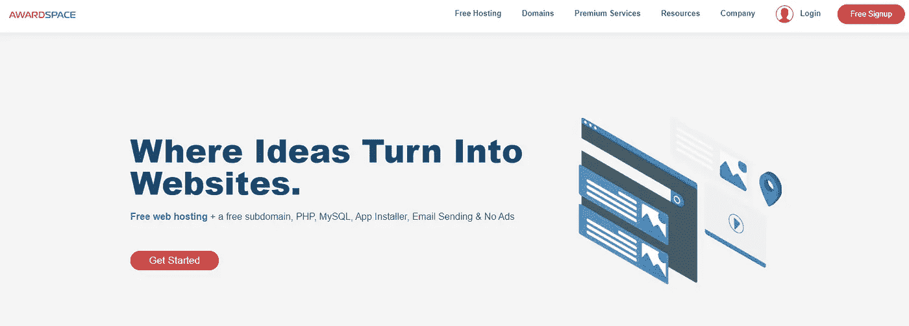*

*你可以点击[这里](https://www.awardspace.com/)开始。*

*Awardspace 是一个负担得起的虚拟主机服务，提供低成本的计划以及大量的额外功能。这是一个无广告的网络托管公司。你得到一个域和无限的子域。所有的计划都有一个一键式安装系统，允许你使用 Joomla 或 WordPress。*

*防火墙保护包括付费和免费账户。所有的免费账户都包括 1GB 的磁盘空间和 5GB 的月带宽。如果你想要更多的资源，你可以很容易地升级帐户，并得到你所需要的。Awardspace 还提供 24/7 的免费客户服务，是值得考虑的绝佳选择。*

# *BYET 主机*

*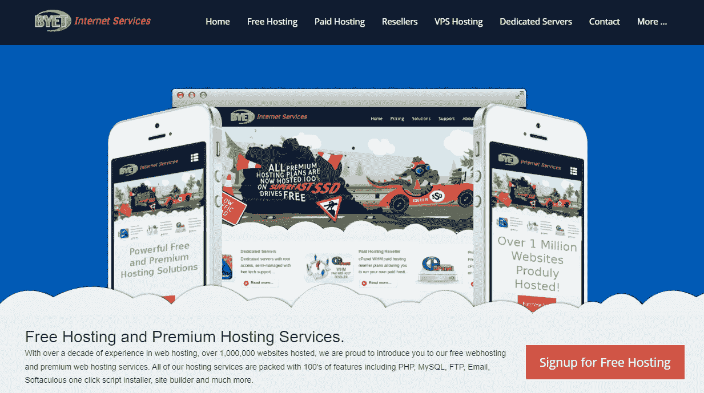*

*你可以点击[这里](https://byet.host/)开始。*

*BYET 主机是另一个免费虚拟主机的好选择。他们提供 1 GB 的磁盘空间，每月 10 GB 的带宽，你被限制在一个域与 5 个子域，等等。他们提供 24/7 的技术支持来帮助你建立你的网站。*

*你可以用 FTP 账号或者使用他们的在线文件管理器来管理你的文件。每个帐户只有 5 个 MySQL 数据库，所以请确保创建他们节省。一旦创建了一个帐户，你就可以立即建立你的网站，因为它使用 Softaculous 安装程序，这将是非常容易的。*

*总的来说，我会说这是一个很好的选择，虽然他们的网站需要一点更新，看起来与名单上的其他网站一样。*

# *谷歌主机*

*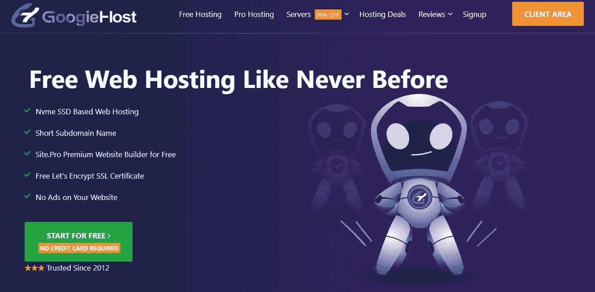*

*你可以点击[这里](https://googiehost.com/)开始。*

*Googie Host 是一家印度公司，每月提供 1GB 空间和 100 GB 带宽，并提供 Cloudflare 保护。它有一个热链接保护功能，保护您的网站不被复制。他们不会在你的网站上显示任何广告。*

*你还将获得免费的子域名和免费的商业电子邮件帐户，2 个 MySQL 数据库，2 个 FTP 帐户，24/7 支持，以及免费的网站建设者，不需要任何编码经验！也绝对是一个值得考虑的好选择。*

# *FreeHostia*

*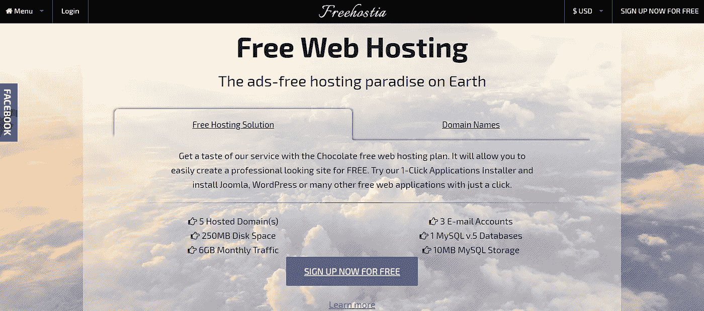*

*点击[这里](https://www.freehostia.com/)就可以开始了。*

*Freehostia 是一家虚拟主机公司，面向那些需要低成本主机的用户。他们的产品提供低带宽使用，每月流量只有 6GB，磁盘空间为 250MB。只有一个 10MB 大小的 MySQL 数据库。另一方面，如果您的资源允许，您可以托管多达 5 个域。*

*使用此服务不需要 FTP 帐户。它带有一个一键式 WordPress 或 Joomla 安装选项。客户支持全天候可用。这是一个非常棒的免费主机提供商，适合那些想尝试所有东西是如何工作的初学者，这个平台可以让你做到这一点。*

# *5 大最便宜的虚拟主机服务*

## *Scala 托管*

*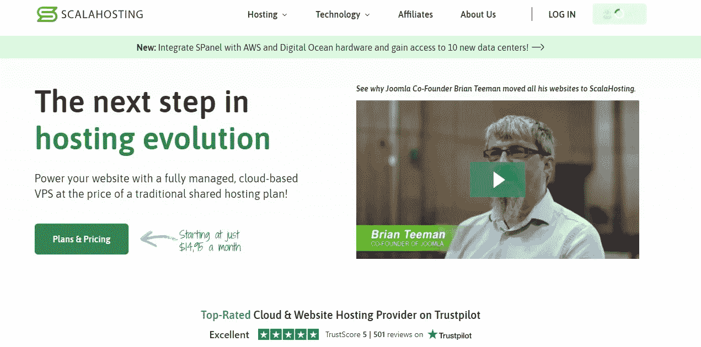*

*你可以点击[这里](https://www.scalahosting.com/web-hosting.html#a_aid=Futura&a_bid=0dc7d01c)开始。*

*Scala Hosting 是一家便宜可靠的虚拟主机公司，它提供了很多不同的软件包来满足你的所有需求。最受欢迎的选择之一是他们的基本虚拟主机服务，它有不同的计划，如迷你，高级启动，或管理 VPS，与竞争对手相比，所有这些都非常便宜。*

*我个人以前使用过他们的服务，我可以说他们的支持是我见过的所有公司中最好的。它真的很快，很可靠，而且他们总是会多做一点来适应你。就这一点而言，我认为这是值得考虑的，但并不止于此。最便宜的迷你计划为一个网站提供这些资源；20GB 的固态硬盘存储，免费 SSL，免费 CDN，无限的电子邮件帐户，无限的带宽，无限的数据库，长达一周的免费备份，一键安装程序，等等。*

*[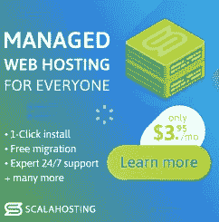](https://www.scalahosting.com/managed-hosting.html#a_aid=Futura&a_bid=0dc7d01c)

你可以点击这里开始。* 

*这是我过去的选择，如果我再次需要虚拟主机服务，我肯定会选择它们！*

# *已知主机*

*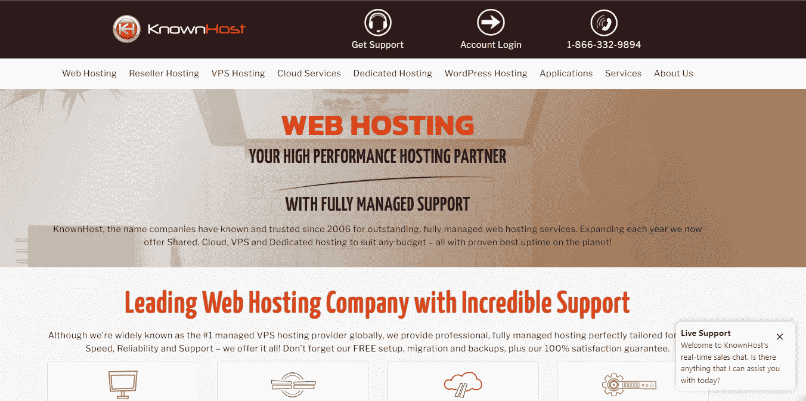*

*你可以点击[这里](https://shareasale.com/r.cfm?b=1210207&u=2997627&m=80177&urllink=&afftrack=)开始。*

*Known Host 是另一家非常好的虚拟主机公司，它为客户提供了许多不同的选择。这包括共享主机、经销商主机、托管专用服务器，甚至云主机。价格取决于你选择的包装类型，但总的来说，它们真的很便宜。*

*他们简单的用户界面和直观的支持工具使管理网站的各个方面变得容易。所有数据都会自动备份，因此您永远不会丢失任何信息，也不会花费时间从备份中恢复文件。您还可以每周 7 天、每天 24 小时联系我们屡获殊荣的客户服务团队，他们将确保您的在线状态顺利运行，无论您是在线还是睡着了！无论你是想建立一个新的网站还是改进你现有的网站，他们都能帮你实现。*

**

*构建于高性能安全集群之上，由 LiteSpeed webserver 提供支持，并在固态硬盘(SSD)集群上备份，托管于行业领先的数据中心。你将获得每月 3.47 美元的共享虚拟主机计划。*

# *格洛霍斯特*

*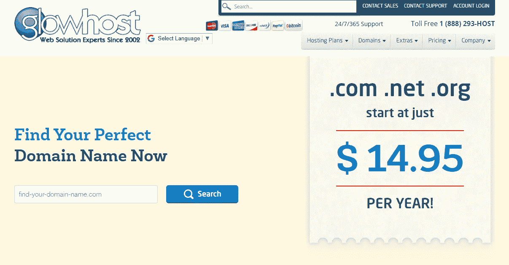*

*点击[这里](https://shareasale.com/r.cfm?b=486022&u=2997627&m=17701&urllink=&afftrack=)开始吧。*

*GlowHost 是另一个廉价的网络主机，提供各种类型的托管解决方案。他们的共享主机方案是最好的方案之一，因为它超级实惠，而且有很多很酷的功能。除此之外，GlowHost 还提供无限的电子邮件地址、免费的域名注册、免费的 SSL 证书、免费的备份空间和免费的网站构建器。*

*他们提供了过多的托管计划，但最基本的一个领域包括无限的磁盘空间，无限的每月带宽，免费麦卡菲安全检查，1500+免费网站设计，等等。除了真正负担得起之外，该计划还提供了所有这些。对于初学者来说，这是掌握主机如何工作的最佳选择之一。*

# *名字便宜*

*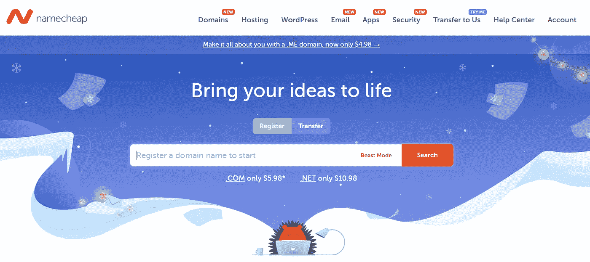*

*点击此处的[开始。](https://shareasale.com/r.cfm?b=1380209&u=2997627&m=46483&urllink=&afftrack=)*

*如果你想要真正便宜的东西，那么 Namecheap 绝对是你要去的地方。他们提供各种各样的托管服务，起价仅为每月 1.88 美元。Namecheap 的一些优点包括 99%的正常运行时间保证、免费 SSL 证书、无限电子邮件、免费域名注册等等。*

*网站托管服务的恒星计划在这个列表中价格最便宜，它提供了未计量的带宽，免费的网站生成器，域名和隐私保护，免费的 SSL 自动安装在您的域上，免费的超音速 CDN，免费的网站迁移，20GB 的 SSD 存储等等。*

*[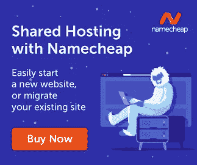](https://shareasale.com/r.cfm?b=1894511&amp;u=2997627&amp;m=46483&amp;urllink=&amp;afftrack=)*

*除了最实惠之外，所有这些都让它成为了这个列表中最棒的选择之一。*

# *WebHostingPad*

*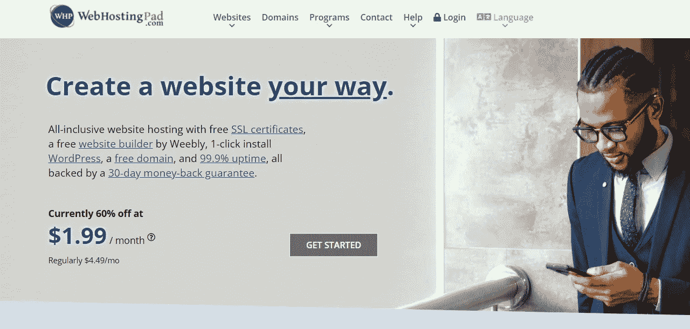*

*点击[这里](https://shareasale.com/r.cfm?b=1717033&u=2997627&m=74149&urllink=&afftrack=)开始。*

*WebHosting Pad 是一家网站托管公司，提供免费 SSL 证书、网站建设帮助和免费域名。这项服务还包括一些其他免费的酷东西。你会得到一个免费的网站生成器，免费的域名，并且你可以在购买之前试用免费的 WordPress 版本。*

*起价每月 1.99 美元，这是另一个真正便宜的虚拟主机替代方案。你可以获得免费的分析工具、一键式 WordPress 安装、可扩展的结构计划、电子商务就绪以及 99.9%的正常运行时间保证。*

*对于刚开始使用 WordPress 并想习惯事物运行方式的初学者来说，这是一个很好的选择。*

# *结束语*

*正如你从上面的文章中看到的，有很多主机选择，所以没有理由在 2022 年建立一个网站。根据你的需要，你会找到一个免费的或付费的供应商，在我看来这是最好的。*

*如果你需要一个好的 VPS 提供商，我建议你看一看 [Futura Hosting](http://futura-hosting.com) 。发送一封主题为“在 sales@futura-hosting.com 的媒介”的电子邮件，以便只为我的读者接收特别优惠。这笔交易包括建立你的新网站，建设它，品牌&标志设计，等等。不要错过！*

*如果你对这篇文章有任何问题或建议，请不要犹豫，在评论区回复。喜欢你读的东西吗？为什么不关注我的媒体简讯，这样你就不会错过我未来的任何文章了？很简单，点击[这里](https://kgabeci.medium.com/subscribe)输入你的电子邮件地址，然后点击订阅。*

*你喜欢阅读媒体上的文章吗？考虑成为会员，这里有很多功能，你每月只需花 5 美元就可以获得所有创作者的内容。使用[这个链接](https://kgabeci.medium.com/membership)，你也可以帮我赚一点佣金，点击成为会员，输入你的信息。*