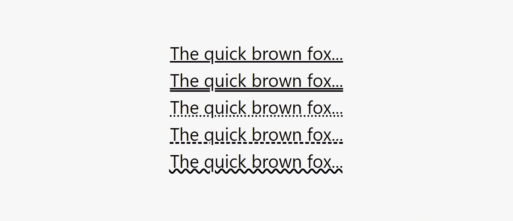

# Tailwind CSS v3.0 中引入的 10 大特性

> 原文：<https://levelup.gitconnected.com/top-10-features-introduced-in-tailwind-css-v3-0-39f9700b12a1>

## 了解 Tailwind CSS v3.0 版本附带的令人难以置信的新特性。

顺风社 CSS v3.0 版已于 2021 年 12 月 9 日发布。它带来了卓越的性能提升、大规模的工作流改进和大量的新功能。这个版本对于 Tailwind CSS 用户来说是最令人兴奋的版本之一。祝贺 Tailwind 团队和他们的社区，他们为这个主要版本的巨大成功付出了努力！

我将详细演示 Tailwind CSS v3.0 中提供的 10 大特性，以便您可以开始使用它们，并通过试用最好的 CSS 框架之一来改善您在前端开发中的体验。初学者和有经验的开发人员/设计人员可以从这篇文章中受益。

# Tailwind CSS v3.0 提供的 10 个最令人惊叹的特性

1.  播放 CDN
2.  花式下划线样式
3.  彩色方框阴影
4.  开箱即用的每种颜色
5.  任意属性
6.  多栏布局
7.  打印修改器
8.  现代纵横比 API
9.  稳定的即时发动机
10.  本机窗体控件样式

# 1.播放 CDN

Play CDN 允许在你的项目中包含 Tailwind CSS，而无需通过 NPM 或 Yarn 下载完整的包。这不是一个基于 CSS 的 CDN，相反，这是一个基于脚本的 CDN。将它添加到 HTML 文件的头部，并开始使用 Tailwind 的实用程序类来设计您的内容。

> Play CDN 并不打算在生产环境中使用，而是作为一种快速入门的方法来使用零配置框架。

参考下面的代码片段，了解如何使用 Play CDN 包含 Tailwind。

您还可以使用他们的在线游乐场来立即开始使用他们的组件。

 [## 顺风游戏

### 一个为 Tailwind CSS 开发的高级在线平台，让你可以直接在…

play.tailwindcss.com](https://play.tailwindcss.com/) 

# 2.花式下划线样式

花哨的下划线样式允许更改下划线的颜色、样式、粗细和偏移量。让我们简明扼要地尝试一下它们。

*   文本装饰颜色
*   文本装饰样式
*   文本装饰厚度
*   文本下划线偏移量

## a)文字装饰颜色

这个工具用于控制文本装饰的颜色。您可以使用`decoration-{color}`工具来改变元素文本装饰的颜色。请参考下面的代码片段，了解如何使用它们。

以下是上述代码片段的输出。

您还可以使用颜色不透明度修改器来控制元素文本装饰颜色的不透明度。请参考下面的代码片段，了解如何使用它们。

以下是上述代码片段的输出。

## b)文字装饰风格

该实用程序用于控制文本装饰的样式。您可以使用`decoration-{style}`实用程序来改变元素的文本装饰的样式。请参考下面的代码片段，了解如何使用它们。

以下是上述代码片段的输出。

## c)文字装饰厚度

这个工具用于控制文本装饰的粗细。你可以使用`decoration-{width}`工具来改变一个元素的文本装饰的粗细。请参考下面的代码片段，了解如何使用它们。

以下是上述代码片段的输出。

## d)文本下划线偏移量

这个工具用于控制文本下划线的偏移量。您可以使用`decoration-offset-{width}`实用程序来更改元素文本下划线的偏移量。请参考下面的代码片段，了解如何使用它们。

以下是上述代码片段的输出。

# 3.彩色方框阴影

彩色框阴影允许在彩色背景上添加发光、反射效果和更自然的阴影。你可以使用`shadow-{color}`工具来改变一个现有的盒子阴影的颜色。默认情况下，彩色阴影的不透明度为 100%，但您可以使用“不透明度”修改器更改此值。请参考下面的代码片段，了解如何使用彩色阴影。

以下是上述代码片段的输出。

与默认的基于黑色的阴影相比，彩色阴影看起来更真实、更自然，因为默认的基于黑色的阴影往往看起来是灰色的、褪色的。

# 4.开箱即用的每种颜色

在 Tailwind v3.0 中，调色板中的每一种颜色都是默认启用的，包括:石板色、灰色、锌色、中性、石色、红色、橙色、琥珀色、黄色、石灰色、绿色、祖母绿、蓝绿色、青色、天蓝色、蓝色、靛蓝、紫色、紫红色、粉色和玫瑰色。单击下面的链接访问官方文档，探索每种颜色并学习如何使用它们。

 [## 自定义颜色–顺风 CSS

### Tailwind 包括一个专业制作的默认调色板，这是一个很好的起点，如果你不…

tailwindcss.com](https://tailwindcss.com/docs/customizing-colors) 

# 5.任意属性

任意属性允许添加定制的 CSS，您可以将其与 hover、lg 等修饰符结合使用。例如，如果您想使用一个 CSS 属性，而 Tailwind 并没有提供现成的实用工具，那么您可以利用“方括号符号”来编写完全任意的 CSS。请参考下面的代码片段，了解如何使用任意属性。

以下是上述代码片段的输出。

# 6.多栏布局

多列布局允许控制元素中的列数。您可以使用`columns-{count}`实用程序来定义元素内部内容所需的列数。列宽将自动转换以匹配该数字。请参考下面的代码片段，了解如何使用多列布局。

以下是上述代码片段的输出。

# 7.打印修改器

“打印”修改器允许控制当有人打印时网页的外观。您可以使用`print`修饰符有条件地应用仅在打印页面时应用的样式。参考下面的代码片段来理解如何使用 print 修饰符。

以下是上述代码片段的输出。

当您尝试打印该页面时，您将看到类似于下图的内容。

# 8.现代纵横比 API

现代纵横比 API 允许控制元素的纵横比。您可以使用`aspect-{ratio}`实用程序为一个元素设置您喜欢的纵横比。这个 API 使用原生的`aspect-ratio` CSS 属性，Safari 直到版本 15 才支持该属性。默认情况下，Tailwind 不包含大量的纵横比值，因为您可以使用任意属性来定义自己的纵横比。参考下面的代码片段来理解如何使用现代纵横比 API。

以下是上述代码片段的输出。

# 9.稳定的即时发动机

Tailwind CSS v3.0 附带了一个稳定的 JIT(即时)引擎。在 2.0 版本之前，Tailwind 使用的是经典引擎，现在已经被 JIT 引擎所取代。此更新的好处如下:

*   令人难以置信的快速构建时间。
*   所有变体都是开箱即用的。
*   无需编写自定义 CSS 就可以生成任意样式。
*   CSS 在开发和生产方面完全相同。
*   针对开发环境，浏览器性能得到了增强。

# 10.本机窗体控件样式

原生表单控件样式允许使复选框、单选按钮和文件输入与您的品牌相匹配，而无需重新发明轮子。这个版本增加了对全新的`accent-color`属性的支持，以及对样式化文件输入按钮的修饰符，这使得在原生表单控件上放置定制设计变得更加容易。

你可以使用`accent-{color}`工具来改变一个元素的强调颜色。这有助于通过覆盖 web 浏览器提供的默认颜色来设置复选框和单选按钮组等元素的样式。请参考下面的代码片段，了解如何使用 accent-color 属性。

以下是上述代码片段的输出。

要设置文件输入按钮的样式，可以使用 file 修饰符。请参考下面的代码片段，了解如何使用 file 修饰符。

以下是上述代码片段的输出。

太棒了。您已经完成了对 Tailwind CSS v3.0 特性的学习，现在您可以开始在您当前或即将到来的项目中实现它们了。

> 如果你喜欢读这篇文章，并且学到了一些新的东西，那么请鼓掌，与你的朋友分享，并关注我以获得我即将发布的文章的更新。你可以在 [LinkedIn](https://www.linkedin.com/in/tara-prasad-routray-b83027145/) 上和我联系。