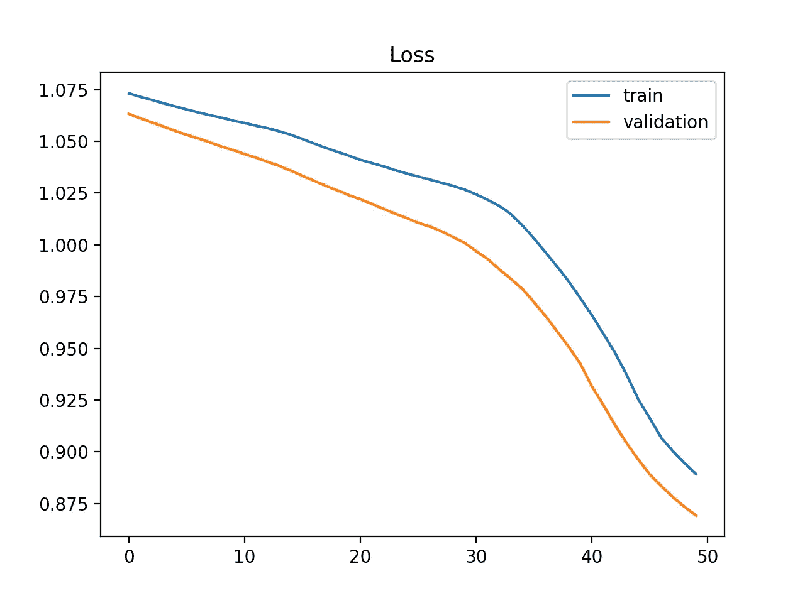
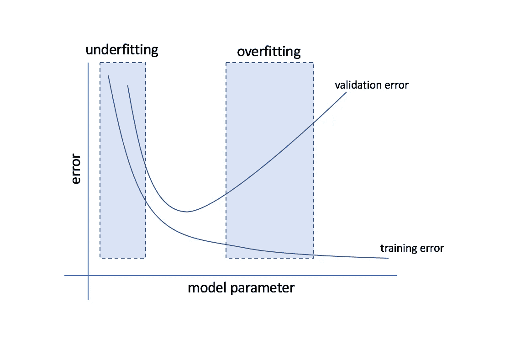

# 数据科学中要避免的 10 大错误

> 原文：<https://levelup.gitconnected.com/top-10-mistakes-to-avoid-in-data-science-dfbcddb3670>

**数据科学是一个复杂的领域，很容易出错**。在本文中，我们将介绍数据科学中应该避免的 10 大错误。无论您是该领域的新手还是经验丰富的数据科学家，本文都有适合您的内容。避免这些常见的陷阱，你将在数据科学的道路上取得成功。

## 错误 1:没有清楚地定义问题

数据科学中最重要的事情之一是在深入研究数据之前明确定义问题。这似乎是显而易见的，但是很容易陷入数据分析的兴奋中而忘记这一步。如果你没有清楚地定义问题，你可能会花费大量的时间和资源进行分析，而这些分析实际上并没有回答你想要解决的问题。

*这里有几个明确定义问题的小技巧:*

*   确保你理解问题的背景，以及为什么它很重要
*   清楚地阐述你试图回答的研究问题
*   确定关键变量及其关系
*   确定分析的预期结果

## 错误 2:没有收集足够的数据

数据科学中要避免的另一个错误是没有收集足够的数据。拥有足够的数据来准确回答研究问题是很重要的。如果没有足够的数据，您可能无法从分析中得出可靠的结论。

这里有一些收集足够数据的技巧:

*   确定准确回答研究问题需要多少数据
*   确定数据的来源，并确保它们是可靠的
*   检查数据的质量，并根据需要进行清理
*   注意数据中任何潜在的偏差

## 错误 3:没有清理和预处理数据

清理和预处理数据是数据科学过程中的一个重要步骤，但它经常被忽视。如果没有正确地清理和预处理数据，可能会得到不正确或不可靠的结果。

*这里有一些清理和预处理数据的技巧:*

*   检查是否有丢失或无效的值，并适当地处理它们
*   确保数据格式正确(例如，日期格式正确，数字数据不被视为文本)
*   检查数据中的任何不一致之处并解决它们
*   根据需要对数据进行规范化或标准化

## 错误#4:没有验证模型

清理和预处理数据后，验证模型以确保其准确可靠是非常重要的。如果您不验证模型，您可能会得到不正确或误导的结果。

*这里有一些验证模型的技巧:*

*   将数据分成训练集和测试集
*   使用交叉验证来评估模型在不同数据子集上的性能
*   将模型的性能与基线或其他模型进行比较
*   检查是否过度装配或装配不足

## 错误 5:没有测试模型

在您验证了模型之后，在看不见的数据上测试它以确保它表现良好是很重要的。如果您不测试该模型，您可能会对其性能有一个过于乐观的看法，并且当它在真实世界的数据中表现不佳时会感到失望。

这里有一些测试模型的技巧:

*   使用未在培训或验证过程中使用的单独测试数据集
*   检查对新数据的归纳
*   使用适当的指标评估模型的性能
*   检查任何意外或异常的结果

## 错误 6:没有正确解释结果

正确解释你的分析结果对于理解你的工作的含义是至关重要的。如果你没有正确地解释结果，你可能会得到不正确的结论或建议。

*这里有一些正确解读结果的小技巧:*

*   确保你理解分析的背景和要解决的研究问题
*   检查数据或模型中的任何偏差或限制
*   在研究问题的背景下考虑结果的含义
*   检查任何意想不到或令人惊讶的结果，并考虑为什么会出现这些结果

## 错误 7:没有有效地传达结果

交流您的分析结果是数据科学过程中的重要一步，因为它允许您与其他人共享您的发现。如果你不能有效地传达结果，你可能无法传达你工作的重要性，或者说服别人按照你的建议去做。

*这里有一些有效传达结果的技巧:*

*   清楚地阐述正在解决的研究问题和关键发现
*   使用清晰简洁的语言
*   使用可视化和其他工具来帮助说明要点
*   考虑受众，并相应地调整沟通风格和形式
*   准备好回答问题，澄清任何误解

## 错误 8:没有维护模型

维护模型是确保模型随着时间的推移保持准确性和相关性的重要一步。如果您不维护模型，您可能最终得到一个不再有用或可靠的模型。

*这里有几个维护模型的小技巧:*

*   随着时间的推移跟踪模型的性能
*   检查数据中的任何更改或正在解决的可能影响模型的问题
*   根据不断变化的环境，根据需要对模型进行微调
*   监控模型是否有任何退化或故障迹象

## 错误 9:没有跟上数据科学的最新发展

数据科学是一个快速发展的领域，跟上最新发展非常重要。如果你跟不上最新的发展，你可能会落后，错过可以改善你工作的新技术和工具。

*这里有一些关于跟上数据科学最新发展的提示:*

*   关注相关的博客和新闻来源
*   参加会议和研讨会
*   加入在线社区和论坛
*   参加在线课程和教程，学习新技能
*   与其他数据科学家协作，共享知识和资源

## 错误 10:在需要的时候不寻求帮助

数据科学可能是一个具有挑战性的领域，需要时寻求帮助非常重要。无论你是在为一个特殊的问题而挣扎，还是只是想从别人那里获得灵感，寻求帮助都是提高工作和技能的有效方法。

以下是一些在需要时寻求帮助的方法:

*   向同事或导师寻求建议或帮助
*   加入在线社区或论坛，在那里你可以寻求帮助或获得反馈
*   参加研讨会或会议，向专家学习，与其他数据科学家交流
*   聘请顾问或教练来帮助你解决特定的问题或技能

数据科学是一个复杂的领域，很容易出错。通过避免这些常见的陷阱，您可以提高工作的准确性和可靠性，并在您的数据科学职业生涯中取得更大的成功。记住明确定义问题，收集足够的数据，清洗和预处理数据，验证和测试模型，正确解释结果，有效沟通结果，维护模型，跟上最新发展，需要时寻求帮助。有了这些技巧和策略，你将在数据科学的道路上走向成功。

关注我的媒体，获取更多精彩文章👍

