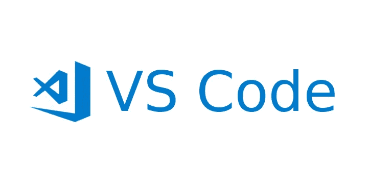
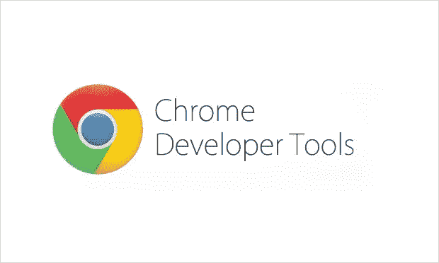
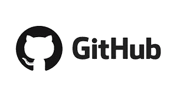
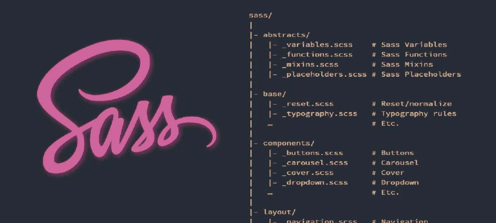
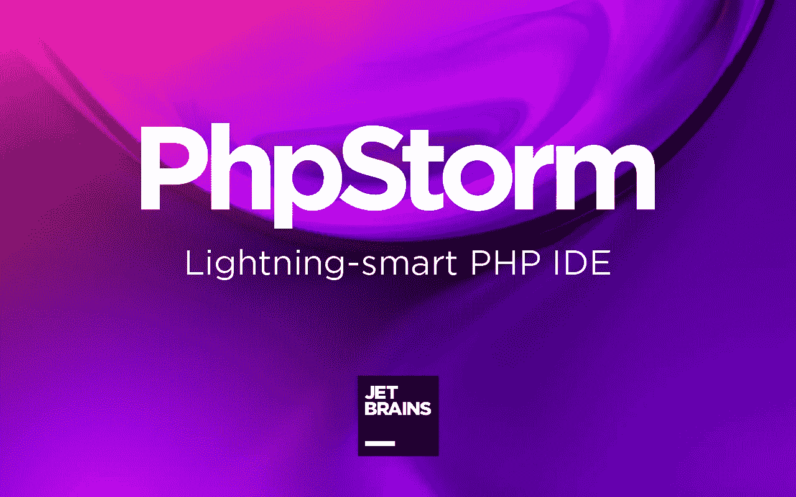
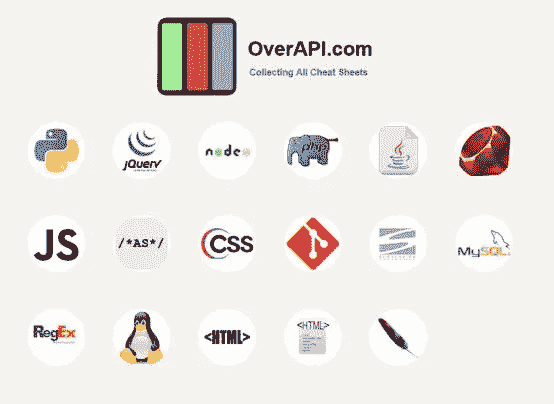
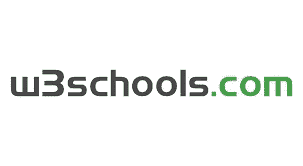
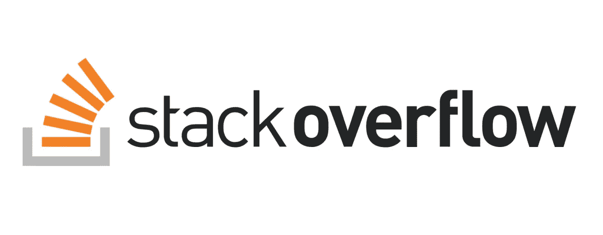
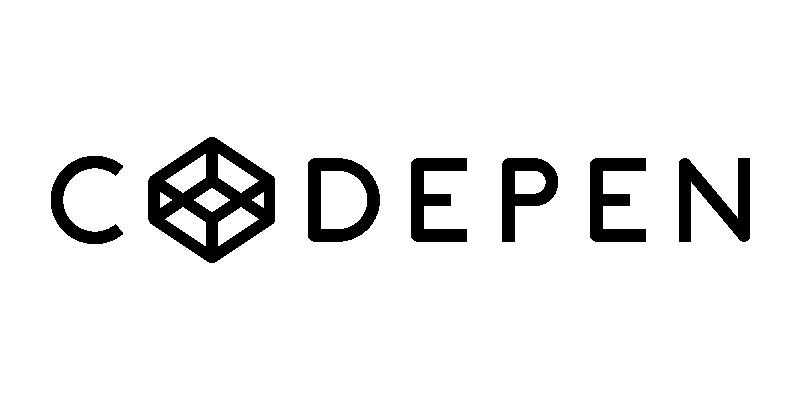
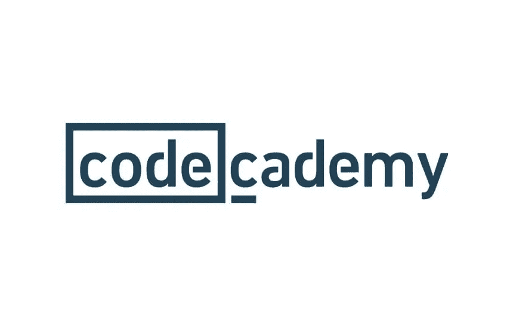

# 网络开发者十大必用工具和网站

> 原文：<https://levelup.gitconnected.com/top-10-must-use-tools-and-websites-for-web-developers-e0d8cf4d9be1>

## 没有这些工具和网站，不要开始你的网络开发之旅！

## 每个 Web 开发人员都应该了解这些资源

谁没有梦想过从零开始建立自己的网站？问题不在于知道从哪里开始，而在于是否有时间和资源投入其中。

> 是你吗？如果**是**，那么你应该看看这些免费工具和网站，它们将帮助你建立下一个伟大的项目。

网站正成为我们日常生活中必不可少的组成部分，无论是出于个人目的还是职业目的。无论你想创建一个博客，建立一个投资组合，还是开发一个电子商务商店，有很多方法可以开始。

我将在本文中讨论的这些网站和工具，为那些想在不支付高额费用的情况下开始使用的人提供了一些最强大的功能。

不再浪费时间，让我们直接进入 5 大**必用**工具列表。

# Web 开发人员的五大必备工具

## 1- Visual Studio 代码

Visual Studio Code 是一个轻量级代码编辑器，可用于 Windows、macOS 和 Linux。它有许多高级特性，包括对 Git 版本控制、调试等的支持。

这使得 VS 代码 ***非常适合希望同时处理多个项目的开发人员*** 。它的速度也快得令人难以置信，这意味着当您的计算机将文件加载到 IDE 时，您不会花太多时间等待。

它提供了一系列外观选项，从添加自己的字体、图标、布局和颜色，到使用容器或远程机器作为全功能开发环境。

但是使它与众不同的是它的远程开发特性——您可以使用容器或远程机器来实现全功能的开发环境。

## 2- Chrome 开发工具

> 如果您能够编辑 HTML 和 CSS，同时查看详细的性能分析，这不是很好吗？

Chrome 开发者工具就是这么做的。

它让您可以访问关于页面的各种信息，比如加载每个元素需要多长时间，JavaScript 加载页面的百分比等等。您甚至可以添加断点，以便在某些情况发生时暂停执行。由于它在 Chrome 内部工作，你可以用它直接在浏览器中调试你的页面。

> 这无疑是一个被低估的工具，没有得到很多认可，但如果你知道如何正确使用它，你会爱上它。

谷歌每六周发布一次产品更新，所以一定要查看该公司的网站以及官方的谷歌开发者 YouTube 频道，了解最新的新闻和技巧。

## 3- GitHub

GitHub 是一个受欢迎的平台，软件开发人员用它来与他人分享他们的代码。它允许用户在公共存储库中(对于开源项目)或私有存储库中(对于闭源项目)协作项目和管理源代码。

一个**版本控制系统**(或者简称为 **VCS** )是一个让你跟踪代码变更的特性。您可以使用这些工具来推出新功能，而不必担心犯令人尴尬的错误。如果你想避免破坏自己的项目，它们是必不可少的。

GitHub 对开发者来说很重要，原因有很多。repository host ing service 也有一个丰富的开源开发社区，并为每个项目提供了几个其他组件，包括错误跟踪、功能请求、任务管理和 wikis。

## 4-萨斯

Sass 是一个 CSS 预处理器，它将样式表编译成一个文件。它有助于减少 HTTP 请求和提高网站速度。Sass 支持变量、嵌套、混合、操作、函数等等。

> 帮助开发人员节省时间的工具是他们最好的朋友

关于编码，他们首先要学习的另一件事是，如果某件事需要重复，那么就不需要再做一遍；相反，它应该封装到自己的函数中。

Sass 最大的优点是它可以在任何文本编辑器中运行。

这样的话，你就不需要安装任何特别的东西就可以开始了。只需保存你的代码并点击“编译”。

## 5- PHPStorm

PHPStorm 是 JetBrains 开发的一个强大的 IDE。它旨在使 web 开发比以往任何时候都更容易。

它支持多种语言，包括 PHP、Java、Python、Ruby、Groovy、Javascript、HTML/CSS、SQL、XML 等等。

它提供了大量有用的功能，比如智能自动完成、错误突出显示和快速修复。此外，由于其内置的调试器，它的速度非常快。

# 网络开发人员必用的五大网站

## 1- OverAPI

OverAPI 旨在为开发人员提供他们需要了解的关于当今不同编程语言和第三方 API 的所有信息。当你面临与这些事情相关的任何问题时，它将永远是你求助的第一资源。

这就像 ***一大堆来自网络发展世界各个不同方面的小抄*** 。您可以找到的文档和注释。Net、Bash、Arduino、脸书、谷歌地图、Java、Linux、Matlab、NMAP、Node.js 等等。

毫无疑问，这是一个值得一看的网站，我相信在未来的某个时候会派上用场。

## 2-w3 学校

W3Schools 是一个在线教程提供商，为初学者和专家提供免费教程。它涵盖了 HTML、JavaScript、CSS 等主题。所有课程都是由经验丰富的专业人士编写的，他们以提供高质量的内容而自豪。

W3Schools 不仅是学习如何编码的好地方，也是那些想重温旧技能的人的好地方。这是每个开发人员早期阶段的必备技能。

## 三层堆栈溢出

Stackoverflow 是一个问答网站，人们在这里提问和回答技术问题。它是由杰夫·阿特伍德和乔尔·斯波尔斯基于 2008 年创建的。

Stackoverflow 每天被全球数百万程序员使用。这是一个寻找基本问题甚至高级问题答案的好地方。

## 四码笔

CodePen 是一个简单的网站，允许用户直接在页面上分享代码片段。这意味着任何人都可以查看代码，而不必下载任何东西。

它非常适合分享您想要展示的小代码片段。或者你只是想看看别人做了什么。不管怎样，这是一个你肯定想收藏的网站。

## 5- [代码学院](https://www.pntra.com/t/2-473102-266608-213588)

如果你对学习如何编码感兴趣，那么 CodeCademy 是适合你的地方。他们为初学者和中级程序员都提供课程。

它们涵盖了 HTML、CSS、JavaScript、jQuery、Git、AngularJS、iOS 开发、Android 开发等主题。

有超过 1000 道[的课程](https://www.pntra.com/t/2-473102-266608-213588)可供选择，所以每个人都有适合自己的东西。

# 结束语

我希望你喜欢这个网站和工具列表。如果对这篇文章有足够的兴趣，我将在接下来的几天里制作第二部分，所以请让我知道。我个人已经使用了我在这里展示的大多数资源，所以我知道它们确实工作得很好。

如果你对这篇文章有任何问题或建议，请不要犹豫，在评论区回复。喜欢你读的东西吗？为什么不关注我的媒体简讯，这样你就不会错过我未来的任何文章了？很简单，点击[这里](https://kgabeci.medium.com/subscribe)输入你的邮箱地址，然后点击订阅。

你喜欢阅读媒体上的文章吗？考虑成为会员，这里有很多功能，你每月只需花 5 美元就可以获得所有创作者的内容。使用[这个链接](https://kgabeci.medium.com/membership)，你也帮我赚一点佣金，点击成为会员，输入你的信息。