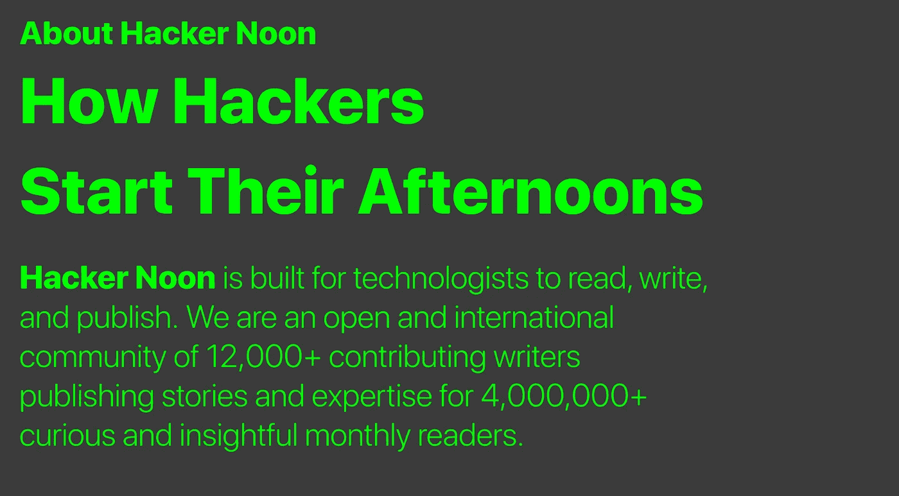
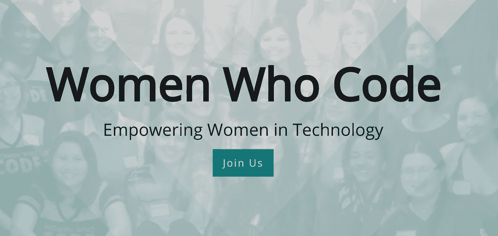
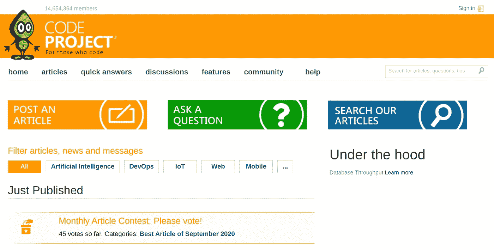

# 十大在线开发者社区

> 原文：<https://levelup.gitconnected.com/top-10-online-developer-communities-6b0ffdce854c>

## 在线社区

## 2020 年开发人员的一些最佳在线社区

照片由[海伦娜·洛佩斯](https://unsplash.com/@wildlittlethingsphoto?utm_source=unsplash&utm_medium=referral&utm_content=creditCopyText)在 [Unsplash](https://unsplash.com/s/photos/friends?utm_source=unsplash&utm_medium=referral&utm_content=creditCopyText) 拍摄

这篇文章是开发人员和数据科学家在网上的最佳去处系列中的另一篇，但重点是社区。在之前的文章中，我们报道了[顶级发展博客](https://medium.com/better-programming/top-10-programming-blogs-in-2020-dda86feead1f)、[顶级数据科学和人工智能博客](https://towardsdatascience.com/top-10-data-science-and-ai-blogs-in-2020-af7367d9a1f3)以及[顶级自由职业者市场](https://medium.com/the-innovation/7-best-websites-for-freelancers-in-2020-78112de6f7e9)。

今天我们做了一个特别的版本，献给我们每天学习新事物的社区。从编码技巧到迷因，这些社区可以让我们欢笑、学习并相互支持。

我今天采用的方法是列出我几乎每天访问的所有网站，以及我自己贡献或阅读的或在社区中有一些特殊价值的网站，尽管我自己不是它的用户，像往常一样，列表没有特定的顺序，也没有任何网站赞助这篇文章。

是时候列出它们并了解一些细节了:

*   开源代码库
*   堆栈溢出
*   Reddit
*   哈克农
*   哈希诺德
*   编码的女人
*   中等
*   开发到
*   代码项目
*   Quora

# [GitHub](https://github.com/)

到目前为止，GitHub 是世界上最大、最受欢迎的开源平台。这个社区拥有超过 5000 万用户和近 2 亿个项目，是许多开源项目的大本营。

我总是在谈论 GitHub，以及你应该如何使用它来建立你的投资组合和托管你的项目，所以这个网站进入这个列表可能并不令人惊讶。

# [堆栈溢出](https://stackoverflow.com/)

你有没有想过，当你寻找常见的编程问题时，你经常去的那个网站是什么？可能是堆栈溢出。

Stack Overflow 是向开发人员提问或分享您的问题的顶级社区网站。它也是在 2008 年推出的，由 Stack Exchange Inc .拥有。它是一个大约有 1000 万用户的社区，用户登录后回答您的问题，讨论您在代码中面临的困难，并找出问题。

已经有数百万个问题得到了回答，所以找到答案的概率非常高。JavaScript、PHP、C#、Python 和 Android 是那里讨论的主要话题。

# [Reddit](https://www.reddit.com/)

Reddit 是一个拥有 3.3 亿活跃用户的强大网络。你永远不会缺少 Reddit 上的内容。Reddit 是一个讨论网站，人们可以在这里发布链接、图片或任何博客文章，其他人可以对其进行评论和投票。

也有很多关于编程和软件开发的讨论。有几个开发人员和软件工程师以及大量永无止境的讨论，对开发人员跟上新技术非常有帮助。

Reddit 可以很神奇，也可以很残酷，它有最好的讨论，我一天都不能不登录 Reddit。这是我最喜欢的平台之一。

# 哈克农

Hackernoon 是关于发布技术新闻、关于编程、创业和加密货币的博客。Hackernoon 是最多样化的社区，有关于人工智能、数据科学、编程等几乎一切的文章。有许多关于加密货币和区块链的文章可以抓住你的注意力。

Hackernoon 也是你可能在某个时候进入的网站，你记得它看起来像一个旧的拱廊。

# [哈希节点](https://hashnode.com/)

Hashnode 是另一个面向开发者的博客平台。这个平台可以免费使用。这是一个社区，在这里你可以讨论与编程相关的问题，与开发者保持联系，并阅读文章。

Hashnode 是一个由来自世界各地的 500 万活跃用户组成的社区。像许多其他网站一样，你也可以为文章投票。

与开发人员更好的互动，讨论任何查询，展示你与计算机科学相关的项目是 Hashnode 不同于其他网站的地方。

# [女人们的代号](https://www.womenwhocode.com/)

Women who Code 是一个开发者社区，旨在增强女性在技术领域的能力。它为您提供与编程、工作和事件相关的解决方案，在这些解决方案中，他们可以加入其他开发人员并与之互动，以增强他们的技能和技术知识。

我不是这个社区的成员，但是，我在这里为所有编码或想从开发开始的女性提到它。

# [中等](https://medium.com/)

Medium 不仅是我选择发表文章的平台，也是最大的博客平台之一。我作为出版商是 medium 的会员，但作为读者也是付费会员。

Medium 包含与编程、数据科学、人工智能、区块链相关的令人惊叹的出版物，但不仅仅是这些。

这里有一些我最喜欢的媒体出版物

*   [级别提升编码](https://levelup.gitconnected.com/)
*   [更好的编程](https://medium.com/better-programming)
*   [走向数据科学](https://towardsdatascience.com/)
*   [代码突发](https://codeburst.io/)
*   [启动](https://medium.com/swlh)
*   [创新](https://medium.com/the-innovation)

当然，当你在那里的时候，不要忘记查看我的个人资料；)

[JC 的牛逼中简介](https://medium.com/@bajcmartinez)

# [开发到](https://dev.to/)

Dev.to 也是一个程序员和软件开发人员的社区，他们在这里分享他们的经验和观点，并帮助其他开发人员在该领域超越他们。软件业很大程度上依赖于合作，这个网站提供了这个平台。这个网站为每个开发者提供了一些有价值的内容。

还有，就是开源！

# [代码项目](https://www.codeproject.com/)

CodeProject 是一个面向程序员的网站，他们在这里通过文章、代码和项目来分享自己的经验。

这些文章可以在许多方面帮助你。几乎所有语言都有文章，从 web 开发到所有计算机编程语言。

CodeProject 还允许其成员在论坛中讨论编程以外的话题。还有一个功能是提问，在这里你可以提出一个问题，然后从有经验的开发者那里得到答案。

公平地说，我不是会员，也不经常使用这个网站，但有人多次向我推荐过这个网站，我认识一些经常在这个网站上的人，所以我决定把它列入名单。

# [Quora](https://www.quora.com/)

如果你像我一样，你可能会想，“Quora？真的吗？”，没错！真的！当我看到这个平台上只有一小部分开发人员时，我真的很惊讶。

Quora 上有人问各种与该领域相关的问题，几乎就像堆栈溢出一样。浏览了 10 分钟后，我对这个网站的所有印象都消失了，它什么都有，从复杂的问题到初级水平的问题。它有文章，很神奇，用户也很多。

一定要去看看！

# 结论

社区可以帮助我们学习、成长和解决问题，它们也可以是一个有趣的地方。所有这些网站的共同点是人，这也是它们伟大的原因。

你知道其他值得一提的社区吗？请在评论区留下它们。

感谢阅读！