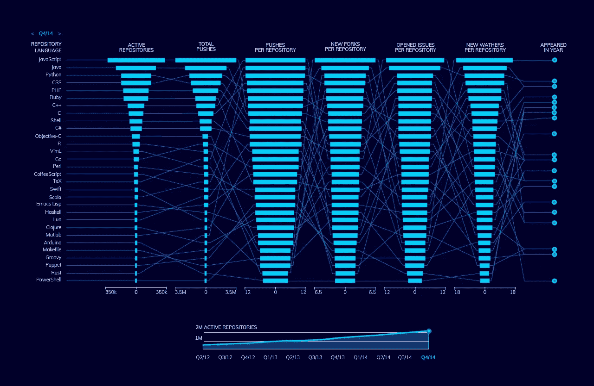

# GitHub 称，2021 年十大编程语言势头强劲

> 原文：<https://levelup.gitconnected.com/top-10-programming-languages-gaining-momentum-in-2020-by-github-33d099cef8c0>

对于一个学习者、开发者或者技术爱好者来说，决定学习哪种语言或者将哪种语言添加到你的文件夹中是相当困难的。这是因为，今天，你可以从大约 700 种编码语言中选择。为了让你更容易理解，下面是 GitHub 的十大编程语言汇编。

GitHub 统计

# Java Script 语言

毫不奇怪， [JavaScript](https://inveritasoft.com/technologies/js) 在这个榜单上排名第一。几年来，它一直是所有程序员最喜欢的语言。2019 年，Statista 报告称，全球 67.8%的开发者正在使用 JavaScript。GitHub 也把这种语言排在了最前面。JavaScript 在构建网站和 web 应用程序时很流行。它是轻量级的，可以成为强大的动态应用程序或网站的坚实基础。也是最容易学的。

# 计算机编程语言

Python 在 GitHub 上最受欢迎的编程语言中排名第二。多年来，Java 一直占据第二的位置。然而，Python 在最近一段时间迅速流行起来。去年，它正式超过 Java，仅次于 JavaScript。那么，这个峰值是由什么引起的呢？人们越来越关注大数据和数据科学。而 Python 是目前为止数据科学和机器学习领域最流行的语言。根据最近的一项调查，83%的数据专业人员经常使用 Python，大多数人向那些渴望进入该领域的人推荐这种语言。

# Java 语言(一种计算机语言，尤用于创建网站)

尽管下降了一位， [Java](https://inveritasoft.com/technologies/java) 仍然是 GitHub 上开发者广泛使用的语言。今年人气排名第三。自发布以来的大约 25 年里，Java 一直是为 android 智能手机用户开发应用程序的首选语言。这是一种考虑到灵活性而创建的语言，可用于构建可在任何设备上运行的程序。今天，它被数以百万计的开发人员用来构建客户端-服务器-web 应用程序。尽管 Java 版本升级到了 Java 11，但至少 83%的开发者仍在使用 Java 8。

# 锈

Rust 是一种相对年轻的系统编程语言，由于其内存安全特性和性能，它的发展势头越来越大。根据 Stack Overflow 的数据，Rust 自 2018 年以来一直被称为最受欢迎的语言，有许多公司积极推动这种语言的未来。作为 C 和 C++的替代品，它被用于创建操作系统和文件系统、浏览器组件、游戏引擎，以抵抗错误。

# 服务器端编程语言（Professional Hypertext Preprocessor 的缩写）

超文本预处理器(PHP)最初是作为 web 开发的通用脚本语言构建的，现在已经发展成为 GitHub 和全世界最受欢迎的语言之一。对于许多 web 开发人员来说，它是一种有吸引力的语言，因为它使得为大型多面 web 应用程序或站点(静态或动态)创建代码变得快速而简单。

# C

C-Sharp (C#)是一种编码语言，它是由微软创建和维护的。它继续运行。NET 框架。它是用于构建 Windows 8 和 10 的编程语言。C#通常用于创建桌面应用程序，但也可以用于制作移动、网络和游戏应用程序。C#在有经验的开发人员和初学者中很受欢迎，因为它运行在一个多方面的框架上，并且非常容易学习。

# C++

软件开发领域最古老的语言是 C。c++是这种语言的更高级版本。这种通用语言用于构建操作系统、游戏套件、浏览器等。这是一种为计算机程序保留的语言。虽然它主要用作过程语言，但它也支持其他编程方法，包括函数式和面向对象的编程方法。

# 以打字打的文件

越来越受欢迎的是打字稿。和 C#一样，都是微软的产品。TypeScript 是一种开源语言，作为 JavaScript 的语法超集，允许开发人员通过称为静态类型检查的过程来分析代码。它基本上是在 JavaScript 之上增加了一层代码。TypeScript 在大型应用程序的开发中很流行。

# 红宝石

Ruby 是一种高级通用编程语言。除了构建 web 应用程序(这是它的拿手好戏)之外，它还有很多其他应用，包括原型和数据科学。Ruby 因使用这种语言构建的 Rails Web 而出名。总的来说，Ruby 非常简单，因为它允许开发者使用更少的代码来开发应用程序。

# 壳

Shell 脚本是一种开发用于在 Unix-shell(命令行解释器)上运行的语言。它广泛用于开发基于 UNIX 和 Linux 的系统。Shell 是开发人员的最爱，因为它可以将复杂的任务转化为简单的重复动作。

# C

2020 年出现在这个名单上的最后一种顶级编程语言是 c 语言，它是一种适合多种应用的过程化语言。尽管它是最早的计算机编程语言之一，但它仍然是构建数据库、操作系统、编译器等最流行的语言之一。

# 最后的话

任何软件开发的核心都是编程语言。现在，开发者可以在 GitHub 等平台上使用多种语言。这些语言是平台上最受欢迎的，Python 和 Rust 令人发指地闯入了列表。这些语言大多是通用的，容易学习。我们知道在哪里可以找到对这些语言了如指掌的专家，如果你需要的话，[给我们一个提示](https://inveritasoft.com/blog/top-10-programming-languages-gaining-momentum-in-2020-by-github)。

*原载于*【inveritasoft.com】