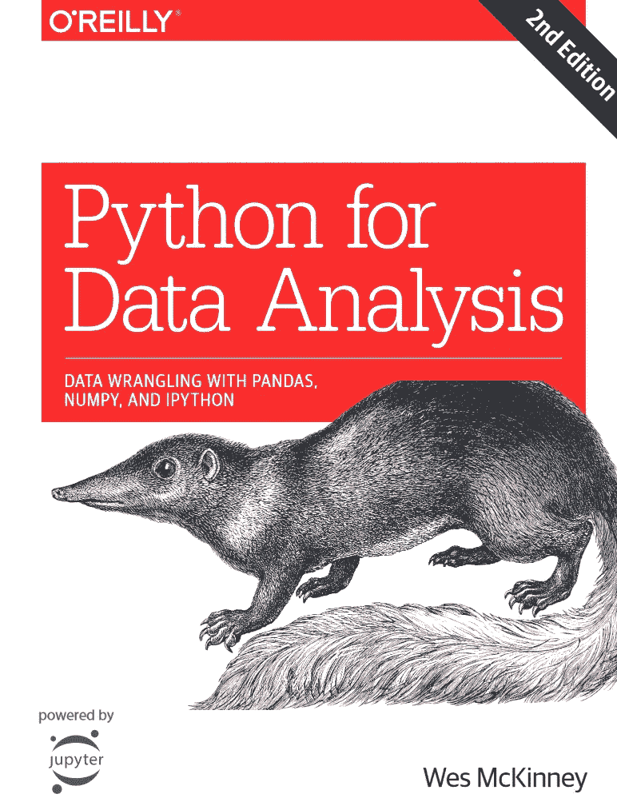
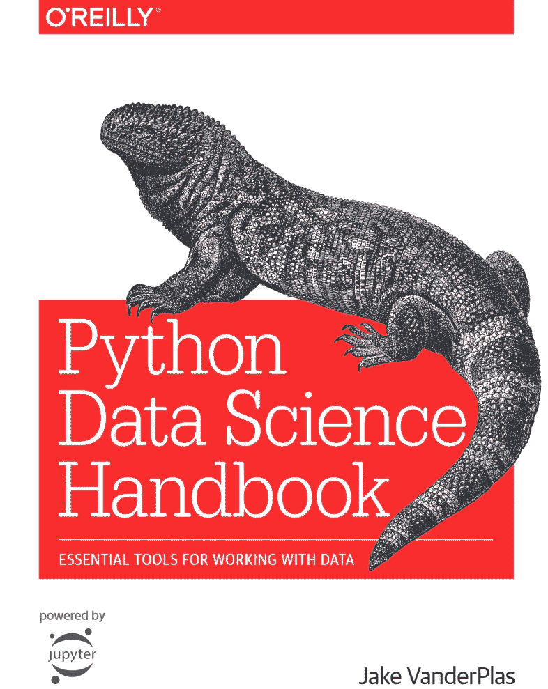
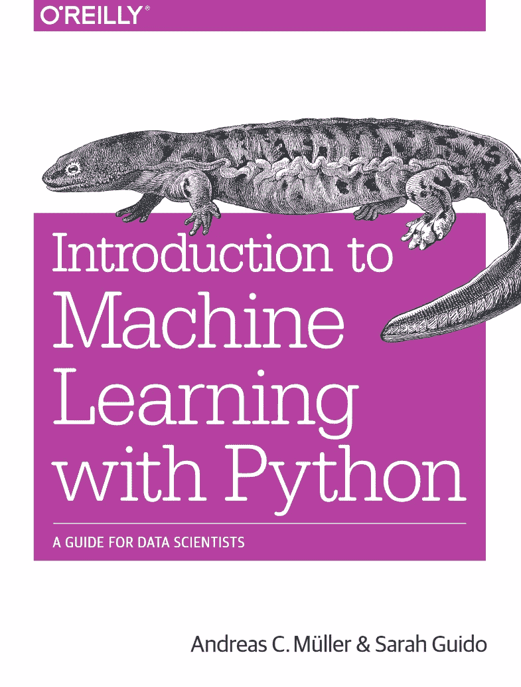
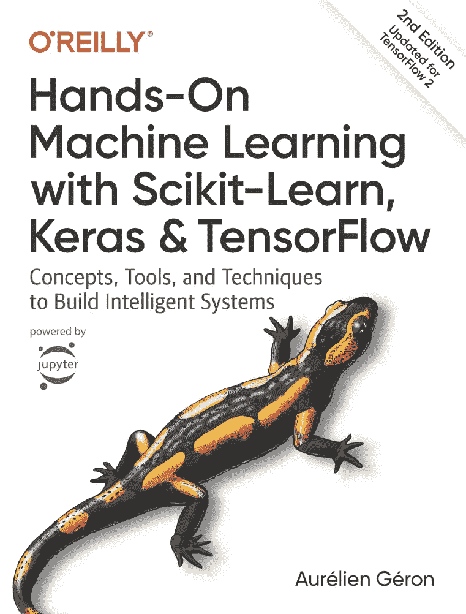
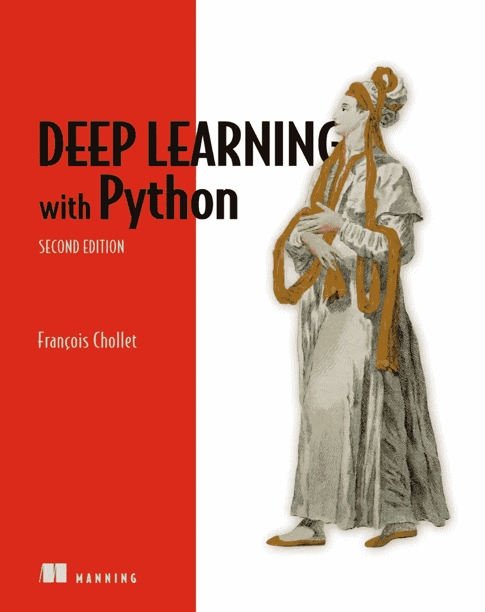

# 数据科学的 10 个最佳 Python 库

> 原文：<https://levelup.gitconnected.com/top-10-python-libraries-and-5-best-books-for-data-science-fa0d0cf171a6>

## 数据科学家应该知道的图书馆和学习它们的前 5 本书。

蒂姆·莫斯霍尔德在 [Unsplash](https://unsplash.com?utm_source=medium&utm_medium=referral) 上的照片

**学习数据科学是一项挑战。**只懂一门编程语言还不足以做数据科学项目。你还需要了解一些库。在这篇文章中，我将介绍数据科学家应该知道的 10 个最好的 Python 库。还有，在帖子的最后，我会说说我爱读的 5 本书。我强烈推荐您在数据科学之旅中阅读这些书籍。

在开始之前，请不要忘记订阅[我的 youtube 频道](https://youtube.com/c/tirendazacademy)，在那里我创建了关于人工智能、数据科学、机器学习和深度学习的内容。

让我们开始吧！

# 什么是数据科学？

照片由 [Tim van der Kuip](https://unsplash.com/@timmykp?utm_source=medium&utm_medium=referral) 在 [Unsplash](https://unsplash.com?utm_source=medium&utm_medium=referral) 上拍摄

**数据科学是发现数据中隐藏模式的科学。**您可以利用数据科学技术从数据中提取有意义的信息。数据科学不需要很深的数学知识。您可以使用 Python 库轻松执行数据分析。有许多库和工具可以在数据科学中使用，尤其是用 Python 编写的。使用这些库可以使您的分析更容易。但是了解所有这些库当然是非常困难的。让我们来看看 10 个最好的图书馆。

# 1-数字

NumPy 是数字 Python 的缩写，是 Python 最重要的库之一。Numpy 用于 Python 中的矩阵和多维数组运算。如你所知，Python 是一种易学的语言，但另一方面，它在数学运算方面速度较慢。但是使用 NumPy 的多维数组操作比 Python 快 100 倍左右。它经常与其他库一起使用，如 Pandas、Scikit-Learn 或 TensorFlow。

# 2-熊猫

数据科学中最常用的库之一是 Pandas。这是我最喜欢的图书馆之一。数据科学项目中最耗时的步骤是数据预处理。该步骤使数据适合于分析。Pandas 用于数据清理和数据预处理。对数据进行预处理后，您可以轻松地使用 Scikit-Learn 等库进行分析。

# 3- Matplotlib

在分析数据之前，了解数据是非常重要的。数据可视化是探索数据最简单的方法。此外，数据可视化是数据分析的重要阶段之一。例如，图帮助我们发现数据中的异常值，并决定使用哪个模型。在 Python 中，数据可视化最常用的库是 Matplotlib。它与 Scikit-Learn 或 TensorFlow 等库一起工作。还可以用 Matplotlib 绘制三维图。

# 4- Seaborn

Matplotlib 是一个重要的可视化数据库。然而，Seaborn 通常用于绘制统计图。此外，Matplotlib 是一个低级库，需要更多的高级图形代码。Matplotlib 的另一个问题是，它比 Pandas 早 10 年左右推出，因此它不是为使用 data frame(Pandas 的一个重要数据结构)而设计的。为了克服这些问题并使统计分析更容易，开发了基于 Matplotlib 的 Seaborn 库。你可以用 Seaborn 画出更容易更有用的图。你也可以用这个库让你的图形主题更漂亮。

# 5- Scikit-Learn

数据预处理后数据分析的重要阶段之一是建立模型。Python 中构建机器学习模型最常用的库是 Scikit-Learn。Scikit-Learn 有监督和无监督的机器学习算法。您还可以使用 Scikit-Learn 进行数据预处理，如数据缩放和数据编码。

# 6-科学

SciPy 是建立在 NumPy 上的一个库。顾名思义，它结合了科学函数和数学算法。在这个库中，您可以找到在数学、统计、线性代数或优化等领域有用的函数。

# 7-细流

一旦你有了一些有意义的结果，你想和别人分享这些结果。您可以使用 Streamlite 库以交互方式部署您的分析结果。Streamlite 是一个帮助开发 web 应用程序的框架。用这个框架开发的应用程序非常快速灵活。

# 8- OpenCV

随着社交媒体和智能手机的发展，我们拍摄了大量的图片，并分享这些图片。数据科学家用人工智能算法分析这些图像。可以使用 OpenCV 库进行计算机视觉分析。OpenCV 主要用 C++编写，但也可以用 Python 和 Java 编写。您可以使用 OpenCV 来操作图像或在图像中查找对象。

# 9-张量流

深度学习是 AI 的子领域之一。可以通过深度学习进行图像分类、语音识别、自然语言处理、语言间翻译等分析。

深度学习使用最多的库之一是 Google 开发的 TensorFlow。有了 TensorFlow，你可以做端到端的数据科学项目。因此，您可以在数据科学分析的每个阶段使用 TensorFlow，从数据预处理到模型部署。

TensorFlow 的一个优势是它可以与 Keras(一种高级 API)协同工作。Keras 于 2019 年作为 API 嵌入 TensorFlow。安装 TensorFlow 时会自动安装 Keras。因此，您可以使用 Keras 轻松进行数据科学或人工智能分析。

还可以使用脸书开发的 PyTorch 库进行深度学习分析。PyTorch 主要用于学术研究。

# 10 瓶

另一个可以用来部署模型的库是 Flask。你可以用 Flask 轻松制作 web 应用。您不需要成为 web 开发人员来部署模型。你可以用 Flask 这个微框架开发 web APIs。

您还可以使用 Django 库来开发 web 应用程序。但是 Django 主要用于更大的项目。另一方面，Flask 主要用于开发小型应用程序。

有了我提到的库，您可以成为一名专业的数据科学家。要了解这些库，您可以查看官方文档或在互联网上找到许多免费资源。现在，我想谈谈我也喜欢阅读的 5 本数据科学书籍。

# 数据科学的前 5 本书

正如我刚才提到的，成为一名数据科学家并不像看起来那么容易。我花了两年时间从零开始成为一名数据科学家。我上面提到的库都有它们的文档。我建议阅读该文档以保持最新。但是初学者很难从文档中学习数据科学。我们来看看学习数据科学的书籍。

## 1- [用于数据分析的 Python](https://www.amazon.com.tr/Python-Data-Analysis-2e-Wrangling/dp/1491957662)

用于数据分析的 Python

我推荐的第一本书是《数据分析用 Python》。这本书的作者就是写熊猫图书馆的人。这本书从 NumPy 开始，特别关注熊猫。您还可以找到使用真实数据集进行数据预处理的示例。这本书的第三版即将出版。

## 2- [Python 数据科学手册](https://jakevdp.github.io/PythonDataScienceHandbook/)

Python 数据科学手册

我推荐的第二本书是《Python 数据科学手册》，你可以在线阅读。这本书的作者目前在谷歌工作。在这本书里，你可以学到 Numpy，Pandas，Matplotlib 库，以及有实际应用的机器学习算法。

## 3- [用 Python 介绍机器学习](https://www.amazon.com.tr/Introduction-Machine-Learning-Python-Scientists/dp/1449369413)

Python 机器学习简介

我推荐的另一本书是《Python 机器学习入门》,该书重点介绍了 Scikit-Learn 库。我强烈推荐这本书，尤其是给那些不懂统计学的人。在这本书里，机器学习在没有深入算法理论的情况下被解释。一本适合数据科学初学者的优秀书籍。

## 4- [动手机器学习](https://www.amazon.com/Hands-Machine-Learning-Scikit-Learn-TensorFlow-dp-1492032646/dp/1492032646/ref=dp_ob_title_bk)

动手机器学习

我推荐的另一本关于数据科学的书是《机器实践学习》。当被问及数据科学或机器学习的书籍推荐时，这往往是数据科学家推荐的第一本书。这本书由两部分组成。第一部分解释了使用 Scikit-Learn 的机器学习，第二部分解释了使用 TensorFlow 和 Keras 的深度学习。是少有的理论与实践相结合的书籍之一。

## 5- [用 Python 进行深度学习](https://www.amazon.com.tr/Deep-Learning-Python-Francois-Chollet/dp/1617294438)

使用 Python 进行深度学习

我会推荐的最后一本书是《Python 深度学习》。这本书是 Keras 的开发者写的。目前在 TensorFlow 担任 Keras 团队负责人。对于那些希望通过 Keras 和 TensorFlow 学习数据科学理论和实践的人来说，这是一本非常棒的书。第二版刚刚出版。

# 结论

数据是新的石油，模型是新的炼油厂。数据科学是一个宽泛的术语，描述从任何类型的数据中提取有意义信息的过程。学习数据科学是一项挑战。在这篇文章中，我告诉了你成为数据科学专家需要知道的事情，并提到了 5 本书。

就是这样。我希望你喜欢它。感谢阅读。别忘了关注我们的[YouTube](https://www.youtube.com/channel/UCFU9Go20p01kC64w-tmFORw)|[GitHub](https://github.com/tirendazacademy)||[*Twitter*](https://twitter.com/TirendazAcademy)*|[ka ggle](https://www.kaggle.com/tirendazacademy)*|*[*LinkedIn*](https://www.linkedin.com/in/tirendaz-academy)*👍**

**您可能会对以下文章感兴趣👇**

** [## 8 个最好的 Seaborn 可视化

### Python Seaborn 使用 penguin 数据集实际绘制统计图。

medium.com](https://medium.com/geekculture/8-best-seaborn-visualizations-20143a4b3b2f)  [## 用于数据分析的 SQL

### SQL 是一种与数据库通信的语言。尽管出现了新技术，但了解 SQL 仍然是…

medium.com](https://medium.com/mlearning-ai/sql-for-data-analysis-8228c923ce82) 

如果这篇文章有帮助，请点击拍手👏按钮几下，以示支持👇**