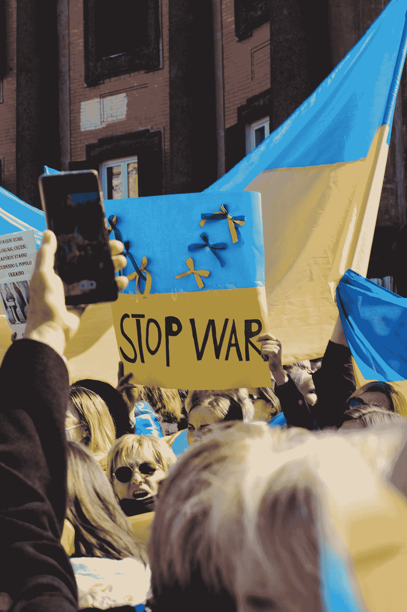
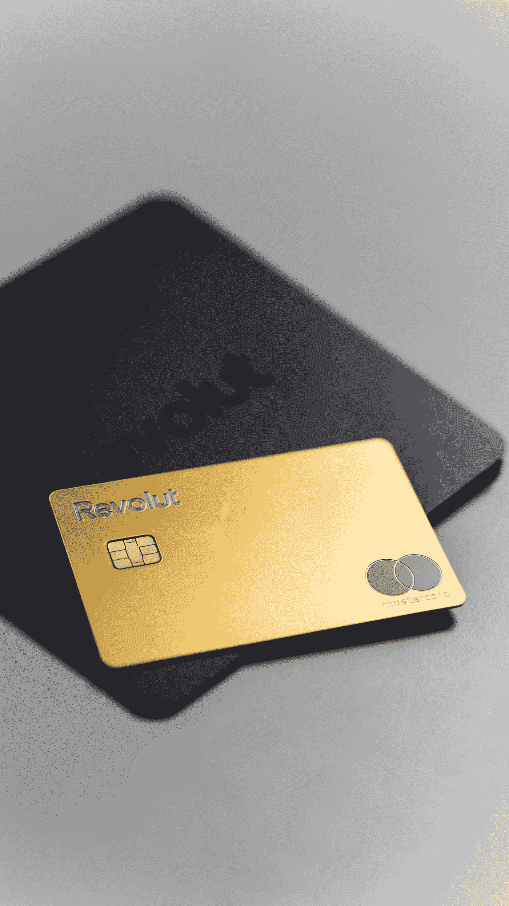

# 关于网络战的十大恐怖事实

> 原文：<https://levelup.gitconnected.com/top-10-scariest-fact-about-cyberwarfare-31b4f8cacfc>

## 网络战比你想象的更危险。

面对网络攻击，你有多安全？你知道一些关于网络战的事实吗？

丹尼尔·林肯在 [Unsplash](https://unsplash.com?utm_source=medium&utm_medium=referral) 上的照片

网络战已经成为全球领导人的主要担忧。近年来，成功的网络攻击数量呈指数级增长。这些攻击包括恶意软件、网络钓鱼诈骗、数据泄露、勒索软件等。它们被用于间谍活动、勒索甚至破坏。

对于政府和企业来说，重要的是制定策略来抵御这些威胁并降低风险。此外，他们还应该实施有效的方法来减少潜在的攻击。

# 关于网络战的十大可怕事实:

## 1)仅在谷歌 Play 商店上就检测到超过 200，000 个恶意程序。

这是一个巨大的数字，想想谷歌有一个伟大的安全团队是惊人的！但是，这仍然意味着大多数人不会得到任何保护，因为存在比这篇文章中列出的更危险的应用程序。

最好按照说明操作，只安装默认安装或通过更新机制安装的可信应用程序。

# 2)乌克兰多年来一直遭受俄罗斯黑客的攻击。

乌克兰是电脑的战场(不幸的是，最近不仅仅是因为这个)。黑客不断攻击这个国家，而政府没有采取足够的措施来阻止他们。尽管网络战仍在进行，但乌克兰仍容易受到攻击。

照片由[纳提·梅尔尼丘克](https://unsplash.com/@natinati?utm_source=medium&utm_medium=referral)在 [Unsplash](https://unsplash.com?utm_source=medium&utm_medium=referral) 拍摄

由于政府监管不力，黑客往往可以逃脱非法行为。乌克兰等许多国家的网络安全往往很薄弱。黑客可以利用这一弱点获取信息或窃取金钱。

此外，该国对技术的高度依赖也使其更容易受到影响。因此，针对乌克兰人的黑客攻击层出不穷。这些攻击包括窃取信息、使用恶意软件，甚至访问银行账户。

# 3)勒索病毒 WannaCry 花费了英国数十亿英镑

名为 WannaCry 的恶意勒索软件瘫痪了全球数千台 Windows PCs，包括医院和政府办公室。网络罪犯发出的勒索信要求人们付钱给他们，否则他们的数据就会被删除。

该病毒使用暴力攻击来阻止服务器运行。它是利用 Microsoft Word 文档中的一个漏洞传播的。

英国国家医疗保健系统因勒索软件攻击损失数十亿英镑。攻击锁定了医院的 IT 系统，导致数千个预约被取消。修复受损的 It 系统需要花费数百万美元。英国政府被警告勒索软件攻击的危险，但他们没有采取任何预防或保护措施。

# 4) 90%的移动银行交易是通过应用程序进行的，黑客滥用了这一点

如今，我们在任何地方都使用智能手机——工作、家庭、学校、假期等——许多人将敏感的用户名和密码放在任何地方，尤其是在咖啡店、餐馆、机场、酒店、图书馆等使用公共电脑或 Wi-Fi 热点时。，因为它们很容易被黑客窃取。

在 [Unsplash](https://unsplash.com?utm_source=medium&utm_medium=referral) 上由 [Tran Mau Tri Tam](https://unsplash.com/@tranmautritam?utm_source=medium&utm_medium=referral) 拍照

例如，超过 30%的 Android 设备在销售一年内被感染。如果你的智能手机遭到黑客攻击，那么你就失去了对你的账户和所有私人数据的控制。想象一下无法访问电子邮件帐户、照片、财务信息、信用卡号码、聊天记录等。

由于 90%的移动银行交易是通过应用程序进行的，网络罪犯使用社会工程策略来欺骗人们向他们提供敏感信息。黑客会记录用户名/密码组合或安全问题等登录信息，这样他们就可以进入受害者的账户，而不必侵入设备本身。

# 5)间谍软件数量大幅增加

一份新的报告显示，自 2020 年以来，间谍软件程序的下载数量增长了 487%。这不仅适用于智能手机，也适用于平板电脑。

照片由[伯纳德·赫曼特](https://unsplash.com/@bernardhermant?utm_source=medium&utm_medium=referral)在 [Unsplash](https://unsplash.com?utm_source=medium&utm_medium=referral) 上拍摄

最近测试的每 5 台平板电脑中就有 3 台发现了间谍软件。尽管间谍软件并不总是针对个人隐私，但它确实暴露了大量个人信息。

# 6)高级持续威胁每年让公司损失数万亿美元

“复杂的”网络攻击每年在全球范围内给公司造成超过 9 万亿美元的损失。全球每年在网络安全产品、服务和工资上的总支出超过 1.1 万亿美元。

这些成本甚至还不包括高等教育费用、生产力损失以及因网络犯罪造成的损害而产生的不断增加的法律费用。

# 7)大多数大型组织每年都会受到攻击

根据威瑞森的一项研究，“大多数组织在 2018 年 5 月至 2019 年 3 月期间受到攻击”。然而，没有明确的迹象表明，更强有力的监管可以遏制未来的犯罪和防止袭击。

TrustedSec 总裁戴维肯尼迪(David Kennedy)表示:“监管格局非常复杂，在需要满足哪些标准方面缺乏明确性。

# 8)每天都有大量信息泄露，个人数据不安全

据估计，去年全球有 2200 万人的姓名和电子邮件地址在网络诈骗中被窃取。这相当于这些人每人每天有 42 亿封电子邮件。在线诈骗已经变得如此普遍，以至于许多机构现在提供免费的两步验证来打击这些犯罪。

马库斯·斯皮斯克在 [Unsplash](https://unsplash.com?utm_source=medium&utm_medium=referral) 上的照片

# 9)2015 年，一名黑客从 Capital One 窃取了 200GB 的数据

Capital One 披露，2014 年期间，其支付处理器处理了近 4000 万笔支付，价值约为 4.45 亿美元。其中 Visa 和 MasterCard 发行了 390 万张信用卡，涉及 140 万名客户的数据遭到泄露。该漏洞是由于“处理 PIN 数字时的行业漏洞造成的，我们正在积极修复该漏洞。”

照片由 [AltumCode](https://unsplash.com/@altumcode?utm_source=medium&utm_medium=referral) 在 [Unsplash](https://unsplash.com?utm_source=medium&utm_medium=referral) 上拍摄

# 10)一名黑客曾经访问了 LinkedIn 的 630 万条记录

2017 年，黑客利用漏洞入侵了 LinkedIn 的内部数据库，该数据库包含可通过该公司网站访问的用户资料。这在当时是一个巨大的突破。

据网络安全公司 FireEye 称，这次攻击导致约 630 万用户的姓名、电话号码、电子邮件地址、职位和其他属性等信息出现在公众视野中。尽管如此，LinkedIn 还是立即开始通知受影响的用户。

# 保护自己免受网络犯罪侵害的最佳方法包括:

-确保在恶意行为者之前下载修复错误的软件更新和补丁。

-避免点击未经请求的信息中嵌入的链接。

-安装强密码以保护您的帐户。

-警惕任何试图进入您账户的可疑网站或人员。

# 结束语

网络战无疑是可怕的，也是当今技术中更普遍的问题之一。注意安全，不要点击来源不可靠的链接。

如果你对这篇文章有任何问题或建议，请不要犹豫，在评论区回复。喜欢你读的东西吗？为什么不关注我的媒体简讯，这样你就不会错过我未来的任何文章了？很简单，点击[这里](https://kgabeci.medium.com/subscribe)输入你的邮箱地址，然后按订阅。

你喜欢阅读媒体上的文章吗？考虑成为会员，有很多功能，你将获得所有创作者的内容，每月只需 5 美元。使用[这个链接](https://kgabeci.medium.com/membership)，你也帮我赚一小笔佣金，点击成为会员，输入你的信息。