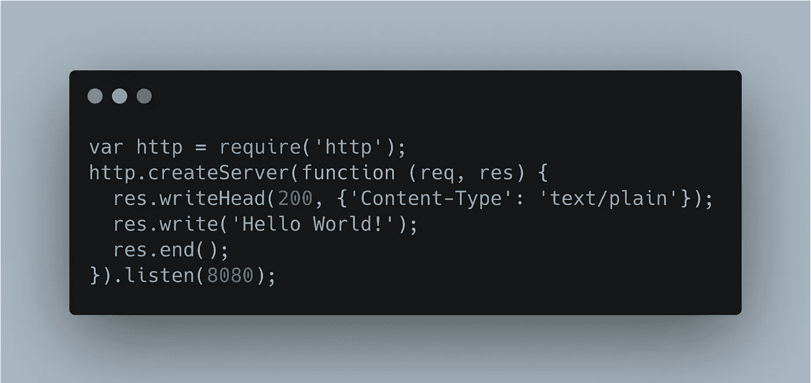
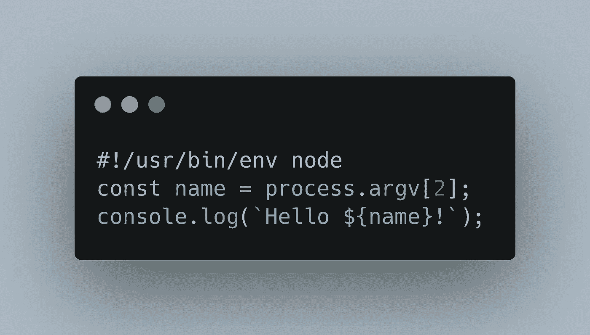
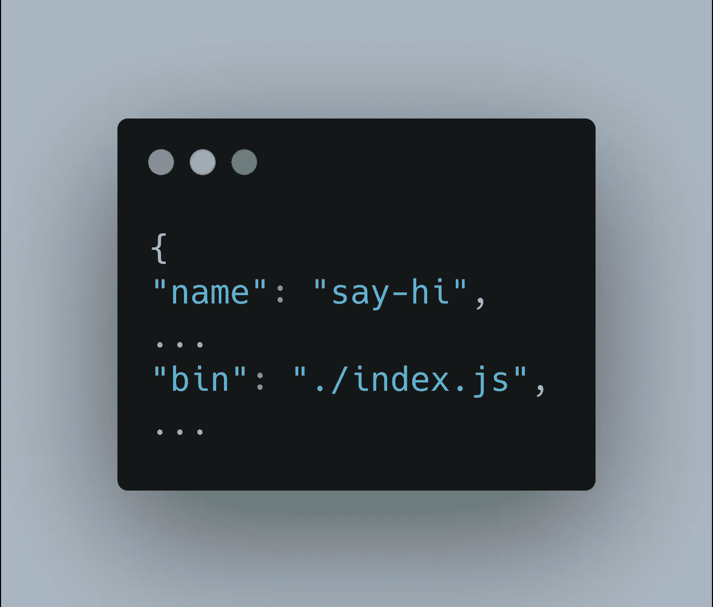

# 我学到的关于 NodeJS 的 10 件事

> 原文：<https://levelup.gitconnected.com/top-10-things-ive-learned-about-nodejs-18f5ecb84f00>

## 这是迄今为止的高潮。


尼克·莫里森在 [Unsplash](https://unsplash.com?utm_source=medium&utm_medium=referral) 上拍摄的照片

W 到底是什么 [NodeJS](https://nodejs.org/en/) ？我认为这是另一篇文章，但现在，我们将保持在 2000 英尺，只是说它是什么:

> NodeJS 是基于 Chrome V8 JavaScript 引擎构建的 JavaScript 运行时。

当我开始我的游戏开发学士学位的最终项目时，我决定制作一个打字稿游戏引擎。一切顺利。知道我现在所知道的，我想在某个时候再次接近那个项目，但是现在，我认为[神圣引擎](https://github.com/srepollock/divine-engine)需要分开一段时间。也就是说，通过这个项目的工作过程，我已经学到了很多东西。

我想分享一下我从这篇文章中学到的东西，希望那些新手——或者老手——可以了解一些关于 NodeJS 的东西，这些东西是我辛辛苦苦学到的。

坐下来，喝杯咖啡，也许做点饼干。我们会慢慢来。


马库斯·斯皮斯克在 [Unsplash](https://unsplash.com?utm_source=medium&utm_medium=referral) 上拍摄的照片

# 1.模块

理解模块分辨率花了我最长的时间。由于我在 TypeScript 中构建的项目需求列表，我想尝试在我的项目中使用最新和最棒的 ESNext 模块，以便我可以尽可能地保持未来的证明。这让我掉进了许多兔子洞，造成了很多混乱。

我只希望我能找到于尔根·范·德·摩尔的这篇文章，这篇文章对事情进行了很好的阐述。请仔细阅读这篇文章，以便更深入地理解。

## 模块格式

> “模块格式是模块的语法”——Jurgen。

仅此而已。加载程序如何读入模块并连接多个文件。

*   异步模块定义(AMD)
*   CommonJS
*   通用模块定义(UMD)
*   系统.寄存器
*   ES* (ESNext)模块格式

## 模块加载器

> "模块加载器解释并加载以某种模块格式编写的模块."于尔根

模块加载器是将模块加载到 JavaScript 引擎中的运行时运行器。使用不同的模块格式和加载器会产生不同的结果，因为它们各有利弊。我会留给你去研究。

因为我在构建 TypeScript，想要最新最好的，所以我使用了 es next——它总是使用最新的 ES 预览版。

## 模块捆绑

> "模块打包器取代了模块装入器."于尔根

使用 bundler 有助于构建单文件库，并为在其他程序中使用该库做准备。关于 bundlers 最好的事情是你可以用其他的模块格式来构建你的库，而不是你编写它们的格式！

例如:我在 ESNext、CJS 和 UMD 模块库中编译了我的代码。

捆扎机的一些例子有:

*   [WebPack](https://webpack.js.org/)——最大的追随者和最头疼的问题
*   [RollupJS](https://rollupjs.org) —最可配置
*   [ParcelJS](https://parceljs.org/) —最容易设置

## 其他一些小知识:

*   NodeJS 使用 CommonJS (CJS)。应用程序中运行的所有文件都必须是 CJS 模块才能正确解析。
*   浏览器上的默认 JavaScript 运行 ES5 脚本。


弗朗西斯科·温加罗在 [Unsplash](https://unsplash.com?utm_source=medium&utm_medium=referral) 上拍摄的照片

# 2.集束

既然我们已经谈了一些，我将描述一下我在捆绑工作中的发现。这也会再次溢出到 fs、https 和 TypeScript 中。

当我构建游戏引擎时，捆绑是最需要调整和修补的。我的捆绑销售渠道非常脆弱，但其他一切都很脆弱，因为当我开始的时候，这些项目还不到一年。

我在我的项目中使用了 [RollupJS](https://rollupjs.org) 进行捆绑。我发现文件观察重载是没问题的——这是我的引擎的一大特色。

当我试图使用项目中捆绑的 native NodeJS 模块时，出现了问题。我也有一两次在从 TypeScript 编译时遇到问题，并试图使用 transpiler [BabelJS](https://babeljs.io/) ，但后来通过正确配置我的 TSConfig 文件找到了一个修复方法(稍后将详细介绍)。

随着我继续学习更多关于捆绑的知识，我终于找到了我需要的插件。插件顺序也是插件中最重要的部分。

最后，我的`rollup.config.json`文件看起来是这样的:


rollup .配置. js


[韦斯利·廷吉](https://unsplash.com/@wesleyphotography?utm_source=medium&utm_medium=referral)在 [Unsplash](https://unsplash.com?utm_source=medium&utm_medium=referral) 上拍摄的照片

# `3\. fs`模块

在我看来，`filestream`或`fs` NodeJS 模块是最有用的模块之一，但却给了我很多麻烦。这个模块将允许你作为一个开发者读写文件。在我的项目中，需要读入游戏和引擎的配置文件。

捆绑器中的`fs`流不停地到处扔错误，但被`@joseph184/rollup-plugin-node-builtins`固定住了。这里的[问题是原`rollup-plugin-node-builtins`项目中的](https://github.com/calvinmetcalf/rollup-plugin-node-builtins/issues/47)将解释我为什么切换到它。

此外，这源于我提交给的修复的`browserify-fs`项目[。](https://github.com/mafintosh/browserify-fs/pull/21)

在 NodeJS 项目中使用`fs`模块是没问题的，但是当涉及到绑定时，大多数加载器会要求注入器将代码实际插入到它正在构建的库中。


尼古拉斯·皮卡德在 [Unsplash](https://unsplash.com?utm_source=medium&utm_medium=referral) 上拍摄的照片

# `4\. https`模块

NodeJS 的`[https](https://nodejs.org/api/https.html)` [模块——由](https://nodejs.org/api/https.html)`[http](https://nodejs.org/api/http.html)` [模块](https://nodejs.org/api/http.html)构建而成——是我最近发现的一个模块，但我希望我能早点发现它；如果我有时间的话，我的游戏可能会有多人游戏。`https`模块很像 Python 中使用的模块；它为开发人员提供了连接到 URL 并以他们选择的任何方式处理返回的请求的功能。

当然有被否决的`request`项目([见为什么](https://github.com/request/request/issues/3142))和[其他方式](https://attacomsian.com/blog/http-requests-in-nodejs/)打电话，但从这里开始，我将使用 HTTPS。

首先，HTTPS 保证了一切安全。这一点很重要，尤其是现在每个人都在家工作，黑客也逍遥法外。这种安全性是我使用`https`模块而不是`http`模块的主要原因。

原则上，该模块允许通过各种选项向外部服务器发送`get` / `post` URL 请求，包括 TLS 支持。这些请求可以用各种[选项](https://nodejs.org/api/https.html#https_https_request_options_callback)来定义，让开发人员对工具有更多的控制。

该模块还允许创建一个服务器，除了您必须做大量的手动处理，像 Express 这样的东西会替您处理(见下一节)。

总是试着使用尽可能少的依赖，这样你就不会发现自己陷入依赖地狱。


[泰勒·维克](https://unsplash.com/@tvick?utm_source=medium&utm_medium=referral)在 [Unsplash](https://unsplash.com?utm_source=medium&utm_medium=referral) 上的照片

# 5.创建服务器

NodeJS 是为可伸缩的 web 应用程序构建的后端，这意味着您可以本地编写和服务 web 主机。对于开发人员来说，这是一个强大的工具，能够创建一个允许您连接设备和人的网络。C

创建一个 NodeJS 服务器确实拓宽了 web 开发人员的视野，使您不会因为从不处理后端而受到限制；现在你控制后端。

在 NodeJS 中设置一个只有节点模块的服务器很简单:



server.js

然后在节点中运行:`node server.js`

然后打电话

```
curl -k http://localhost:8000/
```

在运行`curl`请求的控制台中，输出应该是`hello world`。

尽管启动很简单，但后端开发人员需要担心很多事情，并且必须编写服务器如何处理请求的每一行代码会占用大量时间。

也就是说，还有其他框架可以为您处理大量此类情况，并让您立即获得可伸缩的服务器。我最喜欢的是 Express，我在回购中有一个例子:

[](https://github.com/srepollock/express-rest-api-example) [## sre pollock/express-rest-API-示例

### 此时您不能执行该操作。您已使用另一个标签页或窗口登录。您已在另一个选项卡中注销，或者…

github.com](https://github.com/srepollock/express-rest-api-example) 

托德·夸肯布什在 [Unsplash](https://unsplash.com?utm_source=medium&utm_medium=referral) 上拍摄的照片

# 6.创建 CLI 工具

CLI 工具让开发人员的世界运转起来。如果作为开发人员，您仍然害怕终端，那么现在是开始习惯它的最佳时机。我个人发现，将手指放在键盘上遍历文件系统要比使用鼠标快得多。

也就是说，我确信你已经打开过一两次命令行，使用过类似于`git`或`node`的东西(尤其是如果你最近关注了我的博客)。好吧，让我们用一个小模板来创建我们自己的 CLI 工具，但是是在 NodeJS 中！

NodeJS 包含的基本模块足以启动并运行。要创建一个只回显输入名称的 CLI 工具，创建一个`index.js`文件，包含:



索引. js

使用以下命令编辑您的`package.json`文件:



package.json

然后运行`npm link`将你的项目链接到你的本地 bin。然后要调用您的函数，您可以在终端中调用您赋予包的名称:

`say-hi NAME`

然后控制台会记录你给的名字！

这只是一个模板工具和一些开始。有一些很棒的 CLI 解析工具，比如 NodeJS 推荐的 [Yargs](https://yargs.js.org/docs/) 和广泛使用的 [Commander.js](https://github.com/tj/commander.js) 。在他们的帮助下开始构建命令行工具。


NPM 标志

# `7\. npm`

节点包管理器(NPM)是网上最大的代码库。JavaScript 代码就是。上面有如此多的库和工具，很难把它们都记录下来；更不用说[安全](https://docs.npmjs.com/auditing-package-dependencies-for-security-vulnerabilities) [问题](https://github.com/features/security) [在](https://blog.npmjs.org/post/141702881055/package-install-scripts-vulnerability) npm 内，他们已经开始通过 [NPM 审计](https://docs.npmjs.com/cli/audit)来缓解。


照片由[阿尔方斯·莫拉莱斯](https://unsplash.com/@alfonsmc10?utm_source=medium&utm_medium=referral)在 [Unsplash](https://unsplash.com?utm_source=medium&utm_medium=referral) 上拍摄

# 8.图书馆

库是开发人员最好的朋友。记住“不要重新发明轮子”这句话，这就是库(/框架/包)在计算机编程中的作用。

库是一个代码包，它为开发人员提供了一个可以在他们的项目中使用的 API。从 NPM，开发人员可以引入包——以及库——用于他们的项目。找到一个项目并学习它的 API 可以大大加快开发时间，因为编码人员不再需要“发明轮子”,只需从 npm 商店“购买”(安装)一个即可。


瑞安·卡彭特在 [Unsplash](https://unsplash.com?utm_source=medium&utm_medium=referral) 上拍摄的照片

# 9.语义版本控制

语义版本化或 [semver](https://semver.org/) 是版本命名软件遵循的过程。通过遵循单一的版本控制标准集(这有助于避免依赖地狱),允许库的开发者和用户使用通用的软件版本。

我相信你已经看到了像 Node 的 v14.5.0 这样的软件版本。这在 semver 中分解为`major.minor.patch`。他们将这三个变量描述为:

1.  主要版本当您进行不兼容的 API 更改时，
2.  当您以向后兼容的方式添加功能时，次要版本
3.  当你做向后兼容的错误修正时，补丁版本。

预发布和构建元数据的附加标签可作为主标签的扩展。小调。补丁格式。

给网站一个回顾，也许加入一些自动版本控制的工具。我一直在慢慢琢磨一种我想在未来项目中使用的方法，但还没有得出如何实现的结论。


以打字打的文件

# 10.以打字打的文件

[TypeScript](https://www.typescriptlang.org/) 语言是微软开发的。简单来说，就是:

> TypeScript 是一个 JavaScript 超集，它的一个主要优点是可以利用 JavaScript 尚未采用的最新 ECMA 脚本标准。这些新标准的一个例子包括:强类型、常量、块范围的变量和函数、字符串插值和对象析构等等。除了脚本优势之外，TypeScript 的另一个关键优势是能够通过编译器的监视功能在本机生成增量版本。这允许在文件保存时进行代码编译，以便开发人员可以立即测试他们的更改。—斯潘塞·波洛克

> 这是我实习期末报告的一部分。

打字稿是一段旅程。可以编写通用的 JavaScript 代码，用`tsc`即时编译。[游乐场](https://www.typescriptlang.org/play/index.html)是开始学习 TypeScript 能提供什么的好地方。

我选择 TypeScript 的最大原因是:

*   它是强类型的
*   它具有热重装的监视功能

## 强类型

强类型引用开发人员严格告知编译器该对象是字符串的**类型**:

`let myString: string = "hello world";`

`variableName: string`是强类型部分。这有助于减少 JavaScript 开发时间，因为您现在知道传递的是什么类型的对象。当你使用错误的类型时，编译器会大叫。

## 手表功能

`--watch`标志告诉编译器监视给定目录中的文件(例如 src/):

`tsc --watch src/`

这提供了更新特性的能力，而不必手动重新编译并查看更改。一旦文件被保存，编译器就会获取更改并进行编译。

这对于开发和创建其他插件来观看更新和编译他们自己的变化是非常方便的；这是我的引擎在不关闭窗口的情况下重启场景的目标。

[TypeScript 项目](https://www.typescriptlang.org/docs/handbook/typescript-in-5-minutes.html)对 TypeScript 的精彩介绍。

# 最后

这是我去年在做项目时学到的主要经验的顶点。这是一个零星的列表，我肯定学到了更多，但这是一个花了相当多时间来思考和纠正的列表。我希望你能从这篇文章中得到一些启示。让我知道你是否发现了其他真正加快工作流程的技巧；我很想听听你对这个问题的看法！

JavaScript 可能是一个可怕的主题，但它已经开始渗透到开发世界的方方面面。

感谢您花时间阅读帖子！我希望你已经得到了一些前进的提示。你会从今天的文章中学到什么？为什么不花点时间写个回应和反思呢？

祝一切顺利，保持安全——斯潘塞