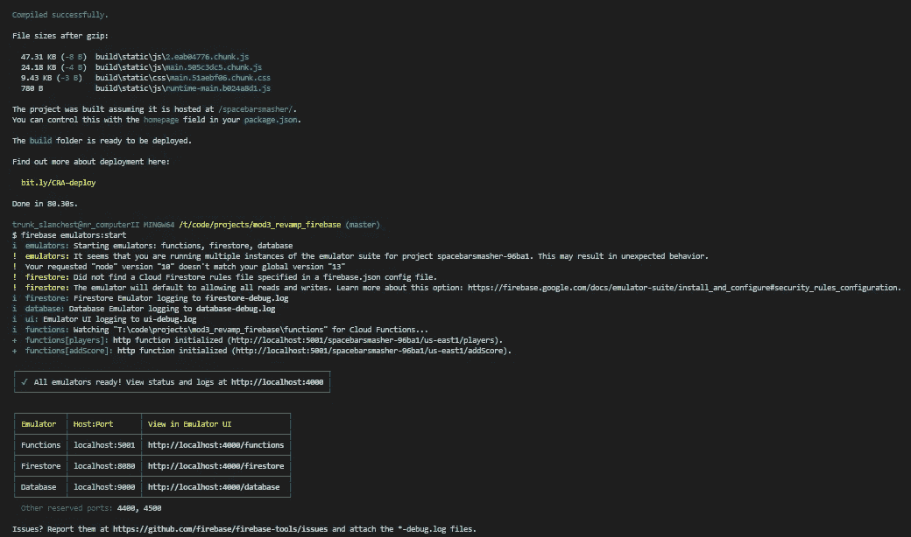

# 我从部署中学到的 10 大技巧

> 原文：<https://levelup.gitconnected.com/top-10-tips-i-learned-from-deployment-1a8db769715b>

## 你不会相信 11 号！

无论您是在从事个人项目、与几个人就一个想法进行合作，还是发布产品级代码，部署都会带来一定程度的压力、焦虑、诡计、陷阱、bug、错误、问题、地雷和噩梦，如果您不知道自己在寻找什么，这些可能很难弄清楚。

在这篇博客中，我想做一些稍微不同的事情，写下我在过去两周部署我的第一个名为 [**空格键粉碎机**](https://trunkslamchest.com/spacebarsmasher/) **的 React 应用程序时所学到的东西。**

我不打算关注具体主机或服务的具体技术细节，而是更多地关注在登陆日前后需要记住的事情。

所以，让我们开始付小费吧。

## 少有人走的路

首先，一些背景故事:

自 2012 年以来，我开发了一些网站，但它们要么非常简单(我以前的图形设计组合只使用 HTML 和 CSS)，要么使用内置框架/模板(Ekklesia 360、myBB、vBulltein 等……)。所以我从来没有部署自己的项目的实际经验。

直到 2 周前，我终于部署了我的第一个用 React 构建的网站，名为 [**空格键粉碎机**](https://trunkslamchest.com/spacebarsmasher/) 。简而言之，就是你在 30 秒内尽可能多的按空格键，努力得高分的项目。

简单吧？

我在 Flatiron 学校上学时和 Jamal Farah 一起创建了这个项目，我们最初是用普通的 JavaScript 和 Ruby On Rails 构建的。毕业后，我用 React 重新构建了整个应用程序，涂上一层新的油漆，然后用 Firebase 重新构建了后端。

为什么选择 Firebase？嗯，我的 webhost 是 LAMP (Linux Apache MySQL PHP)栈。我对灯堆毫无经验。我真的很想把应用程序部署到我的主机上，因为我的图形设计作品集就放在那里，我拥有的几个域名也在那里注册了。我也不想找一个单独的服务来托管 Ruby On Rails 后端，因为 Firebase 一开始是免费的，所以我想我也可以尝试一下。

果不其然(经过几个不眠之夜)，我找出了大多数的错误，并且可以自豪地说它最终都解决了，整个经历被证明是无价的。

所以，这是我学到的。

## #1 -人们会破坏你的项目

我把 [**空格键击碎**](https://trunkslamchest.com/spacebarsmasher/) 发给了一个在英国的朋友。在 5 分钟内，他已经发布了 7348 分。

“嗯，”我对自己说，“这意味着他每秒钟按空格键 244 次。”很明显，他想出了作弊的方法。我让他把他的剧本发给我。他笑着说我想多了。原来他用了一个自动点击器，设置成每毫秒按一次空格键。

所以，我马上意识到我需要想出一些反作弊措施。我为我的鼠标(SteelSeries Rival 600)安装了一个软件自带的宏编辑器来模拟我朋友使用的宏。

我算出，如果我保持按空格键之间的时间量的运行平均值，并且如果运行平均值持续低于 0.01 秒，他们可能在作弊。然后我可以结束游戏，让应用程序称这个人是骗子。

而且这很有效(到目前为止)。对于任何运行 auto-clicker 宏或用 Chrome 编写脚本的人来说，这实际上是一举两得。

哪怕是非自愿的，人家不管怎么样都会把你的项目弄坏的。一旦你在项目中找不到 bug，就开始把它发给你知道会提供反馈的人。倾听他们的反馈，跟踪他们发现的错误。修复这些错误。不要害怕问别人太多的问题。尽可能多地获取关于 bug 的信息。把它看作是一种以你无法独自完成的方式来改进你的项目的方法。

再小的漏洞，也要堵住漏洞。

## #2 -你对项目的看法会改变

在本地运行和开发一个项目与在整个互联网上开发和部署一个项目是非常不同的。你的价值观变了。不管你的用户基数有多大，你可能会感到增加小功能或修复小错误的压力会增加。项目的每个方面都被放大了。这将改变你的发展方式和你为自己设定的目标。

你从别人那里得到的反馈也会改变你对自己项目的看法，即使你试图不让它影响到你。多关注积极的一面，而不是消极的一面。不要让不喜欢你所部署的东西的人破坏了你对你的应用程序的看法。如果没人用你的应用，那也没关系。试着把它发给更多的人。在社交媒体上链接。开始向页面添加 SEO。

在你电脑的泡泡里，你的项目是有史以来最好的东西。但是部署之后，它就变成了另一个网页。那时候你就必须开始把它当成一个。不要让这阻止你热爱你部署的东西。

## #3 -移动化

确保积极的 UX 至关重要。当我第一次开始发送 [**空格键粉碎**](https://trunkslamchest.com/spacebarsmasher/) 的链接时，我从人们那里听到的最常见的事情之一是，它在移动设备上不起作用。我会问“你是什么意思？”他们会回复类似“没有办法在我的手机上按空格键。”

那时我才意识到为移动设备提供便利是多么重要，而且真的没有不提供便利的选择。我开始在谷歌上搜索，并与一些人交谈，以找出一个好的解决方案。

检测移动设备的一种方法是通过媒体查询根据浏览器的`max-width`、`min-width`、`max-height`或`min-height`设置 CSS 属性。

我觉得这是一个笨拙的解决方案。您编写的媒体查询量可能会变得非常长。平板电脑的分辨率可能与一些笔记本电脑相似或更高。个人电脑上的用户可能会将他们的窗口调整到比大手机还小的尺寸。

所以我想找到一个不同的解决方案。我有一种预感，移动设备会在浏览器的全局执行上下文中设置属性，而 PC 不会。特别是触摸屏。

如果我能在浏览器的窗口对象中找到一个属性，告诉浏览器一个设备有一个触摸屏，我就可以添加一个按钮，让移动用户点击他们的屏幕，而不是粉碎他们的空格键。我可以让这个按钮只在移动设备上显示，并将名称改为 Screen Smasher。

我是对的。以下是该文件的摘要:

您可以将它添加到 React 项目中，并像平常导入任何命名导入一样导入它。如果用户使用移动设备，它返回`true`，如果用户不使用移动设备，则返回`false`。它也适用于平板电脑。结合状态管理，您可以根据用户拥有的设备有条件地呈现您想要的任何内容。我一直在用这个文件为桌面和移动设备设置 2 种不同的布局，到目前为止，它一直工作得很好。

但后来我想，“嗯，如果有人把手机横着拿呢？通常，如果用户倾斜手机，网页或应用程序会将布局从纵向改为横向。”

这时，我意识到我必须为移动设备上的纵向和横向屏幕方向设计单独的布局。

在搜索了谷歌之后，我又一次找到了一个专门针对移动设备的解决方案:

您可以将它添加到 react 项目中，并像平常导入任何其他文件一样导入它。这是移动设备转动的角度:纵向 0 度，横向 90 度。由于 0 是一个错误的声明，我们可以将其视为一个`boolean`表达式，如果有人倾斜手机，则动态改变布局。

你也可以变得非常有创意，当手机倾斜时改变布局，这可以在类之间产生一些非常酷的 CSS 转换。

有了这两个文件的组合，我已经能够设置 3 种不同的布局，并对 [**空格键粉碎机**](https://trunkslamchest.com/spacebarsmasher/) 的“移动化”做了几次迭代。我仍在致力于实现，但我不仅仅是对功能蠕变感到内疚，这也是我一直在努力完成的事情。

## #4 -创建一个用于测试的子域

在本地有效的东西在部署时并不总是有效。

在我最终部署并运行了最初的几个版本之后，我开始重构并做一些小的添加。一次部署下来，我彻底打破了一切。我花了一段时间才发现这是我为`fetch`请求编写的一个实用程序库的问题。在问题存在的时候，任何试图使用我的应用程序的人都会得到一个`TypeError`，我有一些人告诉我东西坏了。

当我告诉人们“不要担心，我们正在努力解决这个问题”时，我感觉自己是在技术支持部门。我们应该能在几个小时内恢复运行。”

那时我创建了一个子域，在实际部署之前测试我想到的任何修复。在我修复了这个问题之后，我首先开始向测试域部署新的版本，如果一切正常，我将会向根域部署。当我在后续部署中遇到错误时，它避免了大量的停机时间。

可以把它看作 GitHub 上的一个开发分支。当开发一个新的特性时，你提出一个拉取请求，处理一些东西，然后推进到一个开发分支以确保它能工作。如果是的话，你就和主分支合并。

这是同样的事情，但与部署。

## #5 -保存您部署的每个构建

养成保存您部署的每个构建的习惯。这伴随着开发分支和创建测试子域。你无法控制你的网络主机是否会关闭，丢失服务器上的所有数据，或者谁知道会发生什么。确保你总是有备份。

拥有你写的代码的遗留版本总是一个好主意，以防灾难性的事情发生，即使它被编译了。就像 Github 上的分支一样。有一些方法可以编辑编译好的构建并在本地运行它们以防灾难(尽管这有点痛苦)，并且可能证明在所有事情都发生时解决问题是必不可少的。

## #6 -不要突出蠕变

特性蔓延是指项目的范围在开发过程中不断变得越来越大。以至于完成你想添加到项目中的所有东西都变得不可能。我对此深感内疚。

不要这样。你永远不会有任何成就感。你永远也完成不了一个项目。一旦一个项目被部署，你可能开始头脑风暴什么可能是添加到你的项目的下一个大东西，将使它成为病毒。白日梦是可以的。但是不要把它记为在你继续做其他事情之前必须要做的事情。

让你的目标和愿望清单现实可行。每两周制定一个 MVP。关注并组织你的优先事项，修复或添加不会超过一天。一旦你完成了这个清单，把注意力集中在需要几天的事情上。然后一周。然后两周。诸如此类。如果你在做其他事情的过程中发现了一个 bug 或小故障，把它添加到列表中，并专注于你正在做的事情。完成手头的任务后修复 bug。在较小的任务完成之前，不要试图进行大的重构或添加。

## #7 -修理你不想修理的东西

在本地开发中你可能不屑一顾的问题将会被使用你的项目的人反映给你。他们提供的反馈会产生积压的事情。你不想做的事情。

意识到解决 CORS 问题可能比在登录页面上添加一个新按钮更重要，即使解决 CORS 问题并不好玩。花一天时间清理你写的数千行 CSS 可能比创建新的标题背景艺术资产更重要。

你将不得不做你不想做的工作，而且它可能并不迷人。这可能会扼杀你的动力。但从长远来看，这是值得的。你从磨砺错误中获得的成就感会让你在想做的事情上更加甜蜜。

## #8 -你不能修复所有的错误

我是一个正在恢复的完美主义者。我希望我的项目在任何时候都 100%地工作。我宁愿一个项目简单而完美，也不愿一个项目复杂而只花一半时间。知道有一个我可以修复的 bug，我晚上睡不着觉。知道有一个我无法修复的 bug，我晚上睡不着觉。

也就是说，有些 bugs 问题/错误不在你的控制范围内。它可能和你写的代码没有任何关系。当您需要适应 5 个或更多的浏览器，甚至更多的移动设备时，没有办法确保所有的东西都能在每个浏览器的每个设备上运行。没关系。只做你能做的。

除此之外，您永远无法完全控制托管您项目的服务器(除非您自己运行服务器)。您的主机可能存在您无法修复的问题。不是因为你不知道怎么做，而是因为你就是做不到。您可能没有 root 访问权限。您可能无法通过 SSH 连接到您的主机。他们的服务器可能脱机。也许他们需要更新他们的 SSL 证书。你对此无能为力。

意识到这一点，接受你不能解决所有问题的事实。如果一个问题超出了你的控制范围，给你的主人发一张支持票，然后抱最好的希望。如果你能解决这个问题，试着去做。如果不行，就找新的宿主。

## #9 -保护您的项目

我在熨斗学校上学时，对应用程序安全性不屑一顾。我的意思是，嘿，在 Flatiron 的泡沫中，我通常不必担心任何恶意活动会发生在我的项目上。所有东西都在我的笔记本电脑上，所以除非有人偷了我的笔记本电脑，否则我不用担心有人会破坏我正在做的项目。

这是用户认证、表单验证和 CORS 退居二线的地方。这根本不需要。它被教授了，我们被期望去学习，但是它并不需要。

然后，在项目博览会期间，我正在展示第一个迭代的**[**贾马尔**](https://medium.com/@moulayjam) ，一个软件工程的蔻驰走过来问我“嘿，你部署这个了吗？”对此我回答说，“不，我不知道怎么做。”然后他说，“哦，好吧，因为我真的想用欺骗的请求来垃圾邮件你的后端。”(他是我遇到的最好的教练之一，并没有恶意。他在耍我，但如果有机会，他肯定会破坏我的项目。)**

**那时我意识到，如果我想部署任何东西，我需要认真对待安全性。**

**在本地环境中，安全性不是问题。您是唯一连接和使用您的项目的人。但是当你把它扔进互联网的深海时，一切都变了。**

**确保人们不会向你的数据库发送垃圾请求。确保用户在没有凭据的情况下无法发送请求。确保您合法发送的请求不会被篡改。确保人们不能从他们不应该发送的 URL 向你的后端发送请求。和 CORS 交朋友。**

**想一想你的前端和后端相互交互的每一种方式，以及有人可能如何破坏正在发送的数据。表单中不允许使用特殊字符。不允许空字段。设置值长度的限制。**

**所有这些都符合第一个提示，人们会破坏你的项目，不管他们是否试图这样做。它可能会占用你大量的开发时间，直到你连续几周都在做这件事。但是确保其他人不能破坏你的项目是你想要积极主动的事情。**

**一旦安全问题成为问题，不要去解决它。在它们成为问题之前解决它们。**

## **#10 -不要害怕部署**

**我推迟部署任何东西，直到毕业后 4 个月，因为我害怕。我知道这是一个大难题，我不知道我是否准备好了。**

**不要害怕。从构建一个除了 CRUD 操作之外什么都不做的真正基础的测试项目开始。试着展开它。让它发挥作用，并在部署时慢慢扩大项目规模。一步一步来。不要尝试一下子投入一个巨大的项目。**

**将测试项目的每个部分分成小块，并专注于让这些小块工作。通过这种方式，您不会毁坏或破坏您已经构建的任何东西，同时仍然可以获得部署您真正关心的项目所需的经验。**

**扩大您的测试项目，直到它等于您想要部署的项目。然后，当你感觉舒服时，部署重要的项目。我就是这么做的。这使得部署 [**空格键粉碎**](https://trunkslamchest.com/spacebarsmasher/) 变得更加容易。这也是我现在正在做的事情。我为熨斗开发的 keystone 项目名为 [**SmartApp**](https://github.com/trunkslamchest/mod5_project_frontend) ，远比 [**空格键粉碎机**](https://trunkslamchest.com/spacebarsmasher/) 复杂。在我完成了我为 [**空格键粉碎**](https://trunkslamchest.com/spacebarsmasher/) 计划的大部分工作后，我将建立另一个间歇测试项目来处理我将不得不为 [**智能应用**](https://github.com/trunkslamchest/mod5_project_frontend) 做的所有事情。**

**这就像一个古老的比喻，试图在一锅水中煮一只青蛙。你没有先把水烧开，然后把青蛙放在开水锅里。他会立刻跳出来。取而代之的是，先把青蛙放进水里，然后当他在水里的时候慢慢地煮。**

**然后在他跳出来之前把壶盖盖上。**

## **任务完成**

**这就是我所有的建议。**

**其中一些可能看起来是常识，但是这个博客的目标是试图帮助那些仍然在训练营的人，或者那些以前从未部署过项目的人。**

**我希望我有一些关于主流主机的更具体的技术技巧，或者可以写一个关于部署的逐步教程，但是我感觉我部署到我的 webhost 的方式可能与希望使用 heroku 或 git 页面的人无关。**

**不管怎样，我希望你能从这篇博客中得到一些有用的信息，并且它能帮助你减少一个项目的痛苦。**

**愿你所有的函数都返回 true，你所有的请求都用 200 响应。**

**保持安全…保持健康…继续为正义而战。**

**顺便说一句，如果你检查了 [**空格键粉碎**](https://trunkslamchest.com/spacebarsmasher/) 并且有任何问题，请随时联系我。**