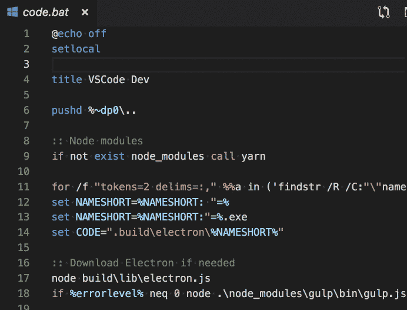

# 软件开发人员的 10 大 VS 代码扩展

> 原文：<https://levelup.gitconnected.com/top-10-vs-code-extensions-for-software-developers-9c3a807c6656>

潘卡杰·帕特尔在 [Unsplash](https://unsplash.com?utm_source=medium&utm_medium=referral) 上的照片

V **isual Studio Code** 是微软为 Windows、Linux、macOS 开发的文本编辑器。它包括对调试、嵌入式 Git 控件和 GitHub、语法高亮、智能代码完成、代码片段和代码重构的支持。

Visual Studio 代码中包含的现成功能仅仅是个开始。 **VS 代码扩展**允许您向您的安装添加语言、调试器和工具，以支持您的开发工作流。VS 代码丰富的可扩展性模型允许扩展作者直接插入 VS 代码 UI，并通过 VS 代码使用的相同 API 贡献功能。

**以下是我认为每个软件开发人员都必须拥有的 10 大 VS 代码扩展:**

# 1.GitLens — Git 增压

吉特朗斯

[GitLens](https://gitlens.amod.io) 是由 [Eric Amodio](https://www.amod.io) 创建的[开源](https://github.com/eamodio/vscode-gitlens)扩展。

GitLens 只是帮助你更好地理解代码。它允许您快速浏览一行或代码块被更改的人、原因和时间。清楚地了解代码是如何发展的。借助该扩展，可以轻松探索代码库的历史和演变。

GitLens 演示

对于那些为开源做贡献的人来说非常有用。该扩展还提供关于贡献者和贡献日期的信息。这是一个人可以拥有的终极 Git 扩展。要安装 GitLens 或了解更多信息，请访问[这里](https://marketplace.visualstudio.com/itemdetails?itemName=eamodio.gitlens)。

# 2.Visual Studio 智能代码

Visual Studio 智能代码

[Visual Studio intelli Code](https://go.microsoft.com/fwlink/?linkid=872679)扩展为 Visual Studio 代码中的 Python、TypeScript/JavaScript 和 Java 开发人员提供人工智能辅助开发功能，其洞察力基于对代码上下文的理解并结合了机器学习。

该扩展通过在完成列表的顶部显示为您的代码上下文推荐的完成项目来提供人工智能辅助的智能感知。下面的例子展示了 Python 代码的实际应用。

Visual Studio Intellicode Python 演示

这基本上是 VS 代码的 **Visual Studio Intellisense** 端口。特定于语言的 intellisense 也是可用的，但是该扩展与这种特定于语言的扩展相结合并与之交互，以使自动完成更有效。要了解更多信息，请访问[这里](https://marketplace.visualstudio.com/items?itemName=VisualStudioExptTeam.vscodeintellicode)。

# 3.vs code-数据库

vs code-数据库

这个扩展提供了对各种数据库服务客户端的支持，比如 SQL、PostgresQL、SSL、socked-SQL 等等。

为了*调试*的目的，我们有时会在编辑器和数据库客户端之间切换。这个扩展为你省去了痛苦。在这个扩展的帮助下，您可以打开一个编辑器选项卡来执行 SQL 查询，并在该选项卡中查看结果。它会自动检测系统路径上可用的已安装数据库。您也可以直接从编辑器中编辑这些值，它将保存在数据库中。

连接演示

在上面的演示中，您可以看到建立一个新的数据库连接非常直观和容易。

查询演示

这演示了与数据库连接和交互的过程。这个扩展也可以用来连接远程数据库。要安装或了解更多信息，请点击[链接](https://marketplace.visualstudio.com/items?itemName=bajdzis.vscode-database)。

# 4.TL；佩奇博士

这个扩展为 bash/dockerfiles/powershell 文件中的常见命令提供了 [tldr](https://github.com/tldr-pages/tldr/) 悬停信息。tldr 页面是一组简化的、由社区驱动的手册页面。**TL；**博士代表*“太长；没看"*。它起源于网络俚语，用来表示一篇长文章(或其一部分)因太长而被跳过。

下面是一些它的用法的例子:

## 外壳脚本:

## Dockerfile:

## 批处理文件:

要安装该扩展并了解更多信息，请访问此处的。

# 5.彩虹括号

为圆括号、方括号和曲线括号提供彩虹色。这对 Lisp 或 Clojure 程序员特别有用，当然还有 JavaScript 和其他程序员。

孤立的右括号将以红色突出显示。有时，由于缺少括号对或缺少右括号，我们的代码编译时会出现错误或 bug。这个扩展提供了视觉反馈，允许程序员下意识地在代码中以正确的括号数结束。

下面是它如何工作的截图:

这也让你的代码看起来丰富多彩；).有关如何安装的更多信息，请访问此[链接](https://marketplace.visualstudio.com/items?itemName=2gua.rainbow-brackets)。

# 6.路径智能感知

这个 Visual Studio 代码插件**自动完成文件名**。顾名思义，它可以帮助您自动完成文件路径。

对于我们大多数软件开发人员来说，这是一个简单而强大的工具，因为它不仅可以索引工作目录，还可以索引远程驱动器。对于那些倾向于将代码库分成多个模块的开发人员来说，这非常有用。这对 web 开发人员来说是一个巨大的帮助，因为它帮助他们轻松地将正确的 CSS 文件链接到正确的 HTML 文件。要了解更多关于这个扩展的信息，请访问这个[链接](https://marketplace.visualstudio.com/items?itemName=christian-kohler.path-intellisense)。

# 7.减价棉绒

Markdown 标记语言被设计成易于阅读、书写和理解。它成功了——它的灵活性既是优点也是缺点。许多样式都是可能的，因此格式可能不一致。有些结构并不是在所有的解析器中都工作良好，应该避免使用。例如，[这里有一些常见/麻烦的降价结构](https://gist.github.com/DavidAnson/006a6c2a2d9d7b21b025)。

[markdownlint](https://marketplace.visualstudio.com/items?itemName=DavidAnson.vscode-markdownlint) 是一个 Visual Studio 代码扩展，它包括一个规则库，以鼓励 Markdown 文件的标准和一致性。它由 Node.js 的 [markdownlint 提供支持，后者基于 Ruby](https://github.com/DavidAnson/markdownlint) 的 [markdownlint。它还提供了一个 markdown 预览器，在它的帮助下，您可以直接从编辑器中预览 README.md 文件。](https://github.com/mivok/markdownlint)

在安装了 markdownlint 的代码中编辑 markdownlint 文件时，任何违反 markdownlint 规则之一的行都会在编辑器中触发*警告*。单击对话框中的一个警告将在默认的 web 浏览器中显示该规则的帮助条目。欲了解更多信息，请访问此[链接](https://marketplace.visualstudio.com/items?itemName=DavidAnson.vscode-markdownlint)。

# 8.较美丽

[漂亮的](https://prettier.io/)是一个固执己见的代码格式化程序。它通过解析您的代码并根据自己的规则(考虑到最大行长度，必要时换行)重新打印代码来强制执行一致的风格。

当你使用漂亮器的本地解析版本时，这个扩展支持[漂亮器插件](https://prettier.io/docs/en/plugins.html)。如果你在`package.json`中注册了 Prettier 和一个插件，这个扩展将尝试注册语言，并为内置语言和插件语言提供自动代码格式化。要安装，请访问此处的。

# 9.代码运行程序

运行多种语言的代码片段或代码文件: **C，C++，Java，JavaScript，PHP，Python，Perl，Perl 6，Ruby，Go，Lua，Groovy，PowerShell，BAT/CMD，BASH/SH，F# Script，F#(。NET 核心)、C#脚本、C#(。NET Core)、VBScript、TypeScript、CoffeeScript、Scala、Swift、Julia、Crystal、OCaml Script、R、AppleScript、Elixir、Visual Basic。NET，Clojure，Haxe，Objective-C，Rust，Racket，Scheme，AutoHotkey，AutoIt，Kotlin，Dart，Free Pascal，Haskell，Nim，D，Lisp，Kit，V** ，自定义命令。

要了解更多信息，请访问此[链接](https://marketplace.visualstudio.com/items?itemName=formulahendry.code-runner)。

# 10.Visual Studio 代码远程— WSL

**Remote—WSL extension**extension 允许您使用[Windows Subsystem for Linux(WSL)](https://docs.microsoft.com/en-us/windows/wsl)作为您的全职开发环境，直接从 VS 代码开始。这一新的优化支持使您能够:

*   使用 Windows 在基于 Linux 的环境中开发，使用 Linux 特定的工具链和实用程序。
*   编辑位于 WSL 或挂载的 Windows 文件系统中的文件(例如`/mnt/c`)。
*   用 VS 代码在 Windows 上运行和调试基于 Linux 的应用程序。

remote——WSL 直接在 WSL 中运行命令和扩展，因此您不必担心路径问题、二进制兼容性或其他跨操作系统的挑战。您可以像在 Windows 中一样在 WSL 中使用 VS 代码。

欲了解更多信息，请访问此[链接](https://marketplace.visualstudio.com/items?itemName=ms-vscode-remote.remote-wsl)。

> 上面提到的扩展没有任何特定的顺序。这些扩展中的每一个都以自己的方式出类拔萃。

感谢您的阅读，祝您愉快！！