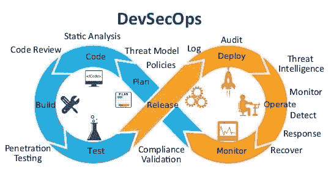
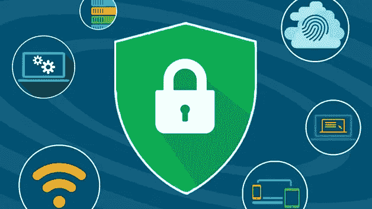
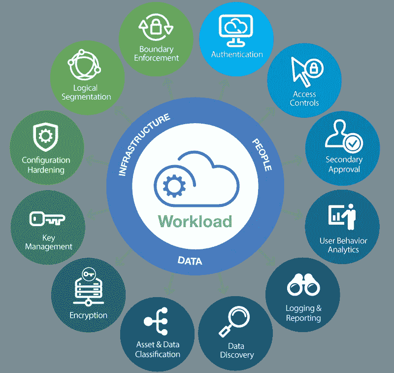
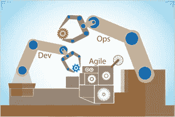

# 企业 CI/CD 渠道的 15 大开发工具

> 原文：<https://levelup.gitconnected.com/top-15-devsecops-tools-for-an-enterprise-ci-cd-pipeline-bd865b47ed5f>

## 通过集成这些同类最佳的 DevSecOps 工具，提升您的 CI/CD 渠道

来源:[https://media-exp1 . licdn . com/DMS/image/C4 d 12 aqgsuirxmnae 5g/article-cover _ image-shrink _ 600 _ 2000/0？e = 1587600000&v = beta&t = afqnghh 9 dxuxx 5 zgnsexicq 3 D1 xno 6 fjcyktvthrzrc](https://media-exp1.licdn.com/dms/image/C4D12AQGsUiRxmNAE5g/article-cover_image-shrink_600_2000/0?e=1587600000&v=beta&t=AFqNGHh9dxUxX5zGNSeXicQ3D1xNO6fjCyKtVThrzrc)

您可以在 CI/CD 渠道中使用如此多不同的工具，很难确定哪些工具应该使用，哪些应该搁置。这个汇编的列表是可以考虑集成到您的 CI/CD 管道中的 15 个顶级工具，以使其为企业做好准备！

## 安全分析工具

来源:[https://www . Cisco . com/c/en/us/products/security/what-is-it-security/_ JCR _ content/Grid/category _ atl _ 42d 8/layout-category-atl/anchor _ info _ 670 b/image . img . jpg/1575361669908 . jpg](https://www.cisco.com/c/en/us/products/security/what-is-it-security/_jcr_content/Grid/category_atl_42d8/layout-category-atl/anchor_info_670b/image.img.jpg/1575361669908.jpg)

**声纳**
OWASP [声纳](https://www.sonarqube.org/)进行扫码。OWASP / SANS 安全报告。专用报告可让您根据已知的标准 OWASP 和 SANS 类别跟踪应用程序安全性。

**设防 Webinspect**
[设防 Web inspect](https://www.microfocus.com/en-us/products/webinspect-dynamic-analysis-dast/overview) 进行动态应用安全测试(DAST)。Fortify WebInspect 动态应用程序安全测试(DAST)软件可发现 web 应用程序中可利用的漏洞并确定其优先级。

**Fortify Application Defender**
[Fortify Application Defender](https://www.microfocus.com/media/data-sheet/security_fortify_application_defender_ds.pdf)用于运行时应用安全测试(RAST)。Fortify Application Defender 运行时应用程序自我保护(RASP)保护生产应用程序免受常见攻击和漏洞。

[**check Marx**](https://www.checkmarx.com/)
灵活准确的安全解决方案，能够识别数百个漏洞。支持超过 22 种编码和脚本语言和框架。

## 集装箱安全

来源:[https://code fresh . io/WP-content/uploads/2017/01/The-State-of-Container-Security-blog-1024 x268 . jpg](https://codefresh.io/wp-content/uploads/2017/01/The-State-of-Container-Security-blog-1024x268.jpg)

[**扭锁**](https://www.twistlock.com/)
理解并实现 Docker 的安全方面。在整个 DevSecOps 生命周期中保护主机、容器和无服务器。超过 35%的财富 100 强企业信任 Twistlock，它是世界上第一个真正全面的云原生安全平台，在单个平台中提供跨主机、容器和无服务器计算的全面覆盖。

**公证人**
了解并实施 Kubernetes 的安全方面。[公证](https://docs.docker.com/notary/getting_started/)是 Docker 安全供应链方法中的一个核心部分，通过它，安全性可以无缝统一地嵌入到从开发到运营的工作流程中。公证人是一个用 Go 编写的更新框架(TUF)的实现。

[**Aqua Security**](https://www.aquasec.com/) Kubernetes、Docker、OpenShift、Fargate、Lambda、AWS &其他容器平台上的完整开发到生产容器安全解决方案。

## 云安全

来源:https://www.hytrust.com/uploads/Asset-71-1.png

**云上 AppScan**
[云上 AppScan](https://www.hcltechsw.com/products/appscan/offerings/asoc)提供了一套安全测试工具，包括针对 web、移动和开源软件的静态、动态和交互测试。它检测普遍存在的安全漏洞并促进补救。

[**AWS 安全服务**](https://aws.amazon.com/products/security/) 了解和实现 AWS 云的安全方面。AWS 上的安全性、身份和合规性。… AWS 数据保护服务提供加密、密钥管理和威胁检测，可持续监控和保护您的帐户和工作负载。AWS 身份服务使您能够安全地大规模管理身份、资源和权限。

**threat modeler**
[threat modeler 云版](https://threatmodeler.com/cloud-edition/)自动构建云基础设施的威胁模型，管理 AWS 和 Azure 环境的潜在威胁。我们开箱即用的云安全解决方案让您了解组织的整个攻击面，并使企业能够更有效地管理风险。

[**趋势科技云安全一号**](https://www.trendmicro.com/en_us/business/products/hybrid-cloud/cloud-one-workload-security.html)
检测和保护构建在您的容器、无服务器和其他计算平台上的现代应用程序和 API。

## 监视

来源:[https://miro . medium . com/max/2560/1 * smygyw5 djjhw 5 js 33 jut bw . png](https://miro.medium.com/max/2560/1*sMYGYw5DjjhW5js33jUTBw.png)

[**new relic**](https://newrelic.com/)
理解并实现 Java 虚拟机的安全方面。云安全社区的领导者在云安全联盟、OWASP、RSA 和 IAPP 发表演讲。

**麋鹿与基巴纳**
[麋鹿与基巴纳](https://www.elastic.co/what-is/elk-stack)进行安全威胁日志分析。“ELK”是三个开源项目的缩写:Elasticsearch、Logstash 和 Kibana。Elasticsearch 是一个搜索和分析引擎。… Kibana 允许用户在 Elasticsearch 中使用图表和图形来可视化数据。弹性堆栈是 ELK 堆栈的下一个发展。

## 其他工具

来源:[https://www . eginnovations . com/blog/WP-content/uploads/2019/10/top-devo PS-tools-list . png](https://www.eginnovations.com/blog/wp-content/uploads/2019/10/top-devops-tools-list.png)

Chef InSpec
[Chef InSpec](https://www.chef.io/products/chef-inspec/)用于扫描您的应用程序和基础架构。Chef InSpec 是一个开源(OSS)自动化测试工具，用于集成、合规性、安全性和其他策略需求。

**hashi corp Vault**
[hashi corp Vault](https://www.vaultproject.io/)用于证书、API 密钥或密码的安全工具。使用 UI、CLI 或 HTTP API 保护、存储和严格控制对令牌、密码、证书和加密密钥的访问，以保护机密和其他敏感数据。

## 结论

在您的 CI/CD 渠道中有许多不同的工具可以利用。这只是众多可用列表中的一小部分。对于喜欢采用同类最佳方法的企业来说，这种抽样可以帮助精简潜在列表。工具和您的管道最重要的方面就是确保它完全集成和自动化，这样可以增加可靠性，而不会产生额外过程的人工开销。