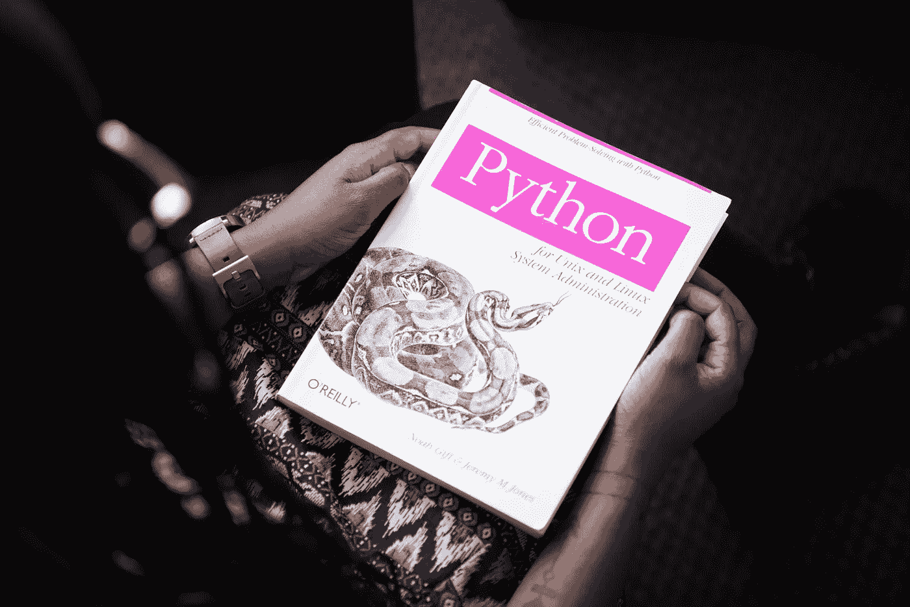

# 前 20 个机器学习算法，每个用不到 10 秒钟解释

> 原文：<https://levelup.gitconnected.com/top-20-machine-learning-algorithms-explained-in-less-than-10-seconds-each-8fd728f70b19>

对 20 个最重要的机器学习算法的简单解释，每个都在 10 秒内完成。

来自 Pexels 的 Mike B

机器学习是一种数据分析方法，可以自动执行模型开发过程。它是人工智能的一个分支，基于这样的想法，即系统可以从数据中学习，识别模式，并在最少的用户干预下做出决策[2]。

机器学习算法被用于各种各样的应用，包括电子邮件过滤、检测欺诈性信用卡交易、股票交易、计算机视觉、语音识别等等。

机器学习主要有三种类型:监督学习、非监督学习和强化学习。

监督学习是数据被标记，算法学习预测标签的地方。例如，在猫和狗的图像数据集中，标签应该是“猫”和“狗”该算法将学习识别哪些图像包含猫，哪些包含狗。

来自 Unsplash 的克里斯蒂娜@ wocintechchat.com

无监督学习是指数据没有被标记，算法试图在数据中找到模式。例如，在动物图像的数据集中，算法可能会将猫、狗和狮子的图像归为“动物”

强化学习是算法通过试错来学习。例如，强化学习算法的任务可能是在迷宫中导航。该算法会在迷宫中尝试不同的路径，直到找到通往出口的最短路径。

我不会花时间分解这三种类型的机器学习模型，而是将描述限制在特定的算法和实现上——其中有 20 个。我发现它们是当今机器学习用例中最重要的前 20 个。

# **下面列出的任何算法的例子都是一个例子，并不意味着是代表该算法能够或能够实现的唯一例子。**

1.线性回归:一种基于已知数据进行预测的方法。例如，你可以使用线性回归，根据你过去赚了多少钱来预测你将来会赚多少钱。你的财产可能值多少钱？

2.逻辑回归:一种用于预测事件发生概率的统计分析。这是一种因变量为二元(0 或 1，是或否)时使用的分析类型。

3.支持向量机:一种可以从示例中学习并进行预测的模型。它常用于将事物分类成组。

决策树。来自 Unsplash 的克里斯蒂娜@ wocintechchat.com

4.决策树:一种通过揭示可能的选项来帮助你做决定的方法。您可以通过查看显示的内容来选择首选选项。

5.随机森林:用它来预测事情。它通过观察一系列不同的场景来工作，这些场景可能会影响你试图预测的事情；然后，它根据所学的知识进行猜测。

6.梯度推进(Gradient Boosting):一种结合多个较弱模型来创建一个较强模型的技术。使用梯度下降算法开发较弱的模型，并且最终模型是所有较弱(比较)模型的加权组合。

7.神经网络:一种机器学习算法，用于对数据中的复杂模式进行建模。神经网络就像其他机器学习算法一样，但它们由大量相互连接的处理节点或神经元组成，这些节点或神经元可以学习识别输入数据的模式。

8.主成分分析(PCA):一种用于发现数据模式的技术。它查看数据，并找到数据变化最大的方向。

来自 Unsplash 的克里斯蒂娜@ wocintechchat.com

9.线性判别分析:一种机器学习技术，有助于识别对预测目标变量最重要的一组变量(特征)。LDA 是一种分析数据的方法，可以用来预测行动的结果。它用于确定数据中不同值之间的关系，然后使用这些关系来预测未来。

10.K-Means 聚类:机器学习中使用的一种技术，用于将数据分组在一起，以便数据更有可能彼此相关。这是一种帮助数据点组(例如，数据库中的项目)的方法，方法是找到它们最接近的对应物并将它们分组在一起。

11.分层聚类是一种将数据项分组在一起以便于理解的方法。它的工作原理是将数据分组，然后查看各组之间的关系。这是一种将数据点按层次结构分组的方法。该算法从自己组中的每个数据点开始，然后合并最接近的组，直到只剩下一个组。

12.DBSCAN:一种可用于将数据点聚集在一起的算法。它的工作原理是查看数据点的密度，如果它们靠得很近，就将它们分组。

13.高斯混合模型:它混合使用线性和非线性模型来预测结果。它是一种机器学习模型，有助于预测一组对象的行为。该模型接受一组输入数据点，并使用它来预测一组新的输入数据点的行为。

14.自动编码器:一种机器学习算法，可以学习从一组输入数据中解码或重建符号序列。这是一种用于学习如何压缩数据的神经网络。目标是学习比原始数据更小的数据的表示(编码)[3](同时仍然包含所有重要信息)。

由 Pexels 的[this is 工程](https://www.pexels.com/@thisisengineering/)

15.隔离林:用它来检测数据中的异常值。它通过随机选择数据点并创建决策树来工作。如果该点是一个异常值，那么从其余数据中分离出来会更容易。

16.一类 SVM:像隔离森林方法一样，这可用于查找异常值:查找异常值的评估是创建一条线，最好将数据分成两组。任何远离这条线的数据点都被认为是异常值。

17.局部线性嵌入:一种用于降低数据维数的技术。这是通过找到接近原始数据的数据的线性表示来实现的。这是一种将数据集表示为空间点序列的方式。这样，您可以更容易地看到数据点之间的关系，并做出更好的预测。

18.t-SNE [1]:通过降低数据的维度来帮助可视化数据。t-SNE 的工作原理是创建数据点的地图，然后找到在低维空间中表示这些点的最佳方式。

19.独立成分分析(ICA):用于发现数据中隐藏的模式。它通过查看数据中不同变量之间的关系来做到这一点。这是一种分离混合信号不同部分的技术。

20.因子分析:用于减少需要分析以发现模式的数据量。它通过识别具有相似行为的数据元素组来做到这一点。此外，它还用于减少需要分析以揭示模式的数据量；它通过识别具有相似行为的数据元素组来实现这一点。实际上，这是一种用来理解数据集的哪些特征对于预测结果至关重要的方法。

如果您有任何编辑/修改建议或关于进一步扩展此主题的建议，请考虑与我分享您的想法。

# **另外，请考虑订阅我的每周简讯:**

 [## 周日报告#1

### 设计思维与 AI 的共生关系设计思维能向 AI 揭示什么，AI 又能如何拥抱…

pventures.substack.com](https://pventures.substack.com/) 

# **我写了以下与这篇文章相关的内容；您可能对它们感兴趣:**

# 6 个用于情感分析的开源 NLP 模型；一个在顶端升起

 [## 16 个用于情感分析的开源 NLP 模型；一个在顶端升起

### 介绍 16 款车型，深入了解风格。

pub.towardsai.net](https://pub.towardsai.net/16-open-source-nlp-models-for-sentiment-analysis-one-rises-on-top-b5867e247116) 

# NLP 的未来是量子物理学

 [## NLP 的未来是量子物理学

### 但是，它已经在这里了。

pub.towardsai.net](https://pub.towardsai.net/the-future-of-nlp-is-quantum-physics-37e3673e82bc) 

# 监督学习:31 个最重要的模型:5 是必须学习的

 [## 监督学习:31 个最重要的模型:5 是必须学习的

### 我概述了 31 个关键的监督学习模型，并揭示了必须学习的前 5 个模型。

pub.towardsai.net](https://pub.towardsai.net/supervised-learning-31-of-the-most-important-models-5-are-a-must-learn-9c62444905fa) 

*参考文献。*

*1。Sklearn.manifold.TSNE .(未标明)。sci kit-学习。2022 年 7 月 20 日检索，来自*[*https://sci kit-learn . org/stable/modules/generated/sk learn . manifold . tsne . html*](https://scikit-learn.org/stable/modules/generated/sklearn.manifold.TSNE.html)

*2。机器学习:它是什么，为什么重要。*[*https://www . SAS . com/en _ us/insights/analytics/machine-learning . html*](https://www.sas.com/en_us/insights/analytics/machine-learning.html)

*3。1.4 模型拟合和模型学习— Vilniaus universitetas。*[*http://web . vu . lt/MIF/a . buteikis/WP-content/uploads/PE _ II _ Book/1-4-learning-algorithms . html*](http://web.vu.lt/mif/a.buteikis/wp-content/uploads/PE_II_Book/1-4-learning-algorithms.html)

# 分级编码

感谢您成为我们社区的一员！在你离开之前:

*   👏为故事鼓掌，跟着作者走👉
*   📰查看[升级编码出版物](https://levelup.gitconnected.com/?utm_source=pub&utm_medium=post)中的更多内容
*   🔔关注我们:[Twitter](https://twitter.com/gitconnected)|[LinkedIn](https://www.linkedin.com/company/gitconnected)|[时事通讯](https://newsletter.levelup.dev)

🚀👉 [**加入升级人才集体，找到一份惊艳的工作**](https://jobs.levelup.dev/talent/welcome?referral=true)