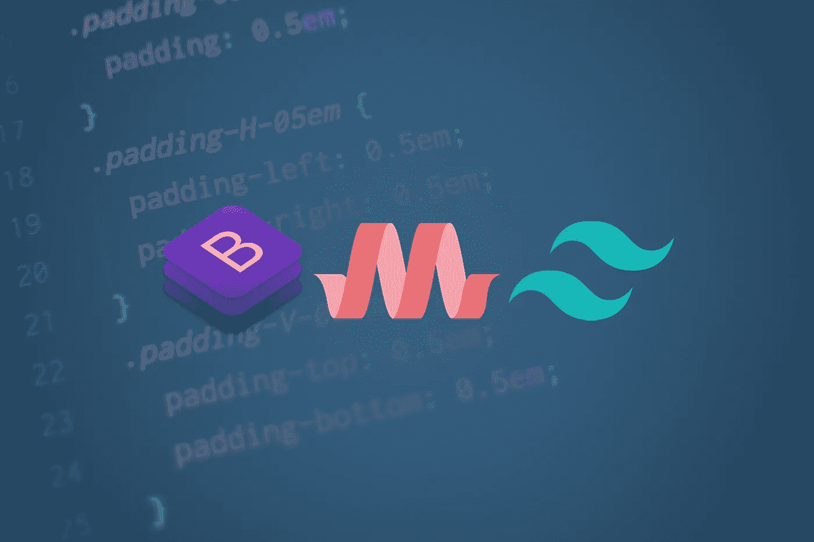
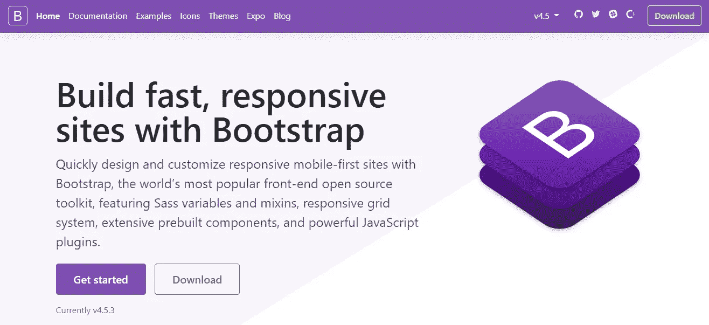
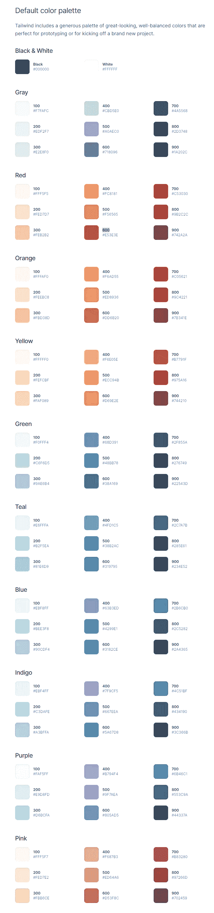

# 前端开发的三大 CSS 框架

> 原文：<https://levelup.gitconnected.com/top-3-css-frameworks-for-front-end-development-bc88aeb60ff1>



# **什么是 CSS web 框架？**

CSS 框架是一个库，为 web 开发人员提供预构建的 CSS 声明和自定义类属性。

## **CSS 框架有什么好处？**

CSS 框架的主要好处是通过以下方式实现快速 web 开发:

*   响应式设计
*   对称布局
*   预建的类属性

框架通过在适应不同观点的网格系统上运行，简化了响应式 web 设计。

自定义工具可以快速更改元素的颜色、填充和边距。

预先制作的组件，如表格、按钮、卡片和表单，可以从文档中复制和粘贴。

## 如何使用 CSS 框架？

许多 CSS 框架是免费开源的，可以直接下载到项目目录中，或者通过 CDN 添加。

本文中使用 cdn 来鼓励快速的 web 开发。

如果您想要自定义 CSS 框架并覆盖 CSS、SCSS 和/或 JS 文件，请将框架下载到您的项目中。

## **前 3 名的 CSS 框架包括哪些？**

*   [自举](https://www.ordinarycoders.com/blog/article/top-3-css-frameworks#bootstrap-css)
*   [物化](https://www.ordinarycoders.com/blog/article/top-3-css-frameworks#materialize-css)
*   [尾翼 CSS](https://www.ordinarycoders.com/blog/article/top-3-css-frameworks#tailwind-css)

选择这三个框架是基于它们的受欢迎程度和易用性。

如果你认为应该添加另一个 CSS 框架，请在下面留下评论。

# **自举**

*版本— 4.5.3*



Bootstrap 是一个免费的开源 CSS 框架，采用移动优先组件。

这是最流行的 CSS web 框架之一，如果不是最流行的话。

## **如何使用引导程序—入门**

[下载 Bootstrap](https://getbootstrap.com/docs/4.5/getting-started/download/) 或添加他们的小型 cdn，以访问他们的实用程序和定制组件。

自举 cdn:

1.  简化的引导 CSS 链接
2.  缩小的 jQuery 脚本
3.  缩小的 Popper.js 脚本
4.  简化的引导 JS 脚本

*带有 Bootstrap CSS、jQuery、Popper.js、Bootstrap JS 的 HTML 模板*

```
<!doctype html>
<html lang="en">
  <head>
    <!-- Required meta tags -->
    <meta charset="utf-8">
    <meta name="viewport" content="width=device-width, initial-scale=1"> <!-- Bootstrap CSS -->
    <link rel="stylesheet" href="https://cdn.jsdelivr.net/npm/bootstrap@4.5.3/dist/css/bootstrap.min.css" integrity="sha384-TX8t27EcRE3e/ihU7zmQxVncDAy5uIKz4rEkgIXeMed4M0jlfIDPvg6uqKI2xXr2" crossorigin="anonymous"> <title>Bootstrap CDNs - Get Started</title>
  </head>
  <body>
    <h1>Bootstrap CSS Framework</h1> <!-- jQuery and Popper.js -->
    <script src="https://code.jquery.com/jquery-3.5.1.slim.min.js" integrity="sha384-DfXdz2htPH0lsSSs5nCTpuj/zy4C+OGpamoFVy38MVBnE+IbbVYUew+OrCXaRkfj" crossorigin="anonymous"></script>
    <script src="https://cdn.jsdelivr.net/npm/popper.js@1.16.1/dist/umd/popper.min.js" integrity="sha384-9/reFTGAW83EW2RDu2S0VKaIzap3H66lZH81PoYlFhbGU+6BZp6G7niu735Sk7lN" crossorigin="anonymous"></script> <!-- Bootstrap JS -->
    <script src="https://cdn.jsdelivr.net/npm/bootstrap@4.5.3/dist/js/bootstrap.min.js" integrity="sha384-w1Q4orYjBQndcko6MimVbzY0tgp4pWB4lZ7lr30WKz0vr/aWKhXdBNmNb5D92v7s" crossorigin="anonymous"></script>
  </body>
</html>
```

要使用 Bootstrap 的 CDN，将缩小的 Bootstrap CSS 作为`<link>`添加到`<head>`中。这是唯一需要的 CDN。

在结束的`</body>`标记之前，依次添加 jQuery、Popper.js 和 Bootstrap JS 脚本，以使用响应组件，如 navbar、collapse 和 dropdown 组件。

## **如何使用引导默认颜色**

*HTML 模板—引导颜色*

```
<!--Bootstrap Colors-->
    <div>
      <p class="text-primary">Blue</p>
      <p class="bg-primary">Blue Background</p> <p class="text-success">Green</p>
      <p class="bg-success">Green Background</p> <p class="text-danger">Red</p>
      <p class="bg-danger">Red Background</p>
    </div>
```

八种默认[引导颜色](https://getbootstrap.com/docs/4.5/utilities/colors/)为任何组件分配背景颜色和文本颜色。

文本颜色格式:

`text-{ Bootstrap color }`

背景颜色格式:

`bg-{ Bootstrap color }`

*自举色作为背景色*


## **如何使用引导填充和边距**

*HTML 模板—引导填充和边距*

```
<!--Bootstrap Padding and Margins-->
    <div class="m-5 p-3">
      <h1>Bootstrap CSS Framework</h1>
    </div>
```

Bootstrap 附带了 [padding 和 margin](https://getbootstrap.com/docs/4.5/layout/utilities-for-layout/) utility 类属性值来设置元素的间距和大小。

间距格式:

`{ property }{ sides }-{ size }`

## **如何使用引导容器**

*HTML 模板—引导容器*

```
<!--Bootstrap Container-->
    <div class="container">
      <h1>Bootstrap CSS Framework</h1>
    </div> <!--Bootstrap Container-fluid-->
    <div class="container-fluid">
      <h1>Bootstrap CSS Framework</h1>
    </div>
```

使用默认的引导网格系统需要引导容器。

响应框在不同的视点自动改变宽度，引导`container`有预先确定的`padding:15px`和响应边距。

另一方面，自举`container-fluid`设置`width:100%`。

每个组件都应该放在一个容器中，以最大限度地提高响应度。

## **如何使用引导行和引导列**

*HTML 模板—引导行和引导列*

```
<!--Bootstrap Rows and Columns-->
    <div class="container p-4">
      <div class="row">
        <div class="col-lg-6 col-md-12">
          <h1>Column 1</h1>
          <p>Supporting paragraph text that will appear in the first column.</p>
        </div>
        <div class="col-lg-6 col-md-12">
          <h1>Column 2</h1>
          <p>Supporting paragraph text that will appear in the second column.</p>
        </div>
      </div>
    </div>
```

自举建立在 [12 列网格系统](https://getbootstrap.com/docs/4.5/layout/grid/)上。

使用类属性值`col`创建列。

通过添加视点大小，后跟直接列宽，为列分配断点。

列断点格式:

`col-{ breakpoint }-{column size}`

## **如何使用自举导航条**

*HTML 模板—带下拉菜单和折叠功能的引导灯导航条*

```
<!--Bootstrap Navbar-->
    <nav class="navbar navbar-expand-lg navbar-light bg-light">
      <a class="navbar-brand" href="#">
        
        Bootstrap
      </a>
      <button class="navbar-toggler" type="button" data-toggle="collapse" data-target="#navbarSupportedContent" aria-controls="navbarSupportedContent" aria-expanded="false" aria-label="Toggle navigation">
        <span class="navbar-toggler-icon"></span>
      </button> <div class="collapse navbar-collapse" id="navbarSupportedContent">
        <ul class="navbar-nav mr-auto">
          <li class="nav-item active">
            <a class="nav-link" href="#">Home <span class="sr-only">(current)</span></a>
          </li>
          <li class="nav-item">
            <a class="nav-link" href="#">Link</a>
          </li>
          <li class="nav-item dropdown">
            <a class="nav-link dropdown-toggle" href="#" id="navbarDropdown" role="button" data-toggle="dropdown" aria-haspopup="true" aria-expanded="false">
              Dropdown
            </a>
            <div class="dropdown-menu" aria-labelledby="navbarDropdown">
              <a class="dropdown-item" href="#">Action</a>
              <a class="dropdown-item" href="#">Another action</a>
              <div class="dropdown-divider"></div>
              <a class="dropdown-item" href="#">Something else here</a>
            </div>
          </li>
          <li class="nav-item">
            <a class="nav-link disabled" href="#" tabindex="-1" aria-disabled="true">Disabled</a>
          </li>
        </ul>
        <ul class="navbar-nav ml-auto">
          <li class="nav-item active">
            <a class="btn btn-outline-primary my-2 my-sm-0">Login</a>
          </li>
        </ul>
      </div>
    </nav>
```

[引导导航条](https://getbootstrap.com/docs/4.5/components/navbar/)是一个响应式组件，设计用于在更小的视点中折叠。

确保添加三个必要的 JavaScript CDNs 以使其正常工作。

*自举导航条*


## **如何使用自举卡**

*HTML 模板—引导网格卡*

```
<!--Bootstrap Cards-->
    <div class="container py-4">
      <div class="row row-cols-sm-1 row-cols-md-2 row-cols-lg-4">
        <div class="col mb-4">
          <div class="card h-100">
            <div class="card-body">
              <h5 class="card-title">Card title</h5>
              <p class="card-text">This is a longer card with supporting text below as a natural lead-in to additional content. This content is a little bit longer.</p>
            </div>
          </div>
        </div>
        <div class="col mb-4">
          <div class="card h-100">
            <div class="card-body">
              <h5 class="card-title">Card title</h5>
              <p class="card-text">This is a longer card with supporting text below as a natural lead-in to additional content. This content is a little bit longer.</p>
            </div>
          </div>
        </div>
        <div class="col mb-4">
          <div class="card h-100">
            <div class="card-body">
              <h5 class="card-title">Card title</h5>
              <p class="card-text">This is a longer card with supporting text below as a natural lead-in to additional content.</p>
            </div>
          </div>
        </div>
        <div class="col mb-4">
          <div class="card h-100">
            <div class="card-body">
              <h5 class="card-title">Card title</h5>
              <p class="card-text">This is a longer card with supporting text below as a natural lead-in to additional content. This content is a little bit longer.</p>
            </div>
          </div>
        </div>
      </div>
    </div>
```

[引导卡](https://getbootstrap.com/docs/4.5/components/card/)是使用`card`类构建的，使用起来非常简单。

通常，卡片被放置在 Bootstrap 的响应行和响应列中。

Bootstrap 4.5 附带了`row-cols`类，通过基于期望的视点给每个卡分配相同数量的列，来最小化代码重复。

行列格式:

`row-cols-{ breakpoint }-{ column size }`

*自举卡*


## **如何使用引导按钮**

*HTML 模板—引导按钮*

```
<!--Bootstrap Buttons-->
    <div class="container p-4">
      <a href="#" class="btn btn-primary">Button</a>
      <a href="#" class="btn btn-outline-primary">Outline Button</a>
      <a href="#" class="btn btn-primary btn-lg">Large Button</a>
      <a href="#" class="btn btn-primary btn-sm">Small Button</a>
      <a href="#" class="btn btn-primary btn-block">Block Button</a>
    </div>
```

引导按钮有一个自定义的类属性值`btn`，并且需要一个颜色分配。

*自举按钮*


## **如何使用 Bootstrap 表单**

*HTML 模板—引导表单字段*

```
<!--Bootstrap Form-->
    <div class="container">
      <form>
        <div class="form-row">
          <div class="form-group col-md-6">
            <label for="inputFirstName">First Name</label>
            <input type="text" class="form-control" id="inputFirstName">
          </div>
          <div class="form-group col-md-6">
            <label for="inputLastName">Last Name</label>
            <input type="text" class="form-control" id="inputLastName">
          </div>
        </div>
        <div class="form-group">
          <label for="exampleFormControlSelect1">Select</label>
          <select class="form-control" id="exampleFormControlSelect1">
            <option>1</option>
            <option>2</option>
            <option>3</option>
            <option>4</option>
            <option>5</option>
          </select>
        </div>
        <div class="form-group">
          <label for="inputEmail">Email</label>
          <input type="text" class="form-control" id="inputEmail">
        </div>
        <div class="form-group">
          <label for="inputMessage">Message</label>
          <textarea class="form-control" id="inputMessage"></textarea>
        </div>
        <div class="form-group">
          <div class="form-check">
            <input class="form-check-input" type="checkbox" id="gridCheck" checked>
            <label class="form-check-label" for="gridCheck">
              I agree to the Privacy Policy and Terms and Conditions of this site.
            </label>
          </div>
        </div>
        <button type="submit" class="btn btn-outline-primary btn-block">Send Message</button>
      </form>
    </div>
```

[引导表单](https://getbootstrap.com/docs/4.5/components/forms/)为所有的基本表单域提供了一个干净的布局，包括文本区、选择和复选框。

*自举形式*


## **如何使用引导图标**

*HTML 模板—引导图标*

```
<!--Bootstrap Icons-->
    <div class="container py-4">
      <!--Alarm icon-->
      <svg width="3em" height="3em" viewBox="0 0 16 16" class="bi bi-alarm-fill text-primary" fill="currentColor" >
        <path fill-rule="evenodd" d="M6 .5a.5.5 0 0 1 .5-.5h3a.5.5 0 0 1 0 1H9v1.07a7.001 7.001 0 0 1 3.274 12.474l.601.602a.5.5 0 0 1-.707.708l-.746-.746A6.97 6.97 0 0 1 8 16a6.97 6.97 0 0 1-3.422-.892l-.746.746a.5.5 0 0 1-.707-.708l.602-.602A7.001 7.001 0 0 1 7 2.07V1h-.5A.5.5 0 0 1 6 .5zM.86 5.387A2.5 2.5 0 1 1 4.387 1.86 8.035 8.035 0 0 0 .86 5.387zM11.613 1.86a2.5 2.5 0 1 1 3.527 3.527 8.035 8.035 0 0 0-3.527-3.527zM8.5 5.5a.5.5 0 0 0-1 0v3.362l-1.429 2.38a.5.5 0 1 0 .858.515l1.5-2.5A.5.5 0 0 0 8.5 9V5.5z"/>
      </svg> <!--Archive icon-->
      <svg width="3em" height="3em" viewBox="0 0 16 16" class="bi bi-archive-fill text-success" fill="currentColor" >
        <path fill-rule="evenodd" d="M12.643 15C13.979 15 15 13.845 15 12.5V5H1v7.5C1 13.845 2.021 15 3.357 15h9.286zM5.5 7a.5.5 0 0 0 0 1h5a.5.5 0 0 0 0-1h-5zM.8 1a.8.8 0 0 0-.8.8V3a.8.8 0 0 0 .8.8h14.4A.8.8 0 0 0 16 3V1.8a.8.8 0 0 0-.8-.8H.8z"/>
      </svg> <!--Arrow icon-->
      <svg width="3em" height="3em" viewBox="0 0 16 16" class="bi bi-arrow-down-circle-fill text-danger" fill="currentColor" >
        <path fill-rule="evenodd" d="M16 8A8 8 0 1 1 0 8a8 8 0 0 1 16 0zM8.5 4.5a.5.5 0 0 0-1 0v5.793L5.354 8.146a.5.5 0 1 0-.708.708l3 3a.5.5 0 0 0 .708 0l3-3a.5.5 0 0 0-.708-.708L8.5 10.293V4.5z"/>
      </svg> </div>
```

[引导图标](https://icons.getbootstrap.com/)是易于定制的 SVG，可以添加到任何现有的引导组件中。

*引导图标*


# **物化**

*版本 1.0.0*


[Materialize](https://materializecss.com/) 是另一个免费使用、开源的响应式前端框架。

组件可响应地扩展，并且易于定制。

## **如何使用物化—入门**

[下载物化](https://materializecss.com/getting-started.html)或添加 cdn 以使用任何物化组件和 CSS。

物化 cdn:

1.  缩小的物化 CSS 链接
2.  物化图标链接
3.  缩小的 jQuery 脚本
4.  缩小的物化 JS 脚本

*带有 Materialize CSS、jQuery 和 Materialize JS 的 HTML 模板*

```
<!doctype html>
<html lang="en">
  <head>
    <!-- Required meta tags -->
    <meta charset="utf-8">
    <meta name="viewport" content="width=device-width, initial-scale=1"> <!-- Materialize CSS -->
     <link rel="stylesheet" href="https://cdnjs.cloudflare.com/ajax/libs/materialize/1.0.0/css/materialize.min.css"> <!-- Materialize Icons -->
    <link href="https://fonts.googleapis.com/icon?family=Material+Icons" rel="stylesheet"> <title>Materialize CDNs - Get Started</title>
  </head>
  <body>
    <h1>Materialize CSS Framework</h1> <!-- jQuery -->
    <script src="https://code.jquery.com/jquery-3.5.1.slim.min.js" integrity="sha384-DfXdz2htPH0lsSSs5nCTpuj/zy4C+OGpamoFVy38MVBnE+IbbVYUew+OrCXaRkfj" crossorigin="anonymous"></script> <!-- Materialize JS -->
    <script src="https://cdnjs.cloudflare.com/ajax/libs/materialize/1.0.0/js/materialize.min.js"></script>

  </body>
</html>
```

将物化 CSS `<link>`和物化图标`<link>`添加到`<head>`中，然后向下移动结束标签`</body>`并添加一个缩小的 jQuery 和物化 JS `<script>`。

## **如何使用物化默认颜色**

*HTML 模板—物化颜色*

```
<!--Materialize Colors-->
    <div>
      <p class="text-blue text-lighten-1">Light Blue</p>
      <p class="blue lighten-1">Light Blue Background</p> <p class="text-green text-darken2">Dark Green</p>
      <p class="green darken-2">Dark Green Background</p> <p class="text-red">Red</p>
      <p class="red">Red Background</p>
    </div>
```

[物化颜色](https://www.um.es/docencia/barzana/materializecss/color.html)给任何组件分配背景颜色和文本颜色。

文本颜色格式:

`text-{ color } text-{ Materialize shade }`

背景颜色格式:

`{ color } { Materialize shade }`

*物化颜色(列为背景色)*


## **如何使用物化容器**

*HTML 模板—物化容器*

```
<!--Materialize Container-->
    <div class="container">
      <h1>Materialize CSS Framework</h1>
    </div>
```

[物化容器](https://www.um.es/docencia/barzana/materializecss/grid.html)是响应盒，根据不同的视点自动缩放。

## **如何使用物化行和列**

*HTML 模板—物化行和列*

```
<!--Materialize Rows and Columns-->
    <div class="container">
      <div class="row">
        <div class="col l6 m12">
          <h1>Column 1</h1>
          <p>Supporting paragraph text that will appear in the first column.</p>
        </div>
        <div class="col l6 m12">
          <h1>Column 2</h1>
          <p>Supporting paragraph text that will appear in the second column.</p>
        </div>
      </div>
    </div>
```

物化也是建立在一个 [12 列网格系统](https://www.um.es/docencia/barzana/materializecss/grid.html)上的。

使用类属性值`col`创建列。通过添加视点大小，后跟直接列宽，为列分配断点。

列断点格式:

`col { breakpoint }{ column size }`

## **如何使用物化导航条**

*HTML 模板—物化导航条，带下拉菜单和侧导航*

```
<!--Materialize Navbar-->
    <nav>
    <div class="nav-wrapper" style="background-color:#263238">
      <a href="#!" class="brand-logo" style="padding-left:20px; font-size:18px">Navbar</a>
      <a href="#" data-target="mobile-demo" class="sidenav-trigger"><i class="material-icons">menu</i></a>
      <ul class="right hide-on-med-and-down">
        <li><a href="#">Contact</a></li>
        <!-- Dropdown Trigger -->
        <li><a class="dropdown-trigger-1" href="#" data-target="dropdown1">Features<i class="material-icons right">arrow_drop_down</i></a></li>
          <!-- Materialize Dropdown Navbar -->
          <ul id="dropdown1" class="dropdown-content">
            <li><a href="#!">one</a></li>
            <li><a href="#!">two</a></li>
            <li class="divider"></li>
            <li><a href="#!">three</a></li>
          </ul>
      </ul>
    </div>
  </nav> <!-- Materialize CSS Mobile SideNavbar -->
  <ul class="sidenav" id="mobile-demo">
    <li><a href="#">Contact</a></li>
    <!-- Dropdown Trigger -->
    <li><a class="dropdown-trigger-2" href="#" data-target="dropdown2">Features<i class="material-icons right">arrow_drop_down</i></a></li>
    <!-- Materialize Dropdown Navbar -->
    <ul id="dropdown2" class="dropdown-content">
      <li><a href="#!">one</a></li>
      <li><a href="#!">two</a></li>
      <li class="divider"></li>
      <li><a href="#!">three</a></li>
    </ul>
  </ul> <!-- jQuery -->
    ... <!-- Materialize JS -->
    ... <!-- Materialize Navbar JS -->
    <script type="text/javascript">
      $(document).ready(function(){
        $(".dropdown-trigger-1").dropdown();
        $(".dropdown-trigger-2").dropdown();
        $('.sidenav').sidenav();
      });
    </script>
```

[物化导航条](https://www.um.es/docencia/barzana/materializecss/navbar.html)是一个响应式组件，用于在小视点中折叠和显示侧导航条。

您需要为下拉菜单和 sidnav 添加一个自定义 jQuery 函数。

*物化导航条*


## **如何使用物化卡**

*HTML 模板—物化网格卡*

```
<!--Materialize Cards-->
  <div class="container">
    <div class="row">
      <div class="col s12 m6 l3">
        <div class="card">
          <div class="card-content">
            <h5 class="card-title">Card title</h5>
            <br>
            <p>This is a longer card with supporting text below as a natural lead-in to additional content. This content is a little bit longer.</p>
          </div>
        </div>
      </div>
      <div class="col s12 m6 l3">
        <div class="card">
          <div class="card-content">
            <h5 class="card-title">Card title</h5>
            <br>
            <p>This is a longer card with supporting text below as a natural lead-in to additional content. This content is a little bit longer.</p>
          </div>
        </div>
      </div>
      <div class="col s12 m6 l3">
        <div class="card">
          <div class="card-content">
            <h5 class="card-title">Card title</h5>
            <br>
            <p>This is a longer card with supporting text below as a natural lead-in to additional content. This content is a little bit longer.</p>
          </div>
        </div>
      </div>
      <div class="col s12 m6 l3">
        <div class="card">
          <div class="card-content">
            <h5 class="card-title">Card title</h5>
            <br>
            <p>This is a longer card with supporting text below as a natural lead-in to additional content. This content is a little bit longer.</p>
          </div>
        </div>
      </div>
    </div>
  </div>
```

[物化卡](https://www.um.es/docencia/barzana/materializecss/cards.html)带有标题和内容的自定义类属性值。

默认情况下，它们也有轻微的阴影。

*物化卡*


## **如何使用物化按钮**

*HTML 模板—物化按钮*

```
<!--Materialize Buttons-->
  <div class="container"><br><br>
    <a class="waves-effect waves-light btn">Button</a><br><br>
    <a class="waves-effect waves-light btn-large">Large Button</a><br><br>
    <a class="btn-floating waves-effect waves-light"><i class="material-icons">add</i></a><br><br>
    <a class="btn-floating waves-effect waves-light btn-large"><i class="material-icons">add</i></a><br><br>
  </div>
```

物化按钮也有轻微的阴影，默认情况下是凸起的。

*物化按钮*


## **物化形态**

*HTML 模板—材料化表单字段*

```
<!--Materialize Navbar-->
  <div class="container">
    <form>
      <div class="row">
        <div class="input-field col s6">
          <input id="first_name" type="text" class="validate">
          <label for="first_name">First Name</label>
        </div>
        <div class="input-field col s6">
          <input id="last_name" type="text" class="validate">
          <label for="last_name">Last Name</label>
        </div>
        <div class="input-field col s12">
          <select>
            <option value="" disabled selected>Choose your option</option>
            <option value="1">Option 1</option>
            <option value="2">Option 2</option>
            <option value="3">Option 3</option>
          </select>
          <label>Materialize Select</label>
        </div>
        <div class="input-field col s12">
          <input id="email" type="email" class="validate">
          <label for="email">Email</label>
        </div>
        <div class="input-field col s12">
          <textarea id="textarea1" class="materialize-textarea" data-length="120"></textarea>
          <label for="textarea1">Message</label>
        </div>
        <p>
          <label>
            <input type="checkbox" checked="checked" />
            <span>I agree to the Terms & Conditions.</span>
          </label>
        </p>
      </div>
      <a href = "#" class="waves-effect waves-light btn-large" role="button">Send Message</a>
    </form>
  </div><!-- jQuery -->
...<!-- Materialize JS -->
...

<!--Materialize Form Select JS-->
<script>
  $(document).ready(function() {
    $('select').formSelect();
  });
</script>
```

[物化表单](https://www.um.es/docencia/barzana/materializecss/forms.html)有一个 JS 函数附加到每个字段，点击时创建一个动画。

如果您想使用表单选择，请确保在 jQuery 函数中初始化它。

*物化形态*


## **如何使用物化图标**

*HTML 模板——物化图标*

```
<head>
  <!-- Required meta tags -->
  ... <!-- Materialize CSS -->
  ... <!-- Materialize Icons -->
  <link href="https://fonts.googleapis.com/icon?family=Material+Icons" rel="stylesheet"> <title>...</title>
</head><body> <!--Materialize Navbar-->
  <div class="container">
      <!--Alarm icon-->
      <i class="material-icons">alarm</i> <!--Archive icon-->
      <i class="material-icons">archive</i> <!--Upload icon-->
      <i class="material-icons">cloud_upload</i>
  </div>
```

您可能已经注意到在以前的一些组件中物化图标的使用。

[物化图标](https://materializecss.com/icons.html)在`<i>`元素中被调用，其类属性值`material-icons`后跟`<i>`标签中图标的名称。

确保将物化图标 CDN 加载到`<head>`中，否则图标不会出现。

图标格式:

`<i class="material-icons">{ icons_name }</i>`

*物化图标*


# **顺风 CSS**

*版本 1.9.0*


[Tailwind CSS](https://tailwindcss.com/components) 将自己推销为预设计组件的替代产品。

实用程序类，而不是预构建的组件，是作为最小的构建块提供的，旨在由自定义 CSS 覆盖。

## **如何使用顺风——入门**

[下载顺风](https://tailwindcss.com/docs/installation#install-tailwind-via-npm)或将 cdn 添加到您的模板中。然而，该文档建议下载 CSS 框架，而不是使用 CDN。

顺风 CSS 是为了帮助你建立一个定制的设计，而 CDN 限制了这些顺风特性。

我们将向您展示如何使用 CDN 来快速入门默认的顺风组件。但是如果你决定使用 Tailwind，下载这个框架。

顺风 cdn:

1.  缩小的顺风 CSS 链接

*带有顺风 CSS 的 HTML 模板*

```
<!doctype html>
<html lang="en">
  <head>
    <!-- Required meta tags -->
    <meta charset="utf-8">
    <meta name="viewport" content="width=device-width, initial-scale=1"> <!-- Tailwind CSS -->
    <link href="https://unpkg.com/tailwindcss@^1.0/dist/tailwind.min.css" rel="stylesheet"> <title>Tailwind CSS CDN - Get Started</title>
  </head>
  <body> <h1>Tailwind CSS Framework</h1> </body>
</html>
```

Tailwind 只提供一个添加到`<head>`元素的 CDN。

## **如何使用顺风默认颜色**

*HTML 模板—顺风颜色*

```
<!--Tailwind Colors-->
      <div>
        <p class="text-blue-400">Light Blue</p>
        <p class="bg-blue-400">Light Blue Background</p> <p class="text-green-900">Dark Green</p>
        <p class="bg-green-900">Dark Green Background</p> <p class="text-red-600">Red</p>
        <p class="bg-red-600">Red Background</p>
      </div>
```

像 Materialize 一样，Tailwind 有多种默认颜色[可以添加为背景或文本颜色。](https://tailwindcss.com/docs/customizing-colors)

文本颜色格式:

`text-{ color }-{ Tailwind shade }`

背景颜色格式:

`bg-{ color }-{ Tailwind shade }`

*顺风颜色*



## **如何使用顺风填充和边距**

*HTML 模板—尾部填充和边距*

```
<!--Tailwind Padding and Margin-->
      <div class="m-5 p-3">
        <h1>Tailwind CSS Framework</h1>
      </div>
```

Tailwind 为[边距](https://tailwindcss.com/docs/margin)和[填充](https://tailwindcss.com/docs/padding)属性提供了 18 种尺寸。格式与 Bootstrap 的间距相同。

间距格式:

`{ property }{ sides }-{ size }`

## **如何使用顺风集装箱**

```
<!--Tailwind Container-->
      <div class="container">
        <h1>Tailwind CSS Framework</h1>
      </div>
```

[顺风容器](https://tailwindcss.com/docs/container)默认有一个`width:100%`。

## **如何使用顺风网格和柱**

*HTML 模板—顺风网格和列*

```
<!--Tailwind Grid and Columns-->
      <div class="container mx-auto py-3">
        <div class="grid grid-cols-2 sm:grid-cols-1 md:grid-cols-2 lg:grid-cols-2 xl:grid-cols-2 gap-2">
          <div>
            <h1>Column 1</h1>
            <p>Supporting paragraph text that will appear in the first column.</p>
          </div>
          <div>
            <h1>Column 2</h1>
            <p>Supporting paragraph text that will appear in the second column.</p>
          </div>
      </div>
```

Tailwind 使用 12 列网格系统。

要指定网格中的[列，添加`grid`类属性值，后跟网格列数和每列之间的](https://tailwindcss.com/docs/grid-template-columns)[间距](https://tailwindcss.com/docs/gap)。

要使网格有响应性，请在断点前面加上网格列大小。

列断点格式:

`{ breakpoint }:grid-cols-{ number of columns }`。

## **如何使用顺风导航条**

*HTML 模板—顺风导航条*

```
<!--Tailwind Navbar-->
      <nav class="flex items-center justify-between flex-wrap bg-teal-400 p-6">
        <div class="flex items-center flex-shrink-0 text-white mr-6">
          <svg class="fill-current h-8 w-8 mr-2" width="54" height="54" viewBox="0 0 54 54" ><path d="M13.5 22.1c1.8-7.2 6.3-10.8 13.5-10.8 10.8 0 12.15 8.1 17.55 9.45 3.6.9 6.75-.45 9.45-4.05-1.8 7.2-6.3 10.8-13.5 10.8-10.8 0-12.15-8.1-17.55-9.45-3.6-.9-6.75.45-9.45 4.05zM0 38.3c1.8-7.2 6.3-10.8 13.5-10.8 10.8 0 12.15 8.1 17.55 9.45 3.6.9 6.75-.45 9.45-4.05-1.8 7.2-6.3 10.8-13.5 10.8-10.8 0-12.15-8.1-17.55-9.45-3.6-.9-6.75.45-9.45 4.05z"/></svg>
          <span class="font-semibold text-xl tracking-tight">Tailwind CSS</span>
        </div>
        <div class="block lg:hidden">
          <button class="flex items-center px-3 py-2 border rounded text-teal-200 border-teal-400 hover:text-white hover:border-white">
            <svg class="fill-current h-3 w-3" viewBox="0 0 20 20" ><title>Menu</title><path d="M0 3h20v2H0V3zm0 6h20v2H0V9zm0 6h20v2H0v-2z"/></svg>
          </button>
        </div>
        <div class="w-full block flex-grow lg:flex lg:items-center lg:w-auto">
          <div class="text-sm lg:flex-grow">
            <a href="#" class="block mt-4 lg:inline-block lg:mt-0 text-teal-200 hover:text-white mr-4">
              Docs
            </a>
            <a href="#" class="block mt-4 lg:inline-block lg:mt-0 text-teal-200 hover:text-white mr-4">
              Examples
            </a>
            <a href="#" class="block mt-4 lg:inline-block lg:mt-0 text-teal-200 hover:text-white">
              Blog
            </a>
          </div>
          <div>
            <a href="#" class="inline-block text-sm px-4 py-2 leading-none border rounded text-white border-white hover:border-transparent hover:text-teal-500 hover:bg-white mt-4 lg:mt-0">Download</a>
          </div>
        </div>
      </nav>
```

Tailwind 没有导航条组件，但是文档中提供了一个响应导航条的[示例。](https://tailwindcss.com/components/navigation)

*顺风导航条*


## **如何使用顺风卡**

*HTML 模板—顺风栅格卡*

```
<!--Tailwind Grid Cards-->
      <div class="container mx-auto py-3">
        <div class="grid grid-cols-4 sm:grid-cols-1 md:grid-cols-2 lg:grid-cols-4 xl:grid-cols-4 gap-4">
          <div class="rounded overflow-hidden shadow-md">
            <div class="px-6 py-4">
              <div class="font-bold text-xl mb-2">Card title</div>
              <p>
                This is a longer card with supporting text below as a natural lead-in to additional content. This content is a little bit longer.
              </p>
            </div>
          </div>
          <div class="rounded overflow-hidden shadow-md">
            <div class="px-6 py-4">
              <div class="font-bold text-xl mb-2">Card title</div>
              <p>
                This is a longer card with supporting text below as a natural lead-in to additional content. This content is a little bit longer.
              </p>
            </div>
          </div>
          <div class="rounded overflow-hidden shadow-md">
            <div class="px-6 py-4">
              <div class="font-bold text-xl mb-2">Card title</div>
              <p>
                This is a longer card with supporting text below as a natural lead-in to additional content. This content is a little bit longer.
              </p>
            </div>
          </div>
          <div class="rounded overflow-hidden shadow-md">
            <div class="px-6 py-4">
              <div class="font-bold text-xl mb-2">Card title</div>
              <p>
                This is a longer card with supporting text below as a natural lead-in to additional content. This content is a little bit longer.
              </p>
            </div>
          </div>          
      </div>
    </div>
```

Tailwind 提供了一个使用响应列和阴影轮廓构建的卡片的基本[示例。](https://tailwindcss.com/components/cards)

查看 [17 Tailwind CSS 卡示例](https://www.ordinarycoders.com/blog/article/17-tailwindcss-cards)获取更多卡模板。

*顺风卡*


## **如何使用顺风按钮**

*HTML 模板——顺风按钮*

```
<!--Tailwind Buttons-->
      <div class="container mx-auto py-3">
        <!--Basic button-->
        <a href="#" class="bg-blue-500 hover:bg-blue-700 text-white py-2 px-4 rounded">
          Button
        </a> <!--Pill button-->
        <a class="bg-blue-500 hover:bg-blue-700 text-white py-2 px-4 rounded-full">
          Button
        </a> <!--Outline button-->
        <a class="bg-transparent hover:bg-blue-500 text-blue-700 hover:text-white py-2 px-4 border border-blue-500 hover:border-transparent rounded">
          Button
        </a> <!--3D button-->
        <a class="bg-blue-500 hover:bg-blue-400 text-white py-2 px-4 border-b-4 border-blue-700 hover:border-blue-500 rounded">
          Button
        </a>
    </div>
```

Tailwind 没有自定义的`btn`类属性。您需要自己构建这些组件类属性。

但是要开始，这里有一些[基本按钮示例](https://tailwindcss.com/components/buttons)。

*顺风按钮*


## **如何使用顺风表格**

*HTML 模板—顺风表单*

```
<!--Tailwind Buttons-->
      <div class="container mx-auto py-3">
        <form>
          <div class="grid grid-cols-2 sm:grid-cols-1 md:grid-cols-2 lg:grid-cols-2 xl:grid-cols-2 gap-2 mb-4">
            <div>
              <label class="block text-gray-700 text-sm font-semibold mb-2" for="firstname">
                First Name
              </label>
              <input class="shadow appearance-none border rounded w-full py-2 px-3 text-gray-700 leading-tight focus:outline-none focus:shadow-outline" id="firstname" type="text">
            </div>
            <div>
              <label class="block text-gray-700 text-sm font-semibold mb-2" for="lastname">
                Last Name
              </label>
              <input class="shadow appearance-none border rounded w-full py-2 px-3 text-gray-700 leading-tight focus:outline-none focus:shadow-outline" id="lastname" type="text">
            </div>
          </div>
          <div class="mb-4">
            <label class="block text-gray-700 text-sm font-semibold mb-2" for="select">
              Select
            </label>
            <div class="relative">
              <select class="shadow appearance-none border rounded w-full py-2 px-3 text-gray-700 leading-tight focus:outline-none focus:shadow-outline">
                <option>Option 1</option>
                <option>Option 2</option>
                <option>Option 3</option>
              </select>
              <div class="pointer-events-none absolute inset-y-0 right-0 flex items-center px-2 text-gray-700">
                <svg class="fill-current h-4 w-4"  viewBox="0 0 20 20"><path d="M9.293 12.95l.707.707L15.657 8l-1.414-1.414L10 10.828 5.757 6.586 4.343 8z"/></svg>
              </div>
            </div>
          </div>
          <div class="mb-4">
            <label class="block text-gray-700 text-sm font-semibold mb-2" for="email">
              Email
            </label>
            <input class="shadow appearance-none border rounded w-full py-2 px-3 text-gray-700 leading-tight focus:outline-none focus:shadow-outline" id="email" type="text">
          </div>
          <div class="mb-4">
            <label class="block text-gray-700 text-sm font-semibold mb-2" for="message">
              Message
            </label>
            <textarea class="shadow appearance-none border rounded w-full py-2 px-3 text-gray-700 leading-tight focus:outline-none focus:shadow-outline" id="message"></textarea>
          </div>
          <div class="mb-4">
            <label class="block text-gray-700">
              <input class="shadow border rounded py-2 px-3 leading-tight focus:outline-none focus:shadow-outline" type="checkbox">
              <span class="text-sm font-semibold">
                I agree to the Terms & Conditions.
              </span>
            </label>
          </div>
          <button class="bg-blue-500 hover:bg-blue-700 text-white font-bold py-2 px-4 rounded focus:outline-none focus:shadow-outline" type="button">
            Submit
          </button>
        </div>
      </form>  
    </div>
```

以下是基于文档中提供的[示例表格](https://tailwindcss.com/components/forms)的联系表格示例。

您可能已经注意到代码中有大量的重复。

为了最小化这种情况，创建自定义的 Tailwind CSS 类属性。

*顺风形态*


*原载于*[*https://www.ordinarycoders.com*](https://www.ordinarycoders.com/blog/article/top-3-css-frameworks)*。*