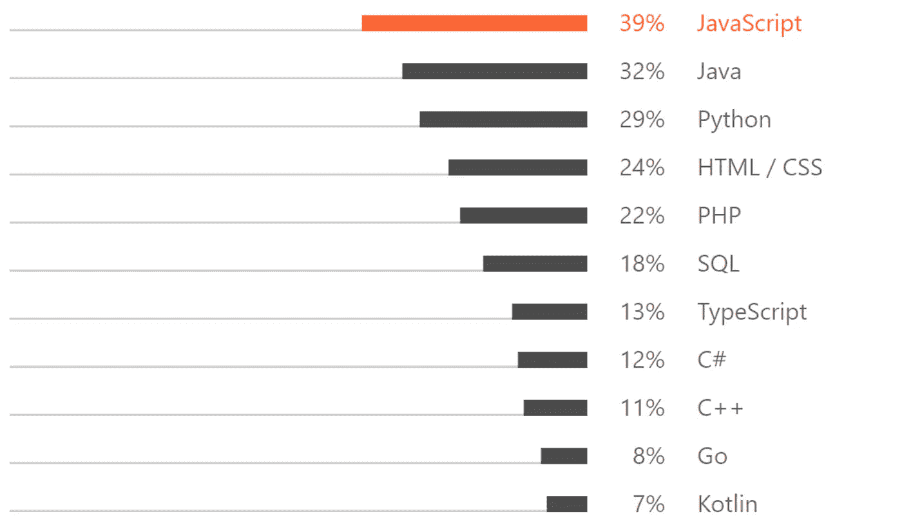
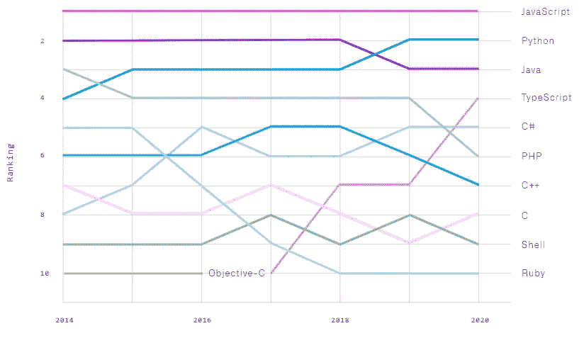
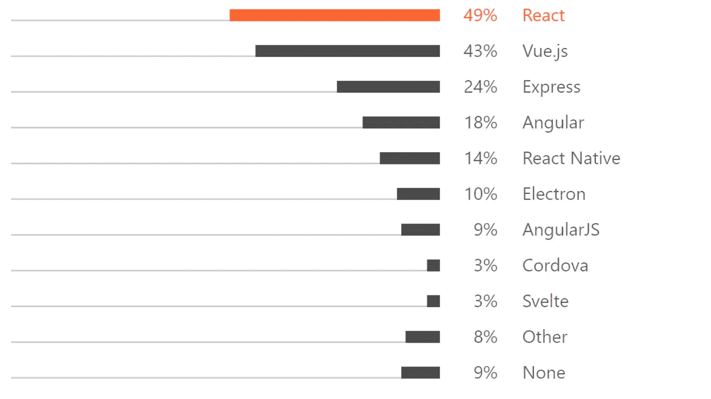
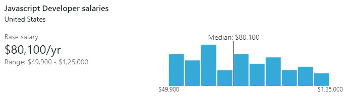
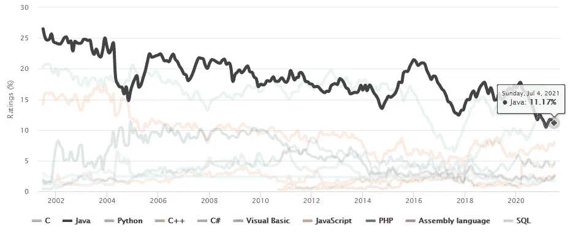
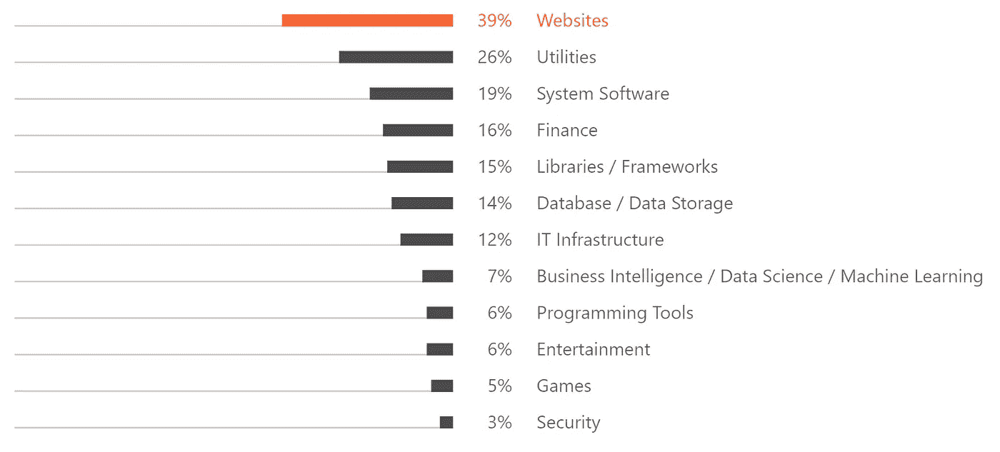
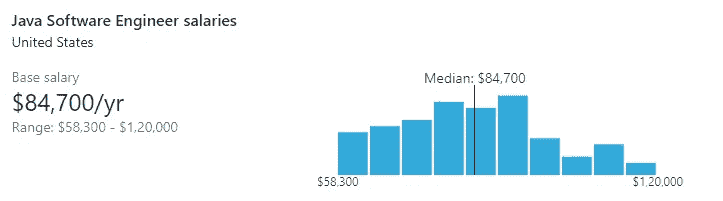
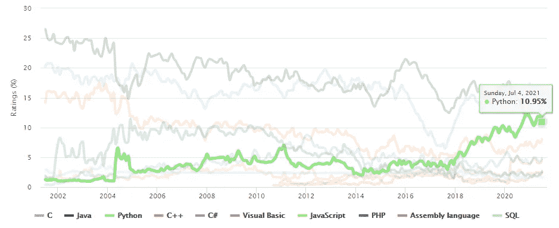
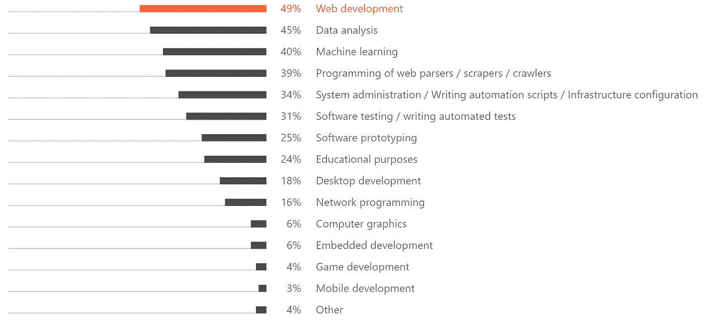
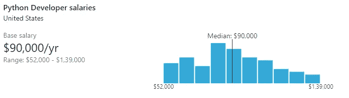

# 2021 年最受欢迎的 3 种编程语言

> 原文：<https://levelup.gitconnected.com/top-3-most-popular-programming-languages-in-2021-d514d57096>

## 他们每个人的最新趋势报告和年薪估计

[肖乐涛](https://unsplash.com/@xiaole?utm_source=unsplash&utm_medium=referral&utm_content=creditCopyText)在 [Unsplash](https://unsplash.com/s/photos/programming-language?utm_source=unsplash&utm_medium=referral&utm_content=creditCopyText) 上拍照

2021 年，对于开发者来说，在市场上众多可用的编程语言中选择一种合适的语言来学习是一项具有挑战性的工作。这就是来自行业报告的趋势和统计数据对获得关于什么是好的学习语言的有价值的反馈有很大帮助的地方。

对于想要学习他们的第一门编程语言的新生来说，市场趋势是寻找指导的最好地方。即使你对编码感兴趣已经有一段时间了，但是想要学习一门新的语言来扩展你的知识，这些统计数据也会有所帮助。

当你把一种语言的流行趋势和你作为开发者能从中赚到的钱结合起来，决定你是否想学它就变得容易了。

无论你是一个新手还是有经验的开发者，我下面提供的细节都将帮助你在 2021 年选择正确的你接下来想要学习的编程语言。

# 1.Java Script 语言

Javascript 是 2021 年最流行的语言。根据各种调查产生的报告，它越来越受欢迎。

[尽管在 Jetbrains 2020 年调查](https://www.jetbrains.com/lp/devecosystem-2020/) **中，Java 是开发者最受欢迎的首选编程语言**，Javascript 是使用最多的整体编程语言。[但是在 2021 年的报告](https://www.jetbrains.com/lp/devecosystem-2021/)中，JavaScript 已经在这两个类别中取代 Java 成为最受欢迎的编程语言。

来源:[开发者生态系统 2021](https://www.jetbrains.com/lp/devecosystem-2021/#Main_what-are-your-primary-programming-languages-choose-no-more-than-3-languages)

就连最近的 Github 报告也把 Javascript 放在了首位。事实上，根据 Github 的数据，Javascript 在前几年仍然是第一语言。

来源: [Github 报告](https://octoverse.github.com/)

但是，Javascript 中有很多框架。如果你选择学习这门语言，下一步将是选择一个流行的框架。

根据 Jetbrains 2021 年关于 Javascript 的报告，React 是所有 JS 框架中最受欢迎的。同时，与去年的调查相比，Vue.js 增长了近 11%，跃升至第二位。

来源:[开发者生态系统 2021](https://www.jetbrains.com/lp/devecosystem-2021/javascript/)

> 大约**使用 JavaScript **的四分之三的开发者**开发网站**，而四分之一的开发者将它用于公共事业。—*[2021 年发展系统调查](https://www.jetbrains.com/lp/devecosystem-2021/javascript/)*

*因此，如果你想成为一名网站开发者，并且喜欢 UI 方面的工作，Javascript 可以成为你的首选语言。*

## *薪金估计*

*[根据 Indeed.com](https://www.indeed.com/career/javascript-developer/salaries)的数据，在美国，一名 Javascript 开发人员的平均年基本工资估计在**111，355 美元**左右。*

*然而，根据 Linkedin insight 的数据，美国 Javascript 开发人员的基本年薪从 49，900 美元到 125，000 美元不等。*

**

*来源: [Linkedin](https://www.linkedin.com/salary/javascript-developer-salaries-in-united-states)*

# *2.Java 语言(一种计算机语言，尤用于创建网站)*

*你可能已经注意到了上面的统计数据；Java 和 Python 之间为第二个位置展开了一场争斗。然而，我会考虑 JetBrains 对这份名单的调查，因为它是最新的报道，也是 2021 年的最新报告。*

*甚至 TIOBE 编程社区索引也显示 Java 在 Python 之上，尽管差距很小。*

**

*资料来源: [Tiobe 指数](https://www.tiobe.com/tiobe-index/)*

*如果您想用相对简单的学习曲线构建能够处理高吞吐量的商业企业应用程序，Java 是最好的语言之一。使用 Java，您可以方便地为 web、移动或桌面构建应用程序。*

*下面给出的统计数据提供了 2021 年开发人员如何使用 Java 构建各种类型的应用程序的信息。*

**

*资料来源:[2021 年发展系统调查](https://www.jetbrains.com/lp/devecosystem-2021/java/)*

## *薪金估计*

*[据 Indeed.com](https://www.indeed.com/career/java-developer/salaries)报道，在美国，一名 Java 开发人员的年平均基本工资估计在 102327 美元左右。*

*然而，根据 Linkedin insight，美国 Java 开发人员的基本年薪从 58，300 美元到 12 万美元不等。*

**

*来源: [Linkedin](https://www.linkedin.com/salary/search?countryCode=us&keywords=java%20software%20engineer)*

# *3.计算机编程语言*

*根据 2021 年的市场趋势，Python 是[第三大最受欢迎的初级编程语言](https://www.jetbrains.com/lp/devecosystem-2021/#Main_what-are-your-primary-programming-languages-choose-no-more-than-3-languages)。由于它的易用性和相对容易的学习曲线，它在过去几年里越来越受欢迎。*

*Python 可用的大量库支持有助于开发人员在广泛的项目中使用该语言。*

*根据最近的 TIOBE 报告，Python 在受欢迎程度上与 Java 展开了激烈的竞争，并且几乎准备好很快取代 Java 成为第二大受欢迎的语言。*

**

*资料来源: [Tiobe 指数](https://www.tiobe.com/tiobe-index/)*

*Python 已经被 TIOBE 索引命名为 2007、2010、2018 和 2020 年的年度语言。*

*虽然 Python 大量用于数据分析和机器学习，但开发人员使用 Python 的最常见目的是用于 Web 开发。*

**

*来源:[2021 年 Jetbrains 调查](https://www.jetbrains.com/lp/devecosystem-2021/python/)*

## *薪金估计*

*[据 Indeed.com](https://www.indeed.com/career/python-developer/salaries)报道，在美国，一名 Python 开发人员的平均年基本工资估计在**108，032 美元**左右。*

*然而，根据 Linkedin insight，美国 Python 开发人员的基本年薪从 52，000 美元到 139，000 美元不等。*

**

*来源: [Linkedin](https://www.linkedin.com/salary/search?countryCode=us&keywords=python%20developer)*

# *最后的想法*

*根据上面给出的趋势，Javascript、Java 和 Python 似乎是大多数开发人员选择的编程语言。看他们每个人的工资，2021 年学其中一门语言是有意义的。*

*忽略几个调查给出的立场差异，毫无疑问，这三个是市场上最受欢迎和最受欢迎的编程语言。还有，看历史数据，说这三个都不会很快失去需求也不会错。*

*希望以上细节对你做决定有帮助。你有喜欢的编程语言或者将来想学的语言吗？请在评论区告诉我你的观点。*

*感谢您阅读这篇文章。您可能还想阅读:*

* [## 程序员给程序员的 10 个终极编程笑话

### 让你笑破肚皮的笑话，即使你不是程序员

levelup.gitconnected.com](/10-ultimate-programming-jokes-by-the-programmers-for-the-programmers-4e24a3b701f2)  [## 缺乏经验的程序员的 7 大标志

### 了解这些迹象，这样你就不会在你的软件开发生涯中犯同样的错误

levelup.gitconnected.com](/top-7-signs-of-an-inexperienced-programmer-5fc3f04658f3)  [## 这就是优秀的软件开发人员努力奋斗的原因

### 知道成为一名优秀的开发人员的不利之处，以及如何制定解决方案来克服这些困难

levelup.gitconnected.com](/this-is-why-good-software-developers-struggle-2267b5daf33)*