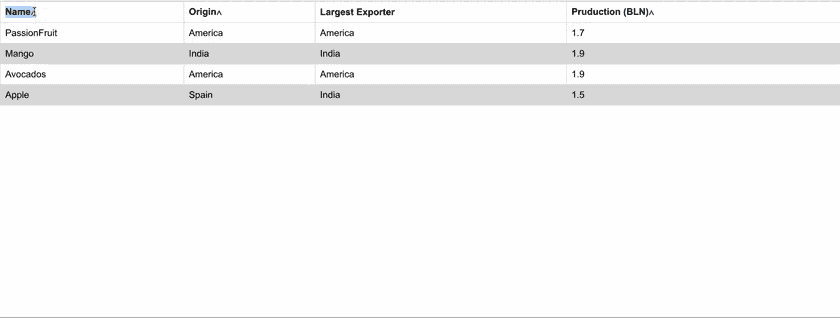

# 🔥前 3 名 React 技巧专家😎喜欢用来减小组件的大小

> 原文：<https://levelup.gitconnected.com/top-3-react-tricks-pros-like-to-use-to-reduce-the-size-of-component-980900370505>

不要让您的 React 组件成为一个科学怪人


# 内容

*   [**简介**](#4bbf)
*   [**1。名称空间的力量**](#558a)
*   [**2。拆分为子组件并共享状态**](#4c02)
*   [**3。用于缩放和可读性的自定义挂钩**](#989f)
*   [**结论**](#4617)
*   [**Github 链接**](#28e3)
*   [**了解更多**](#8f7c)

# 介绍

[](https://easy-web.medium.com/membership) [## 通过我的推荐链接加入 Medium 维塔利·舍甫琴科

### 作为一个媒体会员，你的会员费的一部分会给你阅读的作家，你可以完全接触到每一个故事…

easy-web.medium.com](https://easy-web.medium.com/membership) 

它总是从一些小事开始，然后你变得兴奋，发展到大事，然后你失去控制。而我们在这里谈论的**反应元件**。这是我开始学习反应时的主要问题，如何避免组件爆炸🤯一堆功能，JSX，和配置。在本文中，我们将以一个 UI 组件为例——**表格组件**,并尝试使用 3 个技巧来优化它，让我们像专业人员一样扩展😎。

表格组件将具有一些特性，这些特性可以在以后进行扩展:

*   将标题和行作为参数接收，并呈现表格
*   将 sorters 作为参数接收，以定义哪个标题是可排序的
*   切换表头会将其分类为 ASC 和 DESC

我们的应用程序将如下所示:

最初，表格组件将如下所示，稍后我们将对其进行优化:



# **1。名称空间的力量**

React 组件增加类型(接口、枚举)和常量的数量是很常见的。我们可以使用的第一种技术是名称空间。它是我们的配置文件，可以存储我们的常量、类型，甚至纯粹的帮助函数，因为没有必要将它保存在组件中。让我们仔细看看:

然后，我们可以更新我们的表组件道具类型:

```
...
import { TableConfig } from './TableConfig'const Table: FunctionComponent<TableConfig.TableProps> = ({
...
```

# **2。拆分为子组件并共享状态**

此时，我们知道可以将类型、常量和辅助函数移动到哪里。接下来，我们将弄清楚如何处理子组件。我们将主要的大组件拆分成小的子组件。有两件事需要考虑:

1.  总是在主组件的主体之外创建子组件:要么在同一个文件中，要么在其他文件中。否则，它会引发性能问题，并且每次更新状态时都会创建子组件。
2.  如果您想要共享主组件的状态以避免属性重载，请使用**上下文**。

让我们看看这个例子是什么样子的:

# **3。用于缩放和可读性的定制挂钩**

好的，我们可以缩放类型，JSX，我们有最后一个元素要移出，它是我们的状态，以及处理状态的方法。除了将它们移动到自定义挂钩，没有更好的解决方案，让我们看看它是什么样子的:

# **结论**

我们已经设法将组件的大小减少了近 40%，如果我们将子组件移出文件，我们可以做得更多。希望您已经了解了这个想法，并对组件扩展更有信心。如果你今天学到了新东西，👏和**订阅**博客，获得更多前端开发的灵感。

[](https://easy-web.medium.com/subscribe) [## 每当维塔利·舍甫琴科发表文章时，就收到一封电子邮件。

### 每当维塔利·舍甫琴科发表文章时，就收到一封电子邮件。通过注册，您将创建一个中型帐户，如果您还没有…

easy-web.medium.com](https://easy-web.medium.com/subscribe) 

# Github 链接

[](https://github.com/Vitashev/react-fruits) [## GitHub - Vitashev/react-fruits

### 这个项目是用 Create React App 引导的。在项目目录中，您可以运行:在…中运行应用程序

github.com](https://github.com/Vitashev/react-fruits) 

# **了解更多信息**

[](/building-️-react-micro-frontends-monorepo-with-nx-10bf564f03fe) [## 用 NX 构建⚛️反应微前端 Monorepo

### 在本教程中，你将建立反应微前端没有拥挤

levelup.gitconnected.com](/building-️-react-micro-frontends-monorepo-with-nx-10bf564f03fe) [](https://itnext.io/frontend-interview-cheatsheet-that-helped-me-to-get-offer-on-amazon-and-linkedin-cba9584e33c7) [## 🔥帮助我获得亚马逊和 LinkedIn 录用通知的前端面试备忘单

### 如果你正在准备一个前端面试，想快速更新你的领域知识，这个备忘单将…

itnext.io](https://itnext.io/frontend-interview-cheatsheet-that-helped-me-to-get-offer-on-amazon-and-linkedin-cba9584e33c7) [](https://itnext.io/building-the-nft-instagram-app-with-react-and-thirdweb-d6266c925b32) [## 🥺用 React 和 Thirdweb 构建 NFT Instagram 应用

### 为网络的未来做好准备，或者从 NFT 的炒作中分得一杯羹😜

itnext.io](https://itnext.io/building-the-nft-instagram-app-with-react-and-thirdweb-d6266c925b32)