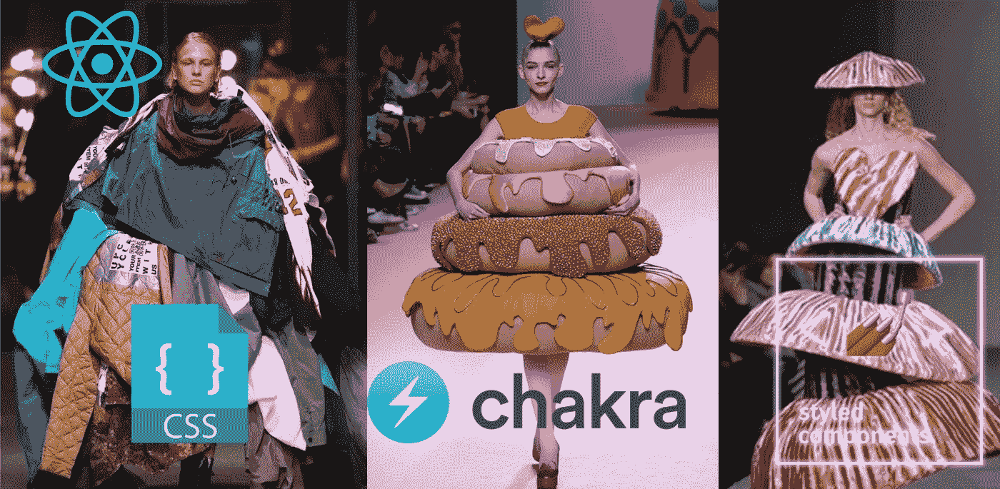

# 🔥2022 年设计 React 组件(如 Pro)的三大方式

> 原文：<https://levelup.gitconnected.com/top-3-ways-to-style-react-components-like-pro-in-2022-9d210bacb98f>

对于那些不想花几天时间对齐 div 的人



# 内容

*   [**简介**](#cc4d)
*   [**1。使用 CSS 模块**](#e24a) 完全控制 React 组件样式
*   [②**。使用 Charka UI**](#ec98) 的无 CSS 样式
*   [**3。React 造型之王—造型—组件**](#7562)
*   [**结论**](#b64f)
*   [**了解更多**](#c43b)

# 介绍

[](https://easy-web.medium.com/membership) [## 通过我的推荐链接加入 Medium 维塔利·舍甫琴科

### 作为一个媒体会员，你的会员费的一部分会给你阅读的作家，你可以完全接触到每一个故事…

easy-web.medium.com](https://easy-web.medium.com/membership) 

样式化是每个 web 开发人员必须知道的前端 Triada 元素之一:HTML/CSS/JS🤔。另一方面，有一大批不喜欢 CSS 的 web 开发人员。他们更喜欢使用一些*助手*，和*库*，基本上非常努力地避免编写这种神秘的造型语言。我们不应该评判这些人，尤其是在涉及到反应的时候，因为这是 JSX 的天性。

不管怎样，这篇文章是写给两个人的:❤️的爱好者和憎恨者😠。我们将回顾将 react 组件造型过程变成愉快旅程的 3 种方式。您可以选择最符合您的用例的或多或少的样式控制选项。

# 1.使用 CSS 模块完全控制 React 组件样式

是的，你可以完全忽略这些库，直接使用 CSS/SCSS/萨斯，就像我们没有任何 JSX 一样。此功能从`react-scripts@2.0.0`开始可用。基本上，任何东西都可以按照我们喜欢的方式使用。使用下面的语法`[name].module.css`创建一个样式表。

```
Text.module.css.success {
  background-color: green;
}
```

并简单地导入到组件中

```
*import* React *from* 'react';
*import* styles *from* './Text.module.css'; *// Import css modules stylesheet as styles*

*const* Text *=* () => {
   *return* <div className={styles['success']}>Successful message</div>;
}
```

`style[‘class-name’]`与`style.className`相比，这种格式更好，可以让你的类名更接近标准的烤肉串而不是丑陋的骆驼案。

它将使用格式`[filename]_[classname]_[hash]`自动为我们确定样式的范围，最终结果在浏览器中将如下所示:

```
<div class="Text_success_sdfg43l">Successful message</div>
```

你也可以使用预处理样式表，比如 SCSS 和萨斯，只需安装`npm install scss`或`npm install sass`。

这种方法给你使用 CSS 的充分自由，你不需要学习新的语法或库。非常方便，尤其是如果你不怕弄脏你的手写 CSS。

# 2.使用 Charka UI 的无 CSS 样式

这是我的第二个选择，它非常适合辅助项目和中小型 web 应用程序。今年 [**tailwind**](https://tailwindcss.com/\) 变得非常流行，许多 web 开发人员发现它是无需编写一行 CSS 就能设计组件风格的完美解决方案。它的缺点是，在开始时你需要经常查阅这个库，直到你习惯了为止。另一个问题是，组件中会有一堆类，这会使 react 组件膨胀，并迫使您复制这些类。

[**Chakra UI**](https://chakra-ui.com/) 类似但是除了造型，你还会得到 UI 组件。它拥有构建任何复杂布局所需的一切。如果您需要更精细的定制，它也足够灵活。与 **tailwind** 的不同之处在于，在 Charka UI 中，你将主要通过道具来传递样式，而不是编写一个类列表，对于 React 应用程序来说，使用道具看起来更自然。

要开始，您需要安装依赖项:

```
npm i @chakra-ui/react @emotion/react @emotion/styled framer-motion
```

将提供程序设置到应用程序的根目录:

```
function App() {
    return (<ChakraProvider>
                <TheRestOfYourApplication />
            </ChakraProvider>)
}
```

现在你可以走了:

```
<Text fontSize='6xl'>Your 6xl size text</Text>
```

如果你不需要微妙的风格，并且想要快速的原型化你的应用，这个解决方案可以快速的获取和满足你的需求。我喜欢在我最喜欢的项目中使用它。

# 3.React 造型之王——造型组件

不是我最喜欢的，但却是最流行的 React 样式库之一 [**样式-组件**](https://styled-components.com/) **。许多知名公司都使用它。我不喜欢它的原因是，每次您想要应用一些简单的样式时，都需要创建一个新的组件。这可能是有意义的，因为在一个正常的世界里，你需要添加一个类，但是在这里你将有一个单独的组件。如果您想构建自己的 UI 组件库，这可能是一个很好的解决方案。**样式组件**很酷的特点是你可以通过道具来设置样式条件，而且它是非常可定制的。**

从安装依赖项开始:

```
npm install --save styled-components
```

现在您已经准备好创建您的第一个样式化组件了:

```
const Container = styled.div`
  text-align: center;
`
```

然后你可以把它作为一个组件:

```
<Container>Your text</Container>
```

# 结论

我对面向客户端的应用程序的偏好是使用传统的 CSS 模块。然后对于宠物项目，用**查克拉 UI 更容易启动。**最后——**风格化组件**如果你需要建立自己的 UI 库。此外，没有什么可以阻止你组合多个选项，比如样式-组件和 CSS 模块。我希望您喜欢这篇文章，并为您的用例选择了正确的样式解决方案。如果你学到了新的东西，向世界展示一些爱的能量👏文章。订阅 Medium 并在[**Twitter**](https://twitter.com/easy_web_org)**上关注我，获取关于 web 开发的更新。**

[](https://medium.com/@easy-web/subscribe) [## 每当维塔利·舍甫琴科发表文章时，就收到一封电子邮件。

### 每当维塔利·舍甫琴科发表文章时，就收到一封电子邮件。通过注册，您将创建一个中型帐户，如果您还没有…

medium.com](https://medium.com/@easy-web/subscribe) 

# 了解更多信息

[](/top-3-react-tricks-pros-like-to-use-to-reduce-the-size-of-component-980900370505) [## 🔥前 3 名 React 技巧专家😎喜欢用来减小组件的大小

### 不要让您的 React 组件成为一个科学怪人

levelup.gitconnected.com](/top-3-react-tricks-pros-like-to-use-to-reduce-the-size-of-component-980900370505) [](/building-react-micro-frontends-monorepo-with-state-management-using-nx-in-2-min-b8b04f9afee0) [## 🔥使用 NX 在 2 分钟内构建⚛反应微前端 Monorepo 和状态管理😅

### 甚至你的祖母也可以用 NX 构建 react 微前端

levelup.gitconnected.com](/building-react-micro-frontends-monorepo-with-state-management-using-nx-in-2-min-b8b04f9afee0) [](/building-hoa-dao-application-with-web-3-stack-nextjs-chakraui-and-thirdweb-9a9c3d586172) [## 使用 Web 3 堆栈构建 HOA DAO 应用程序:NextJs、ChakraUI 和 Thirdweb

### 你将最终明白什么是道，并且能够自己建造它

levelup.gitconnected.com](/building-hoa-dao-application-with-web-3-stack-nextjs-chakraui-and-thirdweb-9a9c3d586172) 

# 分级编码

感谢您成为我们社区的一员！更多内容见[升级编码出版物](https://levelup.gitconnected.com/)。
跟随:[推特](https://twitter.com/gitconnected)，[领英](https://www.linkedin.com/company/gitconnected)，[通迅](https://newsletter.levelup.dev/)
**升一级正在转型理工大招聘➡️** [**加入我们的人才集体**](https://jobs.levelup.dev/talent/welcome?referral=true)