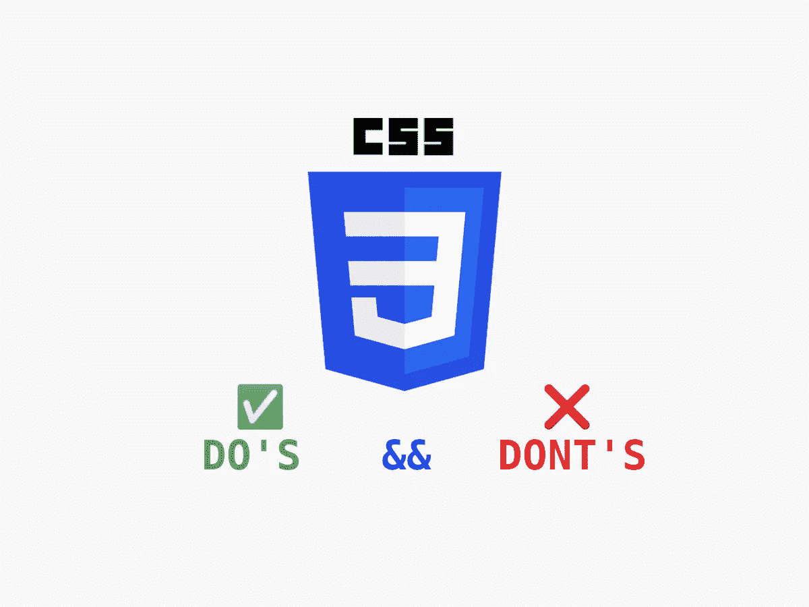
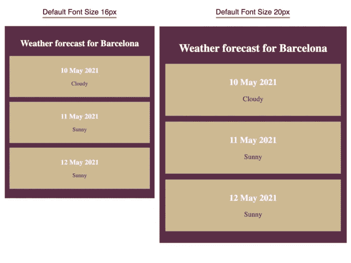

# 要避免的 5 大 CSS 错误

> 原文：<https://levelup.gitconnected.com/top-5-css-mistakes-to-avoid-963f76892954>

## 代码味道、浏览器支持、像素单位等等



正如我们今天所知，CSS 语言是网络的一个重要方面。它使我们能够描述元素是如何在屏幕、纸张或其他媒体中被描述的。

它简单、强大且具有声明性。我们可以很容易地实现复杂的事情，如暗/亮模式。然而，有很多误解和错误的用法。这些会把 CSS 标记变成复杂的不可读和不可伸缩的代码。

我们如何防止这种情况发生？遵循最佳实践，避免最常见的错误。

在本文中，我们将总结 5 大错误以及如何避免它们。

# 1.没有预先设计

立即开始设计和构建组件是很诱人的。这给了我们一种速度感和成就感。然而，从长远来看，这产生了相反的效果。

随着我们构建越来越多的组件，一些没有答案的问题将会出现。这将使我们随机应变，做出快速反应的决定，以保持这种进步感。我们将慢慢为灾难设定完美的场景。

在进行任何编码之前，必须做出许多决定。我们将如何设计组件？我们想以原子的方式构建我们的组件吗？我们宁愿创建一个可组合的实用系统吗？我们想要一个已经内置的 UI 库吗？我们希望 CSS 的作用域是全局的还是按组件的？

清楚地知道我们要去哪里将有助于我们选择最好的工具。这将使我们免于冗余和干违法行为。设计应用程序有许多有效的方法。最常见的无效的是即兴创作。

我们的代码必须是可预测的，易于扩展和维护。

让我们看一个例子:

在上面的例子中，我们可以看到当使用 CSS 变量进行主题化时，一切变得多么清晰易读。第一个`.card`定义看起来完全是随机的。该组件不容易扩展。

# 2.CSS 代码有味道

代码气味不是 bug。它们也不会妨碍系统正常工作。它们只是糟糕的实践，会使我们的代码更难阅读和维护。

在这里，我们将看到最常见的问题以及如何克服它们:

## `::`符号

常见的是在伪元素和伪类中使用`::`符号。这是旧的`CSS spec`的一部分，浏览器继续支持它作为后备。然而，我们应该只对伪元素使用`::`，例如:`::before`、`::after`、`::frist-line` …以及对伪类使用`:link`、`:visited`、`:first-child` …

## 对类使用字符串连接

使用`Sass`预处理器来帮助我们的 CSS 代码库是非常流行的。有时，为了尽量简洁，我们通过连接`&`操作符来创建类。

在开发人员尝试在代码库中搜索`.card-selected`类之前，似乎没有什么问题。开发人员将很难找到这个类。

## 人手短缺的不正确使用

CSS 简写很棒，可以避免我们的代码过于冗长。然而，有时我们并不故意使用它们。`background`速记是大多数时候，偶然使用的。

## 的错误用法！重要规则

`!important`规则用于覆盖特异性规则。它的使用主要集中在覆盖不能以任何其他方式覆盖的样式。

它通常用于更具体的选择器已经完成工作的场景。

## 强力强制属性值

一个幻数出现在 CSS 代码库中是很常见的。它们带来了相当多的困惑。有时我们可能会在代码中发现很长的数字，因为开发人员想要覆盖他不确定的属性。

# 3.不限定 CSS 类名的范围

由于 CSS 语言的性质，很容易无意中用一个糟糕的类名来设计元素的样式。这个问题如此频繁，以至于有相当多的解决方案。

在我看来，最好的两个是:

*   使用命名约定
*   CSS 模块

## 命名约定

最流行的命名约定是 BEM 101。它代表`**B**lock, **E**lement, **M**odifier`方法论。

```
[block]__[element]--[modifier]/* Example */
.**menu__link--blue** {
  ...
}
```

目标是通过让开发人员理解 HTML 和 CSS 之间的关系来创建唯一的名称。

## CSS 模块

我对 BEM 方法最大的担忧是它很耗时，并且依赖于开发者来实现。CSS 模块发生在`pre-processor`侧，这使得它没有错误。它为我们的 CSS 模块类名生成随机的前缀/名称。

开发人员少了一件要担心的事情，并且可以期望他的 CSS 模块被正确地限定范围。

# 4.使用 PX 装置

这种像素使用频率很高，因为它看起来简单直观。恰恰相反。很长一段时间以来，像素不再基于硬件。它们仅基于光学参考单元。

`px`是一个绝对单位。这是什么意思？我们不能适当地扩展它来满足更广泛的观众。

我们应该用什么来代替？相对单位是正确的选择。我们可以依靠这些来更好地表达我们的动态布局。例如，我们可以使用`ch`来表示基于字符数的 div 宽度。

最常见的`px`的替代品通常是`rem`和`em`单位。它们以从框到文本的相对方式来表示字体的相对大小。

*   `rem`将表示相对于根的尺寸`font-size`。
*   `em`将表示相对于元素尺寸的尺寸。

通过使用`rem`，我们将能够根据用户偏好的字体大小来表达布局。这将使我们的布局更容易访问和动态。



相同布局随字体根默认大小变化的示例

在上面的截图中，我们可以看到基于`rem`单元的布局是如何扩展并适应不同的默认字体大小的。

# 5.忽略浏览器支持

当开始开发一个网站时，确定我们的目标客户是至关重要的。跳过这一步直接编码是很常见的。

为什么至关重要？它帮助我们了解我们的应用程序将在哪种设备上使用。之后，我们可以定义我们将支持哪些浏览器和哪些版本。

只要我们提供适当的后备，我们仍然可以致力于拥抱像`subgrid`这样的新特性。定义一个特性渐进体验总是一个好主意。随着一个特性得到更多的支持，我们可以逐步抛弃它的缺点。

像[caniuse.com](https://caniuse.com/)或 [browserslist.dev](https://browserslist.dev/?q=bGFzdCAyIHZlcnNpb25z) 这样的工具在这方面正好有所帮助。像`postcss`这样的工具带有`autoprefixer`功能，这将有助于我们的`CSS`得到更广泛的支持。

# 包裹

我们已经看到了如何改进我们的 CSS 代码。遵循一些简单的准则，我们可以实现一个声明性的、可重用的和可读的代码库。我们应该在 CSS 上投入和 Javascript 一样多的努力。

拥有一个不可预知的 CSS 系统确实会导致挫败感，污染用户的浏览器布局。

干杯—

# 有关系的

[](https://betterprogramming.pub/stop-using-the-pixel-unit-in-css-8b8788a1301f) [## 停止使用 CSS 中的像素单位

### 避免使用 px 装置的 3 个原因

better 编程. pub](https://betterprogramming.pub/stop-using-the-pixel-unit-in-css-8b8788a1301f)