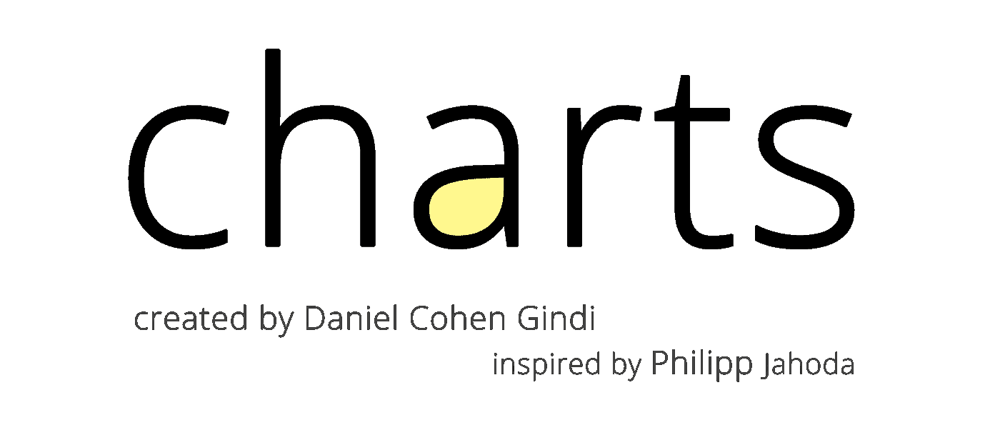
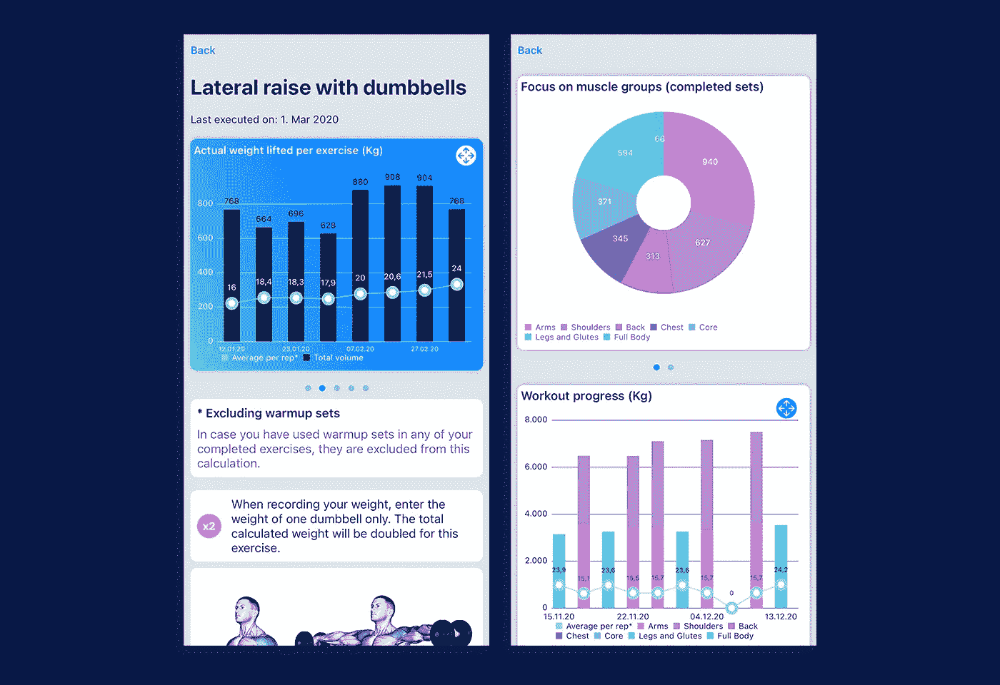
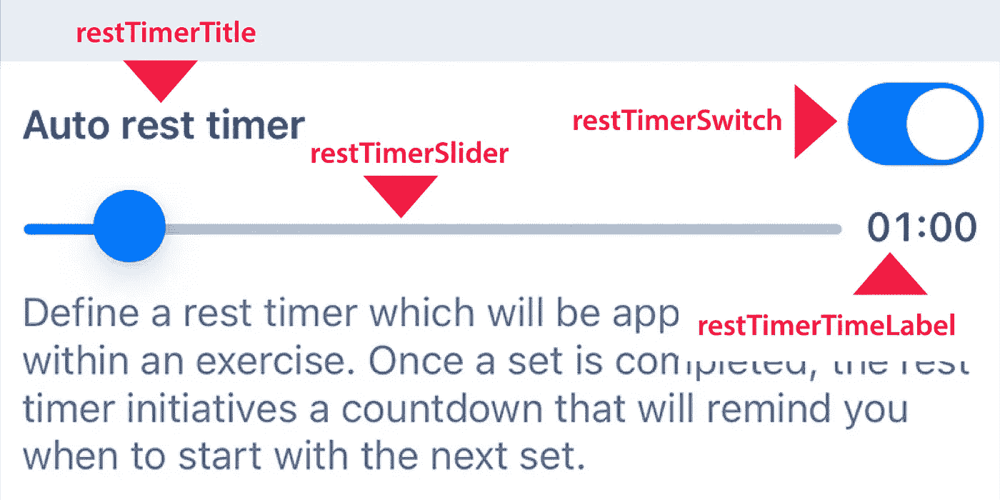

# 每位 Swift 初学者都应该知道的前 5 大 iOS 库和插件

> 原文：<https://levelup.gitconnected.com/top-5-ios-libraries-every-beginner-swift-developer-should-know-c02518842648>

## 当您开始 iOS 编程之旅时，请查看这些库

图片:a-image/Shutterstock

速度和敏捷性对任何开发人员来说都是至关重要的。现成的库是提高生产力的好方法，可以让你专注于增值任务。然而，我不建议你的 iOS 应用程序装载太多的库。相反，坚持使用几个经过验证的库。

事不宜迟，让我们直接进入我最喜欢的 iOS 14 兼容库，它让我作为一名兼职 iOS 开发人员的生活变得更加轻松，并为最终产品增加了重要价值。

# 图表

**设置的复杂程度:**中等

如果你需要在你的应用程序中可视化任何种类的统计或历史数据，不要自己编码。相反，你可以使用 [**图表**](https://cocoapods.org/pods/Charts) 库。它提供了一种简单直观的方式来生成各种图表，并允许以各种方式对它们进行格式化。目前支持以下图表类型:折线图、条形图、散点图、蜡烛棒图、气泡图和雷达图。某些图表类型也可以相互组合(例如，覆盖在条形图上的折线图)。

官方图表标志取自 GitHub

在 Xcode 项目中安装并导入了库之后，我建议执行以下基本步骤:

1.  **原始数据:**以这样一种方式准备数据就足够了，即可以将一组对象(类或结构)传递到图表中。数组中的每个对象必须至少包含您想要在图表中显示的信息(例如，如果您想要在条形图中显示历史数据，则为日期和数字)。
2.  **向 GUI 添加图表:**向您的 ViewController 添加一个 UIView，并让它继承您需要的图表类型，例如 *CombinedChartView* 。将视图连接到您的代码。
3.  **填充图表:**创建一个助手函数，该函数接收来自第二步的图表视图和来自第一步的原始数据。在这个助手函数中，您可以方便地将数组中的数据点分配给图表的各个部分，如 x 轴和 y 轴。

约束:该库目前不能开箱即用地与 SwiftUI 一起工作，但是在这篇伟大的 [**文章**](https://medium.com/@zzzzbh/plotting-in-ios-using-charts-framework-with-swiftui-222034a2bea6) 中解释了一个包装器解决方案。

本[健身追踪器](https://apps.apple.com/app/id1487388888)中图表 iOS 库的 Bart 图、折线图和饼图示例

# MongoDB 领域

**复杂度设置:**高

[**Realm**](https://www.mongodb.com/realm) 是 iOS(和许多其他平台)的离线优先数据库，也是构建需要无缝数据存储和同步的跨平台应用程序时的必备库。Realm 已经存在了几年，最近被集成到 MongoDB 平台中。对我个人来说，它解决了以下关键问题:

*   **本地移动数据库:** Realm 是一种在用户设备上本地存储和检索数据的便捷方式。因此，它是苹果 CoreData 的绝佳替代品。他们宣传它是一个移动数据库，这是对它的很好的描述。我还发现它比 Firebase 等平台更容易使用。值得注意的是，您不一定需要使用在线存储功能来使用 Realm。移动数据库是开源的，免费的。
*   **在线数据存储:**最强大的功能显然是可以跨设备将每个用户的本地数据与 MongoDB 云数据库同步。从开发人员的角度来看，处理数据本质上与处理本地数据是一样的。双向数据同步在后台进行，作为开发人员，您无需担心。对我来说，最大的挑战是，一旦用户注册了你的应用，没有一个内置的开关可以方便地从本地数据库切换到云领域数据库。这个逻辑必须由开发人员来实现。
*   **跨用户分析:**既然 Realm 已经被 MongoDB 收购，您可以使用 MongoDB 提供的所有关于数据分析的强大功能。因此，你能够以一种方便的方式进行跨用户分析。

请注意，浏览教程、启动 MongoDB 实例并相应地调整您的 iOS 代码需要一些时间。但是一旦它开始工作，它就是你的应用程序的真正改变者。

MongoDB 领域图片来自 mongodb.com/realm 网站

# 镣铐

**设置复杂程度:**中等

[**Bond**](https://github.com/DeclarativeHub/Bond) 是 Swift 的一个反应式绑定框架，如果您计划在应用中使用 MVVM 模式，这是一个很好的补充。它易于设置和使用。本质上，它简化了您将 UI 连接到视图模型中的数据的方式。

让我们深入一个示例，让您了解 Swift Bond 是如何工作的。以下示例在视图控制器上有四个 UI 组件:

*   restTimerTitle (UILabel)
*   restTimerSlider (UISlider)
*   restTimerSwitch (UISwitch)
*   restTimerTimeLabel (UILabel)

每个 UI 组件都通过绑定连接到视图模型。这允许视图控制器显示来自模型的数据变化，并且(在需要双向同步的情况下)反过来基于 UI 上的变化更新视图模型中的数据。

UILabel、UISwitch、UISlider 的快速绑定

*restTimerTimeLabel* 正在观察格式化持续时间的变化，然后在 UILabel 上显示它，并在值变化时添加一个漂亮的渐变过渡(第 1 行到第 5 行)。 *restTimerSlider* 从视图模型双向连接到 *restTimerDuration* 值(第 6 行)。因此，滑块的任何更改都会在一行中直接更新视图模型。剩下的第 7 行到第 9 行根据视图模型中的数据添加了一些格式。

Swift Bond 连接您的视图模型和 UI

# 重火力点

**设置复杂度:**中到高

Firebase 官方标志取自 Firebase 网站

谷歌的 [**Firebase**](https://firebase.google.com/docs) 框架提供了各种模块，让你的 iOS 开发者生活变得更加轻松。我发现与初学 iOS 开发人员最相关的关键特性是:

*   **认证:**与我最相关的功能。向您的应用程序添加身份验证的绝佳方式。Firebase 支持多种用户注册方式，如用户名/密码、谷歌、苹果、脸书、推特等。我个人将 Firebase 身份验证与 MongoDB 领域(见上文)一起使用，这需要一些设置(例如，生成自己的 JWT 令牌并编写自己的 Firebase 函数)。
*   **云功能:**云功能是 Firebase 的无服务器框架，用于托管基于 JavaScript / TypeScript 的代码。函数可以对 Firebase 事件做出反应，也可以通过 HTTPS 请求来触发。举例来说，当用户注册我的应用程序时，我会使用云功能自动发送欢迎信息。
*   **存储:**你可以利用 Firebase 让每个应用用户存储个人的二进制对象，比如图像和视频。设置相当简单，并且有很好的文档记录。通过让用户上传和分享他们的图像和视频，这是一个增强你的应用程序的好方法。
*   **Crashlytics:** 通过 Firebase 的崩溃报告解决方案，您可以方便地跟踪您的应用和版本中的应用崩溃。与苹果不同的是，用户不必选择激活应用崩溃记录。您将看到代码崩溃发生的时间和位置。

当然，还有流行的 Firestore 和实时数据库功能。Firestore 是一个 NoSQL 数据库，允许您存储用户数据。我不使用 Firestore，因为我认为 MongoDB 领域是这个特定任务的更好的解决方案。

我看到过有人抱怨 Firebase 的性能和可伸缩性的文章。这是一个至少我不能理解的问题。到目前为止，对于我正在使用的功能，我觉得 Firebase 是一个非常可靠的服务。

# 英雄过渡

**设置复杂度:**低

[**英雄**](https://github.com/HeroTransitions/Hero) 库是一个可以轻松集成到您的应用程序中的快速制胜法宝。它将通过视图控制器之间的平滑过渡美化你的应用程序。您可以选择现成的动画，甚至可以定制过渡来创建更复杂的动画。

官方英雄过渡标志取自 GitHub

# IQKeyboardManager

**设置复杂度:**低

这是第六名的荣誉奖。它可能不像上面的其他库那样是一个通用的库，但在处理你的应用程序中的文本输入时，它是一个很大的帮助。它很好地解决了以下两个问题:

*   **有焦点的文本字段总是可见:**很多时候，当你编辑一个文本字段，iOS 键盘向上滑动时，键盘会遮住你想要编辑的原始文本字段。我不知道为什么苹果到目前为止还没有修复它，但是当你不再看到文本字段时，它会显著影响用户体验。使用这个库，您可以定义原始视图与键盘一起向上滑动，以便用户总是看到当前具有焦点的文本字段。
*   **文本字段之间的轻松导航:**如果您的应用程序界面在一个屏幕上包含许多文本字段，用户浏览所有文本字段会变得不方便。插件内置了一个很棒的导航功能，允许用户轻松地进入下一个或上一个文本字段。

还有其他很棒的库，例如如果你需要做大量的日期计算，看看 [**SwiftDate**](https://cocoapods.org/pods/SwiftDate) 。尽管如此，我个人仍然喜欢自己编写一个小的扩展，以防我只需要库功能的一小部分。

感谢阅读这篇文章。我希望这是有帮助的，你会在你自己的项目中尝试一些提到的库。如果你想看它们的运行，可以在苹果应用商店**查看我的一些免费应用。**

# **参考**

*   **[图表 GitHub 页面](https://github.com/danielgindi/Charts)**
*   **[MongoDB 领域文档](https://docs.mongodb.com/realm/)**
*   **[邦德 GitHub 页面](https://github.com/DeclarativeHub/Bond)**
*   **[Firebase 文档](https://firebase.google.com/docs)**
*   **[英雄转场 GitHub 页面](https://github.com/HeroTransitions/Hero)**
*   **[关于雷·温德里奇的邦德教程](https://www.raywenderlich.com/667-bond-tutorial-bindings-in-swift)**
*   **[IQKeyboardManager GitHub 页面](https://github.com/hackiftekhar/IQKeyboardManager)**