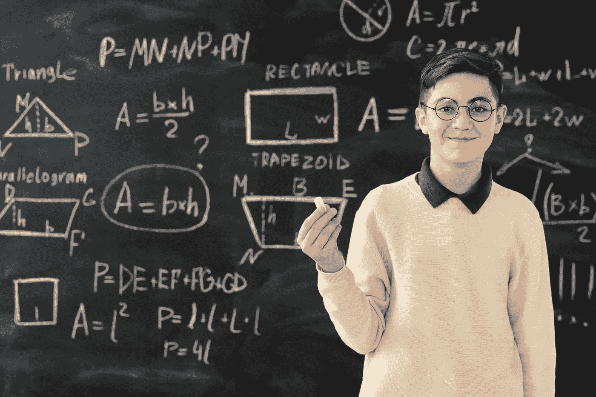
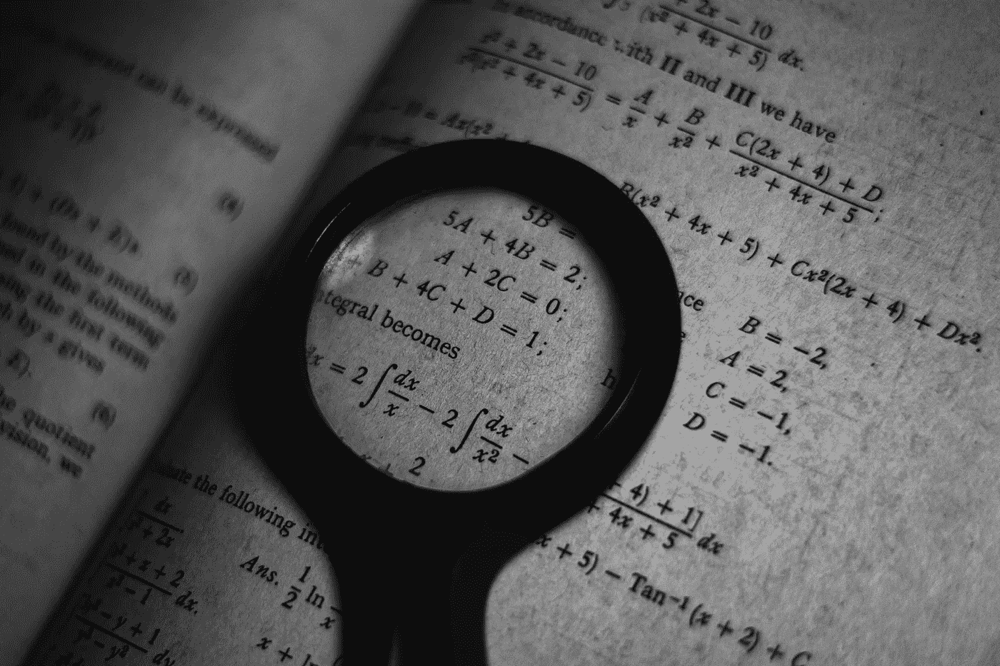
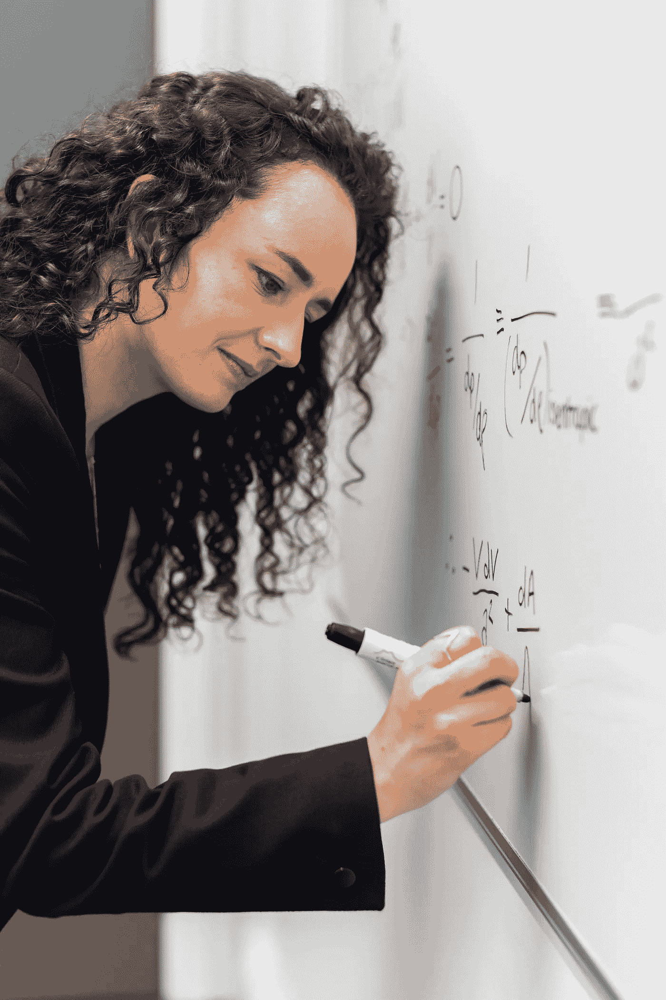

# 机器学习的五大必备数学知识，简单解释

> 原文：<https://levelup.gitconnected.com/top-5-must-know-mathematics-for-machine-learning-simply-explained-4bb16fd8eeed>

一个是必须学习的:高效、准确和优化的机器学习实现和用例的最重要的数学概念和方法

来自 Pexels 的 Max Fischer

在我职业生涯的早期，我经常感觉像一匹正在抖落苍蝇的马(我最早的日子需要 C++和 C#管道实现，通过它们我可以构建。NET solutions)相比于我的许多具有特定数学背景的同行。

我们今天拥有的所有令人敬畏的专业训练在当时并不容易获得。今天，如果你知道去哪里找，你几乎可以精通任何事情。

> **学习机器学习的数学有必要吗？**

来自 Pexels 的 [cottonbro](https://www.pexels.com/@cottonbro/)

—您将使用数学来研究认知和学习过程，以便数学分析的理论结果可以应用于为机器学习模型设计更好的算法。

—数学中的概率方法可以帮助理解人工智能(AI)应用程序或解决方案中通常会遇到的噪声数据集。

—优化技术(在数学中也被广泛研究)在人工智能的许多领域中发挥着关键作用，包括(1)常识性问题解决和自然语言理解[2]和(2)控制信号处理[1]的交叉。

# 你的体重将超过一千颗星星，如果你选择主修数学，你会感谢自己一路上的挣扎和挑战。

来自 Pexels 的 Max Fischer

然而，这甚至是不必要的，因为今天所有优秀的专业培训对你来说都是现成的。

## **事实上，我通过专门培训学到的数学知识，比我通过哈佛大学的学士和硕士学位所能加起来的“学分小时数”的重量还要多。**

对你来说，除了学习这些机器学习的数学方法之外，一个关键的收获是找到数学方面的专门培训。

# **机器学习简介(数学的交叉点)**

机器学习是人工智能的一个子集，允许机器在没有显式编程的情况下从数据中学习。它通常依赖于统计技术，如决策树、支持向量机或神经网络。

数学是机器学习的基础。机器学习算法通常需要大量的数学计算，理解底层数学可以帮助设计、优化和部署您需要的模型。此外，许多机器学习任务本来就很困难，因为它们涉及高维空间[3]，而数学方法，如线性代数和优化，可以帮助我们以系统可重复的方式分解这些复杂的结构。

许多人避开人工智能，因为他们认为人工智能是黑匣子。理解机器学习背后的数学可以帮助实现可重复性和可解释性的简化，所有这些都导致透明。

**机器学习前 5 名数学**

来自 Pexels 的 [cottonbro](https://www.pexels.com/@cottonbro/)

1.线性代数:*这是必须学习的*也是房间里的大象:对于理解机器学习来说，线性代数是必不可少的，也许是这五个中最重要的。它告诉我们如何应用向量和矩阵来表示数据。举例来说，线性代数提供了操纵这些数据的向量和矩阵表示的工具，以便从中学习。

我完成了跨越深度学习、机器学习和自然语言处理的线性代数的多部分指南。我会在底部留下这些帖子的链接。

来自 Pexels 的 Pavel Danilyuk

2.**概率与统计**:概率论提供了一种对不确定性进行推理的方法，这是任何机器学习问题的固有部分。此外，统计学允许我们从数据中估计概率，这是基于学习模型进行预测所必需的。

通过[前方无来自像素的](https://www.pexels.com/@ian-panelo/)

3.**优化理论**:优化理论处理在给定一些约束或目标的情况下寻找最佳解决方案。在机器学习中，我们经常希望找到模型的参数，以最小化预测误差或最大化某些训练数据集的准确性。此外，优化方法可用于更一般的任务，如预处理输入数据或自动选择模型的超参数。

来自 Pexels 的华莱士·查克

4.**微积分**:微积分在处理连续实值函数时发挥作用【11】，这在很多机器学习应用中都很常见。例如，梯度下降[12](一种用于优化模型参数值的流行算法)严重依赖于微积分。几个基本概念包括:

—微分:用于寻找一个函数相对于一个或多个变量的变化率。这是机器学习的一部分，因为它允许我们发现一个函数如何随着其输入的变化而变化。

—积分:寻找曲线下的面积，适用于机器学习问题，因为它检查给定函数中包含多少信息。

来自 Pexels 的 [ThisIsEngineering](https://www.pexels.com/@thisisengineering/)

5.**信息论**:信息论提供了一种方法来衡量一个消息或信号中包含的信息量[13][14](在机器学习中，我们经常使用信息论来为我们的模型设计更好的功能，或者通过比较不同模型的复杂性来在它们之间进行选择。)

我们经常想要设计“信息丰富”的模型[15]，这意味着它们包含尽可能多的关于手头任务的相关信息。也就是说，信息论使其适合于特征选择[16]中的问题，特征选择是选择模型应该使用哪些输入变量的过程。

由于信息论提供了一种测量数据集或随机变量中包含的信息量的方法，因此它通常是机器学习中实现或规划的一部分，作为分解如何在处理数据(例如，通过降维)或学习尽可能简单的模型时最小化信息损失的一部分。某些机器学习任务如编码和数据压缩[17]可以看作是信息论中的问题。熵[18]和互信息[19]是信息论中的两个(许多但关键的)概念，用于理解机器学习算法如何工作。

来自 Pexels 的玛格达·埃勒斯

# 离别的思绪

如果你对这篇文章的编辑有任何建议，或者对进一步扩展这个主题领域有什么建议，请和我分享你的想法。

另外，请考虑 [**订阅我的每周简讯:**](https://pventures.substack.com)

我写了以下与这篇文章相关的内容:您可能对它们感兴趣:

**哈佛学习编程和概率的前 2 名免费课程**

 [## 哈佛学习编程和概率的前 2 名免费课程

### 从这两门课程中学到的知识为世界知名大学创造了立竿见影的投资回报。

levelup.gitconnected.com](/top-2-free-courses-from-harvard-to-learn-programming-and-probability-80e903dae602) 

**自然语言处理的三大重要数学概念**

 [## 自然语言处理中最重要的 3 个数学概念

### 自然语言处理中 3 个最重要的数学概念

medium.com](https://medium.com/illumination/top-3-math-concepts-essential-for-nlp-81f3ac73ab08) 

**深度学习必知的五大数学概念**

 [## 深度学习必须知道的 5 个数学概念

### 一个是必须学习的

levelup.gitconnected.com](/top-5-must-know-math-concepts-for-deep-learning-95fd09ef038b) 

**线性代数深度学习，简单讲解**

 [## 深度学习的线性代数，简单解释

### 了解在深度学习中应用线性代数的 4 个原因，并了解 4 个用例来演示…

pub.towardsai.net](https://pub.towardsai.net/linear-algebra-for-deep-learning-simply-explained-e279998cfad1) 

**人工智能的线性代数:简单解释 NLP 和 ML 用例**

 [## 人工智能的线性代数:简单解释 NLP 和 ML 用例

### 5 个 NLP 用例，5 个 ML 用例，以及在人工智能问题中应用线性代数的理由

pub.towardsai.net](https://pub.towardsai.net/linear-algebra-for-ai-nlp-and-ml-use-cases-simply-explained-c0bac7159a7f) 

*参考文献:*

*1。信号处理的数学。(未注明)。检索 2022 年 8 月 4 日，来自*[*https://books.google.com/books?hl=en&# 38；lr =&# 38；id = mtplyxq 9d 9 MC&# 38；oi = fnd&# 38；pg = PR7&# 38；dq =数学+信号+处理&# 38；ots = m1 lep 76 cns&# 38；SIG = nrve 7 vy 6 hloupk 5 fr-bsh 17 yuha # v = one page&# 38；q =数学% 20 信号% 20 处理&# 38；f=false*](https://books.google.com/books?hl=en&#38;lr=&#38;id=MtPLYXQ9d9MC&#38;oi=fnd&#38;pg=PR7&#38;dq=mathematics+signal+processing&#38;ots=m1LeP76cNs&#38;sig=nRVe7vY6hlOUPK5fr-bsh17yuhA#v=onepage&#38;q=mathematics%20signal%20processing&#38;f=false)

*2。维兰斯基。(1983).人类推理的计算方法。*[*https://www.osti.gov/biblio/5673187*](https://www.osti.gov/biblio/5673187)

*3。范，&# 38；李(2006 年 2 月 7 日)。高维统计挑战:知识发现中的特征选择。ArXiv.Org。*[*https://arxiv.org/abs/math/0602133*](https://arxiv.org/abs/math/0602133)

*4。蒂尔贝，阿尼尔。(2022 年 7 月 26 日)。2 门免费的哈佛编程课程。升级编码。*[*https://level up . git connected . com/top-2-free-courses-from-Harvard-to-learn-programming-and-probability-80e 903 DAE 602*](/top-2-free-courses-from-harvard-to-learn-programming-and-probability-80e903dae602)

*5。蒂尔贝，阿尼尔。(2022 年 7 月 25 日)。自然语言处理的三个重要数学概念。照明。*[*https://medium . com/illumination/top-3-math-concepts-essential-for-NLP-81 F3 AC 73 ab 08*](https://medium.com/illumination/top-3-math-concepts-essential-for-nlp-81f3ac73ab08)

*6。蒂尔贝，阿尼尔。(2022 年 7 月 31 日)。5 个必须知道的数学概念，深度学习。升级编码。*[*https://level up . git connected . com/top-5-must-know-math-concepts-for-deep-learning-95fd 09 ef 038 b*](/top-5-must-know-math-concepts-for-deep-learning-95fd09ef038b)

*7。蒂尔贝，阿尼尔。(2022 年 7 月 27 日)。深度学习的线性代数，简单讲解。走向 AI。*[*https://pub . toward sai . net/linear-algebra-for-deep-learning-simple-explained-e 279998 cfad 1*](https://pub.towardsai.net/linear-algebra-for-deep-learning-simply-explained-e279998cfad1)

*8。蒂尔贝，阿尼尔。(2022 年 7 月 24 日)。人工智能的线性代数:NLP 和 ML 用例。走向 AI。*[*https://pub . toward sai . net/linear-algebrary-for-ai-NLP-and-ml-use-cases-simplely-explained-c 0 BAC 7159 a 7 f*](https://pub.towardsai.net/linear-algebra-for-ai-nlp-and-ml-use-cases-simply-explained-c0bac7159a7f)

9。蒂尔贝，阿尼尔。(2022 年 8 月 2 日)。20 大机器学习算法。升级编码。[*https://level up . git connected . com/top-20-machine-learning-algorithms-explained-in-less-10-seconds-each-8fd 728 f 70 b 19*](/top-20-machine-learning-algorithms-explained-in-less-than-10-seconds-each-8fd728f70b19)

*10。蒂尔贝，阿尼尔。(2022 年 7 月 25 日)。5 个必须知道的机器学习库，Github。走向 AI。*[*https://pub . toward sai . net/5-must-know-machine-learning-libraries-on-github-one-is-a-must-learn-31 a58 a6 ECD 6 e*](https://pub.towardsai.net/5-must-know-machine-learning-libraries-on-github-one-is-a-must-learn-31a58a6ecd6e)

*11。巴尔特，克鲁比莱，拉戈，&# 38；加瓦佐。(2020 年 1 月 1 日)。论开放逻辑关系的多样性。斯普林格国际出版公司。*[*https://link . springer . com/chapter/10.1007/978-3-030-44914-8 _ 3*](https://link.springer.com/chapter/10.1007/978-3-030-44914-8_3)

*12。机器学习的微积分。(未注明)。来自*[*&# 38；lr =&# 38；id = 0 b5 geaaaqbaj&# 38；oi = fnd&# 38；pg = PP1&# 38；dq =微积分+for+机器+学习+&# 38；ots = ibcdsldyx 3&# 38；SIG = vn9 brpshcvtnzv 78 avlknhl 4 cvk # v = one page&# 38；q = calculus % 20 for % 20 machine % 20 learning&# 38；*f =假](https://books.google.com/books?hl=en&#38;lr=&#38;id=0b5gEAAAQBAJ&#38;oi=fnd&#38;pg=PP1&#38;dq=calculus+for+machine+learning+&#38;ots=ibCDslDYx3&#38;sig=VN9bRPshCvTnzv78avLkNHl4cVk#v=onepage&#38;q=calculus%20for%20machine%20learning&#38;f=false)

13。机器学习:趋势、观点和前景。[*https://www.science.org/doi/abs/10.1126/science.aaa8415*](https://www.science.org/doi/abs/10.1126/science.aaa8415)

*14。信息论、推理和学习算法。(未注明)。出自*[*https://books.google.com/books?hl=en&# 38；lr =&# 38；id = aku mj 4 pn _ EMC&# 38；oi = fnd&# 38；pg = PR11&# 38；dq =机器+学习+信息+理论&# 38；ots = enm Rif 8 CCE&# 38；SIG = myy 8s 8 va 0 vid 2 mix 5 hkaksysfy 8 # v = snippet&# 38；q =信号&# 38；f=false*](https://books.google.com/books?hl=en&#38;lr=&#38;id=AKuMj4PN_EMC&#38;oi=fnd&#38;pg=PR11&#38;dq=machine+learning+information+theory&#38;ots=ENmrif8CCe&#38;sig=Myy8s8VA0viD2Mix5hKAKsysfY8#v=snippet&#38;q=signal&#38;f=false)

*15。拉多维奇、威廉姆斯、卢梭、卡根、博纳科尔西、希梅尔、奥里萨诺、特拉奥、&# 38；Wongjirad。(2018).粒子物理学能量和强度前沿的机器学习。自然，560(7716)，41–48 页。*[【https://doi.org/10.1038/s41586-018-0361-2】T21](https://doi.org/10.1038/s41586-018-0361-2)

16。apache spark 下基于信息论的大数据特征选择框架。(未注明)。IEEE Xplore。检索到 2022 年 8 月 4 日，来自[*https://ieeexplore.ieee.org/abstract/document/7970198*](https://ieeexplore.ieee.org/abstract/document/7970198)

17。信息论和数据压缩导论。(2003).[*https://www . Taylor Francis . com/books/mono/10.1201/9781420035278/简介-信息-理论-数据-压缩-彼得-约翰逊-Jr-格雷格-哈里斯-汉克森*](https://www.taylorfrancis.com/books/mono/10.1201/9781420035278/introduction-information-theory-data-compression-peter-johnson-jr-greg-harris-hankerson)

18。信息论和熵导论。【https://citeseerx.ist.psu.edu/viewdoc/download?】*doi = 10 . 1 . 1 . 518 . 9312&rep = re P1&type = pdf*

19。自适应混合模型的互信息理论。(未注明)。IEEE Xplore。检索到 2022 年 8 月 4 日，来自