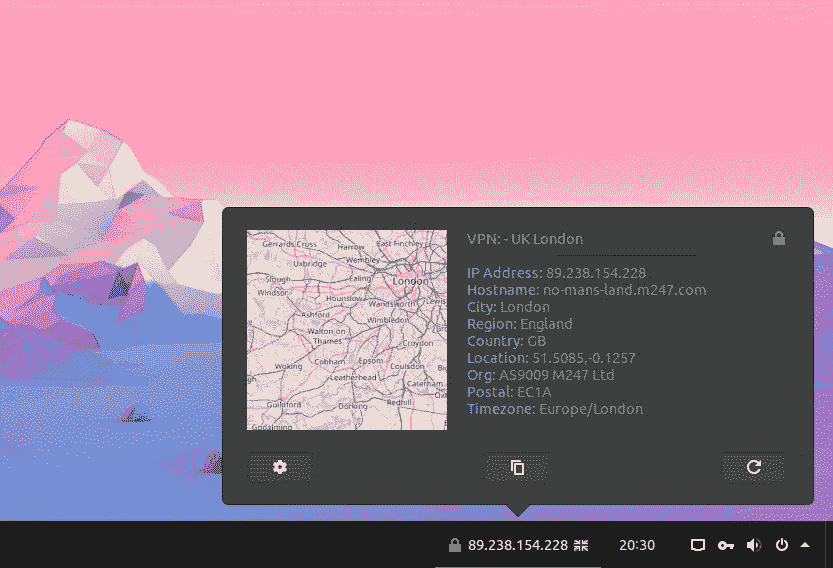
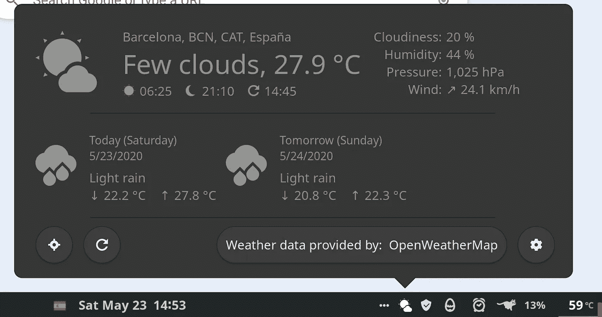

# Gnome 3.36 的五大新扩展

> 原文：<https://levelup.gitconnected.com/top-5-new-extensions-for-gnome-3-36-3f88b92d38d6>

## 使用这些 Gnome 扩展，拥有一台更健康的计算机并改进您在 Linux 中的工作流程

最近，Ubuntu20 采用 Gnome Shell 作为它的默认窗口管理器。这大大促进了 Gnome Shell 扩展的开发。这一点，再加上 Gnome 3.36 中的一些突破性的变化，使得目前一个非常丰富的图形环境得到了发展。出于这个原因，我重新访问了 Gnome 扩展网站，检查新的东西，我非常惊讶。除了对由于 Gnome 3.36 中的变化而损坏的扩展的修复，我发现了一堆非常有用的扩展。

升级到 Gnome 3.36 后，安装了这些额外的扩展和我已经有的扩展，我的顶栏(在我的系统中我把它放在底部，带有有用的扩展 [Dash to Panel](https://extensions.gnome.org/extension/1160/dash-to-panel/) )看起来像这样:

这个条形是在相关时间只有相关信息的几次迭代的结果。我也有其他扩展，不完全创建一个顶栏图标，但这是另一个职位。

因此，在不浪费时间的情况下，我在这里用我的新宠 Gnome 扩展。

# IP 查找器

从 [ArcMenu](https://extensions.gnome.org/extension/1228/arc-menu/) 的创造者，我们有了新的 [IPFinder](https://extensions.gnome.org/extension/2983/ip-finder/) 。这个扩展显示了我们机器的公共 IP 和一面很酷的国旗。这在我们使用 VPN(我们都应该这样做)时特别有用，我们只需看一眼就能得到这些有用的信息。

# RunCat

RunCat 是一个非常简单有趣的程序，已经存在于 Windows 和 Mac 等其他操作系统中，我很高兴看到它移植到 Gnome 上。这是一个典型的 CPU 使用监视器，但是 CPU 的工作负荷越大，它运行得越快。它给你的顶栏带来了乐趣，这对我来说很重要。

人人都爱的滑稽猫

# 番茄定时器(Time++)

有一段时间，我一直在寻找一个容易到达的番茄定时器，我可以不用打开额外的应用程序就可以使用。如果你不熟悉番茄工作法，我把这个链接留给明智的维基百科，但是简单地说，它包括把你的时间分成短的时间段，通常大约 30-45 分钟，然后休息一会儿。在“集中时间”里，你应该集中注意力，不要分心。

所以，有了这个 [Time++](https://extensions.gnome.org/extension/1238/time/) ，你就可以在你的顶栏设置你的 pomodoro 定时器，倒计时马上开始，提醒你正处于深度对焦期。

你的番茄定时器在 runcat 旁边工作。橙色时请勿打扰！

# 系统监视器

系统监视器是一个扩展，可以随时监视最具指示性的指标和传感器。CPU、内存、磁盘 IO、网络流量，以及对我的用例最有用的 CPU 温度和风扇速度。在测量 RAM、网络、磁盘 IO 时，我通常不需要它们来测量我的笔记本电脑(联想 X1 Carbon 第七代)的健康状况。然而，真正重要的是检查处理器温度是否突然达到峰值，这意味着可能发生了某种情况，从机器过热到通风不良。我尽量将温度保持在 50–60 摄氏度左右，当我从事高强度工作，为机器费力搬运时，温度会更高。这一点，结合风扇速度，让我知道我的笔记本电脑受到了多大的影响，并帮助我估计电池将持续多长时间。如果我看到风扇转得很快，而温度仍然很高，我会让它冷却一点。毕竟，健康的电脑寿命很长，使用起来也比沸腾的电脑舒服。

轻松的电脑

一个举重

# 开放天气

我推荐的最后一个顶栏扩展是 [OpenWeather](https://extensions.gnome.org/extension/750/openweather/) 。这个扩展确实如其名:它显示天气，根据你所在地区的天气预报，用图标显示太阳、云等。它还显示各种有用的信息，如日出和日落时间，湿度，未来几天的预测，等等。

只需点击一下鼠标，即可获得有用的天气信息

# 把所有的放在一起

每个人都有不同的工作流程，所以这不是唯一的组织方式。但是不管你的工作流程是什么，重要的是要有一个与之相适应的界面，在正确的时间显示正确的信息，而不要让人分心或过载。探索这一点，并在评论中让我知道你自己的工作流程。请记住，善待你的电脑，你将有更多的时间与它互动，这将立即改善其余的！