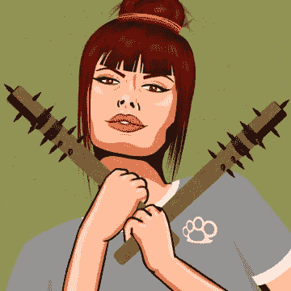
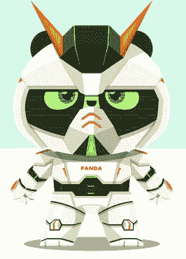
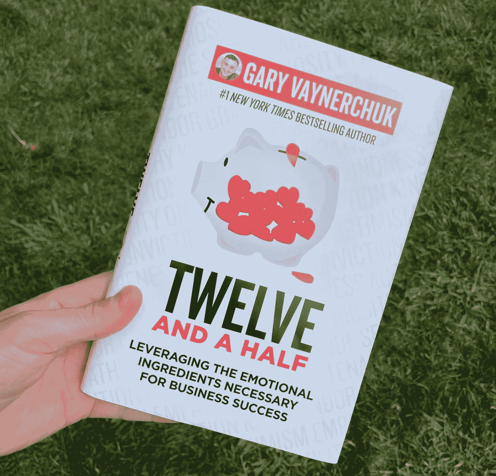
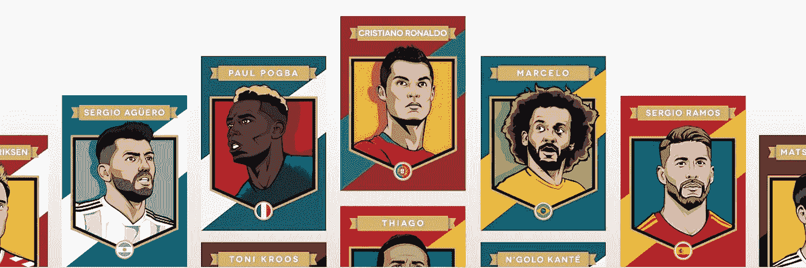

# 350 美元以下的前五大 NFT 项目(0.2ETH)

> 原文：<https://levelup.gitconnected.com/top-5-nft-projects-under-350-0-2eth-61f5c4dd265>

根据 Meta Generation 的数据，截至 2022 年 3 月，Opensea 有 10，325 个活跃的上市收藏，其中 70%的收藏在过去七天没有任何销售记录。

底价低于 1 ETH 的 NFT 项目占 echo 系统的 90%。因此，在熊市中从这个蛇窝中挑选出五个赢家需要一些努力。我当然准备好迎接挑战了。

充分披露，我在所有以下项目的 NFT。我从不谈论与我无关的项目。除非你密切关注这一过程并深入一线，否则很难评估一个项目的潜力。

我也绝不是在提行李。我的 NFT 包已经下跌了 70%，所以现在我的 11 个订户的任何复苏都可能为时已晚。

# 妇女和武器

创始人莎拉·鲍曼是一名伊朗裔美国女性，职业治疗师。在发布了她的 NFT 项目《女人与武器》后，她成为艺术家的毕生梦想终于实现了。

当 Garyvee 在他的 Twitter 页面上分享她的项目时，Sara 和他的搭档 Jake Bauman 在 NFT 空间获得了突出的地位。这对夫妇充满感情的视频回应和无与伦比的艺术是我一头扎进去给自己买几件的原因。我觉得我和他们都有联系。

这个项目有一个巧妙的叙述。这种 20 世纪 50 年代风格的艺术，女性挑逗地咬着嘴唇，手持一对修女吸盘或指关节掸子，与当时的社会规范背道而驰。历史上一个不鼓励女性做好家庭主妇的时代。

如果你读过我的博客，你就会知道我看好一个由女性主导的可靠项目，因为我认为当购买之旅更加直接时，女性将占 NFT 买家的 50%。

# 熊猫地球

关于这个项目是否是中国的第一个 NFT，有很多猜测。2018 年初，《熊猫地球》是首款旨在促进现实世界熊猫保护的虚拟繁殖游戏。

中国开发商在 2018 年底放弃了该项目，使项目陷入瘫痪。结果，15%的熊猫 NFT 变得“灭绝”，元数据存储在失效的服务器上。

在有才华的社区领导的团队添加包装器之前，这个项目不允许在 Opensea 上“列出”或搜索。one discord 中的一个链接将您导航到集合，使这个项目成为 NFTs 中保守得最好的秘密。

该项目可在 Opensea 的“熊猫地球(2018)”下搜索，现在使用销售版税进行保护工作，并在亚洲市场提高对该项目的认识。

我的 2 美分是，艺术是远远领先于它的时间，供应最少在 4500 左右，它是中国的国家动物，在 0.07ETH 的地板上，这有一个镜头。

# 维纳体育通行证

作为家里最有才华的兄弟姐妹，我很同情创始人 AJ Vaynerchuk。当一个有史以来最优秀的企业家本身就是一名杰出的经营者时，被他笼罩在阴影下肯定是一颗难以下咽的药丸。

我在这个项目上投入了大量资金，因为我可以看到市场正在转向公用事业，并最终相信创始人会和他已经成功的公司 Vayner Sports 一起启动这个项目。

意图作为一个“隐形发射”，消息泄露，导致群众试图和薄荷与天文数字的天然气价格收集。然后，你因持有 VSP 而获得的第一个合作伙伴 mint 被延迟，这并不是 AJV 的错。

可以肯定地说，键盘战士们没有退缩。我喜欢看到 FUD 和谢德参与我支持的项目。这创造了一个很好的购买机会，因为你永远不能忽略一个冠军创始人。

# 图书游戏

谈到冠军创始人，兄弟加里创造了图书游戏，这是 NFTs 空投购买他的新书的 12 倍。“十二个半”。

这个关于不可变 X 的项目有太多的神秘，第二层，可以在一个叫做 Token Trove 的市场上买卖。

首先，当人类所知的每个机器人都在前面运行这些机会时，使用第二层解决方案作为允许列表是明智的。这也是错过 Veefriends 系列第一集的人再次品尝苹果的机会。

由于没有汽油费，这些代币在 0.12ETH 处保持稳定的下限，并且可以从 Gary 的收藏中燃烧用于 NFT，使得该项目通货紧缩。

# 被包裹的罢工者

以太坊上有史以来第一个体育 NFT，只有 862 个唯一的所有者和全球 20 亿足球观众，包裹前锋必须是有史以来最被低估的 NFT 项目。

足球卡的实体卡市场在美国更为普遍。收藏家们瞄准了梅西、罗纳尔多以及最近的姆巴佩等空前绝后的球员。但市场其余部分的需求要少得多。

随着对 NFTs 的无边界访问，这种动态可能在未来完全改变。你可以看到来自世界各地的终身英超球迷想要收集他们最喜爱的俱乐部足球运动员，导致巨大的需求。口误，我指的是足球运动员。

***以上都不是理财建议。我不是一个合格的财务顾问，尽管我尽了最大努力，我也无法预测未来。***

***NFT 空间有风险。***

***专家说，目前 99%的项目都在走向 0。***

> 加入 Coinmonks [电报频道](https://t.me/coincodecap)和 [Youtube 频道](https://www.youtube.com/c/coinmonks/videos)了解加密交易和投资

# 另外，阅读

*   [BigONE 交易所点评](https://medium.com/coinmonks/bigone-exchange-review-64705d85a1d4) | [电网交易 Bot](https://coincodecap.com/grid-trading)
*   [氹欞侊贸易评论](https://coincodecap.com/anny-trade-review) | [CoinSpot 评论](https://coincodecap.com/coinspot-review)
*   [新加坡十大最佳加密交易所](https://coincodecap.com/crypto-exchange-in-singapore) | [购买 AXS](https://coincodecap.com/buy-axs-token)
*   [投资印度的最佳加密软件](https://coincodecap.com/best-crypto-to-invest-in-india-in-2021) | [WazirX P2P](https://coincodecap.com/wazirx-p2p)
*   [西班牙 5 大最佳文案交易平台](https://coincodecap.com/copy-trading-spain)
*   [Pionex 双投](https://coincodecap.com/pionex-dual-investment) | [AdvCash 审核](https://coincodecap.com/advcash-review) | [光宗耀祖审核](https://coincodecap.com/uphold-review)