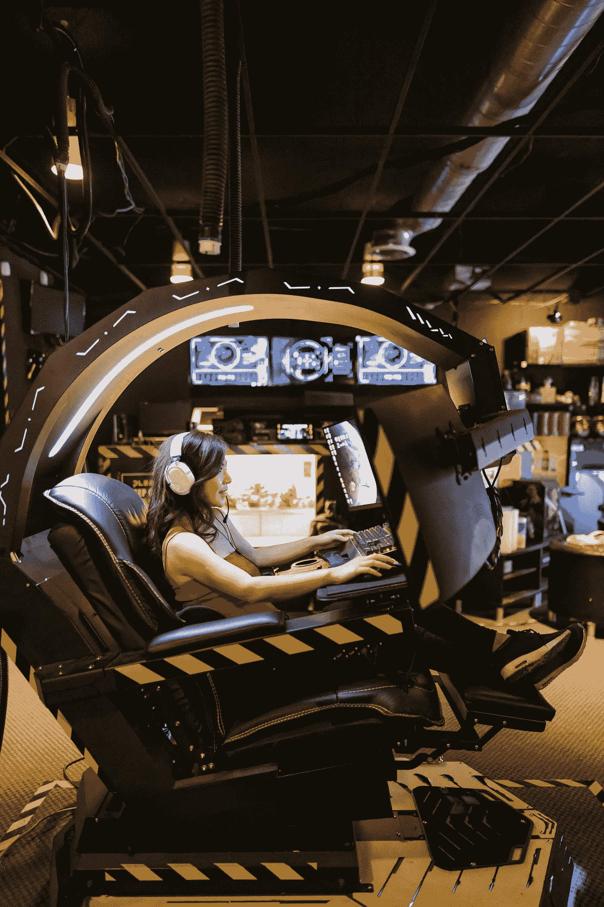

# 前 5 种 NLP 方法，每种方法用不到 10 秒的时间解释

> 原文：<https://levelup.gitconnected.com/top-5-nlp-methods-explained-in-less-than-10-seconds-each-633fb459433b>

额外收获:3 个最流行的 NLP 框架，从简单到复杂(一个在上面！)

来自 Pexels 的 Vickie Intili

风中的羽毛和风中飞舞的羽毛是一回事吗？

## 这句话被认为是爱因斯坦说的，

> “如果你不能简单地解释它，你就不够了解它。”

你对一个算法的所有组成部分理解得越好，我发现你就越容易用它最分解的状态来解释它。然而，并不是所有人都有目标或兴趣在这样的粒度上学习这样的主题:深度学习还是浅层学习。

来自 Pexels 的[米开朗基罗·博那罗蒂](https://www.pexels.com/@michelangelo-buonarroti/)

# **为什么是这种格式？**

机会在于简化极其复杂的方法以达到其根本目的。此外，你们都要求我对一系列人工智能技术进行更简单的解释，并提供相应方法的交叉使用案例或真实世界的例子。我已经把在一些帖子中这样做作为我的目标，当这样一个帖子达到这个目的时，我会在前面这样说。

## **与众不同的定义:自然语言处理(NLP)**

它是计算机理解和解释人类语言的一种方法。就像人类使用语言相互交流一样，NLP 是人工智能和语言学的一个子领域，它采用各种方法和算法来允许计算系统使用自然语言与人类交流。**简单来说，NLP 是如何激活计算系统以实现像人类一样使用自然语言的事情的交集。**

我将这篇文章分成两个部分:首先，谈谈方法。随后，我将澄清几个今天使用的可识别的框架。

来自 Pexels 的金德媒体

# **标记化**

将一串文本分解成小块的过程。记号可以是单词、短语，甚至是单个字符；它被用来简化复杂的任务，如拼写和语法检查系统。纯粹地，把每个单词看作一个“令牌”。

# **词干化和词汇化**

词干提取是将一个单词提取为其基本形式的过程。例如，“图书馆”将被简化为“图书馆”

词汇化类似于词干化——澄清的是，它试图将一个词最小化或简化到它的词根意义。例如，“最好”就是“好”

# **命名实体识别(NER)**

一种从文本中识别命名实体并将它们分类为预定义类别(如人员、组织、位置和时间表达式)的方法。因此，NER 是信息提取的一个子任务，它寻求定位和分类实体。作为例证，见《谷歌送朱迪去巴黎》:人是朱迪；地点是巴黎；组织是谷歌。

由 Pexels 的 [RODNAE Productions](https://www.pexels.com/@rodnae-prod/) 制作

# **情绪分析**

社交媒体、客户体验评论或调查中的陈述有多积极、中立或消极？要确定人们对某事的感受，情感分析是答案。我发现整个 NLP 中情感分析的最大进步，特别是零镜头学习的进步(我将在本文结尾留下我最近发表的关于零镜头学习的帖子。)

# **词性标注**

给句子中的每个单词加上语法功能标签的过程。例如，每个名词都会被标为“主语”或“宾语”动词将根据它们是否表达行为或存在状态而被标记。

这里有两个例子:

这些树长在花园里。在这个句子中，“trees”是名词，“grew”是动词。“in”这个词起介词的作用，描述树木生长的位置。

另一个，“每天，我和我的金斯利一起跑步去学校。”在这个例子中，“我”和“金斯利”都是代词；“跑”是动词表达的动作；“每一天”用副词表示这种情况何时发生。

# **三个框架，从简单到复杂**

来自 Pexels 的 Ron Lach

# **文本块**

Textblob [12]是一个 Python 库，可以阅读和理解书面文本。举个例子，它可以拿“狗坐在垫子上”这样的句子，告诉你“狗”是名词，“坐”是动词，“垫子”是另一个名词。

Textblob 还可以识别给定的单词或短语是肯定的还是否定的。例如，如果我们用 Textblob 分析下面两个短语:

1)昨晚吃饭的时候我过得非常愉快！

我真的一点也不开心。

它会认为第一个短语比第二个短语更积极。

来自 Pexels 的 Pavel Danilyuk

# **天赋**

另一个“库”,用于进行基本上任何部分的 NLP 分析，它是最先进的。它试图使将 NLP 模型应用到你的文本变得容易，例如确定文本中的情感或提取命名实体。

使用它来确定任何评论或文本是正面的还是负面的。也就是说，如果我们有以下评论，“我喜欢这部纪录片！真是太有料了！”天赋可能会预测情绪是积极的。回到 NER，如上所述，它可以从文本中提取人名。例如，给定句子“埃隆·马斯克(Elon Musk)创立了 SpaceX”，Flair 会将“埃隆·马斯克”识别为一个人的名字。

来自 Pexels 的梅森·麦考尔

# **罗伯塔**

一种神经网络[8][9][10]模型，旨在很好地执行自然语言任务，如阅读理解、问题回答和摘要。请注意 Transformer 模型，这是一种适用于 RoBERTa 的深度学习技术(以及许多当今的 NLP 实现)。

来自 Pexels 的[金德媒体](https://www.pexels.com/@kindelmedia/)

# **离别的思念**

我在一系列 NLP 用例中成功实现了 Flair。我喜欢它，因为我可以按原样激活它，而无需应用“预训练”来优化它。

特别是对于 RoBERTa，所有迹象都表明 NLP 的未来将如何受到零射击学习的影响，零射击学习是一种新兴的实施方式，我甚至会提到 state field，它可能会在未来驱动所有的预测分析。

如果你对这篇文章的编辑有任何建议，或者对进一步扩展这个主题领域有什么建议，请和我分享你的想法。

## 另外，请考虑订阅我的每周简讯:

 [## 产品。风险时事通讯

### 产品和人工智能交汇处的想法。让我先读一下产品。风险投资时事通讯…

pventures.substack.com](https://pventures.substack.com) 

我写了以下与这篇文章相关的内容:您可能对它们感兴趣:

# 前 20 个机器学习算法，每个用不到 10 秒钟解释

 [## 前 20 个机器学习算法，每个用不到 10 秒钟解释

### 对 20 个最重要的机器学习算法的简单解释，每个都在 10 秒内完成。

levelup.gitconnected.com](/top-20-machine-learning-algorithms-explained-in-less-than-10-seconds-each-8fd728f70b19) 

# NLP 产品和用户体验指南，简单解释

 [## NLP 产品和用户体验指南，简单解释

### 八个最重要的自然语言处理(NLP)方法及其与产品管理和…

uxplanet.org](https://uxplanet.org/nlp-guide-for-product-and-user-experience-simply-explained-72050abeee73) 

# 零射击学习深潜:如何选择一个和当今的挑战

 [## 零射击学习深潜:如何选择一个和当今的挑战

### 零射击学习演练

pub.towardsai.net](https://pub.towardsai.net/zero-shot-learning-deep-dive-how-to-select-one-and-challenges-60ae243e040a) 

# 自然语言处理中最重要的 3 个数学概念

 [## 自然语言处理中最重要的 3 个数学概念

### 自然语言处理中 3 个最重要的数学概念

medium.com](https://medium.com/illumination/top-3-math-concepts-essential-for-nlp-81f3ac73ab08) 

*参考文献:*

*1。蒂尔贝，阿尼尔。(2022 年 7 月 25 日)。自然语言处理的三个重要数学概念。照明。*[*https://medium . com/illumination/top-3-math-concepts-essential-for-NLP-81 F3 AC 73 ab 08*](https://medium.com/illumination/top-3-math-concepts-essential-for-nlp-81f3ac73ab08)

*2。蒂尔贝，阿尼尔。(2022 年 8 月 4 日)。产品和用户体验的 NLP 指南(UX/UI)。UX 星球。*[*https://medium . com/UX-planet/NLP-guide-for-product-and-user-experience-simple-explained-72050 abeee 73*](https://medium.com/ux-planet/nlp-guide-for-product-and-user-experience-simply-explained-72050abeee73)

*3。蒂尔贝，阿尼尔。(2022 年 8 月 2 日)。20 大机器学习算法。升级编码。*[*https://medium . com/git connected/top-20-machine-learning-algorithms-explained-in-less-10-seconds-each-8fd 728 f 70 b 19*](https://medium.com/gitconnected/top-20-machine-learning-algorithms-explained-in-less-than-10-seconds-each-8fd728f70b19)

*4。阿克比克，a .(未注明)。flair NLP 框架。信息研究所。2022 年 8 月 8 日检索，来自*[*https://www . informatik . Hu-Berlin . de/en/for schung-en/gebiete/ml-en/Flair/Flair*](https://www.informatik.hu-berlin.de/en/forschung-en/gebiete/ml-en/Flair/Flair)

*5。伯特 101。(未注明)。国家的艺术 NLP 模型解释。检索到 2022 年 8 月 8 日，来自*[*https://huggingface.co/blog/bert-101*](https://huggingface.co/blog/bert-101)

*6。Devlin，j .，Chang，m-w，Lee，k .，&# 38；k . toutanova(2018 年 10 月 11 日)。BERT:用于语言理解的深度双向转换器的预训练。ArXiv.Org。*[*https://arxiv.org/abs/1810.04805*](https://arxiv.org/abs/1810.04805)

*7。flairNLP。(未注明)。GitHub — FlairNLP/flair:一个非常简单的自然语言处理(NLP)框架。GitHub。检索到 2022 年 8 月 8 日，转自*[*https://github.com/flairNLP/flair*](https://github.com/flairNLP/flair)

*8。刘，y，奥特，m，戈亚尔，n，杜，j，乔希，m，陈，d，利维，o，刘易斯，m，泽特勒莫耶，l .，&# 38；斯托扬诺夫，V. (2019 年 7 月 26 日)。RoBERTa:稳健优化的 BERT 预训练方法。ArXiv.Org。*[*https://arxiv.org/abs/1907.11692*](https://arxiv.org/abs/1907.11692)

*9。罗伯塔。(未注明)。检索到 2022 年 8 月 8 日，来自*[*【https://huggingface.co/docs/transformers/model_doc/roberta】*](https://huggingface.co/docs/transformers/model_doc/roberta)

10。RoBERTa:一种预训练自监督 NLP 系统的优化方法。(未注明)。2022 年 8 月 8 日检索，来自[*https://ai . Facebook . com/blog/Roberta-an-optimized-method-for-pre training-self-supervised-NLP-systems/*](https://ai.facebook.com/blog/roberta-an-optimized-method-for-pretraining-self-supervised-nlp-systems/)

*11。西伯特/情绪-罗伯塔-大-英语拥抱脸。(未注明)。检索到 2022 年 8 月 8 日，来自*[*https://hugging face . co/siebert/sensation-Roberta-large-English*](https://huggingface.co/siebert/sentiment-roberta-large-english)

*12。TextBlob:简化的文本处理— TextBlob 0.16.0 文档。(未注明)。检索到 2022 年 8 月 8 日，来自*[【https://textblob.readthedocs.io/en/dev/】T21](https://textblob.readthedocs.io/en/dev/)

13。蒂尔贝，阿尼尔。(2022 年 7 月 21 日)。零射击学习深潜。走向 AI。[*https://pub . toward sai . net/zero-shot-learning-deep-dive-how-to-select-one-and-challenges-60ae 243 e 040 a*](https://pub.towardsai.net/zero-shot-learning-deep-dive-how-to-select-one-and-challenges-60ae243e040a)

*14。哈特曼，j .，海特曼，m .，西伯特，c .，&# 38；夏姆普，C. (2022 年)。情感分析的准确性和应用。国际市场研究杂志。*[*https://doi.org/10.1016/j.ijresmar.2022.05.005*](https://doi.org/10.1016/j.ijresmar.2022.05.005)