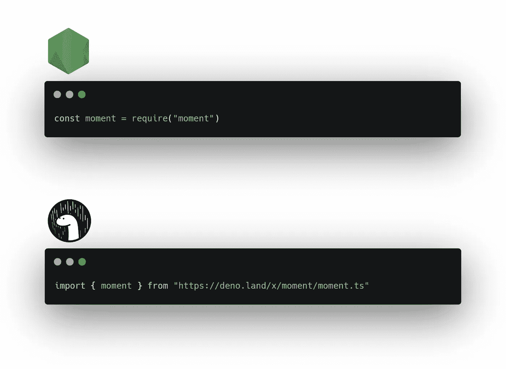
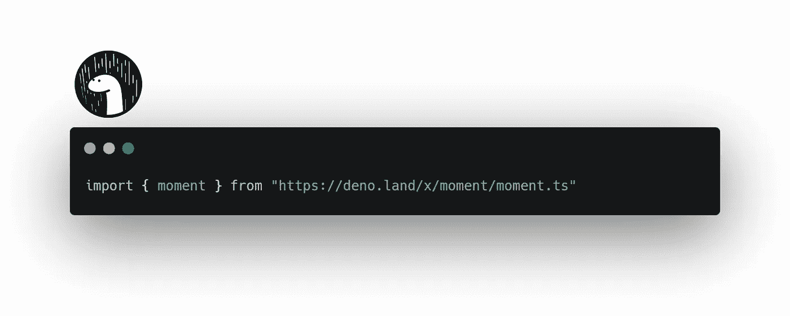
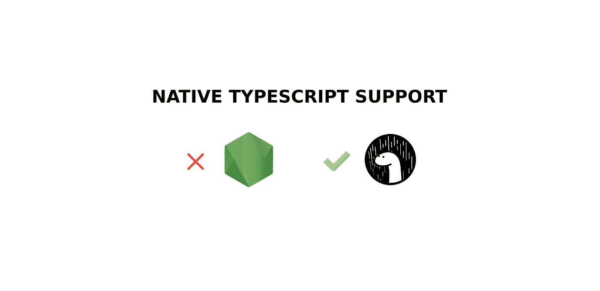
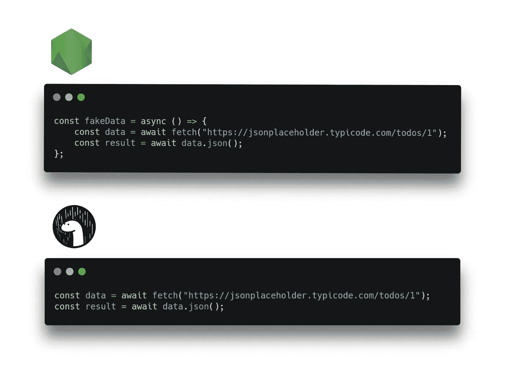
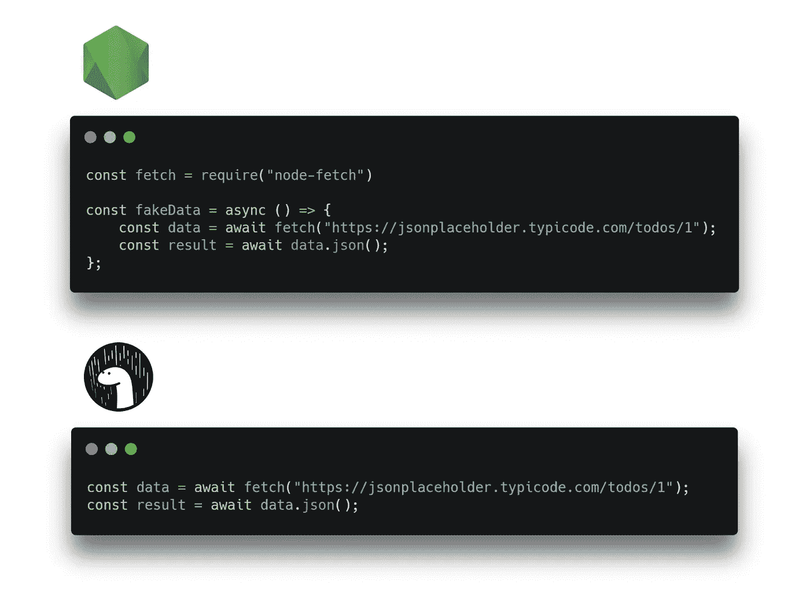

# Javascript 开发人员更喜欢 Deno 而不是 Node 的五大理由

> 原文：<https://levelup.gitconnected.com/top-5-reasons-javascript-developers-prefer-deno-over-node-b1ff01734811>

## 并列比较


NodeJS 的开发者 Ryan Dahl 发布了一个新的运行时，旨在解决 Node 的许多缺点。您的第一反应可能是“哦，太好了，又一个 Javascript 框架？正是我所需要的…”别担心，我也有同样的反应。了解了这些优势之后，我也明白了为什么 Deno 正是 2020 年一个后端 Javascript 开发人员所需要的。让我们来看看 javascript 开发人员在使用 Deno 和 Node 时体验更加流畅和现代的五大原因。

# 1:现代 Javascript — ES 模块



如果你像我一样是 React 开发人员，你会注意到在使用 NodeJS 时导入包的语法是不同的。这是因为 Node 是在 2009 年制作的，从那以后 Javascript 有了很多更新和改进。

在 React(和 Deno)中，我们使用现代的`import package from 'package'`语法，而在 Node 中，我们使用`const package = require("package")`语法。

ES 模块导入的优势有两个原因:
1:使用`import`，你可以有选择地从一个包中只加载你需要的部分，这样可以节省内存。
2:加载是 ***与`require`同步*** ，`import`异步*加载模块，提高了性能。*

*如果你注意到上面的图片，我们正在从一个 URL 导入**时刻**包，这将我们带到 Deno 的下一个优势。*

# *2:分散包*

*有了德诺，你不再依赖 NPM。没错，不再有`package.json`。每个包都是从一个 URL 载入的。*

*在 NodeJS 中，要使用一个包，您必须首先从 NPM 安装它:*

```
*npm i moment*
```

*等待它安装，然后将其包含在您的应用中:*

```
*const moment = require("moment")*
```

*另外，任何时候有人想在本地运行你的 NodeJS repo，他们必须从 NPM 安装所有的依赖项。*

*在 Deno 中，这个包是从一个 URL 导入的，所以如果你想使用 moment，你只需要导入[https://deno.land/x/moment/moment.ts](https://deno.land/x/moment/moment.ts)。*

**

*Deno 软件包的另一个巨大优势是每个软件包在安装后都被缓存在硬盘上。这意味着软件包的安装只发生一次。如果您想再次导入依赖项，无论在哪里，都不必下载它。*

# *3: TypeScript 本机工作，不需要配置*

**

*让 TypeScript 使用 NodeJS 是一个多步骤的过程。您必须安装 typescript，更新 package.json、tsconfig.json，并确保您的模块支持@types。*

*在 Deno 中，你所要做的就是将你的文件保存为。ts 而不是。js，**TypeScript 编译器已经在**中完成了。*

# *4:顶级 await—在异步函数之外使用 await*

**

*在 Node 中，`await`关键字只能在异步函数中访问。*

*有了 Deno，你可以在任何地方`await`任何东西，而不用把它包装在一个异步函数中。几乎所有的 Javascript 应用都包含许多异步函数。这次升级使得代码更加简洁明了。*

# *5:访问浏览器 API(窗口，获取)*

*要用 javascript 发出 HTTP 请求，我们可以使用 Fetch API。
在 NodeJS 中，我们没有访问浏览器 API 的权限，所以我们不能本地调用 fetch 函数。我们必须首先安装软件包:*

```
*npm i node-fetch*
```

*然后导入包:*

```
*const fetch = require("node-fetch")*
```

*只有这样我们才能打电话去取东西。*

*Deno 本身可以访问`window`对象，这意味着你可以直接调用`fetch("https://something.com")`以及浏览器 API 中的任何其他对象，而无需安装任何库。*

*当结合顶级 await 优势时，您现在可以看到 Deno 代码比节点代码简单得多:*

**

*一种更 2020 年的 Javascript 代码编写方式*

# *这还没有结束*

*Deno 还有很多其他优势，比如默认情况下更安全，你可以执行 Wasm 二进制文件，它有很多内置的库，还有很多。*

*本文中提到的所有要点都是相互联系的，共同构成了一个更现代的 2020 后端 javascript 运行时。作为一个反应型开发人员，我与 Deno 产生共鸣。我现在可以使用`import`语法，在任何我想写的地方写`await`，不用配置任何东西就可以使用 TypeScript，甚至不用安装包就可以调用`fetch`。这很简单。*

*Deno 最终会取代 Node 吗？也许吧。这可能需要几年时间。NodeJS 生态系统是巨大的，Deno 要赶上还需要时间。但是 Javascript 开发人员最近在他们的新项目中偏爱 Deno，所以如果你想尽快开始一个新项目，它绝对值得一看。有关如何开始的更多信息，请访问 [deno.land](https://deno.land/)*

*[](https://skilled.dev) [## 编写面试问题

### 一个完整的平台，在这里我会教你找到下一份工作所需的一切，以及…

技术开发](https://skilled.dev)*