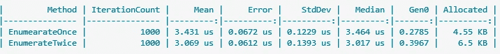

# 六大所谓的性能杀手。网

> 原文：<https://levelup.gitconnected.com/top-6-alleged-performance-killers-in-net-343a66e363b8>

## 这些常见的习惯可能会在您的。NET 应用！

Marc-Olivier Jodoin 在 [Unsplash](https://unsplash.com?utm_source=medium&utm_medium=referral) 上拍摄的照片

英寸 NET，我们不必担心我们的内存使用和垃圾收集，对不对？好吧，如果你不在乎性能，那可能是真的。然而，C#开发人员有一些共同的习惯，在性能和内存使用方面效率很低。到目前为止，这些习惯并不是有意的，只是像你已经学会的那样编码，或者像 C#或某些公共库的文档所建议的那样。

以下是我的 6 大主题，关于你下次在性能和内存使用优化方面面临类似问题时应该注意的内容。

# 介绍

一些优化代码比未优化代码执行得更快的主要原因之一是在[堆](https://learn.microsoft.com/en-us/dotnet/standard/garbage-collection/large-object-heap)和堆栈中更好地分配内存。

那么什么是栈和堆呢？简单来说，`Stack`是一个堆栈，在调用过程中，每个新的方法调用都被堆叠在上面，当方法完成时，就从上面移除。你可以把一个方法想象成一个盒子，放在`Stack`的上面。这个框可能包含变量、指针和指令。

`Heap`可以被看作是一个有点乱的容器，所有更复杂、内存密集型或寿命更长的东西都被临时放在这里。更复杂的对象的读写成本会更高。当对象不再被引用时，它最终会被垃圾收集器从`Heap`中移除。这就是有趣的地方:虽然`Stack`几乎可以完美地清理自己，但`Heap`必须由`[Garbage Collector](https://learn.microsoft.com/en-us/dotnet/standard/garbage-collection/fundamentals)`单独清理，这需要时间和大量的性能成本。

> 在垃圾收集期间，你的应用程序完全停止执行！

如果你不注意，垃圾收集可能会轻松地占用你的应用程序运行时的 2%以上，只是收集未引用的对象，这是很多的。

这就是为什么在执行过程中，你应该注意变量存储在哪里的原因。以下是两条经验法则:

1.  引用类型总是在堆上被实例化。
2.  [值类型](https://learn.microsoft.com/en-us/dotnet/csharp/language-reference/builtin-types/value-types)和[指针](https://learn.microsoft.com/en-us/dotnet/csharp/language-reference/unsafe-code#pointer-types)在声明父的`scope`中实例化。这意味着，当你在引用类型中实例化一个值类型时，它也会在堆中。

# 1.堆栈可能时的堆分配

一个常见的误解是，任何值类型总是放在堆栈内。只有当变量也在堆栈范围内时，这才是正确的。让我们看看下面的例子:

创建一个对象的新实例需要将其存储在堆上，因此必须将任何包含的属性也存储在堆上，这比简单的堆栈分配要慢得多。

对于一些低工作负载的实例，这通常不是问题。然而，当您扩展和初始化数千个类时，一个简单的值类型就足够了，您肯定应该使用它！(有关详细示例，请参见 2。)

# 2.类与结构

与堆和栈分配密切相关的还有决定，是使用`class`还是`struct`作为数据传输对象。不同之处在于，`structs`是值类型，这使得它们能够在`Stack`上分配。但是请记住，值类型也被视为不可变的。这意味着，每次你对它进行修改，或者把它传递给另一个作用域，它都会在内存中被复制。

在 1。我提到过，你应该在栈上分配变量，以获得一些性能。然而，有一个陷阱。当你不注意内存中对象的克隆时，只在栈上工作也可能会减慢你的速度。让我们用一个基准很快地比较一下结构和类。我正在使用 [BenchmarkDotNet](https://benchmarkdotnet.org/articles/overview.html) 。

运行这些基准测试，在我的机器上得到以下结果:

那么这告诉我们什么呢？初始化一个结构似乎比初始化一个类要快得多，而且在堆上也没有分配内存。看起来结构在任何地方使用都是完美的，对吗？让我们创建另一个测试，特别是一个测试，如果我们将结构对象或类对象传递给其他函数，会发生什么:

结果是:

现在，这些班级在表现方面再次领先。正如我上面提到的，当你把一个结构传递给另一个函数时，它会在`Stack`上被克隆，这比仅仅在堆上克隆一个指向类对象的指针要花更多的时间。

那么，我们能从这些基准测试中学到什么呢？有些情况下，结构执行得更好，有些情况下，类执行得更好。实例化类将在堆上分配内存，但是通过其他函数传递它们比每次克隆它们更有效。为了更好地区分，在什么情况下使用什么，我将在未来创建一个关于这个主题的更详细的分析。所以一定要保持更新！

分配的内存将是一个问题，当它被填满到极限时，垃圾收集器就会跳进来。正如我在介绍中所说的，在垃圾收集期间，您的应用程序完全停止工作。这就是为什么您应该始终关注您的堆分配。

# 3.IEnumerable 和 LINQ

IEnumearbles 可能是最常见的性能杀手，因为它们可以很快被错误地使用。影响性能的一个关键因素是枚举 IEnumerables 的次数比你必须枚举的次数多。

让我们来看一个简单的基准测试:

这里我认为第二种方法会慢一些，因为它有一个额外的带有`ToArray()`的枚举。让我们来看看结果:

结果有点令人困惑。对于 1000 个元素，两种方法的执行时间大致相同，第二种方法甚至稍快一些。我们不是刚刚假设，在两次 LINQ 通话之间进行枚举是不好的吗？坏的一面似乎在于内存的使用。如您所见，第二种方法占用了更多的`Heap`分配的内存，这将在运行时后期的垃圾收集期间降低性能。但这就是全部吗？看看下面的方法:

这里我们有一个额外的枚举，即`Count()`。与`EnumerateTwice()`方法的不同之处在于，`Count()`并不返回一个已经枚举的数组，在这个数组上我们可以进一步执行更多的逻辑。相反，我们实际上是在枚举 IEnumerable `half`两次！在这种情况下，这个枚举花费了我们 60%的额外执行时间。

请记住，任何额外的枚举都可能会降低您的速度。但是，枚举中间的 IEnumerables 可能更有效，因为 IEnumerable 的源可能是计算密集型的，如数据库调用或 IO 操作。在这里，你甚至应该在将它传递给其他函数之前对它进行枚举，因为你不容易确保它不会在其他函数中被枚举甚至变异。

# **4。迭代大集合**

经常与 IEnumerables 一起迭代这些集合并执行某种逻辑。最常见的方法当然是`For`和`ForEach`循环，以及`Linq`方法，比如`Select()`。但是遍历列表最快的方法是什么呢？

嗯，看情况。对于小列表，一个`For`循环当然足够了，但是对于真正的大列表，或者每个元素都有复杂的侧面逻辑怎么办？让我们用 BenchmarkDotNet 创建一些基准。
(这些方法归功于【1】

运行这些基准测试会在我的机器上产生以下结果:

如您所见，我使用了普通迭代和并行迭代，以及一种非常不常见的使用`Span<T>`的方法。排除`Span`，我们可以清楚地看到，与顺序方法相比，迭代次数越高，并行方法的性能越好。肯定会有一个点，并行循环将比顺序循环更快，如果边逻辑更复杂，则该点将比本例中更早到达。同样值得注意的是，并行循环的内存分配并不与迭代次数成比例。事实上，对于每次迭代计数，它大致保持不变。

现在让我们来看看`Span`方法。它的速度大约是 for 循环的两倍，并且在所有显示的迭代计数中保持在排名的首位。为什么会这样呢？一个`Span`是一种特殊的 ref 结构，它在`Stack`上被分配，而[代表一个连续的任意内存区域](https://learn.microsoft.com/en-us/dotnet/api/system.span-1?view=net-6.0#spant-and-memory)。这意味着它将被保存在一个连续的内存地址范围内，使得迭代非常简单，因为迭代器知道下一个条目就在下一个内存槽中。

但是，复杂的任务怎么办？

在这里，我从上面提取了性能最好的候选对象，并使它们执行 10 毫秒的异步操作。注意，我不能在`Span`迭代中使用异步/等待方法。这是不允许的，因为`Span`不能处理不同的线程，因此我需要同步处理它。

结果如下:

这里我们可以看到，即使只有 100 个元素(每个操作 10 毫秒)，并行方法也明显领先。

那么我们能从中学到什么呢:

*   当迭代具有不太复杂的侧面逻辑的集合时，`Span`方法是最快的。
*   当迭代和执行更复杂的侧面逻辑时，使用并行方法。

# 5.例外

现在谈谈性能的另一个关键点:异常。

我一直问自己的一件事是，在一个方法周围放置一个不必要的`TryCatch`块是否会对性能产生影响。为此，我创建了以下基准:

在基准测试结果中，我们可以看到，只要没有真正抛出异常，简单使用`TryCatch`不会对应用程序性能产生严重影响。与没有这个块的方法相比，它甚至不会分配更多的内存。然而，影响性能的是抛出一个实际的异常。这让你的速度慢了将近 80 倍！

因此，为了节省性能，尽可能避免异常是非常明智的。这可以通过对不需要的状态进行预防性检查并返回特定的结果而不是错误来实现。一个工会类型将有利于这件事。我强烈推荐查看 NuGet 包`language-ext`:

 [## 代码生成 louthy/language-ext Wiki

### Language-ext 提供了许多代码生成特性，有助于在……

github.com](https://github.com/louthy/language-ext/wiki/Code-generation#discriminated-union--sum-types) 

# 6.**异步/等待**

现在是本文的最后一点:`async/await`的用法。

也许您已经问过自己，当您可以简单地返回底层任务时，使用`await`操作符是否更好？让我们用另一组基准来找出答案:

如您所见，在执行时间上没有区别，在堆分配上有一点点区别。当然，当使用 await 时，你会损失一点点性能，据说是通过创建一个内部状态机，但是你会失去`await`操作符的一个重要优点:异常处理。当您在调用链中不使用 await 操作符，并且任务抛出错误时，异常不会冒泡到错误处理程序，您可能永远也不会知道这个错误。

在这个例子中，我在顶层等待它，但是我也可以只使用`Task.Run()`，错误就会消失。

对于`async/await`来说，另一个重要的问题是，如果您能够同步计算，那么如果您异步进行，性能会有什么影响？

在这个例子中，我生成了 1000 次由十个数字组成的数组。在一种情况下同步，在一种情况下异步。当使用异步调用时，性能影响是显而易见的，这主要是由于创建了一个需要一些计算的任务。

如果我只运行这个任务一次，而不是 1000 次，性能影响就不会那么大了。

总之，你可以说，当使用任务时，只要你没有太多的顺序任务，就不会有严重的性能影响。正如我们在 4 中看到的。并行计算甚至可以显著提高您的性能，因此真正重要的是您如何使用它。除此之外，如果您可以轻松地使用同步方法而不是异步方法，那么同步方法肯定会更快。

特别感谢[尼克·查普萨斯](https://www.youtube.com/c/Elfocrash)在他的频道上提供的详细信息！

[1]:【https://www.youtube.com/watch?v=jUZ3VKFyB-A 

如果您对基准感兴趣，您可以在这里查看我的基准库:

 [## GitHub-TobiStr/基准:堆和堆栈分配用例的基准

### 此时您不能执行该操作。您已使用另一个标签页或窗口登录。您已在另一个选项卡中注销，或者…

github.com](https://github.com/TobiStr/Benchmarks) 

感谢您花时间阅读这篇文章。我希望，你会觉得它有知识性、教育性和趣味性。非常感谢您的支持和参与。

如果您有兴趣了解干净架构、干净编码和最新技术栈的最新趋势、技巧和诀窍，尤其是在 C#环境中。净和有棱角——如果你考虑跟踪我，我会很感激。

祝你有美好的一天！

如果你还没有每天使用媒体来增长你的知识，现在是开始的最佳时机！借助 Medium，您可以轻松获得更多关于高度专业的主题的知识，发布高质量的内容，并接触到更广泛的受众。要开始，只需使用以下链接创建一个中型帐户:

[*现在加入介质*](https://medium.com/@tobias.streng/membership)

通过这样做，你将获得一个强大的平台，可以帮助你联系新的作者和读者，每天学习新的东西。