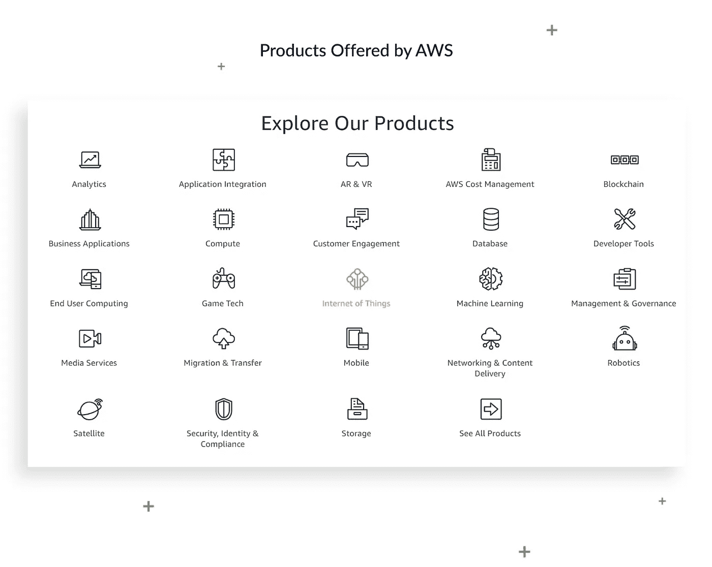
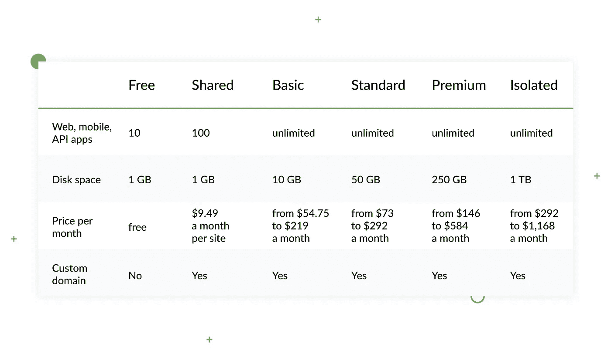
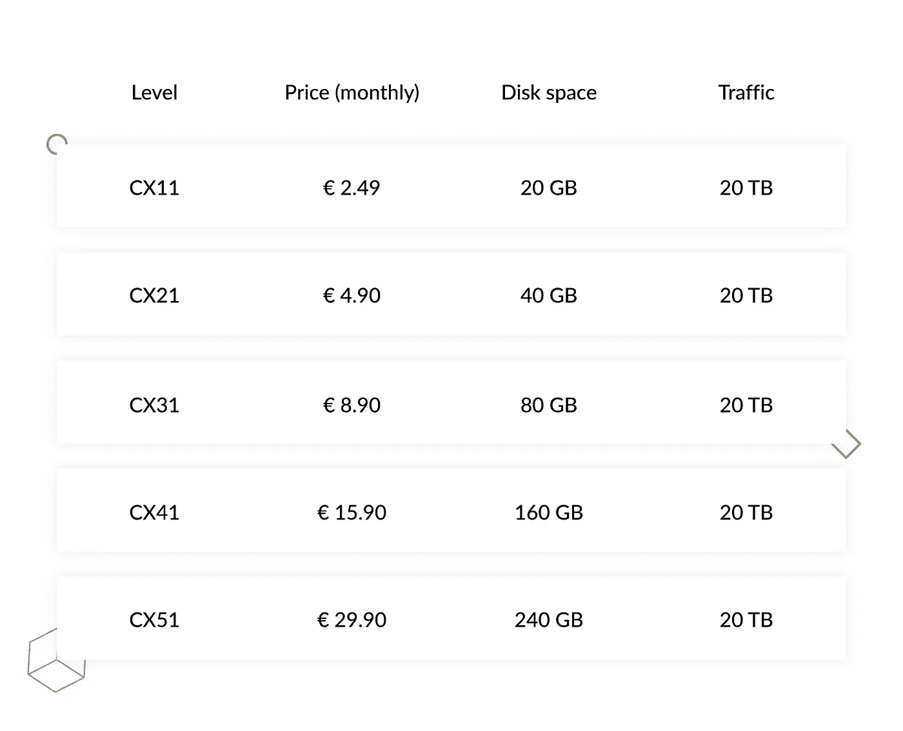
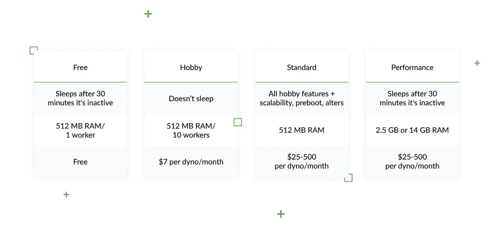
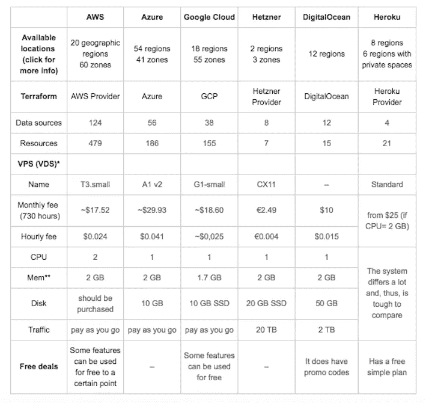

# 如何选择 Django 兼容的托管服务

> 原文：<https://levelup.gitconnected.com/top-6-django-compatible-hosting-services-ee9e6bedbfab>

找到最好的 Django 主机来满足你的所有需求可能是一件大事，但绝对值得努力。此外，尝试不同的选择，看看什么最适合你也是值得的。一些工程师更喜欢使用付费和高功能的服务器，而另一些工程师在(相对)免费服务中找到更多好处，这两种选择都有自己的好处。我们选择了前 6 名的小型、中型和大型 Django 托管服务，这些服务具有各种功能，当然值得考虑。

## 在 Django Stars 博客上阅读这篇文章的原文。

# 大型 Django 虚拟主机公司

# [亚马逊网络服务](https://aws.amazon.com/) (AWS)

AWS 是 Django 最复杂的主机之一。真正让 AWS 脱颖而出的是它的灵活性和功能性。使用其高度可调的构建套件，可以配置应用程序以满足几乎任何需求，并将服务器应用于任何项目和任何目的。对于那些运行大量冗长项目的人来说，这也是一个很好的选择。

借助 AWS，您将涵盖数据存储、内容交付、数据库管理、网络、负载平衡和自动伸缩等方面。如果还忽略了分析、移动开发、测试、开发人员和管理工具以及安全服务，这个列表就不够了。

尽管 Django 托管主要是为了处理 Amazon 客户端(只要他们有相应的基础设施来运行它)，但是对其他用户没有直接的限制。底线是，这是最适合 web 专业人员和那些可能需要真正广泛功能的公司的工具。此外，由于亚马逊跨越了全球基础设施连接的大约 60 个实体，**它特别适合在不同国家设有办事处的大企业。**

在众多的中小规模用户中，AWS 还拥有 Atlassian、Expedia、沃达丰、西门子、飞利浦，还有更多。

**优点:**

*   只要所有数据符合严格的安全标准和 PII，AWS 就是安全和合规的。
*   包含许多有用的工具，如分析和移动服务。
*   通过提供 VPC(虚拟私有云)提供额外的灵活性。
*   它的客户支持是快速和有益的。
*   使用 AWS，很容易运行和扩展您的应用程序(当然，如果它本身是可伸缩的)。
*   在世界各地拥有数据中心。

**缺点:**

*   技术支持是有偿的。
*   丰富的选项可能会使没有经验的用户感到困惑甚至气馁。
*   你为使用资源付费，所以很难预测一天结束时你会被收取多少费用。

## 计划和定价

AWS 定价不是一件容易的事情。

他们的官方网站为初学者提供免费试用和特别优惠。这可能是一个诱人的尝试建议，但请注意，一旦您超过了所选的等级，他们将根据官方的现收现付费率向您收费。

还有一个选项是选择无到期的免费层 AWS 解决方案。然而，由于有限的存储容量，当你开始积聚动力时，这些有额外的好处。

要了解试用期结束后您将要支付的确切(或者更有可能是大概)金额，您应该使用他们网站的“[定价](https://aws.amazon.com/pricing/?nc2=h_ql_pr)页面上的[计算器](https://calculator.s3.amazonaws.com/index.html)。

尽管 AWS 乍一看似乎过于复杂，但对于那些愿意并致力于在这个行业取得进步的人来说，它仍然值得仔细考虑。为了让事情变得简单，你可以看看 [Terraform](https://www.terraform.io/docs/providers/aws/index.html) (一个将文化基础设施实现为代码的工具。)此外，使用[指南](https://www.terraform.io/guides/index.html)可能是 AWS 更深入理解的起点。

# Azure (微软)

微软的 Azure 是一个基于云的平台，主要功能是内容交付网络、媒体服务、web 应用、API 应用等等。总的来说，这项服务可能类似于亚马逊解释中的数字海洋。它还包含了帮助托管 Django 网站的所有必要的工具包。这对于繁忙的网站来说至关重要，尤其是那些每月收到数十亿次请求的网站。

Azure 的案例研究包括惠普、Asos、Adobe、IHG 和空客等公司。

**优点:**

*   多因素认证和其他安全层。
*   价值 200 美元的 30 天信用额度，可免费使用虚拟机 1 年。
*   有人工智能驱动的程序供你使用。
*   它完全可扩展。
*   Azure 由全球 40 多个数据中心托管。
*   花些时间了解它的细微差别，人们可以轻松地使用和部署应用程序。

**缺点:**

*   只有当您对管理数据感兴趣时才有效。
*   缺少恢复模式，这可能只能通过设置新的服务器设置，拉起你卡住的项目数据来解决。
*   让您只与一家供应商合作。
*   对于新用户来说可能难以理解。
*   拥有几乎相同的功能，它可能比其他 Django 主机花费更多。

 [## 用 Django 构建的 10 个流行网站

### 不管你在哪个领域工作，你最重要的任务之一就是创建一个快速、好看的网站…

djangostars.com](https://djangostars.com/blog/10-popular-sites-made-on-django/?utm_source=medium&utm_medium=levelup.gitconnected.com&utm_campaign=django%20hosting%20services&utm_content=you%20may%20also%20like) 

## 计划和定价

虽然微软 Azure 确保它比 AWS 托管服务便宜五倍，但在复杂性、缺乏某些功能甚至价格方面，它肯定会向亚马逊服务让步。然而，这并不妨碍大企业经营它们的业务，如果它们认为这样做足够划算的话。相反，如果你使用微软的其他产品，你会发现它非常有用。

# [谷歌云平台](https://cloud.google.com/)

很明显，这项服务是由谷歌运营的，是一个拥有许多工具的精致产品，从计算、存储、运行大数据分析、机器学习等服务开始。他们专门致力于满足类似于 **Spotify、Lush、强生、可口可乐、索尼音乐、Wix、**等大型企业的需求。一种替代功能云存储，适用于需要在异地安全保存文档的个人和公司。

**优点:**

*   它非常擅长分析和数据存储。
*   与其他谷歌产品配合良好。
*   提供超过 12 个月的 300 美元免费信贷。

**缺点:**

*   每月大约 150 美元的支持费有点高。
*   从谷歌云存储中获取数据将花费每 GB 0.12 美元。
*   有一个复杂的定价方案，很难预测费用。
*   在功能和生产力方面有点落后于 AWS。

使用其他谷歌服务，寻找慷慨的 Django 应用程序托管服务，以及愿意支付昂贵而出色的谷歌支持服务是你应该尝试的主要原因。

## 计划和定价

价格相对较低，区域级每月每 GB 0.020 美元，Coldline 级每月每 GB 0.007 美元。

# 中小型 Django 托管服务

让我们开门见山吧:即使免费的 Django 托管服务确实存在，你也很少会选择它们，因为它们的功能、质量和缺乏支持都不会让你感到惊讶或适合你。然而，一些 Django 主机提供商保证免费试用期，这对客户和主机都同样有利。

## 您可能还喜欢:

 [## 配置 Django 设置:最佳实践

### 本文面向使用 Django 框架的工程师。它对配置 Django 有深刻的见解…

djangostars.com](https://djangostars.com/blog/configuring-django-settings-best-practices/?utm_source=medium&utm_medium=levelup.gitconnected.com&utm_campaign=django%20hosting%20services&utm_content=you%20may%20also%20like)  [## 将 Django ORM 与 SQLAlchemy 合并以简化数据分析

### Django 产品的开发通常简单明了:优秀的文档，许多现成的工具…

djangostars.com](https://djangostars.com/blog/merging-django-orm-with-sqlalchemy-for-easier-data-analysis/?utm_source=medium&utm_medium=levelup.gitconnected.com&utm_campaign=django%20hosting%20services&utm_content=you%20may%20also%20like) 

# [赫茨纳](https://www.hetzner.com/)

Hetzner 是一家总部位于德国的组织，在德国和芬兰都有数据中心。当访问他们的网站时，首先映入眼帘的是其陈旧的网页设计，但这并不妨碍该公司提供广泛的服务，如 SSL 证书、专用服务器、vServers、无限带宽、存储盒、域名注册等。总的来说，对于那些了解主机规格的人来说，Hetzner 是一个明智的解决方案，因此知道他们到底想从主机上得到什么。

**Hetzner 被 Leoni、Autodoc、Showmax、Bitdefender、Outdooractive 等广泛使用。**

**优点:**

*   无论是小型项目还是大型项目，它的费用可能都是最实惠的。
*   与戴尔和英特尔的合作意味着高质量的软件。
*   是相对可扩展的。
*   给免费域和 SSL。
*   支持是免费的，全天候可用。
*   **具有易于配置的现成图像。**

**缺点:**

*   试图在德国以外通过电话寻求支持可能会很昂贵。
*   在服务器故障的情况下没有补偿。
*   不提供传统的正常运行时间保证。
*   提供了一个笨拙的网络界面和一个非常有限的控制面板。
*   **他们在美国没有任何数据中心。**
*   技术文档仅提供德语版本。

## 计划和定价

赫茨纳最吸引人的地方之一是它的可负担性。使用 Django 托管可能会非常便宜。不过，它允许从第 9 级(cx41)开始使用 Python 进行 web 托管。以下是大致费用清单:

# [数字海洋](https://www.digitalocean.com/)

DigitalOcean 不亚于谷歌云平台、亚马逊网络服务和 Azure 的体面竞争对手。这个云服务平台在简单性、快速加载时间(使用 SSD 存储及其 8 个数据中心)和安全性方面是一个相当好的托管提供商。它还提供了直观的界面和简单的设置。首先，它同样适合有基本需求的新手和有经验的企业。

Lytham Labs、QuoDeck、Fanout、Accern、TaskRabbit 和许多其他组织多年来一直愉快地使用数字海洋服务。

**优点:**

*   具有非常简单、用户友好的设置。
*   在美国、英国、新加坡和荷兰拥有 9 个数据中心。
*   没有你可能不知道的额外服务的隐藏费用。
*   全天候的出色支持。
*   拥有实惠的价格政策。
*   人们可以免费试用 60 天的云主机。

缺点:

总体而言，涵盖多个方面，DigitalOcean 并没有明显的缺点。价格和覆盖面都不错。

## 计划和定价

根据配置不同，包月费从 5 美元到 960 美元不等。

总而言之，根据价格和有效性，它可能是 Linux 开发人员的最佳解决方案，尽管它不提供任何分析、配置管理或托管数据库。

# [Heroku](https://devcenter.heroku.com/)

在这里，你不会发现很多装饰和幻想，但 Heroku 仍然拥有 PaaS 架构，Python，Ruby，Java 和 PHP 支持，加上插件和数据库。它具有应用程序指标、代码和数据回滚、实时洞察、GitHub 集成等功能。Heroku 与众不同之处在于，它提供了一种设置和配置元素的简单方法，从而提高了参与度和生产率。**最适合中小型公司。**

**优点:**

*   快速上传、更新和部署项目非常容易。
*   在美国和欧洲拥有数据中心。
*   提供非常好的支持服务。
*   Heroku 的基础设施由亚马逊的安全数据中心管理。
*   是主机服务中的一个多语言平台，所以你可以选择你需要的语言。
*   容易追根究底。

**缺点:**

*   如果你变得更大，将比其他副总裁花费更多。
*   与应用服务器的兼容性远非完美。
*   只要 Heroku 提供自己的基础设施解决方案，切换到另一台服务器可能会有挑战性。

## 计划和定价

所有付费计划都遵循现收现付模式。

总的来说，Heroku 非常好地帮助你从一开始就快速起步，但在更高级的水平上可能会有所阻碍。如果你的目标仅仅是发布一个产品，这可能是最好的选择。

# 把它包起来

为自己选择一个完美的托管服务是一件大事。然而，通过反复试验，您可以找到最适合您特定需求的产品。

因此，如果你还没有为 Django 找到自己的最佳主机，让我们来看看强大主机的要素:

*   允许定制的可扩展性；
*   无论发生什么，您都可以获得坚实的技术支持；
*   安全站点认证，确保可靠性；
*   免费域名供您使用；
*   更高可靠性的退款保证；
*   不同国家的多台服务器。

这些特性并不都是完全标准的，但是它们可能会提示您这台或那台主机是否值得一试。总的来说，我们建议你仔细看看这些 Django 兼容的提供者，选择那些最适合你的企业规模、目标、背景和个人偏好的。

在评估这些 Python & Django 兼容的 web 托管服务时，强调它们在不同层面挖掘潜力是至关重要的。虽然你可以选择 Heroku 和 DigitalOcean 作为中级甚至入门级产品，但 Hetzner 可能需要你更加精明。AWS、Azure 和谷歌云服务也是如此:这些服务功能广泛，费用高昂，更适合有高级需求的大公司。

**每项服务在该地区工作时德国的 VPS 价格*

**针对最低速率执行的 CPU 比较*

> *这篇关于* [***django 托管服务***](https://djangostars.com/blog/top-django-compatible-hosting-services/?utm_source=medium&utm_medium=levelup.gitconnected.com&utm_campaign=django%20hosting%20services&utm_content=django%20hosting%20services) *的文章是由 Django Stars 的后端开发者****Denis Podlesniy****撰写的。*

 [## 学习 Python -最佳 Python 教程(2019) | gitconnected

### Python 是一种动态的通用编程语言，在许多领域都有应用，包括 web 开发、数据科学…

gitconnected.com](https://gitconnected.com/learn/python)