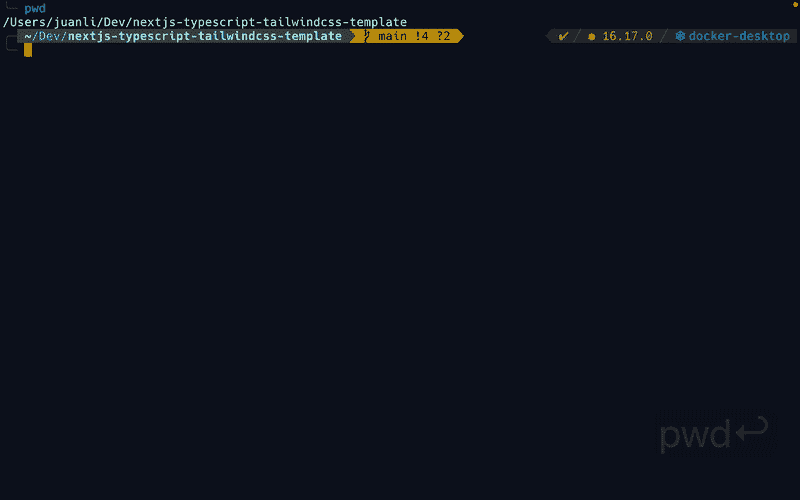
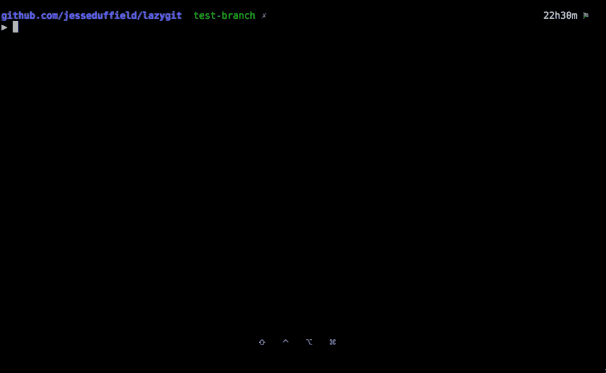
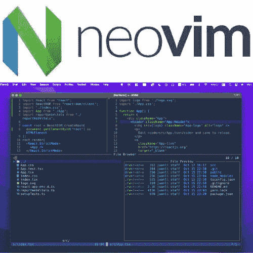

# 让 Neovim 成为一个拥有 3 大插件的智能编辑器，提升你的开发工作流程

> 原文：<https://levelup.gitconnected.com/top-6-neovim-plugins-to-level-up-your-development-workflow-3605deb2ed05>

## LSP 相关的特性、文件管理和 git 管理。



使用 Neovim 进行 Next.js 项目。GIF 由$ brew install jesseduffield/lazygit/lazygit

在[jesseduffield/lazy git # home brew](https://github.com/jesseduffield/lazygit#homebrew)中找到更多安装选项。

**使用 Lazygit**

在 git 存储库(您的项目)内的终端中调用`lazygit`。

```
$ lazygit
```

**作者演示 lazygit 的用法(**[**jesseduffield/lazy git**](https://github.com/jesseduffield/lazygit)**):**



信用:[https://github.com/jesseduffield/lazygit](https://github.com/jesseduffield/lazygit)

# 包裹

本文涵盖了 Neovim 用户的三个重要特性——智能代码、文件管理和 Git 管理。拥有一个定制的文本编辑器和强大的 vim 文本编辑器对于我们的日常编码工作非常重要。希望它们也能对你的项目有所帮助。

感谢阅读。

享受与 Neovim 的合作。



[*如果你想在 Medium 上阅读来自*](https://medium.com/@amy-juan-li/membership)[](https://medium.com/u/9f2dc23bfffa?source=post_page-----3605deb2ed05--------------------------------)**和成千上万其他作家的每一个故事，考虑成为 Medium 会员* *。每月 5 美元，你可以无限制地访问媒体内容。如果你* [*通过我的推荐链接*](https://medium.com/@amy-juan-li/membership) *报名，我会得到一点佣金。**

# *进一步阅读*

*[](https://amy-juan-li.medium.com/a-step-by-step-guide-to-configuring-lsp-in-neovim-for-coding-in-next-js-a052f500da2) [## 在 Neovim 中为 Next.js 中的编码配置 LSP 的分步指南

### 智能代码完成，漂亮的诊断等。

amy-juan-li.medium.com](https://amy-juan-li.medium.com/a-step-by-step-guide-to-configuring-lsp-in-neovim-for-coding-in-next-js-a052f500da2) [](https://amy-juan-li.medium.com/how-i-learned-to-love-vim-9b7fe53a4615) [## 我是如何学会爱上 Vim 并在一个月内从 VS 代码过渡到 Neovim 编码工作流的

### 快速过渡到基于 Vim 的文本编辑器是正确的选择！

amy-juan-li.medium.com](https://amy-juan-li.medium.com/how-i-learned-to-love-vim-9b7fe53a4615)*