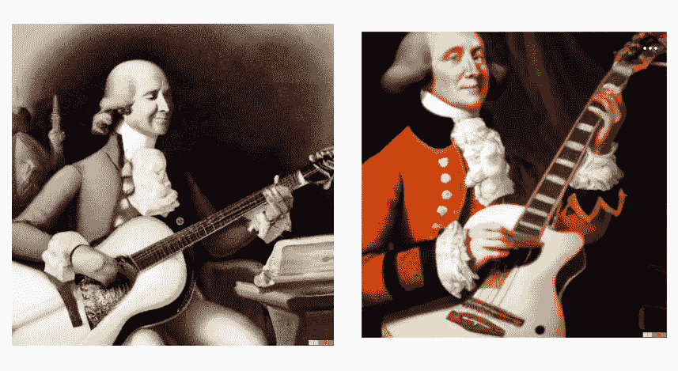

# 7 大深度学习方法，每种方法用不到 10 秒钟的时间解释

> 原文：<https://levelup.gitconnected.com/top-7-deep-learning-methods-each-explained-in-less-than-10-seconds-3683120de455>

对 7 个最重要的深度学习算法的简单解释，每个都在 10 秒内完成。

[作者创作](https://medium.com/@AnilTilbe)

根据这么多帖子，深度学习仍然是一个深刻的黑暗秘密。让我们简化它，让它像冬天一样光秃秃。

化繁为简至关重要，尤其是如果你是专家的话。举例来说，这句话(通常是这么说的)是爱因斯坦说的，

“如果你不能简单地解释它，你就不够了解它。”

随着时间的推移，你对算法的所有组成部分理解得越好，我就知道我首先需要成为一名专家。我能够进一步简化，因为我已经花了大量时间开夜车来理解深度学习的这些子领域。

来自 Pexels 的马修斯·贝尔泰利

# **为什么选择这种格式来解释？**

仅仅是这个主题本身，即使是在人工智能社区内，也是如此复杂，因为太多的专家驻留在进行深度分析或研究的领域(他们非常深入地理解跨深度学习的特定方法、方法和建模)——我们花在教育上的时间越来越少(也许更多的时间在做)。如果你问十个人工智能从业者如何定义深度学习，他们的回答可能会告诉你他们的专业技能范围，以及他们如何实施深度学习。我每天都看到这种情况。即使在很高的层面上，人们也经常混淆机器学习和自然语言处理。

来自 Pexels 的 cottonbro

# **不是你每隔一个定义:深度学习**

深度学习是机器学习的一个子集，它使用算法来模仿人脑的工作方式。深度学习网络可以通过分析数据并根据找到的模式进行预测来进行自我学习。

例如(就此而言，这只是许多插图中的一个*，多个插图*，想象你想教如何识别不同的动物。你可以展示动物的图片，并说出每种动物的名字。通过足够的练习，我们有可能在没有事先被明确告知的情况下，看到一张动物图片并预测它是什么。给定一些数据，深度学习网络可以学习识别模式(用于进行预测)，而无需明确(或具体)用这种洞察力编码。

最近的进步(例如，我已经在 Medium 上写了几次关于零距离学习的文章)，真的改变了需要多少数据，如果有的话。然而，在少量学习或其他方法的环境中，在实现之前先学习，上面的例子是适用的。

适合深度学习的一些常见任务示例包括:图像识别、面部检测、图像或视频中的对象识别。

由来自佩克斯的[汉弗莱·穆莱巴](https://www.pexels.com/@goodcitizen/)

# **深度学习 vs 自然语言处理**

深度学习是一种机器学习技术，它与计算系统一起工作，在没有显式编程的情况下做事情。自然语言处理是人工智能、计算机科学和语言学的一部分，涉及计算机和人类(自然)语言之间的交互。

深度学习的两个例子是图像识别和面部识别。自然语言处理的两个例子是文本分类和情感分析。

# **机器学习 vs .深度学习**

深度学习是机器学习的一个子集。机器学习是你给计算系统一些数据，它试图从数据中学习做一些事情，比如预测接下来会发生什么。深度学习是指计算系统从数据中学习，并通过在数据中形成模式来开始理解事物如何工作。例如，深度学习算法可能能够查看猫和狗的图片，并通过查看它们来识别哪些是猫和狗(而常规的机器学习算法需要有人告诉它图片 A、B 和 C 都是猫，然后它才能开始将其他图片识别为猫)。

这些是模型。

来自 Pexels 的 Mirco 暴力模糊

# **人工神经网络**

人工神经网络是一种模仿人脑处理信息的方法[6][7]。人工神经网络[17]的基本单元是神经元，它接收来自其他神经元的输入，然后基于该输入产生输出[8]。

继续猫和狗的类比，想象你正试图识别一幅图像是否包含一只猫。计算系统可能会查看图像中的像素，并尝试将它们与猫的已知模式进行匹配。相反，人工神经网络将接受猫(和非猫)的许多不同图像，并学习识别区分猫和其他物体的特征。

作为另一个例子，假设你想创建一个程序，可以生成新的英语句子。要用传统的编程方法做到这一点，您需要编写关于语法和词汇用法的规则。然而，有了人工神经网络，你可以简单地向它提供大量现有英语句子的例子，让它学习句子结构是如何工作的。

来自 Pexels 的懒惰艺术家画廊

# **卷积神经网络**

神经网络是一组可以学习识别模式的连接节点[18]或神经元。卷积神经网络是一种特殊的神经网络，用于处理图像[6]。

例如，假设你想教一个孩子如何识别字母 A。你可以给他们看一堆不同字体和大小的 A 的不同图片，最终，他们会学会识别字母 A，不管它看起来像什么。同样，您可以通过向卷积神经网络显示许多包含字母 A 的图像示例来训练它。最终，它将学习如何识别字母 A，无论它出现在图像中的什么位置，它显示的大小或它使用的字体。

卷积神经网络通常用于面部识别和图像中的对象检测等任务，因为它们擅长在图像中的任何位置找到模式，而不管其位置或大小。为了扩大对图像的关注，他们着眼于图像的小部分或“大块”，并试图识别其中的内容。例如，如果你向卷积神经网络展示一张狗的图片，它可能会学习识别狗的头部、耳朵和眼睛的形状。当它看到另一张形状相同但排列不同的图片时(就像一只不同品种的狗)，它仍然可以说它是一只狗。

由来自佩克斯的[何懒艺术家画廊](https://www.pexels.com/@thelazyartist/)

# **长短期记忆(LSTM)模型**

长期短期记忆(LSTM)模型是一种人工神经网络，可以记住长序列的数据[6]。这对于预测句子中的下一个单词或理解对话的上下文等任务很有帮助。

例如，想象你正在阅读一本书。LSTM 模型将能够跟踪哪些单词已经被使用过，因此它可以预测下一个单词可能会出现。类似地，如果有人对你说，“我今天感觉非常沮丧，”LSTM 模型可以理解这个人可能很沮丧，因为他们使用了像“沮丧”和“真的”这样的词

LSTMs 是一种从经验中学习神经网络[16]。就像人一样，他们可以长时间记住事情。例如，如果你想预测一个句子中的下一个单词，LSTM 会查看前面的单词，并用它们来猜测下一个单词可能是什么。

来自 Pexels 的懒惰艺术家画廊

# **深度堆叠自动编码器**

自动编码器是一种神经网络，它将数据作为输入，并尝试输出相同的数据。深度堆叠自动编码器是一种在输入和输出层之间有多层的自动编码器[8]。这允许自动编码器学习输入和输出数据之间更复杂的关系。

例如，想象你有一张人脸的图像。一个简单的自动编码器可能只是试图复制图像中的像素。然而，深度堆叠的自动编码器(相比较而言介于两者之间)可以学习面部的不同部分(眼睛、鼻子、嘴)如何相互关联，以在图像作为输出显示时应用于重建这些关系。

另一个例子是，如果您有描述不同杂货店商品的数据点(如重量、颜色和价格)。深度堆叠的自动编码器可以了解不同的特征如何相互关联，并在输出数据时重新创建这些关系。

# **受限玻尔兹曼机器**

受限玻尔兹曼机器(RBM)是一种人工神经网络，可以学习复制数据[9][10]。例如，如果你向一台受限的玻尔兹曼机器展示许多狗的图片，它最终会学会识别图片中的模式，并生成看起来逼真的新狗图片。另一个例子是，如果你向一台受限的玻尔兹曼机器展示大量不同的英语单词，它会学习这些单词如何组合的模式，并最终能够生成新的英语单词。具体到图像，RBM 已显示在图像去噪的应用。

来自 Pexels 的 Anton Trava

# **深度信念网(DBN)**

深度信念网(DBNs)是一种人工智能，可以学习识别数据中的模式。例如，一只 DBN 可以被训练来观察人脸图片，并识别哪些特征属于哪个人。

可以使用深度信念网络的其他例子包括:

-识别手写数字

-发现金融交易中的欺诈行为

-控制机器人

从技术角度来说，DBNs 是一种生成性人工神经网络，它试图学习高维数据的概率分布[11]。它们已经被用于计算机视觉和自然语言处理(NLP)实现管道的实现。

来自 Pexels 的懒惰艺术家画廊

# **稀疏编码和变换**

让我们从这个例子开始:作为一个例子，如果你有一串从 1 到 10 的数字，但是有一些数字丢失了(2，4，6)，一个转换可以填充这些空白，使数字 1 到 10 再次按顺序排列。一般来说，稀疏编码是一种使用非常少的神经元来表示信息的神经编码类型[12]。这意味着每个神经元的权重或重要性更低，整个网络可能更有效率[13][14][15]。

来自 Pexels 的[金德媒体](https://www.pexels.com/@kindelmedia/)

# **离别的思念**

让我们言简意赅:如果你对这篇文章的编辑有任何建议，或者对进一步扩展这个主题领域有什么建议，请和我分享你的想法。

另外，请考虑*[***订阅我的每周简讯***](https://pventures.substack.com)*

* [## 产品。风险时事通讯

### 产品和人工智能交汇处的想法。点击阅读产品。投资时事通讯，作者安尼尔…

pventures.substack.com](https://pventures.substack.com) 

我写了以下与这篇文章相关的内容:您可能对它们感兴趣:

# 前 20 个机器学习算法，每个用不到 10 秒钟解释

 [## 前 20 个机器学习算法，每个用不到 10 秒钟解释

### 对 20 个最重要的机器学习算法的简单解释，每个都在 10 秒内完成。

levelup.gitconnected.com](/top-20-machine-learning-algorithms-explained-in-less-than-10-seconds-each-8fd728f70b19) 

# NLP 产品和用户体验指南，简单解释

 [## NLP 产品和用户体验指南，简单解释

### 八个最重要的自然语言处理(NLP)方法及其与产品管理和…

uxplanet.org](https://uxplanet.org/nlp-guide-for-product-and-user-experience-simply-explained-72050abeee73) 

# 零射击学习深潜:如何选择一个和当今的挑战

 [## 零射击学习深潜:如何选择一个和当今的挑战

### 零射击学习演练

pub.towardsai.net](https://pub.towardsai.net/zero-shot-learning-deep-dive-how-to-select-one-and-challenges-60ae243e040a) 

# 金融工程十大基本深度学习模型

 [## 金融工程十大基本深度学习模型

### 金融工程中这些方法的 10 个基本深度学习(DL)模型和用例。

medium.datadriveninvestor.com](https://medium.datadriveninvestor.com/top-10-essential-deep-learning-models-for-financial-engineering-ca550fcff91) 

*参考文献:*

*1。蒂尔贝，阿尼尔。(2022 年 7 月 25 日)。自然语言处理的三个重要数学概念。照明。*[*https://medium . com/illumination/top-3-math-concepts-essential-for-NLP-81 F3 AC 73 ab 08*](https://medium.com/illumination/top-3-math-concepts-essential-for-nlp-81f3ac73ab08)

*2。蒂尔贝，阿尼尔。(2022 年 8 月 4 日)。产品和用户体验的 NLP 指南(UX/UI)。UX 星球。*[*https://medium . com/UX-planet/NLP-guide-for-product-and-user-experience-simple-explained-72050 abeee 73*](https://medium.com/ux-planet/nlp-guide-for-product-and-user-experience-simply-explained-72050abeee73)

*3。蒂尔贝，阿尼尔。(2022 年 8 月 2 日)。20 大机器学习算法。升级编码。*[*https://medium . com/git connected/top-20-machine-learning-algorithms-explained-in-less-10-seconds-each-8fd 728 f 70 b 19*](https://medium.com/gitconnected/top-20-machine-learning-algorithms-explained-in-less-than-10-seconds-each-8fd728f70b19)

*4。蒂尔贝，A. (2022 年 7 月 28 日)。金融工程中 10 个必不可少的深度学习。数据驱动投资者。*[*https://medium . datadriveninvestor . com/top-10-essential-deep-learning-models-for-financial-engineering-ca 550 fcff 91*](https://medium.datadriveninvestor.com/top-10-essential-deep-learning-models-for-financial-engineering-ca550fcff91)

*5。Sattari，M. T .，Apaydin，h .，Band，S. S .，Mosavi，a .，&# 38；普拉萨德河(未标明)。基于核方法与人工神经网络和深度学习方法在月参考蒸散估算中的比较分析。水文学和地球系统科学，25(2)，603–618。*[*https://doi.org/https://doi.org/10.5194/hess-25-603-2021*](https://doi.org/https://doi.org/10.5194/hess-25-603-2021)

*6。蒂尔贝，阿尼尔。(2022 年 7 月 24 日)。10 个最重要的递归神经网络。走向 AI。*[*https://pub . toward sai . net/10-of-the-most-important-recurrent-neural-networks-for-ai-8de 9989 db 315*](https://pub.towardsai.net/10-of-the-most-important-recurrent-neural-networks-for-ai-8de9989db315)

*7。理查兹、利利拉普、博多因、本吉奥、博加兹、克里斯滕森、克洛帕斯、科斯塔、伯克、德、甘古里、吉隆、哈夫纳、凯佩克斯、克里格斯科特、莱瑟姆、林赛、米勒、瑙德、帕克、……科丁。(2019).神经科学的深度学习框架。自然神经科学，22(11)，1761 年至 1770 年。*[*https://doi.org/10.1038/s41593-019-0520-2*](https://doi.org/10.1038/s41593-019-0520-2)

*8。包，魏，岳军军，&# 38；饶毅(2017)。使用堆叠自动编码器和长短期记忆的金融时间序列的深度学习框架。PLOS 一号，12(7)。*

**9。菲舍尔，&# 38；伊格尔。(2012 年 1 月 1 日)。受限玻尔兹曼机导论。施普林格柏林海德堡。*[*https://link . springer . com/chapter/10.1007/978-3-642-33275-3 _ 2*](https://link.springer.com/chapter/10.1007/978-3-642-33275-3_2)*

**10。基于期望能量的受限玻尔兹曼分类机。(未注明)。神经网络，64，29–38。*[*https://doi.org/10.1016/j.neunet.2014.09.006*](https://doi.org/10.1016/j.neunet.2014.09.006)*

**11。自主越野驾驶远程视觉系统中的深度信念网学习。(未注明)。IEEE Xplore。检索到 2022 年 7 月 27 日，来自*[【https://ieeexplore.ieee.org/abstract/document/4651217/】T21](https://ieeexplore.ieee.org/abstract/document/4651217/)*

*12。变换不变稀疏编码。(未注明)。IEEE Xplore。检索到 2022 年 7 月 27 日，来自[*https://ieeexplore.ieee.org/abstract/document/6064547*](https://ieeexplore.ieee.org/abstract/document/6064547)*

**13。Evtimova，k .，&# 38；纽约州勒村(2021 年 12 月 16 日)。使用方差正则化的多层解码器的稀疏编码。ArXiv.Org。*[*https://arxiv.org/abs/2112.09214*](https://arxiv.org/abs/2112.09214)*

**14。布拉德利等。可微分稀疏编码。*[*https://kilthub . CMU . edu/articles/journal _ contribution/Differential _ Sparse _ Coding/6552635/files/12033980 . pdf*](https://kilthub.cmu.edu/articles/journal_contribution/Differential_Sparse_Coding/6552635/files/12033980.pdf)*

**15。Kubilius，j .，Schrimpf，m .，Kar，k .，Rajalingham，r .，Hong，h .，Majaj，n .，Issa，e .，Bashivan，p .，Prescott-Roy，j .，Schmidt，k .，Nayebi，a .，Bear，d .，Yamins，D. L .，&# 38；迪卡洛，杰杰(未注明)。高性能浅层递归神经网络的类脑物体识别。神经信息处理系统进展，32。**

*16。陈，杨，钟，王，张，孙建清，&# 38；赵，X. (2016 年 1 月 1 日)。移动人体活动识别的 LSTM 网络。亚特兰蒂斯出版社。[*https://www . Atlantis-press . com/proceedings/icaita-16/25849464*](https://www.atlantis-press.com/proceedings/icaita-16/25849464)*

*17。什么是人工神经网络，我们为什么需要它？。[*https://kids . frontiersin . org/articles/10.3389/frym . 2021.560631*](https://kids.frontiersin.org/articles/10.3389/frym.2021.560631)*

*18。数据挖掘技术|数据挖掘教程。[*https://wide skills . com/data-mining-tutorial/data-mining-techniques*](https://wideskills.com/data-mining-tutorial/data-mining-techniques)**