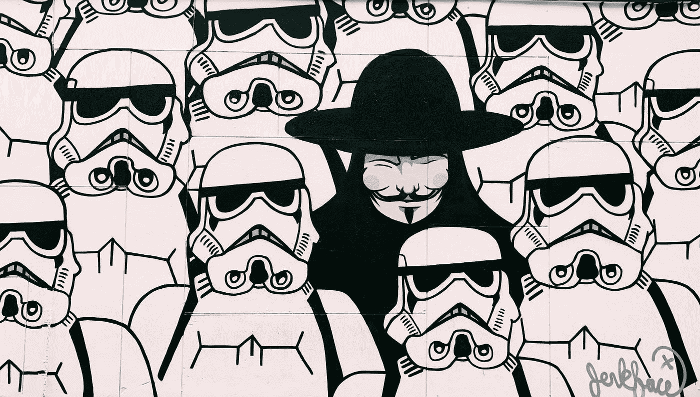

# 2021 年 7 大免费矢量资源

> 原文：<https://levelup.gitconnected.com/top-7-free-vector-resources-of-2021-3747785706b0>

## 为你的项目找到完美的矢量艺术是一个挑战。所以这里有 7 个免费的优质矢量资源。

乔恩·泰森在 [Unsplash](https://unsplash.com?utm_source=medium&utm_medium=referral) 上的照片

# 介绍

向量是伟大的，哦，如此多才多艺。

它们可以作为图形在用户界面中使用。您可以在登录页面上使用它们，让它焕然一新。或者甚至可以通过把它们印在商品和产品上来进行营销。

然而，为你的项目找到完美的矢量艺术可能是一个挑战，因为有许多低质量的资源。考虑到这一点，我决定自己剔除较弱的来源。在这篇文章中，我列出了 7 个在线寻找免费矢量艺术的最佳网站。来源从完整的矢量图像到完美的矢量图标。

**1。未绘制**

Undraw 是我个人最喜欢的免费矢量网站之一。根据他们自己的网站，他们提供:“为你的设计提供可定制颜色的高质量插图，可以组合和修改的对象，以创建新的令人兴奋的图像。”，而这正是他们所提供的。矢量对于各种各样的插图都非常有用，同时看起来有趣又友好。

[https://undraw.co](https://undraw.co/)

 [## unDraw -任何想法的开源插图

### 创建更好的设计网站，产品和应用程序。浏览查找…

undraw.co](https://undraw.co/) 

**2。FreeVectors.net**

据 FreeVectors.net 称，他们是一个有趣的矢量爱好者小社区，分享免费的矢量图形。网站上的所有图片都可以免费用于个人用途，其中大部分可以用于商业用途。我个人非常喜欢 vectors 的风格。它们像 Undraw 中的一样是描述性的，但可以用于其他更丰富多彩的目的。

[https://www.freevectors.net/](https://www.freevectors.net/)

 [## 下载免费的矢量艺术，图像和矢量图形

### 欢迎来到 FreeVectors.net，一个由矢量爱好者组成的有趣的小社区，他们分享免费的矢量图形。上的所有图像…

www.freevectors.net](https://www.freevectors.net/) 

**3。名词项目**

名词项目对于找到符合你的目的的正确图标是惊人的。Noun 项目的一大优点是他们提供了来自世界各地的插画师的各种图标。你可以免费使用每一个图标，但是你必须在某处声明这个图标是从名词项目中使用的。另一个选择是付费订阅，在这种情况下，你可以使用图标做任何你想做的事情，内容创建者可以从使用中获得报酬。

[https://thenounproject.com/](https://thenounproject.com/)

 [## 名词项目:免费图标和一切股票照片

### Noun Project 有史以来最多样的图标和库存照片收藏。下载 SVG 和 PNG。浏览 3 个以上…

thenounproject.com](https://thenounproject.com/) 

**4。自由设计文件**

这个网站不断更新高质量的矢量。Freedesignfile 包含数千个免费矢量和更多内容，包括免费的 Photoshop 笔刷和动作、照片和字体。Freedesignfile 非常适合寻找好的和说明性的图片。他们的大量资源的唯一缺点是，有时很难找到适合你的目的的资源。一个很大的好处是，它的所有图像对个人使用都是免费的，大多数可以用于商业用途。

【https://freedesignfile.com/ 

 [## 免费矢量，免费照片，免费 PSD 图形和图标免费下载

### 自由设计文件有数以千计的高质量的免费矢量和免费照片，此外，包括免费的 Photoshop…

freedesignfile.com](https://freedesignfile.com/) 

**5。Vecteezy**

热门网站 Vecteezy 是你能想到的任何免费矢量艺术的一站式商店。然而，质量确实各不相同，所以你可能必须花时间涉水通过平庸的向量，然后才能找到足够好的东西来使用。这是值得花时间的，因为这里有一些高质量的矢量图形。

[https://www.vecteezy.com](https://www.vecteezy.com/)

 [## 下载免费矢量，剪贴画图形，矢量艺术和设计模板

### 在 Vecteezy，我们明白创新之路从来都不是笔直的。我们旨在为设计师提供他们所需的资源…

www.vecteezy.com](https://www.vecteezy.com/) 

**6。Freepik**

你们中的一些人可能已经熟悉了 Freepik。Freepik 是另一个很棒的网站，可以找到很好的插图。除了矢量图像，Freepik 还提供了大量的照片和 photoshop(。psd)文件。我没有把 Freepik 放在更高位置的原因是，他们真的试图向你推销他们对任何变化的溢价报价。

[https://www.freepik.com/](https://www.freepik.com/)

 [## 面向所有人的免费图片资源

### 数百万免费图文资源。Vectors、库存照片、PSD、图标，所有您需要的创意…

www.freepik.com](https://www.freepik.com/) 

7 .**。扁平图标**

最后但同样重要的是，我们有 Flaticon。Flaticon 就像名词 Project，一个主要是图标载体的网站。Flaticon 和 Noun Project 的最大区别在于，除了提供印刷符号，Flaticon 还提供了一系列丰富多彩的图标。当我希望图标成为用户体验的亮点时，我主要使用 Flaticon。

https://www.flaticon.com/

 [## Flaticon，最大的免费矢量图标数据库

### 3，877，000+SVG、PSD、PNG、EPS 格式或作为图标字体的自由矢量图标。成千上万的免费图标在最大的…

www.flaticon.com](https://www.flaticon.com/) 

这些是我 2021 年最喜欢的 7 个自由载体资源。我希望你喜欢这个故事。

【https://ko-fi.com/koenvanzeijl 