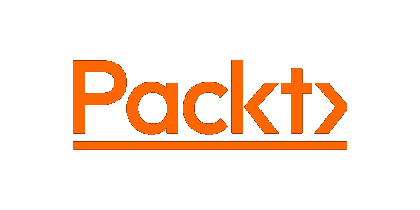
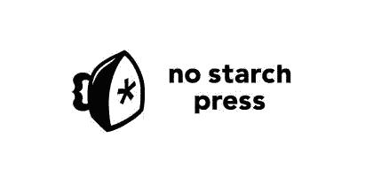

# 你必须知道的 7 大计算机技术书籍出版商

> 原文：<https://levelup.gitconnected.com/top-7-publishers-of-books-on-computer-technologies-that-you-must-know-b36d51e29bc1>

## 以及如何从其中一本开始。

杰西卡·鲁斯切洛在 [Unsplash](https://unsplash.com?utm_source=medium&utm_medium=referral) 上的照片

在这个学习的现代时代，我们有无数的媒介来学习计算机技术，从正式的大学学位，到新兵训练营，到 YouTube 视频，到基于订阅的互动课程，到纯粹的基于文本的文章，到播客，有一种媒介显然经受住了时间的考验，并希望在未来继续这样做。

那是本 ***书*** 。

不同的人对此显然有不同的看法。

*   有人说，对于学习计算机技术来说，书籍已经过时，YouTube 视频是一个更好的选择。
*   一些人投票赞成其他互动课程，让学习者在学习特定主题的同时实施实际的东西。
*   有些人说书籍很贵，所以最好使用免费的学习资源，而不是在大量的纸张上花费大量的金钱。

虽然这些争论*中的每一个*都有某种相关性，但我真诚地相信，学习与计算机技术相关的任何东西的最好方式之一就是拿起一本该主题的书。

很久以来，在某个特定主题上有专长的人一直在写书，把这个主题传授给其他人。通常书是由他们领域的专家写的，以一种全面的方式涵盖了书的潜在主题。

更不用说，给定的一本书并不总是容易理解，或者用简单明了的语言写出来。有时确实会有一些书在结构、内容、整体设计等方面做得不太好。

但是在计算机技术领域，有一些著名的出版商在过去几年里成功地出版了高质量的书籍，这些书籍非常容易被目标读者理解。

再说一次，如果说这些出版商出版的每一本书都是独一无二的，那就错了。

*不尽然！*

这些出版商的一些书确实有一些地方需要大量的改进。但是请记住，这种书的比例非常非常低，所以我们可以有把握地期待几乎每本书都是质量一流的。

在本文中，我们将讨论这类出版优秀且全面的计算机技术书籍的出版商。

# 1.奥莱利

**奥赖利**早在 1984 年就开始出版关于编程和其他计算学科的书籍。

它的创始人 Tim O'Reilly 是一位享有盛誉的国际演说家，在过去几年里，他在许多计算机创新中发挥了作用。

该公司一年来在全球各地举办了一系列会议，帮助在该领域的各类人群中传播计算机技术，从新手到高级专家。

至于奥莱利出版的关于计算机技术的书籍，它们设计得非常好，结构也非常好。

从目录到使用的排版，到代码片段的可读性(包括它们的语法高亮)，再到内容的清晰性，O'Reilly 可以提供一切。

要开始阅读奥赖利的书，你可以去他们的官方网站，【oreilly.com】的，然后搜索给定的主题，比如*“JavaScript”。*

之后会出现一些搜索结果。在搜索结果中，其他出版商的书籍也将包括在内。

要将搜索限制在奥赖利的书籍，点击搜索结果页面顶部的**出版商**下拉菜单，然后从那里选择**奥赖利媒体公司**。这将过滤搜索，只显示 O'Reilly 的书籍。

从显示的所有书籍中，选择一本书，然后从亚马逊(或 Ebooks.com)的链接中购买印刷版，或者按月或按年订阅 O'Reilly，以获得他们所有的在线书籍。

以下是我个人读过的奥莱利的一些书，我觉得非常棒:

 [## JavaScript:权威指南，第 7 版

### JavaScript 是网络编程语言，如今被更多的软件开发人员使用

www.oreilly.com](https://www.oreilly.com/library/view/javascript-the-definitive/9781491952016/)  [## 想想 Python，第二版

### 如果你想学习如何编程，使用 Python 是一个很好的开始。本实践指南将带您…

www.oreilly.com](https://www.oreilly.com/library/view/think-python-2nd/9781491939406/)  [## 学习 PHP，MySQL 和 JavaScript，第 6 版

### 利用开源技术和 web 标准的强大组合，构建交互式、数据驱动的网站，甚至…

www.oreilly.com](https://www.oreilly.com/library/view/learning-php-mysql/9781492093817/) 

# 2.[打包](https://www.packtpub.com/)

Packt 成立于英国伯明翰，自 2004 年以来一直致力于为有抱负的读者提供学习和信息服务。

正如他们的官方网站[packtpub.com](https://www.packtpub.com/)所说，Packt 已经出版了超过 6500 本关于计算机技术的书籍和视频。

这显然不仅仅是一个数字。这纯粹让人想起这样一个事实，即在过去的二十年里，Packt 建立了一个巨大的资源库，以帮助人们获得计算技能。

一本 Packt 书入门真的很简单。

前往[packpub.com](https://www.packtpub.com/)，然后在页面顶部的搜索栏中输入你想读的书的主题。假设您的搜索查询是*【Java】*。

从出现的搜索结果中，选择一本书并点击它。这将带你到一个页面，在那里你可以使用三个购买选项中的任何一个来购买这本书。

也就是说，您可以订阅(按月、按年或按 18 个月的期限)，从而在线访问 Packt 的整个库。或者你可以从亚马逊购买某本书的纸质版本，或者直接从 Packt 的官方网站购买该书的电子书版本。

再一次，以下是我个人从 Packt 上读过的一些书的列表，我当然也会推荐给其他人:

 [## 掌握打字稿-第四版| Packt

### 在上一章中，我们讨论了 TypeScript 中可用的一些基本类型。我们讨论了…

www.packtpub.com](https://www.packtpub.com/product/mastering-typescript/9781800564732?_ga=2.30765500.227003809.1658648787-1507643003.1658648787)  [## 面向对象 JavaScript -第三版| Packt

### 自从网络出现以来，人们就一直需要更动态、更灵敏的界面。虽然还可以…

www.packtpub.com](https://www.packtpub.com/product/object-oriented-javascript/9781785880568?_ga=2.30826044.227003809.1658648787-1507643003.1658648787)  [## Node.js Web 开发-第五版| Packt

### JavaScript 是每一个前端 web 开发人员唾手可得的，这使它成为一种非常流行的编程语言，所以…

www.packtpub.com](https://www.packtpub.com/product/node-js-web-development/9781838987572?_ga=2.90519065.227003809.1658648787-1507643003.1658648787) 

# 3.[威利](https://www.wiley.com/en-us)

另一家全球领先的图书出版商是威利公司，成立于两个世纪前的 1807 年。

威利不仅出版计算机技术方面的书籍。相反，它涵盖了广泛的领域，从医学、医疗保健、法律、工程、艺术、行为科学、环境、数学等等。

然而，威利大学庞大而多样的图书目录丝毫没有降低它们的质量。威利的书写得很好，容易理解，设计得非常好。

要从威利的书开始，去他们的官方网站[wiley.com](https://www.wiley.com/en-us)，在页面顶部的搜索栏输入一个主题。假设您输入的查询是*‘JavaScript’。*

在随后的搜索结果页面上，从找到的与输入主题相关的图书集中选择一本书，然后单击它。这将把你带到可以买到这本书的页面。

一个选择是购买电子书版本，而第二个选择是购买硬拷贝。两者都可以在威利的网站上完成。

作为另一种选择，也可以通过订阅 O'Reilly 来阅读 Wiley online 的一些书籍。这是因为奥赖利与一些出版公司合作，并在其在线平台上提供他们的书籍。

不管怎样，下面我收集了一些我读过的威利的书，觉得特别有趣:

 [## 面向虚拟对象的 UML 2

### 使用友好、易于理解的虚拟风格来帮助读者学习使用最新版本的建模系统…

www.wiley.com](https://www.wiley.com/en-us/UML+2+For+Dummies-p-9780764526145)  [## 面向 Web 开发人员的专业 JavaScript，第 4 版

### 使用专业 JavaScript 网页版终极指南更新您的 ES 6 和 es7 技能集…

www.wiley.com](https://www.wiley.com/en-us/Professional+JavaScript+for+Web+Developers%2C+4th+Edition-p-9781119366577)  [## GitHub For Dummies

### 与 GitHub 协作编码一旦你学会了编码的基础，下一步就是开始分享你的…

www.wiley.com](https://www.wiley.com/en-us/GitHub+For+Dummies-p-9781119572657) 

# 4.[进程](https://www.apress.com/)

**斯普林格自然公司 Apress** 于 1999 年由作者加里·康乃尔和丹·阿普曼创立。开始时，它被称为作者出版社，后来简称为出版社，最后简称为出版社。

Apress 专注于编写关于 IT、软件和计算机编程的书籍。正如其官方网站[关于我们](https://www.apress.com/in/about)页面所述:

> 我们高质量、实用的内容有助于各级技术专业人员提高他们在日常工作中所需的技能。

Apress 的书涵盖了许多技术，从 Java 到 C++，到 Swift，到 Python，到全栈 web 开发，到。NET 系列编程工具，等等。

要开始阅读一本新书，去 SpringerLink 的网站，[link.springer.com](https://link.springer.com/)，在页面顶部的搜索栏中输入你想读的书的主题。假设题目是*‘python’。*

从匹配书籍的结果集合中，选择一本书，然后单击它。这将把你带到这本书的主页，在那里可以买到它。

和上面所有的选择一样，你可以选择购买所选书籍的电子书版本，或者购买纸质版本。

以下是我非常喜欢读的一些出版社的书:

 [## Pro Git

### 广告目录(13 章)Pro Git(第二版)是你的完全更新的 Git 及其用法指南…

link.springer.com](https://link.springer.com/book/10.1007/978-1-4842-0076-6)  [## 开始 Node.js

### 广告目录(13 章)开始 Node.js 是你一步一步学习各方面的指南…

link.springer.com](https://link.springer.com/book/10.1007/978-1-4842-0187-9)  [## 实用 Node.js

### 这本书是你使用 Node.js 和它的…

link.springer.com](https://link.springer.com/book/10.1007/978-1-4842-3039-8) 

# 5.[无淀粉压机](https://nostarch.com/)

说到精美的插图和优质的内容，不谈**无淀粉出版社**就不公平了。

比尔·波洛克在 1994 年没有发现淀粉印刷机。它的总部设在美国旧金山，是另一家与出版计算机技术书籍有关的受欢迎的出版商。

来自 No Starch Press 的书内容全面，结构良好，非常容易通读。我自己已经读了许多非淀粉出版社的书，当然还想读更多。

我只是发现这些书中有一点不令人满意，那就是代码片段没有语法突出显示(即代码的不同部分用不同的颜色表示，以便在视觉上快速区分它们)。

然而，这不应该阻止你选择从无淀粉出版社买书。T2 所有书籍的内容清晰，涵盖的信息范围非常广泛。

要从 No Starch 出版社的书开始，去他们的网站，【nostarch.com】的，在页面右上角的搜索栏中输入你想读谁的书的主题。假设题目是*‘TCP’*。

从随后出现的结果中，选择一本书，然后点击它。这将把你带到一个页面，在那里你可以购买这本书的电子书版本或者印刷的硬拷贝。

我从非淀粉出版社读过的写得非常好的书:

 [## 用 Python 自动化枯燥的东西，第二版

### 最畅销的 Python 书籍的第二版，用 Python 自动化枯燥的东西，第二版(100，000 多册…

nostarch.com](https://nostarch.com/automatestuff2)  [## 面向对象 JavaScript 的原理

### 少花钱多办事。面向对象 JavaScript 的原理帮助你充分利用这种强大的语言…

nostarch.com](https://nostarch.com/oojs)  [## 实用 SQL，第二版

### SQL 快速指南——定义、组织和探索关系数据的语言。

nostarch.com](https://nostarch.com/practical-sql-2nd-edition) 

# 6.皮尔逊

与 Wiley 类似， **Pearson** 是另一家出版公司，生产各种学科的书籍，包括计算机技术。

根据[维基百科](https://en.wikipedia.org/wiki/Pearson_plc):

> 该公司于 1844 年由塞缪尔·皮尔逊创立，当时是一家建筑和工程公司，在约克郡以 s .皮尔逊的名字运营。

随着时间的推移，Pearson 将其关注点转移到管理广泛传播的教育材料的出版上，并且至今仍在继续这样做。

皮尔逊是一家极其多元化的出版商。它有许多学科的书籍，从数学、医疗保健、工程、艺术、商业、教学、社会科学等等。

谈到 IT 和计算机科学，在这些领域也有许多值得考虑的优秀书籍。

要开始阅读一本皮尔森的书，请访问他们的网站，[pearson.com](https://www.pearson.com/)，在右上角的搜索栏中搜索给定的主题。假设题目是*‘c++’。*

从出现的结果中，挑选一本你感兴趣的书，然后点击它进入该书的主页。在这里，你可以买到这本书，一如既往，有两种形式——电子书或印刷版。

以下是我最喜欢的几本皮尔森的书:

 [## 算法设计与分析导论

### 算法设计与分析入门:9780132316811:计算机科学书籍@ Amazon.com

www.amazon.com](https://www.amazon.com/Introduction-Design-Analysis-Algorithms-3rd/dp/0132316811)  [## C++中的数据结构与算法分析

### Amazon . com:c++中的数据结构和算法分析:9780132847377: Weiss，Mark: Books

www.amazon.com](https://www.amazon.com/Data-Structures-Algorithm-Analysis-C/dp/013284737X)  [## 问题解决和程序设计在 C，学生价值版加 MyLab 编程与皮尔逊…

### 学习编程与 ANSI-C“问题解决和程序设计”“在 C”教读者编程与 ANSI-C，一个…

www.amazon.com](https://www.amazon.com/Problem-Solving-Program-Student-Programming/dp/0134243951) 

# 7.[曼宁](https://www.manning.com/)

曼宁于 1990 年由李·菲茨帕特里克和马尔詹·贝斯创立。早在 1993 年，它就出版了第一本书。

从那时起，到今天，它继续为读者提供计算机科学及其相关学科的有价值的书籍。

曼宁书籍的显著特点是它们的封面，最初的灵感来自于 1805 年版的 Sylvain Marechal 的四卷本《地区服饰习俗简编》。

曼宁的目标是，通过制作这样的封面，展示近两个世纪前，来自世界各地的人们在着装上的文化多样性。

正如曼宁所说，在其[封面](https://www.manning.com/covers)页面上:

> 随着时间的推移，各地的着装规范都在发生变化，当时如此丰富的地区差异已经逐渐消失。现在很难区分不同大陆的居民，更不用说不同的城镇或地区了。这种文化多样性源于孤立，而我们现在一点也不孤立。
> 
> 因此，我们用基于两个世纪前丰富多样的地区生活的书籍封面来庆祝今天计算机世界的创造性和主动性。

无论如何，回到他们的书的内容，曼宁，像上面讨论的所有出版商一样，涵盖了计算机技术的一系列主题，从编程语言，到 web 开发，到移动应用程序开发，到 AI/ML，到嵌入式系统，到网络，等等。

要开始阅读一本曼宁手册，请访问它的网站，[manning.com](https://www.manning.com/)，在页面顶部的搜索栏中搜索一个主题。比方说题目是*‘快递’。*

此后，像往常一样，从与输入的查询匹配的图书集合中，选择特定的图书，然后点击它。这将把你带到主页，在那里你可以买到这本书。

在这方面，曼宁提供了两种选择——要么购买电子书版本，要么购买印刷版本，这样你也可以自动获得电子书版本。

下面，我整理了一些来自曼宁的有用的书籍，它们以简洁和结构良好的方式写成:

 [## 用行动表达

### 对新手和高级用户都有帮助的例子。杰夫·史密斯，单一来源系统快递…

www.manning.com](https://www.manning.com/books/express-in-action)  [## Node.js 在行动，第二版

### 这本书的前一版的电子书副本是免费的。它将自动添加到…

www.manning.com](https://www.manning.com/books/node-js-in-action-second-edition?query=node)  [## 与 Mongo，Express，Angular 和 Node 一起变得刻薄，第二版

### 变得刻薄，第二版教你如何使用刻薄栈开发全栈 web 应用。这个版本…

www.manning.com](https://www.manning.com/books/getting-mean-with-mongo-express-angular-and-node-second-edition?query=angular) 

# 最后

学习是一个终生的过程。这真的不能仅仅通过使用一种单一的媒介来完成，不管是哪种媒介(书籍、互动课程、YouTube 视频、基于文本的文章等等)。

毫无疑问，书籍是学习任何与计算机科学和编程相关的知识的绝佳媒介。然而，如果说一个人仅仅通过阅读书籍、书籍或者仅仅是书籍就可以成为专业人士，那就大错特错了。

*嗯，那没用！*

相反，我们应该关注多种媒介，并从每种媒介中获取尽可能多的知识。

我们必须听采访，听程序员在会议上的讨论，了解技术的历史，阅读大量的书籍，浏览文档，参考在线课程，查看他人的代码，最重要的是，创建真实世界的程序。

尽管如此，我在这个列表中还是遗漏了很多东西，但是你有希望得到这个想法——我们必须将我们的触角延伸到多个地方，这样我们才能学到尽可能多的东西。

快乐学习，快乐编码。🙂

顺便说一句，在 [CodeGuage](https://www.codeguage.com/) ，我们提供了一个关于 JavaScript 的绝对免费和全面的课程。

它有超过 20 个测验和超过 25 个练习，让你练习 JavaScript 中给定的主题。有超过 70 章的内容，涵盖了从语言基础到高级思想，如[对象原型](https://www.codeguage.com/courses/js/objects-prototypes)和[函数闭包](https://www.codeguage.com/courses/js/functions-closures)。

以下是它的链接:

 [## 学习 JavaScript——最全面的课程

www.codeguage.com](https://www.codeguage.com/courses/js/) 

# 分级编码

感谢您成为我们社区的一员！在你离开之前:

*   👏为故事鼓掌，跟着作者走👉
*   📰查看更多内容请参见[升级编码刊物](https://levelup.gitconnected.com/?utm_source=pub&utm_medium=post)
*   🔔关注我们:[Twitter](https://twitter.com/gitconnected)|[LinkedIn](https://www.linkedin.com/company/gitconnected)|[时事通讯](https://newsletter.levelup.dev)

🚀👉 [**软件工程师的热门职位**](https://jobs.levelup.dev/jobs?utm_source=pub&utm_medium=post)