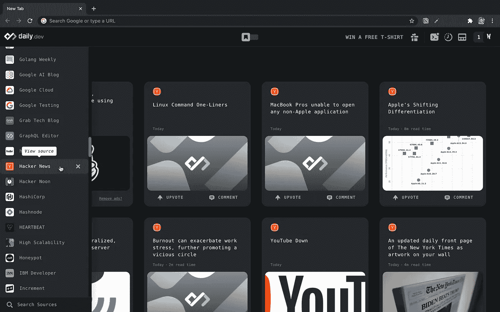

# Web 开发人员的 8 大 Chrome 扩展

> 原文：<https://levelup.gitconnected.com/top-8-chrome-extensions-for-web-developers-5bd1de60b886>

> 一些 Chrome 扩展可以增强你的浏览器，成为你日常编码生活中必不可少的。

克里斯蒂娜@ wocintechchat.com 在 [Unsplash](https://unsplash.com?utm_source=medium&utm_medium=referral) 上的照片

以下是我几乎每天都在使用的 chrome 扩展列表。

# 1. [ColorZilla](https://chrome.google.com/webstore/detail/colorzilla/bhlhnicpbhignbdhedgjhgdocnmhomnp?hl=en)

这是每个前端开发人员都应该使用的基本工具之一。Colorzilla 可以很容易地从网站上抓取任何颜色并复制到剪贴板上。

它重量轻，易于使用。它附带了额外的功能，如 CSS 渐变生成器和颜色历史来存储您选择的颜色。

我用过的最好的颜色选择器扩展之一。

# 2. [JSONViewer](https://chrome.google.com/webstore/detail/json-viewer/gbmdgpbipfallnflgajpaliibnhdgobh?hl=en)

这是我最喜欢的 Chrome 扩展，也是我用得最多的一个。它为 JSON 内容提供了简单而整洁的外观。

有几种配置可以让它看起来像你想要的样子。我把我的设置成 3024 夜的主题。

# 3.[什么字体](https://chrome.google.com/webstore/detail/whatfont/jabopobgcpjmedljpbcaablpmlmfcogm?hl=en)

这个扩展可以让你找到任何网页上使用的字体。

我主要用它来判断我在 CSS 文件中应用的字体是否真正出现在网页上。

# 4. [daily.dev |一体化编码新闻阅读器](https://chrome.google.com/webstore/detail/dailydev-all-in-one-codin/jlmpjdjjbgclbocgajdjefcidcncaied?hl=en)

我最近才知道这个扩展，但是从那以后它就成了我的新标签。

主页显示了最流行的软件开发文章的精选提要。你可以从侧边栏查看数百篇其他来源的文章。

最好的文章来源之一，光滑的用户界面，而且是免费的。这个扩展是每个软件开发者的必备。

# 5.[窗口大小调整器](https://chrome.google.com/webstore/detail/window-resizer/kkelicaakdanhinjdeammmilcgefonfh?hl=en)

在得到这个扩展之前，我曾经

*   打开 Chrome 开发者工具
*   点按“调整窗口大小”按钮
*   在不同的屏幕尺寸之间变戏法。

窗口 resizer 扩展使这个过程超级简单，只需点击一下。这是所有前端开发人员和设计人员必备的扩展。

# 6.[马里纳拉:番茄助手](https://chrome.google.com/webstore/detail/marinara-pomodoro%C2%AE-assist/lojgmehidjdhhbmpjfamhpkpodfcodef?hl=en)

这是一个简单的番茄定时器。

我已经按照番茄工作法来分配我的任务快 3 年了。我更喜欢使用名为 sessions 的 iOS 应用程序，但当我不在身边时，这个 Chrome 扩展也可以完成这项工作。

# 7. [CSS 窥视者](https://chrome.google.com/webstore/detail/css-peeper/mbnbehikldjhnfehhnaidhjhoofhpehk)

快速浏览一下应用于特定元素的 CSS 样式。

CSS peeper 就是这么做的——很简单。

另外，它还为您提供了网页上使用的所有调色板，以及一种快速导出页面上显示的所有图像的方法。

# 8.[清除缓存](https://chrome.google.com/webstore/detail/clear-cache/cppjkneekbjaeellbfkmgnhonkkjfpdn?ref=designrevision.com)

这个扩展使得清除缓存和 cookies 只需点击一下鼠标。

此外，还有很多其他选项可供选择。只需点击一下，您就可以清除历史记录、下载或本地存储。

我希望你喜欢这个列表。请在评论中分享你最喜欢的 chrome 扩展。