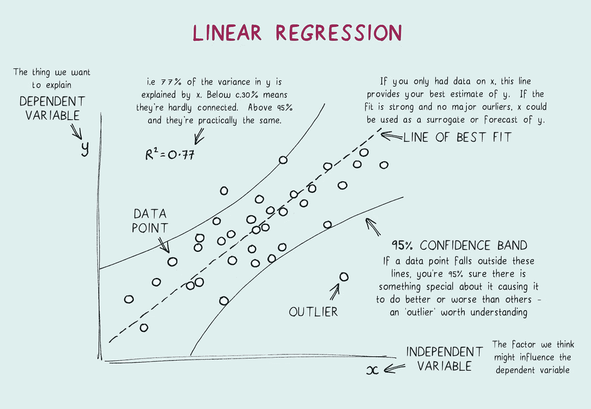
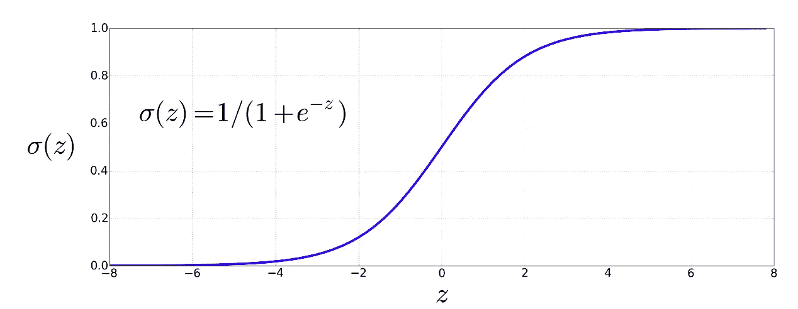
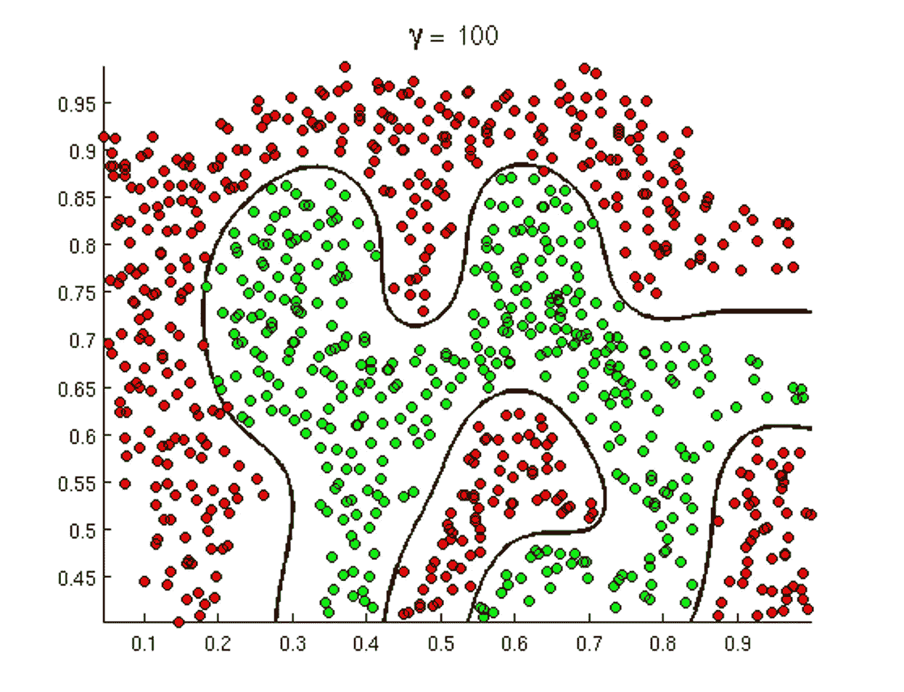
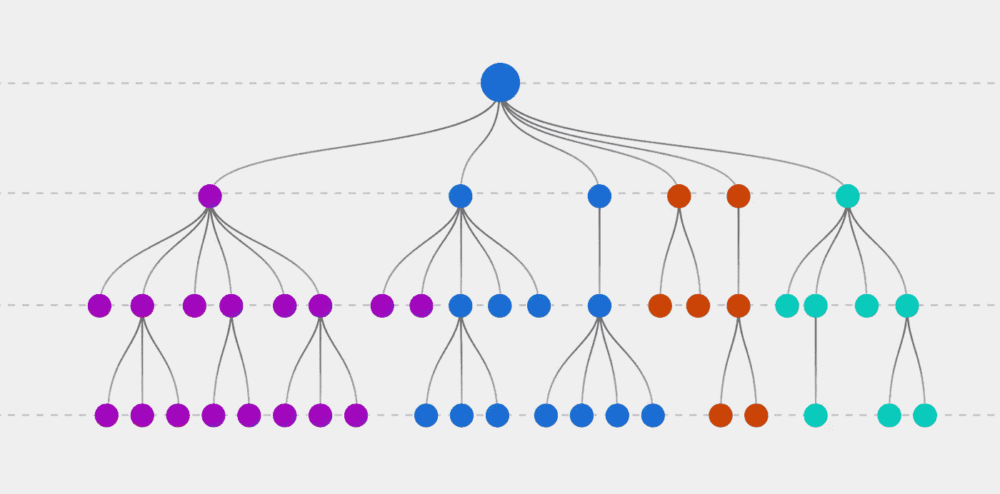
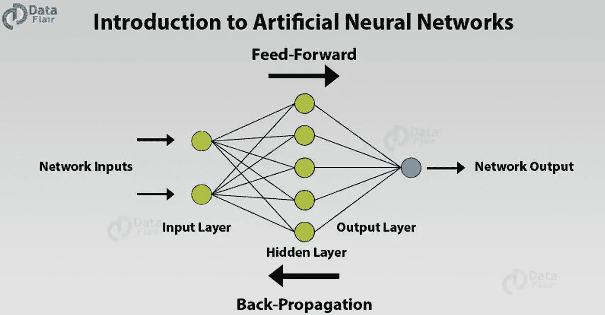
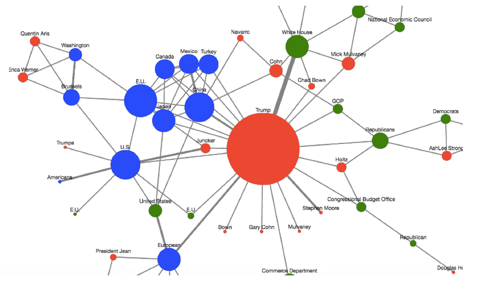
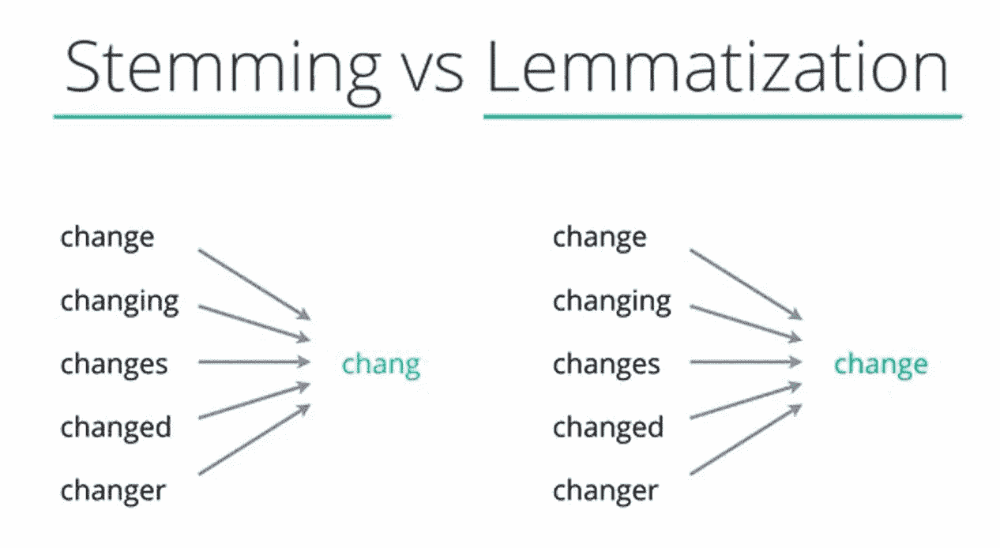
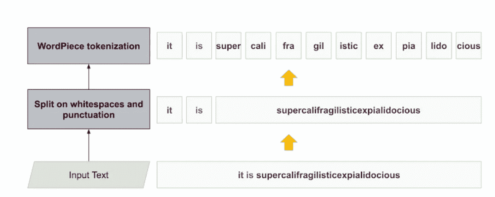
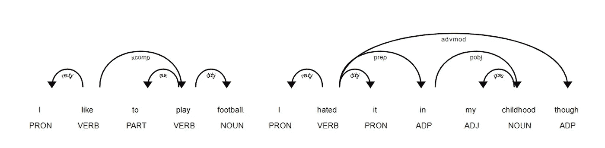

# 9 大人工智能方法，带有图形，直观且简单明了

> 原文：<https://levelup.gitconnected.com/top-9-ai-methods-with-graphs-visualized-and-simply-explained-2d42b7c5bc68>

具有相应可视化的自然语言处理和机器学习方法

来自 Unsplash 的法比奥·曼乔内

我一直在撰写最佳人工智能模型的解释，有时会非常详细，有时会采取非常简单的方法。在这篇文章中，我的目标是用视觉来描述 9 种最基本的人工智能方法。

首先，这里是机器学习、深度学习和自然语言处理(NLP)的三个简要定义。

— NLP:如何像人类一样激活计算系统完成自然语言任务[1]。

—机器学习:计算系统如何从数据中学习，识别模式，并在很少或没有人类交互的情况下做出决策。

—深度学习:计算系统如何通过评估数据并根据发现的模式生成预测来进行自我学习。

让我们开门见山吧。

# **1。** **机器学习(ML):线性回归**

由[丹·怀特 1000](https://www.shutterstock.com/g/Dan+White+1000) 上梭托

通过分析已经发生的事情来确定未来将要发生的事情的方法。例如，您可以使用线性回归来预测根据其他汽车的价值出售您的汽车可以获得多少钱。这些数据可以让你估计你可以从你的销售中得到多少钱。程序中包含“线性”一词是因为使用了线性数学模型来应用于所有提供的数据。

# **2。** **ML:逻辑回归**

图片来自[4]

一种统计技术，用于估计未来某件事情发生的可能性。这种回归分析用于因变量为二元类型(如正或负，是或否)的情况。举个例子，刚刚出现在你收件箱里的邮件:是垃圾邮件吗？

# **3。** **ML:支持向量机(SVM)**

图片来自[5]

根据新文本与包含在训练集中的文本的相似程度来确定新文本的类别。例如，你正在读的是关于技术还是法律？此外，是否有可能根据提供的文本中包含的文体线索来确定作者的身份？这些是 SVM 的用例。

# **4。** **ML:决策树**

图片来自[6]

这是一种通过列出各种选择来帮助你做出选择的方法。然后，您可以通过检查所有潜在的结果来选择最佳的替代方案。在商业中，这种方法的应用包括自下而上或自上而下。

# **5。** **深度学习:人工神经网络**

来自[7]

一种计算机程序，在广义上模仿人脑处理信息的方式。神经元是神经系统的一个单元，负责接收来自其他神经元的输入，并产生与该输入相关的输出。例如，假设您对确定一张图片是否包含一只狗感兴趣。照片中的像素可能会被计算系统分析，然后试图将它们与之前建立的狗图案进行匹配。另一方面，人工神经网络会接受许多不同的狗的图片，以及不是狗的事物的图片，并学习识别将狗与其他类型的事物区分开来的特征。

# **6。** **自然语言处理:命名实体识别(NER)**

来自[8]

一种技术，用于从文本中提取可识别的事物，并将其分类为预定的类别，如位置、组织、时间或人物表情。NER 是信息提取的一个子领域，旨在定位和分类实体。以“华尔街日报派奥利维亚去纽约”这句话为例。在这个场景中，Olivia 是人，纽约是地点，华尔街日报是公司。

# **7。** **NLP:词干化和词汇化**

来自[9]

将一个单词缩减到其最基本形式的过程称为词干化。为了简单起见，我们可能只提到“改变”而不是“变化”(如上面的图片所示)。词汇化与词干化相关，因为它旨在将一个术语缩减或简化为其基本含义，它源于希腊语单词 lemma，意思是“根”。例如，单词“best”也可以指“good”

# **8。** **NLP:标记化**

来自[10]

一种将一段文本转换成一列标记的方法。在 NLP 中，这通常是通过分隔句子之间的空格和标点来实现的。例如，短语“Joe 吃了午餐”可以标记为“Joe”、“吃了”、“the”、“午餐”。此外，可以分配标记来表示单个单词、短语甚至单个字母。

# **9。** **自然语言处理:词性标注**

来自[11]

一个句子中每个单词的语法功能由一个标签来表示。在这个例子中，每个名词都会被归类为“主语”或“宾语”根据动词描述的是动作还是状态，动词将被分为几类。看看下面的例句，就明白我的意思了:“后院开始长杂草，”她说。“weeds”这个词在这个句子中起名词的作用，但“sprouted”这个词起动词的作用。“in”这个词起介词的作用，它表示杂草生长的位置。

## 离别的思绪

如果你对这篇文章有任何改进的建议或拓宽主题的建议，我将非常感谢你的来信。

如果你喜欢阅读这样的故事，并想支持我成为一名作家，可以考虑报名成为一名媒体成员。一个月 5 美元，你可以无限制地阅读媒体上的所有报道。如果你注册使用我的链接，我会赚一小笔佣金，不需要你额外付费。

 [## 通过我的推荐链接加入 Medium-Anil til be

### 阅读阿尼尔·蒂尔贝(以及媒体上成千上万的其他作家)的每一个故事。你的会员资格直接支持作家…

medium.com](https://medium.com/@AnilTilbe/membership) 

还有，这是我的时事通讯；我希望你能考虑订阅。

 [## 预测风险简讯

### 人工智能和产品的交集。点击阅读预测风险时事通讯，作者 Anil…

predictiveventures.substack.com](https://predictiveventures.substack.com) 

*参考文献:*

*1。蒂尔贝，阿尼尔。(2022 年 8 月 18 日)。最简单的人工智能指南:15 大模型(NLP、ML 和 DL)。UX 星球。*[*https://UX planet . org/simplest-artificial-intelligence-guide-top-15-models-with-10-second-explanations-13325967 d322*](https://uxplanet.org/simplest-artificial-intelligence-guide-top-15-models-with-10-second-explanations-13325967d322)

*2。蒂尔贝，阿尼尔。(2022 年 8 月 14 日)。金融领域的 10 大人工智能任务。升级编码。*[*https://level up . git connected . com/top-10-人工智能-任务-财务-简单解释-bca6b7889282*](/top-10-artificial-intelligence-tasks-in-finance-simply-explained-bca6b7889282)

*3。蒂尔贝，阿尼尔。(2022 年 8 月 2 日)。简化的 20 种机器学习方法。升级编码。*[*https://level up . git connected . com/top-20-machine-learning-algorithms-explained-in-less-10-seconds-each-8fd 728 f70b 19*](/top-20-machine-learning-algorithms-explained-in-less-than-10-seconds-each-8fd728f70b19)*[*https://web.stanford.edu/~jurafsky/slp3/5.pdf*](https://web.stanford.edu/~jurafsky/slp3/5.pdf)*

**4。*[*http://open classroom . Stanford . edu/main folder/document page . PHP？course = machine learning&doc = exercises/ex8/ex8 . html*](http://openclassroom.stanford.edu/MainFolder/DocumentPage.php?course=MachineLearning&doc=exercises/ex8/ex8.html)*

**5。*[*https://www . explori um . ai/blog/the-complete-guide-to-decision-trees/*](https://www.explorium.ai/blog/the-complete-guide-to-decision-trees/)*

**6。*[*https://data-flair . training/blogs/artificial-neural-networks-for-machine-learning/*](https://data-flair.training/blogs/artificial-neural-networks-for-machine-learning/)*

**7。*[*https://www . novetta . com/2018/09/named-entity-recognition-and-graph-visualization/*](https://www.novetta.com/2018/09/named-entity-recognition-and-graph-visualization/)*

**8。*[*https://www.quora.com/What-is-lemmatization-in-NLP*](https://www.quora.com/What-is-lemmatization-in-NLP)*

**9。*[*https://ai . Google blog . com/2021/12/a-fast-word piece-token ization-system . html*](https://ai.googleblog.com/2021/12/a-fast-wordpiece-tokenization-system.html)*

**10。*[*https://stack abuse . com/python-for-NLP-词性标注-命名实体识别/*](https://stackabuse.com/python-for-nlp-parts-of-speech-tagging-and-named-entity-recognition/)*