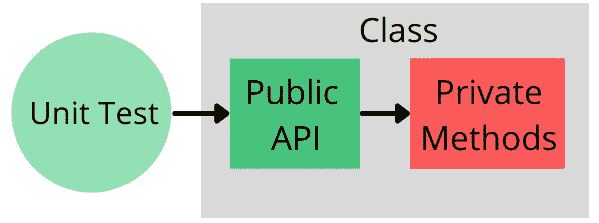

# 编写优秀单元测试的最佳实践

> 原文：<https://levelup.gitconnected.com/top-best-practices-for-writing-brilliant-unit-tests-3af3e9ddce79>

## 这可以最大化你的单元测试套件的好处。

由[凯利·西克玛](https://unsplash.com/@kellysikkema?utm_source=medium&utm_medium=referral)在 [Unsplash](https://unsplash.com?utm_source=medium&utm_medium=referral) 上拍摄的照片

好的单元测试有助于软件开发人员发现在重构、修复 bug 或将新功能集成到现有代码库中时可能会意外出现的回归问题。

创建一个有用的单元测试套件有许多最佳实践，我们将看看几个重要的。

# 单元测试符合 F.I.R.S.T

整个套件的执行时间应该是**快**几秒钟，而不是几分钟。缓慢的测试将增加开发人员重构逻辑所需的时间，因为他们经常运行整个测试套件以确保没有新的回归问题。此外，慢速测试会降低构建管道的执行时间。

单元测试应该是相互独立的，也就是说，它们不应该共享状态。如果一个测试在共享内存中存储了一些数据，而下一个测试依赖于这些数据，那么就不可能只运行第二个测试或者并行运行测试。

如果单元测试仅仅依赖于一个代码，而不依赖于诸如数据库、文件系统或其他外部因素，那么它们就是可重复的。这确保了单元测试不需要预先设置，并且在任何环境下都能产生相同的结果。

**自验证**单元测试在测试执行后产生一个布尔值，指示测试是通过还是失败。开发者通常通过使用`AreEqual, IsTrue, Greater`等方法来实现。开发人员不应该通过阅读日志或类似的东西来找出测试执行的结果。

单元测试套件应该随着应用程序代码的发展而发展。测试应该以**及时**的方式编写，而不仅仅是在投入生产之前。

# 单元测试中缺乏非确定性

测试中的不确定性意味着对于测试中的相同逻辑，单元测试有时通过，但有时失败。

为了找到非确定性行为的根本原因，开发人员需要仔细检查单元测试代码和测试中的逻辑。开发人员应该看看非确定性行为最常见的来源:`DateTime`对象或缺乏线程同步。

## 日期时间对象

这是一个使用`DateTime`如何产生非确定性测试结果的例子:

如果代码在一个节拍内运行得非常快，单元测试就可以通过，否则测试就会失败。

问题出在测试本身的逻辑中，因为对`DateTime`对象的使用是硬编码在`User`类中的。

有两种方法可以修复非确定性，并且都需要重写`User`类。

第一个选项是将`DateTime`实例作为构造函数参数传递给`User`类。在这种情况下，单元测试确定在`User`对象和`AreEqual`方法中都传递了同一个`DateTime`实例。

第二个选择是实现包装`DateTime`类型的`IDateTimeProvider`接口。

## 缺少线程同步

在下面的示例中，不确定性是由映射逻辑中缺少线程同步引起的。

有时输出集合的长度与输入集合的长度相同，但有时长度会有所不同，因为在向`output`集合中添加项目时缺少线程同步。

为了使单元测试具有确定性，您需要通过添加关键部分或使用并发集合来修复映射逻辑。

# 不测试类实现细节

在用单元测试覆盖某个类之前或期间(以防你不使用 TDD ),最好确保**类实现细节被正确封装**,这样单元测试就不会测试类实现细节。

您当然可以为`NormalizeComment`方法编写一个单元测试。但是在这种情况下，您的应用程序将至少有一个测试封装不良的逻辑的坏单元测试。

`NormalizeComment`方法是`Comment`类的实现细节，但是它错误地暴露给了应该记得调用它的客户端。

在编写单元测试之前，可以对外界隐藏`Comment`类的实现细节，如下所示:

那么单元测试就会容易写得多，更简洁，更容易维护。

现在无需修改单元测试就可以更改类实现细节，因为它只测试`Comment`类的公共 API。

## 测试私有方法

关于单元测试的一个误解是私有方法应该被单元测试覆盖，而不仅仅是公共方法。但这只是一种误解。

私有方法、属性和其他私有成员是类的实现细节，不应该直接测试。唯一需要测试的是类的**公共 API** 。当测试公共方法时，私有方法将被单元测试间接覆盖。

在测试公共 API 时，唯一要确保的是它具有完整的行和分支覆盖，这反过来又为所有私有方法提供了完整的覆盖。

# 单元测试套件是构建管道的一部分

一个项目可以有一个理想的单元测试集，它覆盖了项目的整个代码库的所有可能的边缘情况，符合 F.I.R.S.T .原则，并根据编码和单元测试最佳实践编写。

然而，在集成到构建服务器的持续集成管道中之前，这样一个理想的单元测试套件不会有太大的好处。

[快速失败](https://en.wikipedia.org/wiki/Fail-fast)是可以应用于软件工程各个方面的基本原则之一。设计为快速失效的系统充分利用了尽快检测和报告问题的能力。有了 Fast Fail，在生产环境中发生严重问题的可能性就会低得多，因为它们会在 QA、DEV 甚至本地环境中被发现。

如果至少有一个单元测试是红色的，持续集成管道应该单元测试套件和失败构建。否则，就违反了快速失败原则，因为不能保证开发人员会在创建拉请求之前手动运行测试。失败的单元测试及其在应用程序逻辑中的相关 bug 可能会悄悄地进入生产环境。

# 摘要

*   单元测试应该是快速的、独立的、可重复的、自我验证的，并且及时编写。
*   测试中的不确定性通常是由测试逻辑中的`DateTime`使用或缺乏线程同步引起的。
*   应该只测试类的公共 API，而不是实现细节。
*   单元测试必须集成到构建管道中，这样如果存在 bug，应用程序可以快速失败。

## 我的其他文章

 [## 适配器设计模式的最简单解释

### C#中的真实世界示例

levelup.gitconnected.com](/the-simplest-explanation-of-adapter-design-pattern-cd37f02bfecd)  [## 每个企业项目都是遗产吗？

### 如何不让项目变成遗产？

medium.com](https://medium.com/geekculture/dont-let-your-enterprise-project-become-a-legacy-d282acfdf212)  [## 养成这几个习惯，成为一名优秀的软件工程师

### 你所需要的只是纪律。

levelup.gitconnected.com](/develop-these-few-habits-to-become-an-outstanding-software-engineer-8117a155af77)