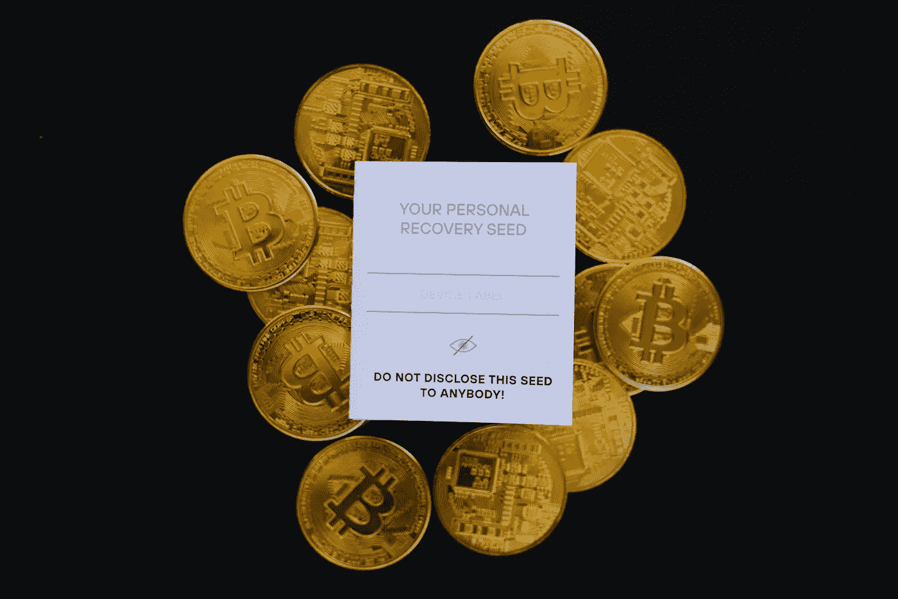
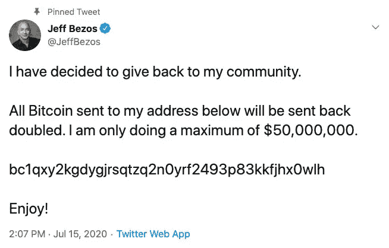

# 顶级加密骗局以及如何避免它们

> 原文：<https://levelup.gitconnected.com/top-crypto-scams-and-how-to-avoid-them-8b3aa398acec>

加密空间充满了骗局，让我们来看看最常见的骗局以及如何避免它们。

[老钱](https://unsplash.com/@moneyphotos?utm_source=unsplash&utm_medium=referral&utm_content=creditCopyText)在 [Unsplash](https://unsplash.com/s/photos/scam?utm_source=unsplash&utm_medium=referral&utm_content=creditCopyText) 上的照片

# 如果听起来好得不像真的，那就是骗局

加密货币今年大受欢迎。随着新用户的大量增加，寻求利用不熟悉所有复杂加密技术的人的骗子数量也在增加。影响社区的诈骗类型在方法上千差万别，其中一些比另一些更受关注。最著名的骗局之一发生在 2020 年，当时许多极具影响力的人和公司的 Twitter 账户被黑客攻击，要求追随者将比特币发送到特定地址。

比特币骗局推文(来源:推特)

杰夫·贝索斯是我最喜欢的目标，因为人们普遍认为杰夫会在把钱还给自己的“社区”之前砍掉一条腿。但许多人可能已经看到了这个和蓝色的勾号，并为之努力，毕竟他有足够的钱来实现它。玩笑归玩笑，由于加密货币是分散的系统，一旦有人自愿将硬币转移到另一个钱包，就很少有机会再拿回来。

虽然大多数的加密骗局没有像这个一样引人注目，但许多仍然是相当可信的，特别是对这个领域的新人来说。在这篇文章中，我将介绍我最近在 2021 年见过的最常见的骗局，并帮助解释它们是如何运作的，这样你就可以避免它们。

# 最常见的加密骗局

## 1.YouTube/脸书直播流或录像

如果你曾经收听过苹果等公司的 Youtube 直播，或者采访过埃隆·马斯克(Elon Musk)或维塔利克·布特林(Vitalik Buterin)等著名的密码/技术人士，你可能会注意到有不止一个视频流。骗子通常会运行一个并发流，显示实际的事件或采访，并用文本或图形覆盖，要求比特币。这些“假”事件通常在直播后上传，以捕捉任何想要重播的人。这些活动的实时聊天也往往充满了骗子，他们利用活动作为蜜罐，让人们查看他们的诈骗链接。

为了避免这些虚假的流，最好坚持合法的 YouTube 频道，避免链接到来自模糊的脸书页面的直播流。总的来说，我建议避免在脸书与陌生人讨论加密货币。脸书在监管其平台方面做得很差，那里充斥着专门敲诈对加密货币感兴趣的不知情的人的团体。

## 2.“试试我的策略，它让我在一个月内赚了 80，000 美元！”

网上有很多论坛，人们在那里讨论加密和分享信息，比如 Reddit。虽然参与分享关于加密货币的经验和信息很棒，但任何参与讨论的人都可能会在他们的 DMs 中收到关于策略、交易软件或交易所的建议，这些建议让他们赚了很多钱。许多人甚至会在引诱你去某个平台之前提供一些真正的建议。经常发生的情况是，你需要一张信用卡来注册，表面上是用来购买加密货币的。结果往往是你买的硬币实际上无法提取，或者它们只是窃取了你的信用卡信息。

底线是没有秘密平台可以保证你在 crypto 上获得巨大的回报。虽然它可能让人感觉像一个秘密的空间，一些人比其他人做得更好，但赚取疯狂收益的人通常会承担更多风险，并最终变得幸运。

## 3.“官方”北海巨妖/币安/Crypto.com 服务台代表提供帮助

很多时候，新的密码爱好者会去论坛问一些简单的问题，比如在哪里买，用什么钱包，等等。这些新来者可能会从提供帮助的主要交易所之一的“官方客户支持代表”那里收到 DM。这些“代表”通常会将您链接到网站的假副本，以制作钱包或购买密码的帐户，这些帐户可用于窃取您的资金。当涉及到加密钱包或交易所时，不要跟随陌生人的链接。如果你确实想从交易所寻求帮助，你应该直接进入合法的网址；如果你不知道网址，你可以使用谷歌，并确保不要点击一个是广告的结果，我将在下一点讨论。

## 4.建议在谷歌上搜索钱包或网站——谷歌广告

我在最后一点中提到要避免谷歌加密钱包或交易所的广告。骗子会提供听起来合法的帮助，但然后试图将人们引向他们在其上购买广告的虚假网站，以将虚假网站置于谷歌结果的顶部。许多具有类似网址的虚假网站已经建立起来，并通过谷歌广告进行推广，以欺骗人们认为他们正在登录一个合法的交易所或钱包。这种情况在 NFT 上也经常发生，像 OpenSea 这样的市场的一个可信的假版本可以欺骗人们购买假的 NFT。

就在今天，我读到了一个相对精通密码的投资者意外使用了 Metamask(一种流行的钱包)的假版本，他的 32 ETH 被盗。因此，无论如何，最好的做法是**总是避开谷歌广告**。这些页面并没有有机地出现在搜索结果的顶部，这些广告已经成为在新用户面前获得诈骗网站的好方法。

## 5.人们将种子短语泄露给他们的钱包

这个有意思，是给愿意偷别人东西的人的骗局。如果你不熟悉加密钱包，它们带有一个随机单词的种子短语，可用于恢复你的钱包或在新设备上登录你的钱包。如果有人得到了您的私有种子短语，他们可以清空您钱包中的内容。

骗子有时会故意向实际上包含一些密码的钱包泄露种子短语，但当有人访问钱包时，他们会注意到没有足够的 ETH 来支付汽油费以从钱包中转移其他密码。这意味着这个人需要将一些 ETH 转移到钱包中来支付汽油费，但是一旦任何 ETH 进入钱包，机器人就会立即将其取出。

避免这一点很容易，永远不要利用你的加密爱好者同伴。

## 6.有影响力的人突然推销一枚硬币

如果你在抖音、推特、Instagram 等网站上关注某人。如果他们突然开始推销一枚硬币或一个项目，我会非常谨慎。除非你能够对一种新硬币的优点做自己的研究，否则信任那些也不知道自己在推销什么的付费影响者是危险的。现在有大量的资金通过加密社区流动，其中一些已经成为支付顶级影响者向广大观众宣传新硬币的方式。

这种行为的一个例子是金·卡戴珊，她今年在她的 Instagram 上推广了一种名为以太坊 Max 的硬币，并因此受到了监管机构和密码爱好者的严厉批评。这类促销活动通常旨在让对密码了解不多的潜在买家购买新硬币。以太坊 Max 是一个特别好的例子，因为许多人可能听说过以太坊的成功，并认为它们是相关或相同的。

像任何其他行业一样，对加密有所了解的创作者有机会进行付费赞助，但要警惕不了解加密的影响者推广新的或非常小的硬币。

## 7.“我这个月过得很棒，想分享一些硬币！”

偶尔你会看到有人声称他们的投资赚了很多钱，并想分享他们的财富。这种骗局可能有几种方式，但通常你会在一个需要访问你的钱包的网站上“给”你硬币。他们不会给你任何东西，而是会掏空你的钱包给你。为了避免这一点，只要记住没有人会给出免费的密码，即使他们看起来值得信任。

## 8."送我们一个 ETH，我们会送回来两个 ETH！"

这是 Twitter 上一个流行的骗局，帐户会为一个特殊的活动做广告，无论你发给他们什么，他们都会翻倍。这与我在帖子顶部讨论的许多经过验证的 Twitter 帐户被黑客攻击来做广告的骗局相同。虽然看起来没人会上当，但这确实发生了。重要的是要记住，不管宣传这个机会的账户看起来多么值得信任，这实际上永远不会让你得到额外的密码。

# 包扎

如果你熟悉加密货币领域，那么很多建议可能都是常识。然而，对于刚刚接触加密货币的人来说，这种骗局真的有用。如果它们不起作用，我们就不会看到越来越多的它们以巧妙的方式出现。在任何平台上忽略关于加密货币的直接消息总是一个好主意。如果有人不愿公开发布他们的“建议”，那通常是因为其他人会警告你远离。幸运的是，知道这些骗局的存在将有助于新手和老手避免它们，并使每个人的加密空间更加安全。

**注意:**如果你喜欢在 Medium 上阅读我和其他人的内容，考虑使用下面的链接订阅，以支持这样的内容创作，并解锁无限的故事！

 [## 用我的推荐链接加入媒体-威尔·诺里斯

### 作为一个媒体会员，你的会员费的一部分会给你阅读的作家，你可以完全接触到每一个故事…

medium.com](https://medium.com/@willmnorris/membership)