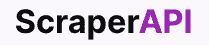
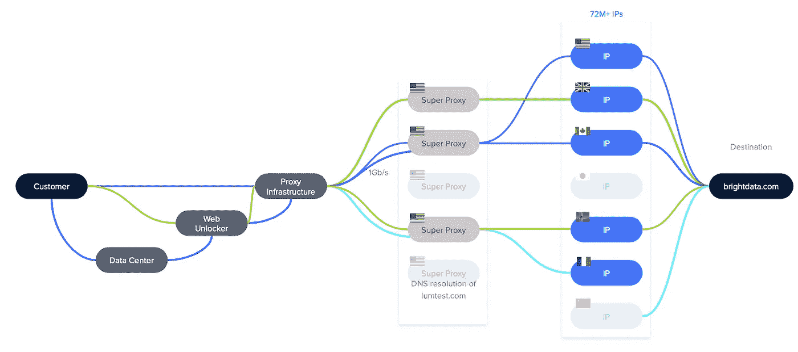
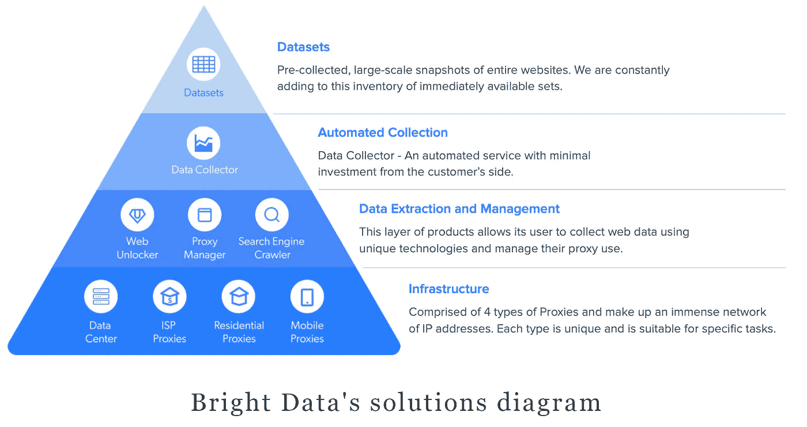

# 2022 年你不应错过的 4 种数据收集工具

> 原文：<https://levelup.gitconnected.com/top-data-collection-tools-a18fe72c16f7>

## [网页抓取](https://rakiabensassi.medium.com/list/software-engineering-7a179a23ebfd)

## 信息是生存和发展的关键。这里有一些市场上最好的工具来获得它。


Erlich 将 Jian-Yang 的应用称为“食物的 Shazam”——HBO 的硅谷([来源](https://qz.com/983809/silicon-valleys-see-food-was-a-real-app-called-meal-snap-that-launched-in-2011/)

当我在看 HBO 的[硅谷](https://www.hbo.com/silicon-valley)剧集时，我喜欢那部剧集中的戏剧和喜剧。但最引起我注意的是一些巧妙的产品创意，如 *SeeFood* 。

在向风险投资公司科尔曼·布莱尔(Coleman Blair)推销时，厄尔利希意识到自己面临着一个严重的问题。他的一位程序员杨坚想谈谈一款推广他祖母章鱼八大秘方的应用，这款应用不符合风投公司对基于摄像头的应用的设想。

这位风险投资家解释他的期望时说:“就像你给食物拍照一样，应用程序会返回营养信息或食谱，或者它们是如何获得的。

听到这最后一句话后，厄尔利希觉得受到了启发。他毫不犹豫地宣布，他们的项目实际上是 *SeeFood* 而不是*海鲜*:它是“ *Shazam for food* ”就像你能看到的食物一样。

这一声明为他们省去了一些麻烦。但后来，他们注意到他们需要大量数据来训练[机器学习](https://betterprogramming.pub/build-a-hand-pose-detector-web-app-powered-by-machine-learning-62131ec43db5)算法，使应用程序能够识别和识别食物。他们计划了一个大规模的从网络上抓取图像的任务，但是他们在预算和有限的时间内很难完成。

如果他们使用了适当的工具和基础设施，他们本可以成功完成任务。

你可能不会建造下一个“ *Shazam for food，*”但是就像 Erlich 和江洋一样，你可能已经面临或者将要面临[的情况](https://betterprogramming.pub/data-scraping-tools-7cb76eeab89e#470d)你需要收集和分析公共数据，并从中获得有意义的见解，以做出一些重要的决策，或者实现业务自动化并推动业务发展。

为了帮助您完成这项工作，我将在本帖中与您分享我对四种强大的数据收集产品的评论，这些产品提供了独特的功能来满足不同终端用户的需求。

# 1.刮擦剂


[报废剂](https://scrapingant.com/?ref=rakiabensassi)

[ScrapingAnt](https://scrapingant.com/?ref=rakiabensassi) 是一个抓取 API，它运行着数以百计的 Chrome 浏览器集群，并提供一个大型代理池——包括来自世界各地的轮换代理和常驻代理——以允许用户抓取所有网站而不会被阻止。它提取数据的速度比使用单台计算机快得多，可以并行抓取数千页。

它支持 Python、JavaScript 和任何可以进行 API 调用的编程语言。

作为一名开发人员，我觉得 ScrapingAnt 非常舒服。我通过在 [my Node.js 项目](https://javascript.plainenglish.io/web-scraping-with-nodejs-and-javascript-10e6b4268be1)中安装其客户端库`scrapingant-client`来使用它，然后在我的 IntelliJ 编辑器上实现代码，并使用`node`命令在我的终端上本地运行它:

```
node my-scraper.js
```

在这个[视频](https://www.youtube.com/watch?v=xWrI00AsJmY)中，你可以看到一个我如何使用它的例子:

## 团队支持

[团队](https://entrepreneurshandbook.co/how-to-make-it-big-in-data-industry-44893d7381fe)非常支持和友好，如果你不是开发者，他们甚至可以为你创建定制的抓取脚本。你只需要发一封电子邮件，向他们传达你的要求。

## 价格

*   **10000 API**积分的免费计划。该计划包括 JavaScript 渲染、定制 cookies、输出预处理、基本电子邮件支持、文档。
*   19 美元/月的发烧友:10 万次 API 调用
*   启动费 49 美元/月:50 万 API 调用，专家协助。
*   每月 249 美元的业务:300 万次 API 调用，专家指导。

# 2.谢尔普拉皮



[刮刀](https://www.scraperapi.com?fpr=rakia67)

[ScraperAPI](https://www.scraperapi.com?fpr=rakia67) 与 ScrapingAnt 价格略有不同。它支持 Python、JavaScript、PHP、Ruby 和 Java，并提供了一个易于定制的 API。

要启用 JS 渲染、IP 地理定位、住宅代理和更多功能，您只需根据您的请求添加参数，如`&render=true`、 `&country_code=us`和`&premium=true`。

```
curl "http://api.scraperapi.com/?api_key=APIKEY&url=http://http://httpbin.org/ip**&render=true**"
```

以下每种定价模式都包括:

*   旋转代理工具
*   自定义标题支持
*   无限带宽
*   自动重试
*   桌面和移动用户代理
*   99.9%的正常运行时间保证
*   自定义会话支持
*   验证码和反机器人绕过
*   24/7 专业支持

## 价格

*   **有 5000 个请求的免费计划**。
*   29 美元/月的爱好:25 万个 API 调用，10 个并发线程。
*   每月 99 美元的启动费用:100 万 API 调用，25 个并发线程，地理定位。
*   每月 249 美元的业务:300 万 API 调用、50 个并发线程、地理定位、住宅代理、JS 渲染。
*   企业定制定价模型:无限 API 调用和并发线程，地理定位，住宅代理，JS 渲染，定制反机器人旁路。

用优惠券 WEBENIUS10 在[注册](https://www.scraperapi.com?fpr=rakia67)可以享受 10%的折扣。

# 3.八解析


来源:octoparse.com

Octoparse 是开始你的网络抓取之旅的一个很好的工具，尤其是如果你不是一个程序员的话。如果你是一名开发人员，它可以节省你的时间，它为我做了一些刮擦任务。

该工具是用户友好的，具有强大的自动检测功能和大量的指导信息，在您创建刮擦工作流程时，在您采取每个操作后都会自动调整这些信息。

以下两个视频展示了如何使用该工具[收集客户评论列表](https://www.youtube.com/watch?v=09GRsNwvKjU)和[我自己的媒体简介内容列表](https://www.youtube.com/watch?v=mhEupoQtbv8):

如果您有一个复杂的收集方案，您可能需要更多关于该工具的培训，以了解如何正确设置您的数据收集工作流，并了解更多详细信息，如:

*   如何抓取需要认证的数据？
*   如何添加非自动检测的必填字段？
*   如何使用“ ***清除数据*** ”功能自动转换、格式化和转换某些字段。
*   等等

我有一个如此复杂的案例，在努力了两三天来解决我的抓取任务之后——没有请求团队的支持——我注意到如果我使用了一个抓取 API，比如 [ScrapingAnt](https://scrapingant.com/?ref=rakiabensassi) ，并且自己编写了所需的抓取代码，那么事情会变得简单得多，花费的时间也少得多。

如果你发现自己处于这样的情况，你没有能力投入时间去学习，不要犯我的错误，让团队来帮助你。

## 团队支持

团队是支持的。当我需要他们的帮助时，我用工具本身给他们发信息，他们通过电子邮件回复我，而其余的问题/答案，直到我的问题得到解决，都是通过电子邮件回复的。

## 价格

*   **简单项目自由计划**
*   每月 75 美元的标准价格
*   专业版每月 209 美元
*   数据服务起价为每月 399 美元
*   爬虫服务起价 189 美元/月
*   企业定制定价模型

# 4.亮眼的数据


[亮眼数据](https://brightdata.grsm.io/proxytypes)

[光明数据(原 Luminaty)](https://brightdata.grsm.io/proxytypes) 是全球排名第一的网络数据平台。它通过提供包括数据收集基础设施和现成数据集在内的工具和服务池，允许您收集公共 web 数据。



光明数据架构([来源](https://brightdata.grsm.io/proxytypes))

光明数据的产品可以分为四大类；每一类都有自己的特点；并作为上述类别的技术基础；

## 1.基础设施

[**住宅代理**](/residential-proxies-business-automation-3dd228dba84f) **，数据中心，ISP 代理，移动代理**

这个类别包含一个广泛的 IP 地址网络和 4 种类型的代理:每种类型都是独一无二的，适合特定的任务。

## 2.数据提取和管理

**网络解锁器、代理管理器、搜索引擎爬虫**

这些产品允许您使用独特的技术来管理您的代理和收集 web 数据。

## **3。数据采集器**

要使用此自动化服务收集数据，您可以:

*   选择并运行一个现有的网络搜集模板，
*   请求新自定义收集器，
*   或者在他们的 web 应用程序的代码编辑器中自己实现一个新的。您会注意到源代码被分成了不同的视图，对我来说，这看起来不如在本地代码编辑器上使用 ScrapingAnt API 舒服，这对于开发人员来说更自然。

[此视频](https://www.youtube.com/watch?v=G8VGPWoaYxU)展示了使用 Bright Data 的数据收集服务从 Medium 中收集顶级作家名单的场景。

**注意:**数据收集器只能检索不需要身份验证的公共可用数据。例如，如果您需要从 LinkedIn 获得一个专家列表，LinkedIn 要求您在访问该列表之前提供用户名和密码，与其他提到的提供商不同，您可能无法通过 Bright Data 的 collector 输入用户名和密码来获得您需要的信息。

## 4.数据集

数据集是预先收集的整个网站的大规模快照，涵盖广泛的数据，如公司、个人和社交媒体影响者。这对于许多用例都很有用，例如识别和分析趋势，优化您的电子商务活动，甚至获取数据来支持您的机器学习算法。如果现有集合不适合您的需求，您可以请求新的数据集。



光明数据的解决方案图([来源](https://brightdata.grsm.io/proxytypes)

## 团队支持

团队是支持的。当我需要他们的帮助时，我会用他们的网络应用给他们发信息，他们会通过电子邮件和 skype 回复我。在我的问题得到解决之前，其余的问题/答案都是通过 skype 提出的。

## 价格

Bright Data 提供的定价模式与其他提供商略有不同: ***【随用随付】*******月度订阅*** 。*

*数据收集器的每月选项包括以下型号:*

*   *350 美元/月的试验:从 3.50 美元/CPM 开始，100K 页面加载。*
*   *起价为每月 750 美元:起价为每分钟 3 美元，页面加载量为 25 万。*
*   *每月 1，250 美元的产量:从 2.50 美元/CPM 开始，500，000 页面负载。*
*   *每月 2000 美元以上:每分钟 2 美元起，100 万次页面加载。*
*   *企业定制定价模型*

*旋转的[住宅代理](/residential-proxies-business-automation-3dd228dba84f)可以通过 **7 天免费试用**进行测试。*

# *还有一点*

*尽管作为软件开发人员、数据科学家、机器学习爱好者、企业主、营销人员，甚至是内容创作者，上述产品都是你工具箱中的好东西，但你总是可以通过将数据收集任务外包给像 [ScrapeIt](https://www.scrapeit.io/) 这样的网络抓取服务来节省你的时间和精力。*

*ScrapeIt 提供:*

*   *如果是一次性数据交付，最多 100，000 行，价格为 220 美元。*
*   *如果是经常性数据交付，最多 100，000 行，每月 170 美元。*
*   *定制解决方案起价 1000 美元。*

*我希望这个工具和服务的列表能给你一些指导，帮助你做出关于如何获得你所需要的信息的最佳决定。*

# *想要更多吗？*

*我为一群聪明、好奇的🧠人写关于工程、技术和领导力的文章💡。 [**加入我的免费电子邮件简讯**](https://rakiabensassi.substack.com/) **独家访问**或在此报名媒体。*

*[](https://javascript.plainenglish.io/web-scraping-with-nodejs-and-javascript-10e6b4268be1) [## 用 Node.js 和 ScrapingAnt 在 5 分钟内学会网页抓取

### 如何使用 JavaScript 收集数据并自动化您的任务

javascript.plainenglish.io](https://javascript.plainenglish.io/web-scraping-with-nodejs-and-javascript-10e6b4268be1) [](https://betterprogramming.pub/how-to-analyze-and-visualize-users-feedback-by-leveraging-reviews-scraping-container-go-case-db53333716c8) [## 如何通过利用评论抓取来分析和可视化用户的反馈

### 搭建一个启发式评估角度 app

better 编程. pub](https://betterprogramming.pub/how-to-analyze-and-visualize-users-feedback-by-leveraging-reviews-scraping-container-go-case-db53333716c8)*