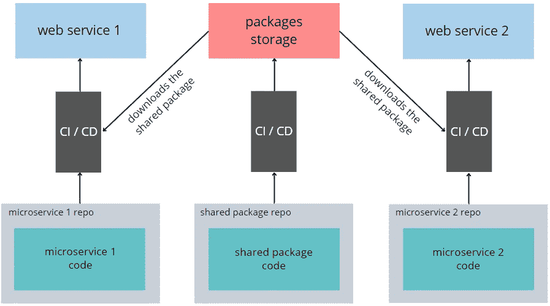
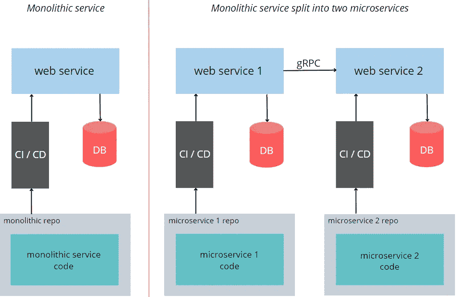

# 开发人员在微服务架构中解决的主要难题

> 原文：<https://levelup.gitconnected.com/top-dilemmas-that-developers-solve-in-microservices-architecture-93a875a28dab>

## 以及如何解决这些问题的建议。


照片由[爆裂](https://unsplash.com/@burst?utm_source=medium&utm_medium=referral)上[爆裂](https://unsplash.com?utm_source=medium&utm_medium=referral)

在一个问题的多个解决方案之间进行权衡分析是软件开发工作的一个关键部分。通常，复杂的问题没有唯一正确的解决方案，因此开发人员必须权衡每个适用选项的利弊，然后选择最合适的一个。

Array 还是 HashSet？深度优先搜索还是呼吸优先搜索？规范化或非规范化表？开发人员每天都必须通过分析业务和技术需求、约束等来回答这些问题

当开发者在微服务应用上工作时，他们比在单片应用中面临更多的困境。

# 共享包还是复制粘贴？

你喜欢代码重用还是复制粘贴？对于大多数开发人员来说，这个问题的答案似乎是显而易见的(我希望您选择了代码重用)，直到在微服务架构的上下文中提出这个问题。

虽然开发人员在单个项目中为在单个进程中运行的应用程序编写代码，但是将共享代码存储在一个位置并在应用程序的不同位置重用它几乎不需要任何成本。这只会带来更好的代码可维护性和更快的新特性开发等好处。

在同一个项目中重用代码非常简单，如下所示:

```
//Shared code
public static class Utility
{
    public static string Trim(string str)
        => str.Trim();
}public class Consumer
{
   public void DoSomething()
   {
       var str = Utility.Trim("string ");
       //...
   }
}public class AnotherConsumer
{
   public void DoSomething()
   {
       var str = Utility.Trim(" string ");
       //...
   }
}
```

重构共享代码的接口(重命名`Trim`方法或向其添加另一个参数)和在所有消费者中更新方法只需在 IDE 中点击几下即可完成。如果做错了什么，编译器会显示问题出在哪里。

在微服务架构中，代码重用是通过创建包含共享代码的自包含包来实现的，其他微服务可以安装和使用这些包。这些包可以放在单独的存储库中，并且有自己的 CI / CD 管道。



微服务之间共享包允许开发人员避免跨微服务复制粘贴代码，但这会导致其他问题:

*   **突变**。通过修改共享包中定义的接口，很容易引入突破性的变化。只有在微服务升级到包含重大变更的包版本后，问题才会变得明显。
*   **版本化。**使用 API 版本控制技术可以避免重大变更。然而，频繁修改共享包中定义的接口会导致代码混乱。许多以 V1、V2…N 结尾的 API 和模型会出现在共享包代码中。
*   **可测试性。**改变共享包中定义的逻辑可以破坏所有消费者微服务的行为。为了尽早发现这些问题，开发人员需要实现覆盖所有微服务的自动化端到端测试。
*   **一致性**。不同的微服务可以使用同一共享包的不同版本(如果开发人员忘记更新其中一个微服务的版本)，导致微服务或 bug 的行为不一致。
*   **文献资料。每个共享包都应该有文档，当代码改变时需要维护。**

在代码具有高度不稳定的接口的情况下(但在稳定化步骤之后将其提取到共享包中)或者当它是小的实用程序代码时(以将共享包的数量减少到最小)，开发人员可以考虑在微服务之间复制和粘贴代码。

# 服务到服务的通信还是消息总线？

虽然有些微服务可以完全隔离，但其他微服务必须相互交互:通知已经发生的事件、交换数据等。

微服务的两种常见通信方法是服务对服务通信和消息传递。复杂的微服务应用程序通常实现这两种方法:一些微服务集使用 HTTP 或 gRPC 直接与其他服务通信，而另一些则使用服务总线。

开发人员应该根据具体情况选择通信模式。服务总线通信通常被开发人员视为默认选择，因为它提供了许多好处:

*   当微服务通过消息总线通信时，它们是松散耦合的。开发人员可以在不接触发送方的情况下更改订阅方。
*   通常每个服务总线组件都实现弹性、监控和许多其他特性，所以微服务不需要自己实现这个逻辑。

服务到服务的通信使微服务紧密耦合，导致 API 版本问题，由于需要实现故障转移逻辑(如重试、断路器模式等)而使微服务变得复杂。

然而，服务到服务的方法可能比消息传递更可取，在消息传递中，一个微服务需要调用另一个微服务并接收响应，以便继续执行。此外，当性能至关重要时，服务之间通过 gRPC 甚至 HTTP 的通信比消息传递要快得多。

# 微服务多还是少？

开发人员可能出于各种原因决定实施新的微服务，例如:

*   **新的子域。**业务领域的发展导致了新的子域的诞生，这些子域可以在单独的微服务中实现。每个微服务可以分配给不同的团队。
*   **缩放。**某些功能可能比应用程序的其余部分预期更高的负载。在这种情况下，该功能可以分离到一个单独的微服务中，可以独立扩展。
*   **韧性。**有些功能可能需要很长时间才能完成，并且会占用大量 CPU 和内存资源。这种功能可以被分离到一个单独的微服务中，以便在出现故障或高资源消耗的情况下不会影响其他微服务。

引入新微服务的理由应该是正当的。实施额外的微服务至少可以解决上面列出的一个问题，并始终提供真正的价值。这是因为每个新的微服务都会使架构变得非常复杂。



正如您在上面的图表中看到的，多添加一个微服务会导致许多额外的事情需要实现。

通常，对于每个新的微服务，开发人员可能需要创建一个单独的存储库，实现 CI/CD 管道，提供新的 web 服务、存储等。新的微服务将需要与其他微服务交互，这将导致额外的往返和延迟。可能需要实现一个共享包来跨微服务共享逻辑。此外，维护需要实现 Saga 模式的微服务之间的数据一致性也很重要。

开发人员应该仔细权衡在系统中引入新的微服务的利弊，并确保新的微服务带来的好处多于复杂性。

# 单回购还是多回购？

与将所有微服务放在一个或几个存储库中相比，将每个新的微服务放在一个单独的存储库中似乎是更自然的方法。

在存储库和微服务之间建立一对一的关系意味着存储库将会很小，从而导致快速的 Git 命令、快速的 IDE 加载时间以及不同团队之间的明确责任划分。然而，这些好处是有代价的，比如跨存储库的潜在代码重复，这可以通过实现共享包来解决，这反过来会导致可维护性问题。

拥有大量的存储库会导致其他问题，比如复杂的开发生命周期和确保不同存储库中不同项目所使用的框架、设计模式、开发方法之间的一致性的问题。

将所有的微服务放在一个存储库中，或者根据某种属性将微服务分成若干组，并将每组存储在单独的存储库中，可以完全或部分解决上述问题。你可以在我的另一篇文章中读到更多:

[](/how-many-repositories-do-you-need-for-a-microservices-project-b5c991aa440) [## 一个微服务项目需要多少个存储库？

### 在多存储库和单存储库之间找到平衡点。

levelup.gitconnected.com](/how-many-repositories-do-you-need-for-a-microservices-project-b5c991aa440) 

在选择微服务架构时，开发人员应该做好经常进行权衡的准备，不要害怕做出错误的决定，并尽快纠正错误。

感谢阅读。如果你喜欢你所读到的，看看下面这个故事:

[](/top-misconceptions-about-dependency-injection-in-asp-net-core-c6a7afd14eb4) [## ASP.NET 核心中关于依赖注入的主要误解

### 这甚至会导致错误。

levelup.gitconnected.com](/top-misconceptions-about-dependency-injection-in-asp-net-core-c6a7afd14eb4)